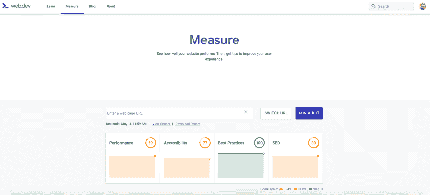
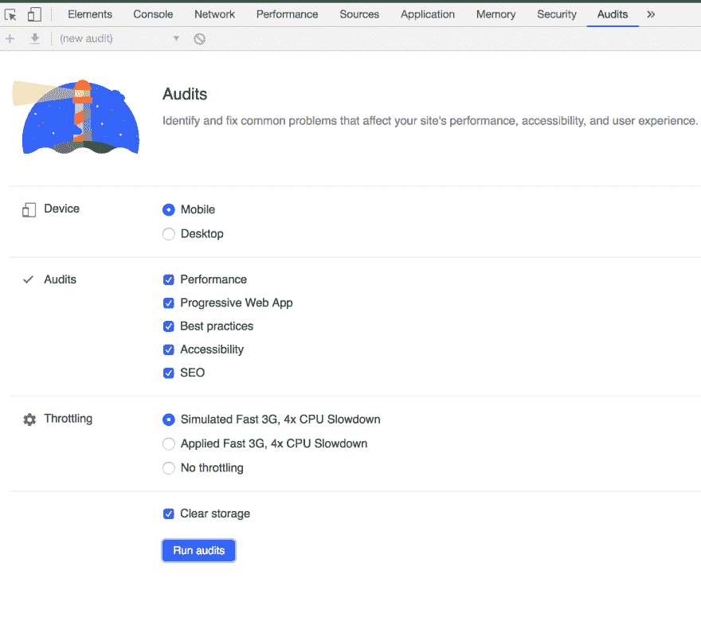
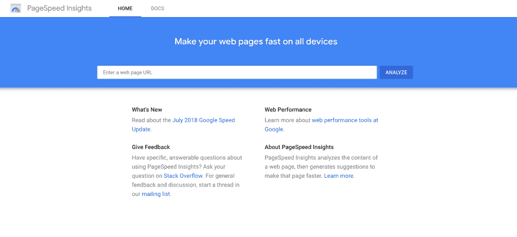
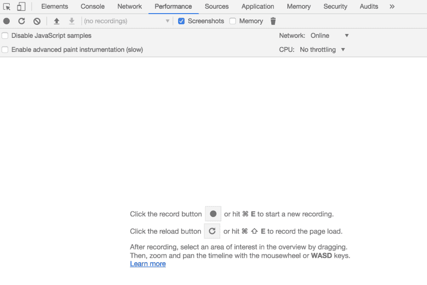
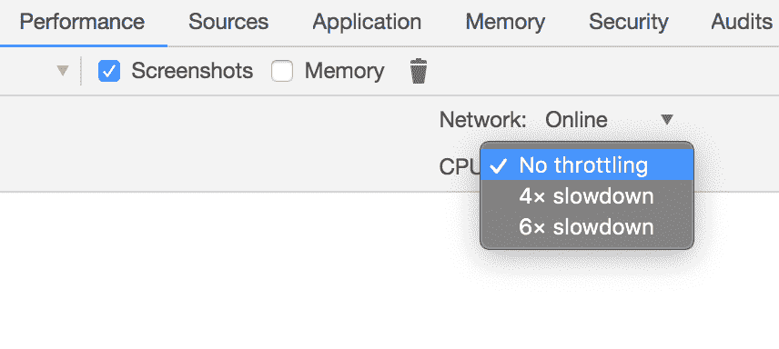
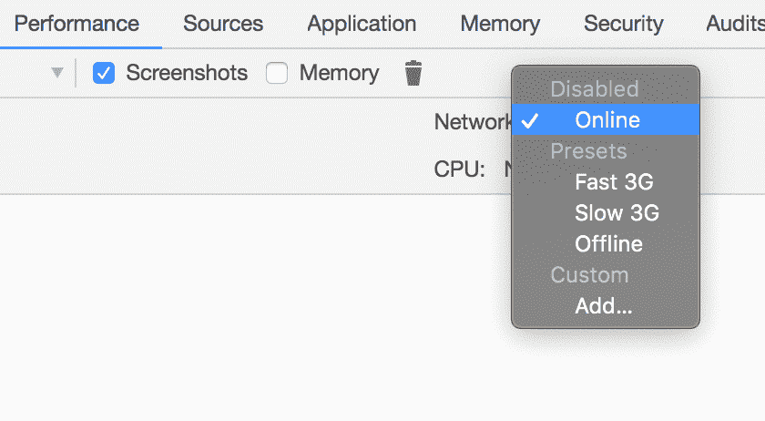

# Web 性能入门

> 原文：<https://dev.to/xabadu/getting-started-with-web-performance-3phi>

绩效是一个术语，我们知道我们应该不断地思考*(并致力于)*，但出于不同的原因，我们往往会忘记它。事实是，这可能是一个压倒性的话题，当面对这些问题时，甚至不知道从哪里开始。

尽管如此，现在我们有很多工具可以帮助我们测试我们的应用程序，看看它们做得如何，同时理解它们如何工作可能有点棘手*(有时真的很难)*，所以在我们有限的时间内，我们经常把它放在一边，因为结果似乎不如发布新功能或修复令人讨厌的错误等其他事情那么明显。

在这篇文章中，我将介绍一些关于为什么我们应该关心、如何开始以及如何让它成为我们日常工作流程的一部分的初步想法。

但是首先，回顾一些事情来理解性能的重要性并对其设定正确的期望是一个好主意:

### 我为什么要在乎性能？

虽然乍看起来不太明显，但我们的应用程序或网站的性能可能会对我们的用户产生更大的*(通常是负面的)*影响，有时甚至会让他们离开并选择去另一个网站。如果你的应用属于一个企业，这可能会变成更糟糕的结果，赶走客户，失去一个潜在的销售给竞争对手，他们有一个比你更*【更快】*的网站。

我们可以找到大公司分享的大量统计数据，这些数据显示，在加载内容时，哪怕是 **1 秒或更少**的延迟都会影响他们的销售或赶走流量，所以这让你想知道这种影响是否会发生在知名品牌身上，它会对我们的品牌产生什么影响？

### 没有银子弹

像生活中大多数美好的事情一样，拥有一个高性能的应用程序并不容易，立即理解这一点很重要。处理与绩效相关的问题涉及很多...嗯，工作。遗憾的是，没有神奇的包或库可以让我们使用并解决我们所有的问题(然而，谁知道呢，也许有一天，你知道，就像🤖🤖🤖和 stuff) ，但这并不意味着不可能实现，事实上恰恰相反。解决性能问题和改进应用程序的过程相对简单:

*   收集一些数据。
*   实验。
*   收集一些新的数据进行比较。
*   得出结论*(也称为保留有效的，取消无效的)*。

虽然其中一些部分可能有不同的含义*(其中一些可能有点棘手)*，但过程总是相同的，这使得记住这两件事更加重要:

*   **在其他应用上有效的东西可能不适合你的**:这并不意味着好的实践和一般建议应该被忽略，它通常是有用的建议，可以帮助我们实现目标，只是*它可能不适合你的用例*。
*   **很多时候，性能都是关于取舍的**。

### 重写比改进更不可能

作为开发人员，当我们参与一个有问题的项目时，很多时候我们的第一反应是考虑重写代码。事实是，大多数时候，由于时间限制、预算或其他优先事项，我们无法做到这一点。这就是为什么考虑改进我们正在工作的当前代码库是一个好主意，而不是扔掉它并编写一个新的。有了这个，我们就能够将结果与长期有效的实际数据进行比较，并更好地了解每个变化所产生的影响。

而且，如果我们真的要重写，有很多事情我们可能会记住，以使它变得更好。

那么，考虑到所有这些，我们如何开始呢？:**带着计划**。

## 准备制定计划

不知道我们应该实现什么就贸然开始工作，可能会导致更多的问题，而不是解决问题。了解工作的重点是什么，并制定一个如何执行的计划，这将使我们获得与我们应用程序的主要目的相关的实际成功。

等等，目的，什么意思？

### 确定你申请的主要目标

当构建一个应用程序或网站时，我们应该问自己的第一个问题可能是*这个应用程序试图实现什么？*。在大多数情况下，目标是非常明确的:卖东西、展示内容、提供服务等等。现在，虽然确定主要目标可能很简单，但很多时候很难清楚地知道应用程序应该如何集中精力来实现这个目标。

这种关注点在不同的应用程序之间往往是不同的，尤其是如果它们属于不同的类别，这与我们应该集中精力提高性能的地方密切相关。

例如，假设我们建立了一个销售 cookies 的网站。该网站的主要目标非常明确:出售那些令人愉快的🍪🍪🍪。现在，当规划网站主页的功能时，我们知道我们可能会有这些部分:

*   一个有漂亮标志的标题和一个有很酷的动画的菜单。
*   所有可用 cookies 的列表。
*   一个侧边栏，包含联系信息、社交媒体链接、时事通讯、促销注册和一些广告。
*   一个很酷的页脚，上面有所有的法律信息。

如果我们回到我们的主要目标*(销售 cookie)*，我们思考每个部分的重要性以及它与目标的关系，我们可能会假设我们的用户并不真正关心列表上的一些东西，他们访问网站是为了得到一些 cookie*(这也是我们想要的)*。因此，考虑到这一点，我们可能应该首先尽可能快地向他们展示带有 cookies 的列表，而不是花费时间和资源来显示菜单和动画*(尽管它们可能很酷)*或带有社交媒体链接的侧栏，所以这是我们的计划应该关注的地方。

### 制定一个逐步改进的计划(一次 5-10%)

在谈论性能时，需要理解的一件非常重要的事情是，这是一项持续的工作，我们很可能无法立即解决每个问题。其中很大一部分是测量和实验，所以在尝试新事物、分析权衡和基于此做出决策之间有很多来回。同样，很有可能我们所做的改变在百分比上不会有巨大的差异，但这并不意味着我们没有成功，相反，我们所做的每一个改进都会对访问我们网站的每一个用户产生影响，并使他们的体验更好。

请这样想:如果我们有一个用 JavaScript 构建的应用程序，它存在于一个 500kb 的捆绑文件中，那么访问我们网站的用户将下载 500kb 的代码，这些代码必须由他们的浏览器进行解析、解释和编译。现在，假设我们找到了一种方法来对该文件进行一些改进，我们最终将包的大小减少了 10%。即使 10 看起来不多，但仍然比我们发送的*(需要解析、解释和编译)*少了 50kb，所以不仅加载速度更快，而且我们的用户会喜欢下载更少的数据来使用应用*(特别是移动网络上的应用)*。

因此，记住这一点，一个好的经验法则是在每个工作周期中计划 5-10%的逐步改进。如果我们能得到更多，很好，但这些数字之间的一切都应该是伟大和现实的，因为最初，胜利会更大，更引人注目，但随着我们的进步，将很难找到需要改进的地方。在每一轮改进后，我们可以得到一些新的样品，并为下一轮做准备。

### 获取您的数据

开始工作前的最后一步是从我们的应用程序的当前性能中获取真实数据，以确定痛点并确定工作的优先级。我们通过测量来做到这一点。

## 测量

### 为什么要测量

每当思考我们为什么要测量时，我喜欢思考这些原则:

*   有时候事情看起来很快，但事实并非如此。
*   有时事情看起来不错，但还可以更好。
*   有时候事情看起来很慢，但这不是 ***自己*** 的错。

浏览器比以往任何时候都要快，所以现在可以比我们注意到的更快地做很多事情，但这并不一定意味着它们真的很快。下面发生了很多事情，我们不会有一个清晰的想法，直到我们偷看引擎盖下，看看所有的东西是如何加载的，每个部分花费了多少时间，如果其中任何一个导致了问题。

通过使用工具来衡量我们的应用程序的每个部分，我们将清楚地了解一切的真实情况，并且更容易识别问题和计划工作。

### 如何测量

现在有很多工具可以让我们清楚地了解我们的应用程序是如何运行的，甚至可以得到一些关于如何改进发现的任何问题的建议。在这些备选方案中，我喜欢使用的是:

#### 灯塔(Web、CLI、CI)

Google Lighthouse 可能是当今对我们的应用程序进行性能审计的最佳工具。它负责检查不同的负载场景，我们如何处理资源，甚至就如何改进发现的任何问题提出建议，甚至涉及到可访问性和 SEO。最棒的是，有多种方式来运行它*(通过[谷歌的网络开发网站](https://web.dev/measure)、 [Chrome 扩展](https://chrome.google.com/webstore/detail/lighthouse/blipmdconlkpinefehnmjammfjpmpbjk)甚至 [Chrome 开发工具](https://developers.google.com/web/tools/lighthouse/#devtools) )* ，甚至可以作为构建检查与他们的 [GitHub 集成](https://github.com/GoogleChromeLabs/lighthousebot)合并到我们的日常工作流程中。

<figure>

<figcaption>Lighthouse in Google's Web Dev site</figcaption>

</figure>

<figcaption>Chrome 开发工具中的灯塔</figcaption>

#### 页面速度洞察

前阵子，如果你在 [PageSpeed Insights](https://developers.google.com/speed/pagespeed/insights/) 和 Lighthouse 中测量一个 URL，你会经常得到*一些*不同的信息、分数和建议，所以运行两者并整合这些信息是有用的。目前，它已经非常接近了，但实际上继续检查这两者以确保我们正在处理所有发现的问题并没有坏处。

<figure>

<figcaption>PageSpeed Insights</figcaption>

</figure>

#### Pingdom 网站速度测试

使用像 [Pingdom](https://tools.pingdom.com) 这样的外部工具来运行审计对于获得我们可以比较的额外数据也很有用。特别是这个网站的一个很酷的地方是，它允许我们测试我们的网站是如何从不同的位置加载的，所以如果我们接触到全球的观众，我们会更好地了解他们是如何看到我们的内容的。

<figure>

<figcaption>Pingdom Website Speed Test</figcaption>

</figure>

#### 浏览器开发工具

最后，但肯定不是最不重要的，它是 Chrome Dev Tools 的 Performance 选项卡，这将是我们进行本地开发时最好的朋友之一。有了它，我们可以记录网站加载时发生的一切，包括解析了多少代码，以什么顺序，我们是否让 CPU 工作太多，以及每件事需要多长时间，这将让我们清楚地了解我们应该解决的潜在瓶颈。

<figure>

<figcaption>Performance Tab in Chrome Dev Tools</figcaption>

</figure>

### 区分问题的优先级并定义更大的影响

还记得前几节我们讨论过的 ***确定你的应用*** 的主要目标吗？现在我们有了真实的数据，并且知道了难点在哪里，就更容易知道哪些因素影响了目标。考虑到这一点，定义优先级并列出将产生更大影响的事情非常重要，因为这些成功不仅会让用户受益，还会让我们的应用程序实现我们想要实现的目标。

## 附加提示

### 找出如何将绩效融入你的计划中(好的占 20%)

正如在软件开发过程中测试经常发生的那样，我们需要改变我们对性能的思考方式，将它视为过程的**部分，而不是额外的部分。要做到这一点并使之成为我们团队文化的一部分，最好的方法是设法将其纳入我们的规划。一个好主意是，在每次冲刺的开始，留出 10-20%的时间来解决性能问题。如果我们把这作为一项持续的努力和我们每周工作的一部分，不仅它会成为每个人都关心的事情，而且最终，需要解决的问题会更少，努力也不会那么重要。**

 **性能改进的好处是，它们通常与业务的成功相关联，因此在这方面投入时间并不像重构一些代码、改进工具等其他技术任务那样困难。

### 过早优化

在考虑性能时，过早优化是一个大问题。很容易陷入想得太远，试图想出最好的方法来处理我们可能永远不会到达的案件，所以在开始时不要太担心这是一个好主意，但与此同时，密切关注事情，并尝试确定可能在某个时候出现的可能问题。

### 随时随地考验一切

作为开发人员，我们经常犯的一个大错误是在最好的条件下测试应用程序*(本地，在我们的电脑上，有快速的互联网连接)*。但我们不得不怀疑，我们用户的现实情况是这样的吗？大概不会。这就是为什么在测试时，模拟不同的场景*(较慢的 CPU 或网络连接)*并看看我们的应用程序如何运行是一个好主意。重要的是要记住，事情总是在最好的情况下看起来很棒，但只有在一些限制下，我们才开始看到裂缝😔。

幸运的是，由于 Chrome 开发工具，现在模拟这些条件并进行测试很简单:

#### 节流 CPU

<figure>

<figcaption>How to throttle CPU in Chrome Dev Tools</figcaption>

</figure>

#### 节流网络

<figure>

<figcaption>How to throttle the network in Chrome Dev Tools</figcaption>

</figure>

尝试这些设置并重新加载你的应用程序，这样你就可以在模拟条件下看到它了。

**注意**:只要 ***Chrome Dev Tools*** 打开，这些条件就会保持。一旦我们关闭它，我们将回到正常设置。

### 获取你的用户(设备、浏览器)的数据，看看他们在用什么，你应该考虑什么

有了像 Google Analytics 这样的工具，比以往任何时候都更容易清楚地了解你的用户在哪里，以及他们在访问你的网站时使用了什么:浏览器、设备、操作系统，甚至是屏幕分辨率。拥有这些数据将是你的超能力，让你知道你应该关注什么，避免白费力气。

例如，如果你收集数据并意识到 100%的用户在桌面上使用最新版本的 Chrome，没有人使用其他浏览器或移动设备，你可以安全地优先考虑影响他们的问题，而不是关注你的移动版本或支持其他浏览器的旧版本。相反，没有这些数据可能意味着花费无数的时间来修复错误，而这些错误可能对用户没有任何影响。

## 现在:我们开始工作吧！

现在我们有了数据，想法，知道我们需要关注什么，是时候开始工作了！。但是，我们怎么做呢？好了，这是下一篇文章✌️.

最初发表在我的博客上 [xabadu.dev](https://xabadu.dev/getting-started-with-web-performance/)**