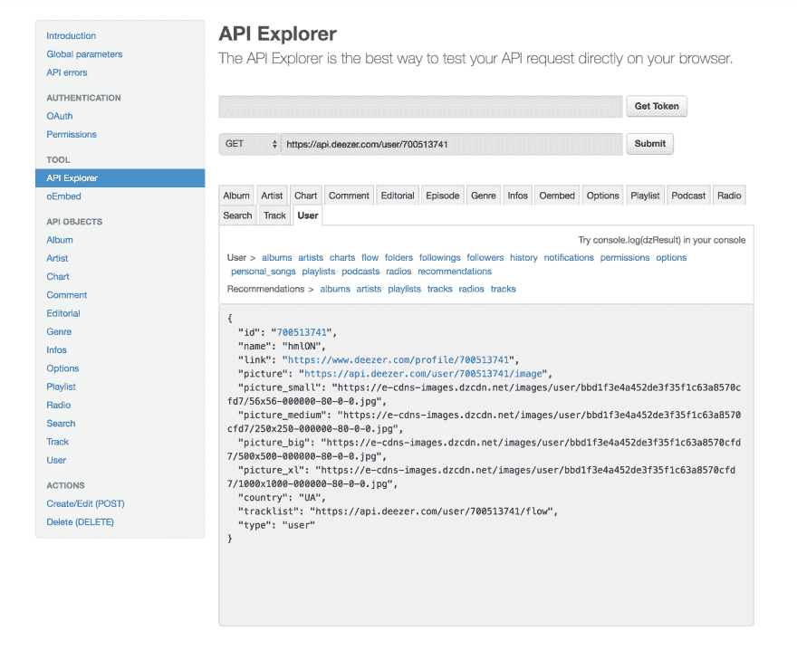

# 使用 Python 从 Deezer 获取最新版本

> 原文：<https://dev.to/hmlon/getting-your-latest-releases-from-deezer-withpython-ljc>

你有没有感觉错过了你最喜欢的艺术家的专辑？如果是，那么这篇文章就是为你而写的。

在这里，我们将从 [Deezer API](https://developers.deezer.com/api) 获取您关注的艺术家及其专辑，以查看您是否错过了任何发布。我们将使用 Python 来完成所有的工作。

# 入门

首先，你需要知道你的身份证。您可以通过在浏览器中打开 Deezer 并访问您的个人资料来获取它。

现在，如果您检查 URL 地址，您应该会看到类似这样的内容

```
https://www.deezer.com/en/profile/700513741 
```

URL 末尾的一个数字就是你的 ID(我的是`700513741`)。让我们将它存储在一个变量中。

```
deezer_id = 700513741 
```

如果您想获得项目用户的 id，您需要创建一个 Deezer 应用程序，并将该应用程序连接到您的项目。关于如何做到这一点的更多信息，您可以查看本指南。

# 抓取关于你的信息

[](https://res.cloudinary.com/practicaldev/image/fetch/s--CvT70_P8--/c_limit%2Cf_auto%2Cfl_progressive%2Cq_auto%2Cw_880/https://images.unsplash.com/photo-1470173274384-c4e8e2f9ea4c%3Fixlib%3Drb-1.2.1%26ixid%3DeyJhcHBfaWQiOjEyMDd9%26auto%3Dformat%26fit%3Dcrop%26w%3D1650%26q%3D80)

为了开始我们迷人的旅程，让我们先找到自己。要获取用户，我们可以使用 Deezer 的[用户端点](https://developers.deezer.com/api/user)。我们只需要向文档中指定的 URL 发送一个请求，关于用户的信息应该出现在响应中。

但是在用 Python 做任何请求之前，我们可以尝试在 Deezer 的 [API explorer](https://developers.deezer.com/api/explorer) 中做一些请求。

文件上说获取用户信息的网址是`https://api.deezer.com/user/me`。但是，如果我们试图执行对端点的请求，我们会收到一个错误

> 必须使用活动访问令牌来查询当前用户的信息

这意味着我们必须获得一个与我们的用户相关的令牌，Deezer 才能知道谁是“我”。但是我们都喜欢以一种简单的方式做事，而获得访问令牌实在是太难了。这正是我让你自己去拿身份证的原因。现在我们只需用你的 ID 替换`/me`，一切都将正常工作。以下是我在 API explorer 中得到的内容

[](https://res.cloudinary.com/practicaldev/image/fetch/s--6Pel8AzK--/c_limit%2Cf_auto%2Cfl_progressive%2Cq_auto%2Cw_880/https://kholinlabs.com/assets/2018-12-10-getting-your-releases-from-deezer/api-explorer-1.png)

# 提出真正的请求

使用 [`requests`库](http://docs.python-requests.org/en/master/)用 Python 发出请求非常容易。如果你没有安装这个库，你可以使用[官方安装指南](http://docs.python-requests.org/en/master/user/install/#install)。一旦你安装了`requests`，我们就可以开始编码了。

为了用`requests`发送一个常规的 [`GET`](https://www.w3schools.com/tags/ref_httpmethods.asp) 请求，库为我们提供了一个`get`方法，它只需要一个 URL

```
import requests
url = f"https://api.deezer.com/user/{deezer_id}"
user_response = requests.get(url) 
```

`user_response`变量现在应该包含请求期间发生的大量数据。我们感兴趣的是回应的内容。我们可以用`response.content`方法
得到它

```
user_response.content
# => b'{"id":700513741, "name":"hmlON", ...}' 
```

正如我们所知，响应包含一个 JSON 字符串。我们可以用一个 [`json`库](https://docs.python.org/2/library/json.html)来解析它，但是`requests`已经为 is 做好了一切——我们可以只使用一个`json()`方法

```
user_response.json()
# => {'id': 700513741, 'name': 'hmlON', ...} 
```

现在我们有了一本可以使用的普通词典。让我们先完成我们的“hello world”程序(Deezer API edition ),然后再继续提出其他请求

```
name = user_response.json()['name']
print(f"Hello, {name}!") 
```

# 抓取你喜欢的艺术家

[](https://res.cloudinary.com/practicaldev/image/fetch/s--APK8BhF3--/c_limit%2Cf_auto%2Cfl_progressive%2Cq_auto%2Cw_880/https://images.unsplash.com/photo-1533174072545-7a4b6ad7a6c3%3Fixlib%3Drb-1.2.1%26ixid%3DeyJhcHBfaWQiOjEyMDd9%26auto%3Dformat%26fit%3Dcrop%26w%3D1650%26q%3D80)

你最喜欢的艺术家可以在[用户/艺术家端点](https://developers.deezer.com/api/user/artists)上找到。像往常一样，它建议在 URL 中使用`/me`,但是我们更聪明，将使用 ID。所以我们来测试一下终点。

```
artists_url = f"https://api.deezer.com/user/{deezer_id}/artists"
artists_response = requests.get(artists_url)
artists_response.json()
# => {
#  "data": [
#    {
#      "id": "296861",
#      "name": "The Neighbourhood",
#      ...
#    },
#    ...
#  ]
#  ...
#  "total": 30,
#  "next": "https://api.deezer.com/user/700513741/artists?index=25"
# } 
```

端点似乎正在工作。从回复中我们可以看到，这里有几个有趣的字段:

*   数据——我们想要的你最喜欢的艺术家
*   总计—我们关注了多少位艺术家
*   下一页—指向下一页结果的链接

如果响应返回最后一页数据，则`next`参数为空。这意味着，如果我们只想看一眼艺术家，我们可以按原样发送请求。但是如果我们想要获取所有数据(就像我们现在做的)，我们就必须使用这个参数。

获取所有记录的算法非常简单——当下一页出现时，我们转到下一页。让我们开始实施吧

```
artists = []               # we'll store artists here as we go through the pages all_artists_loaded = False # in the beginning nothing is loaded url = f"https://api.deezer.com/user/{deezer_id}/artists"

while not all_artists_loaded:
    response = requests.get(url).json()
    artists += response['data']   # data attribute contains artists from the request
    if response.get('next'):      # there are more artists on the next page
        url = response['next']    # we will continue to fetch from the next page
    else:                         # there are no more followed artists
        all_artists_loaded = True # we will end the loop 
```

这个算法非常简单，但是有一点我要注意。当我检查是否有下一页时，我使用`response.get('next')`而不是`response['next']`。这里的区别是，当响应中没有下一个键时，`response.get('next')`方法将不返回任何内容，而常规的`response['next']`方法将引发一个错误。

```
response = {'data': ['...']} # response without the 'next' attribute 
response['next']
# raises KeyError: 'next' 
response.get('next')
# => None 
```

# 获取你最喜欢的艺术家的作品

[](https://res.cloudinary.com/practicaldev/image/fetch/s--Iq3Y3Uks--/c_limit%2Cf_auto%2Cfl_progressive%2Cq_auto%2Cw_880/https://images.unsplash.com/photo-1530288782965-fbad40327074%3Fixlib%3Drb-1.2.1%26ixid%3DeyJhcHBfaWQiOjEyMDd9%26auto%3Dformat%26fit%3Dcrop%26w%3D2250%26q%3D80)

既然我们都关注了艺术家，我们就可以获取他们的专辑。[艺术家/专辑端点](https://developers.deezer.com/api/artist/albums)非常适合这个任务。

这一次，我们需要遍历每个艺术家，并将所有专辑保存在一个数组中。为了获取每个艺术家的所有版本，我们将使用与获取艺术家相同的算法。

```
releases = [] # we'll store all releases here 
for artist in artists:
    # the old algorithm is still working here
    all_releases_loaded = False
    artist_id = artist['id']
    url = f"https://api.deezer.com/artist/{artist_id}/albums"

    while not all_releases_loaded:
        response = requests.get(url).json()
        releases += response['data']
        if response.get('next'):
            url = response['next']
        else:
            all_releases_loaded = True 
```

和以前差不多。但是有一个问题我们会注意到，如果我们看任何版本

```
releases[-1]
# {
#  'cover': 'https://api.deezer.com/album/40571541/image',
#  'explicit_lyrics': True,
#  'fans': 52,
#  'genre_id': 116,
#  'id': 40571541,
#  'link': 'https://www.deezer.com/album/40571541',
#  'record_type': 'single',
#  'release_date': '2017-04-18',
#  'title': 'DEADMAN WUNDERLAND',
#  'tracklist': 'https://api.deezer.com/album/40571541/tracks',
#  'type': 'album'
# } 
```

问题是我们不知道艺术家是谁。我们可以用两种方法解决它:

1.  通过将艺术家的 ID 作为关键字存储在字典中，并将`artist_id`添加到所有版本中
2.  通过在发行版中存储完整的标题(带有艺术家的名字)

我会选择第二个，因为它更容易做到，但如果你想实现第一个解决方案或任何其他解决方案，请在评论中分享。

为了在发行版中保存完整的标题，我们需要将艺术家的歌曲存储在一个临时数组中。当所有的专辑被提取，我们需要添加完整的标题给他们。

```
releases = [] # we'll store all releases here 
for artist in artists:
    # this time we'll store releases in a temporary array
    current_artist_releases = []

    # nothing changed here
    all_releases_loaded = False
    artist_id = artist['id']
    url = f"https://api.deezer.com/artist/{artist_id}/albums"

    while not all_releases_loaded:
        response = requests.get(url).json()

        # now we're saving each page's response to current_artists_releases
        # instead of straight to releases
        current_artist_releases += response['data']

        # this stays the same too
        if response.get('next'):
            url = response['next']
        else:
            all_releases_loaded = True

    # and after we've fetched all releases
    # we can add full title to all of them
    for release in current_artist_releases:
        full_title = f"{artist['name']} — {release['title']}"
        release['full_title'] = full_title

    # and only after we every release from current artist
    # has a full title we can add them to the main releases
    releases += current_artist_releases 
```

所以现在所有的版本都应该有一个完整的标题

```
releases[-1]['full_title']
# => 'Aries — DEADMAN WUNDERLAND' 
```

# 那么你错过了什么？

[](https://res.cloudinary.com/practicaldev/image/fetch/s--BWGROfUM--/c_limit%2Cf_auto%2Cfl_progressive%2Cq_auto%2Cw_880/https://images.unsplash.com/photo-1460687521562-9eead9abe9e8%3Fixlib%3Drb-1.2.1%26ixid%3DeyJhcHBfaWQiOjEyMDd9%26auto%3Dformat%26fit%3Dcrop%26w%3D2250%26q%3D80)

让我们来看看去年发布了什么。如果你还没有查看过，你可能会对一些有趣的专辑感到惊讶。

首先，我们需要过滤发布，以便只留下去年创建的发布。为此，我们将使用一个标准的[日期时间库](https://docs.python.org/2/library/datetime.html)来获取去年
的日期

```
import datetime

today = datetime.date.today()
print(today)
# => 2018-12-13 
year_ago = today - datetime.timedelta(days=365)
print(year_ago)
# => 2017-12-13 
```

然后，为了过滤，我们需要将发布日期与我们的`year_ago`变量进行比较。这里唯一的问题是发布日期是一个字符串

```
releases[-1]['release_date']
# => '2017-04-18' 
```

在 Python 中，我们不能将字符串与日期进行比较。因此，解决这个问题的一个方法是将字符串转换成日期。日期时间库有一个专门针对我们的例子的函数，叫做 [`datetime.strptime`](https://docs.python.org/3/library/datetime.html#datetime.datetime.strptime) 。它需要一个字符串(发布日期)和它的格式。

我们可以看到，`release_date`格式是`'year-month-day'`。在[文档](https://docs.python.org/3/library/datetime.html#strftime-strptime-behavior)的一点帮助下，这转换成`'%Y-%m-%d'`T5

```
datetime.datetime.strptime(releases[-1]['release_date'], '%Y-%m-%d').date()
# => datetime.date(2017, 4, 18) 
```

让我们将`release_date`存储为日期，而不是所有`releases`的字符串。

```
for release in releases:
    previous_date = release['release_date']
    new_date = datetime.datetime.strptime(previous_date, '%Y-%m-%d').date()
    release['release_date'] = new_date 
```

现在我们终于可以过滤掉我们的`releases`，只得到去年的

```
latest_releases = [
    release for release in releases
    if release['release_date'] > year_ago
] 
```

之后，去年的所有版本都存储在`latest_releases`变量中。现在我们需要按日期对这些发布进行排序，让它们按时间顺序排列

```
latest_releases = sorted(latest_releases, key=lambda release: release['release_date']) 
```

最后，我们可以打印这些新闻稿

```
for release in latest_releases:
    date = release['release_date']
    title = release['full_title']
    print(f"{date}: {title}")
# ...
# 2018-10-25: Aries — BLOSSOM
# 2018-11-02: Panic! At the Disco — The Greatest Show
# 2018-11-02: The Neighbourhood — Hard To Imagine The Neighbourhood Ever Changing
# 2018-11-09: Muse — Simulation Theory (Super Deluxe)
# 2018-11-09: Imagine Dragons — Origins
# 2018-11-09: Imagine Dragons — Origins (Deluxe)
# 2018-11-09: Goody Grace — Nostalgia Is A Lie
# 2018-11-30: Arctic Monkeys — Tranquility Base Hotel & Casino 
```

如果你已经跟进了这么久，请在评论中分享你上个月的最新版本。

# 结论

在本文中，我介绍了:

*   如何使用 Deezer API
*   如何用 Python 发出请求
*   如何将字符串转换成日期

恭喜你，现在你知道如何检查你关注的艺术家的新作品了。如果你和我一样，不喜欢错过你最喜欢的艺术家的新作，我已经为此建立了一个网站。

如果你想自己运行代码，而不想从文章中一点一点地打乱它，我已经把它上传到 GitHub 上的[要点中。](https://gist.github.com/hmlON/5cbe4b9723e430866c9653aff5fc6eee)

此外，这是一系列文章的第三部分。请继续关注第 4 部分。你可以在我的 [GitHub 页面](https://github.com/hmlON)找到[这个项目](https://github.com/hmlON/mun)的代码，以及我的其他项目。如果你喜欢这篇文章，请在下面留下你的评论并关注我。