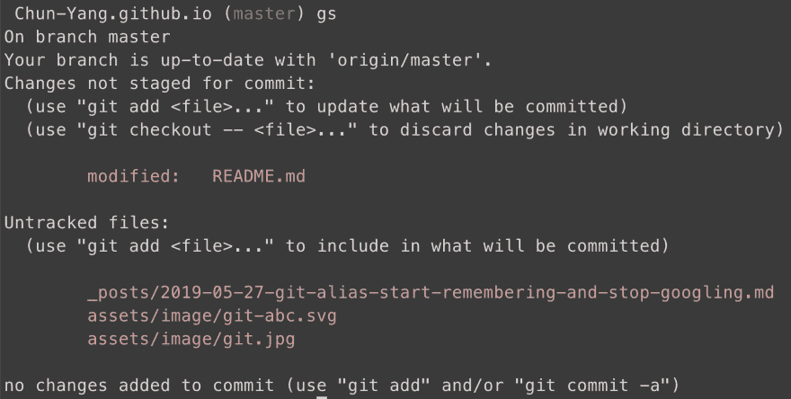
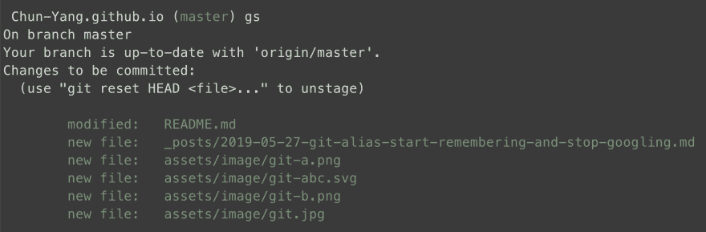
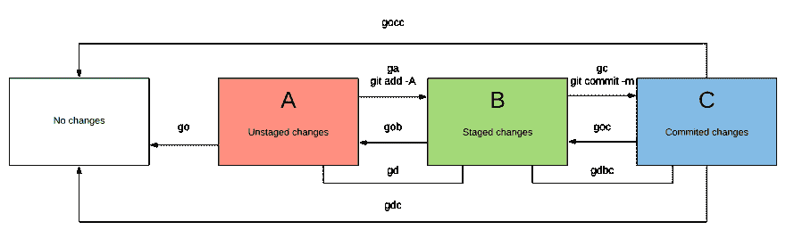

# Git ABC -开始记忆，停止谷歌搜索

> 原文：<https://dev.to/trentyang/git-abc-start-remembering-and-stop-googling-2e18>

我曾经是一个 Git 谷歌人(我的意思是我经常谷歌 Git:P ),直到有一天我坐下来，决定花点时间记住最常用的命令。我的方法是开发一个易于理解的框架，并使用系统化的别名来代替 Git 命令。如果这听起来有趣，我向你介绍 Git ABC。
[T3】](https://i.giphy.com/media/3o6Zti2G1pq3skGxKE/giphy.gif)

## 去 ABC

在 Git 中，文件更改(例如添加新行)需要经历三个阶段。我用 A，B，C 来代表它们。

#### 阶段一

未分级的变更和未跟踪的文件处于阶段 a。`git status`将用红色显示它们。
[](https://res.cloudinary.com/practicaldev/image/fetch/s--sI3muWTv--/c_limit%2Cf_auto%2Cfl_progressive%2Cq_auto%2Cw_880/https://trentyang.com/assets/image/git-a.png)

#### B 阶段

一旦我们`git add -A`，变更将被转移到阶段 b。`git status`将以绿色显示它们。
用 Git 的行话来说，这些变化现在已经“上演”了。
[T6】](https://res.cloudinary.com/practicaldev/image/fetch/s--oPtzM_iX--/c_limit%2Cf_auto%2Cfl_progressive%2Cq_auto%2Cw_880/https://trentyang.com/assets/image/git-b.png)

#### C 阶段

在我们`git commit -m`之后，变更将被转移到阶段 C(提交阶段)。

## 别名

现在有趣的部分来了。

[](https://res.cloudinary.com/practicaldev/image/fetch/s--RsrbOxXc--/c_limit%2Cf_auto%2Cfl_progressive%2Cq_auto%2Cw_880/https://trentyang.com/assets/image/git-abc.svg)

#### 前进

Git 用户应该已经熟悉了`git add`和`git commit`，所以我选择了下面的别名来推进变更

*   `alias ga='git add -A'` (Git Add)将变更从阶段 A 移动到阶段 B
*   `alias gc='git commit -m'` (Git Commit)将变更从阶段 B 移动到阶段 C

#### 向后移动

我使用`go`来撤销更改。我们可以认为它是‘走开’:)

*   `alias go='git checkout'`撤消对的更改
*   `alias gou='git clean -id'`(取消跟踪)从中删除未跟踪的文件
*   `alias gob='git reset HEAD'`(从 B 开始)将更改从 B 移动到 A
*   `alias goc='git reset --soft HEAD~1'`(从 C 开始)将更改从 C 移动到 B
*   `alias gocc='git reset --hard HEAD~1'`(从 C 确认)从 C 中删除整个提交

#### 检查阶段间的差异

我使用`gd` (Git Diff)来检查差异。

*   `alias gd='git diff'`A 和 B 的区别
*   `alias gdbc='git diff --cached'`B 和 C 的区别
*   `alias gdac='git diff HEAD'`A 和 C 的区别
*   上次提交后的所有更改

在这里，我列出了下面所有的别名，以便您可以复制并粘贴到您的 shell 配置文件中。

```
# move forward
alias ga='git add -A'
alias gc='git commit -m'

# move backward / undo
alias go='git checkout'
alias gou='git clean -id' # u means Untracked files
alias gob='git reset HEAD'
alias goc='git reset --soft HEAD~1'
alias gocc='git reset --hard HEAD~1' # c means Confirm

# check difference
alias gd='git diff'
alias gdbc='git diff --cached'
alias gdac='git diff HEAD'
alias gdc='git diff HEAD^ HEAD' 
```

## 奖金别名

我的一些有趣的别名不适合上面的框架，所以我把它们放在这里:)

```
# status
alias gs='git status'

# log
alias gl='git log'
alias glo='git log --oneline --decorate'

# stash and apply
alias gst='git stash'
alias gap='git stash apply --index'

# rebase
alias gr='git rebase'
alias grm='git fetch origin master:master && git rebase master'
alias grs='git rebase --skip'
alias grc='git rebase --continue'
alias gri='git rebase -i master' 
```

## 超越

最后，我鼓励你们为了利益和乐趣疯狂地创造自己的别名:)

[](https://i.giphy.com/media/39xDh4ja5Tp6IpDyBU/giphy.gif)