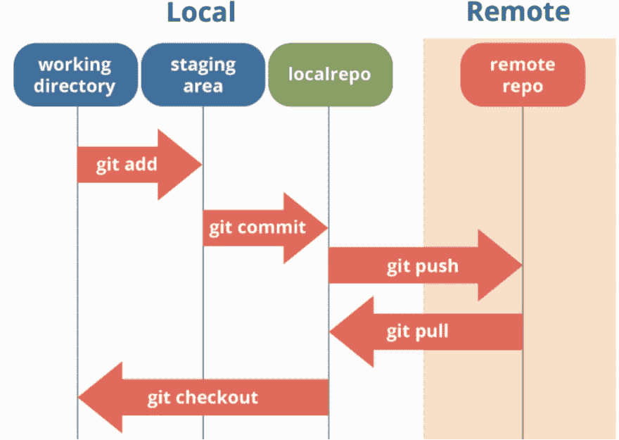
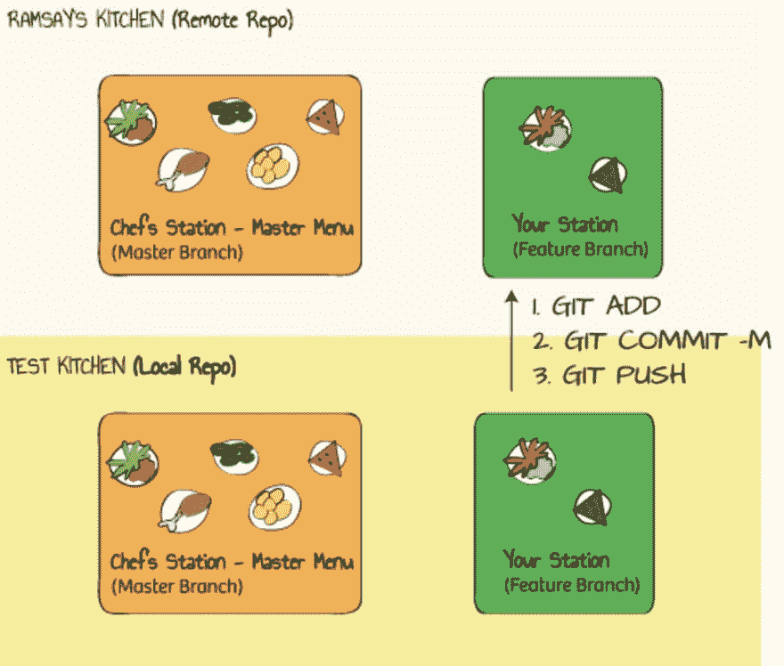
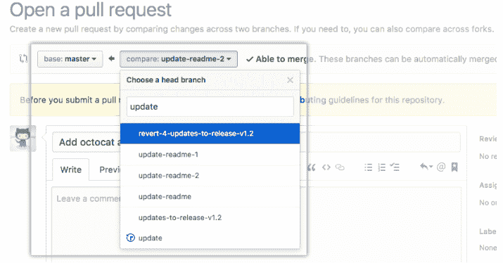

# Git、GitHub 和工作流基础知识

> 原文：<https://dev.to/mollynem/git-github--workflow-fundamentals-5496>

上周，我在熨斗学校完成了我的第一个小组项目。在[项目](https://github.com/mollynemerever/module-one-final-project-brewery-list-organizer)中，我用我的 Ruby 编程知识创建了一个 CLI 应用程序，帮助用户在美国发现新的酿酒厂。

整个团队项目中最大的障碍之一是导航 Git 和 GitHub。在这篇文章中，我希望帮助解释我们使用的工作流程，并分享一些在流程的每个阶段常用的命令。

### Git & GitHub

Git 是一个版本控制系统，它将帮助你在项目的整个生命周期中跟踪项目的变化和历史。在整个项目中，我经历了版本控制的两个主要部分:

1.  分支——允许你为自己复制源代码。然后，您将在自己的分支上工作，这样您的编辑不会立即影响原始源代码。

2.  合并——在完成测试后，将您的分支与原始源代码结合起来的过程。

GitHub 是托管您的 Git 存储库的服务。把 GitHub 想象成托管你的源代码的云服务器。项目的存储库由所有分支、提交、合并历史、任何许可或自述文件、rake/gem 文件等组成。

Git 和 GitHub 之间的合作给团队带来了无价的财富——任何对代码的修改都可以通过这两个工具来跟踪。因此，在出现错误的情况下，代码可以高效快速地回滚到出错前的状态。

### 工作流&常用命令

让我们回顾一个简单的项目工作流和帮助我们从一个步骤进入下一个步骤的 CLI 命令。下面是一个包含 Git 和 Github 的工作流程图。这个图表最接近地代表了我的小组项目的流程。

**git 克隆**

第一步(图中没有包括)是将存储库克隆到您的本地机器上。确保将项目克隆到一个有意义的工作目录中，这样您就可以很容易地记住本地项目所在的位置。

**git 拉原点主控**

接下来，从远程存储库下载(提醒一下，这个位于 GitHub 上)以确保您拥有最新的信息。信不信由你，在你把存储库克隆到你的计算机上的时候，一个团队成员可能已经做了修改。

**git check out-b new _ branch _ name**

创建自己的分支机构！如果你像我一样在一个团队项目中工作，你可能想要为你正在工作的特性创建一个新的分支。确保你是根据你的工作场所期望的标准来给你的部门命名的。您现在有了自己的小地方来试验代码，而不会立即影响主分支上的更改！

**注意:如果您有意编辑现有的分支，您可能不需要创建新的分支。在这种情况下，在进行任何更改之前，请确保您在正确的分支上，而不是主分支上。在创建/编辑分支之前，一定要和你的队友确认。

**git 添加文件名**

代码测试完成后，将您的更改添加到临时区域。这意味着您的文件被 Git 跟踪，变更已经完成，代码已经准备好，可以添加回存储库了。

**git status**

运行 git status 来确认您的文件已经被添加到临时区域。如果文件名以绿色列出，那么就可以开始了！如果没有，请再次尝试添加。

**git commit -m "有价值的 _ 但是 _ 短消息 _ 这里"**

将您的更改提交回存储库。添加简短但详细的注释，说明所做的更改、编写的代码或修复的 bug。让您的团队成员和未来的团队成员容易理解所做的更改。

**git push branch_name**

下一步——将您的更改推送到存储库！现在，您已经将代码转移到了 GitHub 上。你推上来的代码存在于你正在处理的当前分支中。我们(艰难地)认识到在你的分支*和*上努力推进到你自己的分支是多么重要。如果你不小心推送到主分支，你就有可能覆盖 GitHub 中主分支的代码。

最后，您需要通过 GitHub 创建一个**拉请求**。这可能因项目的性质而异。提交一个 pull 请求将通知存储库的所有者，您已经准备好将您的代码与主分支合并。在完成合并之前，由所有者来检查您的代码。在我们的特殊情况下，当我们完成拉请求时，我们让团队成员一起查看代码。因为我们对 GitHub 流程还比较陌生，所以我们希望确保当一个分支与主分支合并时，没有代码被意外覆盖。

git pull origin master
这个命令是上面提到的克隆到你的机器后你应该做的第一件事。同样，一旦母版被修改，您将需要完成此操作。这个命令获得了一个*荣誉奖*，因为它在保持你的工作版本最新方面发挥了关键作用。在一个存储库中的主分支已经从一个拉请求中更新之后，确保从存储库下拉到您的本地分支。这将确保您继续处理最新的文件。

### 结论

我希望这篇文章有助于解释使用 Git 和 GitHub 的一些基础知识。写这个博客对我来说是一次有价值的锻炼，因为我能够反思挑战我的团队的过程，并通过进一步的研究了解更多。请注意，这篇文章没有涉及到许多常见的命令，我鼓励您根据需要查找这些命令。我很想听到对这篇文章的反馈，欢迎评论！编码快乐！

资源:
[Git 厨房与戈登·拉姆齐](http://bloggytoons.com/posts/2013/10/10/git-kitchen-wchef-ramsay)
[约什·埃里克森-密歇根大学](http://dept.stat.lsa.umich.edu/~jerrick/courses/stat701/notes/git.html#content)
[Git 基础知识](http://slidedeck.io/stalwart201/git-basics)