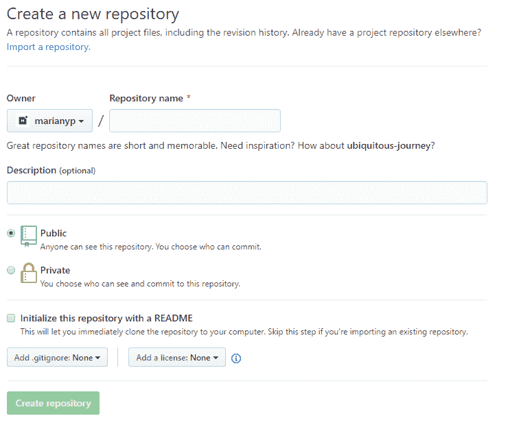

# Git & GitHub 放入 5 个简单的步骤✔️

> 原文：<https://dev.to/marianyp/git-github-put-in-5-simple-steps-egl>

我将尽可能少用晦涩难懂的语言来写这篇文章，这样你就不会产生不必要的困惑。我假设你理解 Git 和 GitHub 之间的区别，以及两者的“有用性”。这篇文章将会用简单的英语展示启动一个知识库的步骤。然后，展示我们如何做这些步骤。

首先，创建一个 GitHub 存储库。导航到 [GitHub](https://www.github.com/) 上的“新存储库”。然后，您应该会看到这样的页面。

简单地给你的库起一个名字，相对于你正在工作或者将要工作的任何项目。此外，如果您愿意，您可以添加一个描述，并做一些事情，比如改变存储库的公开性。

在页面的底部，有一些其他的选项来启动您的存储库。这一部分可能会让初学者迷惑，我稍后会解释，但是如果你想添加一个自述文件。gitignore，和/或 license，继续。

现在你已经有了 GitHub repo，我们可以回顾一下使用 Git 和 GitHub 时将会发生的 5 个简单步骤。这些步骤如下:

1.  在您的计算机上启动本地 git 存储库。

2.  添加您的远程存储库。

3.  开始编码并添加您的文件。

4.  提交您的代码

5.  将您的本地回购状态推送到您的 GitHub 回购。

现在你已经有了步骤，让我们把它们分解并解释我们如何去做它们。

# 1。在您的计算机上启动本地 git 存储库

使用 git 和 GitHub 背后的想法是，你有一个在线的 Git 存储库，这是我们之前在 GitHub 上创建的，我们在本地计算机上也有自己的本地 Git repo。要创建本地 Git repo，请打开项目文件夹中的终端/控制台并运行命令

`git init`

该命令在您当前所在的目录中创建一个. git 文件。这个。git 文件使目录位于本地 git 存储库中。现在我们有了一个本地 git 存储库，我们可以将它连接到我们的 GitHub 存储库。

# 2。添加远程存储库

所以我们有了本地存储库，但是我们如何将它连接到我们之前创建的 GitHub repo 呢？这个命令允许我们将本地 repo 连接到 GitHub repo。

`git remote add origin [repo url]`

让我们把这个命令分解一下，让它更有意义。我们正在使用 git 远程功能，这就是为什么前两个参数是`git remote`，所以这很简单。但是这个`add origin [repo url]`是什么？

我们正在向名为“origin”的本地存储库中添加一个远程。“origin”这个名称也不是必需的。如果我们愿意，我们可以将遥控器命名为“purplecow”或任何我们真正想要的名称，而不是“origin”。但标准是命名为 origin。

最后一个参数是到您的存储库的链接，看起来有点像这样:[https://github.com/user/repo.git](https://github.com/user/repo.git)。你可以点击 GitHub repo 上的这个按钮找到这个链接。

## (第二部分)

如果您在创建 GitHub 时添加了 README 或任何其他初始文件，您需要遵循这个步骤。否则，你可能会遇到一些麻烦。如果您没有用任何文件初始化，您可以跳过这一步，转到步骤 3。

现在的问题是，您的 GitHub repo 有一个文件，而您的本地存储库没有这个文件，这个文件就是您初始化时使用的文件(README，。gitignore 等)。您的本地存储库被认为是落后的。要解决这个问题，您现在需要将文件从 GitHub repo 拉到本地 repo。为此，我们会:

`git pull origin master`

这将把 README.md 文件或 GitHub 启动时使用的任何文件提取到本地 repo 中。在这个过程中，你现在做这件事是很重要的。否则，当你开始提交更改时，你的回购将被认为是“不同步的”，你将不得不经历一个繁琐的过程才能把事情做好。

# 3。开始编码并添加您的文件

我们的 GitHub 回购和我们的本地回购都设置好了！现在是时候向临时区域添加文件了。暂存区基本上只是“区域”或更新文件的列表，这些文件被“附加”以供提交。为了“附加”一个文件，我们使用“git add”命令。您可以像这样添加单个文件。

`git add file1.js file2.js file3.js`

然而，如果我们已经开发和充实了我们的项目，并且希望整个目录被登台，我们可以这样做。

`git add *`

这将把当前目录中 Git 检测到已更改的每个文件添加到临时区域。但是如果有一些您不想添加的文件呢？也许您有一个包含敏感信息的文件，您不希望 Git 访问它？这就是。gitignore 派上了用场。

。gitignore 是一个允许你将其他不被跟踪的文件列入黑名单的文件。所以在做‘git add’的时候，不会意外添加不需要的文件。

要从终端创建一个. gitignore 文件，可以这样做。

`touch .gitignore`

然后我们打开。git 忽略文件并在单独的行中过滤不需要的文件。例如，在一行中，我可以将`node_modules`放入黑名单，将名为 node_modules 的文件夹列入黑名单。在另一行，如果我愿意，我可以添加`.png`，将所有 png 文件列入黑名单。

# 4。提交您的代码

快好了！我们现在需要提交我们的工作。我们使用`git add`添加了我们的文件，现在需要将这些更改保存到我们的本地存储库中，因为这些更改只在暂存区中。为此，请运行:

`git commit -m "Initial Commit"`

如前所述，该命令将提交我们使用`git add`对 repo 进行的任何更改/添加。`-m`允许我们在命令中放入一条消息，我们在引号中放了这条消息。传统上，在第一次提交时，您会看到消息说“初始提交”。

# 5。将您的本地回购状态推送到您的 GitHub 回购。

现在剩下的就是更新我们的 GitHub 库的状态。我们一直在运行所有这些命令，做所有这些更改，但它只影响了我们计算机上的本地回购。所以让我们运行一个命令来更新我们的 GitHub repo，或者说 **push** 。

`git push origin master`

本质上，正在发生的是，我们正在把我们的主分支推向我们的原点。Origin 是我们早期定义的东西之一，是我们的 GitHub repo 的 URL。

所以现在，看看你的 GitHub 回购页面。如果一切顺利，你的推送应该会成功，你应该可以在网上看到你的文件！很简单，对吧？

# 课后辅导+技巧

简而言之，这 5 个步骤可以转换为以下命令列表:

1.  `git init`

2.  `git remote add origin (repo url)`

3.  `git add`

4.  `git commit -m “your message”`

5.  `git push origin master`

但是当你在做一个项目并做出改变的时候，你会做什么呢？当你编码时，你如何保持你的回购更新？好吧，只要重复步骤 3 - 4。

例如，如果我修复了代码中的一个 bug，所以我想更新我的 repo。我会做这样的事。

`git add modifiedFile1.php modifiedFile2.txt`

如前所述，我必须通过跑步来实现这些改变。正如你所看到的，我给出了一个详细但简短的描述，关于我在迭代中做了什么改变。

最后，我用`git push origin master`将这些更改推送到我的 GitHub。这几乎就是 Git 和 GitHub 的全部内容。Git 和 GitHub 还拥有许多命令和功能，但是您会在需要时或者通过查看文档慢慢了解它们。

### 感谢阅读！如果你有任何提示或建议，请写在下面。