# Git 重置-硬 git 重置-解释

> 原文：<https://dev.to/konrad_126/git-reset---explain-49bl>

Reset 可能是最难理解的 git 命令之一，此外还有一个危险的坏名声。这两种说法都有一个合理的理由:是的，重置命令有点难以理解，在某些情况下，它可能是危险的。但是，这并没有那么难。所以在这篇文章中，我会尽我所能给你一个清晰的，精炼的重置命令教程。为了使它简短而不至于让人不知所措，我已经抽象出了不重要的细节并简化了一些东西，但是如果你想了解更多关于 git 的内部工作方式，你也可以查看我的[理解 Git](https://medium.com/hackernoon/https-medium-com-zspajich-understanding-git-data-model-95eb16cc99f5) 系列来了解这里介绍的一些东西的更多细节。

## 饭桶树

在我们深入研究`reset`命令之前，我们需要看一下 git 的树:工作目录、暂存区和存储库。

[](https://res.cloudinary.com/practicaldev/image/fetch/s--BflwjrpI--/c_limit%2Cf_auto%2Cfl_progressive%2Cq_auto%2Cw_880/https://thepracticaldev.s3.amazonaws.com/i/ewai9wp289nvh3m73izy.png)

从 git 的角度来看，您可以将它们视为可以进行更改的区域:

*   工作目录——文件系统上的项目文件
*   暂存区-下一次提交的预览
*   repository——git 保存所有(过去的)提交的数据存储。

`reset`命令作用于这些区域，但是首先，让我们看看我们日常使用的`add`和`commit`命令是如何影响这些区域的。

* * *

假设我们有一个 web 应用程序，我们对我们的`index.php`文件做了一些重构。我们所做的更改会反映在工作目录中:

[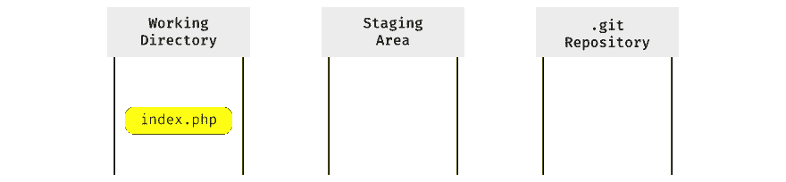](https://res.cloudinary.com/practicaldev/image/fetch/s--mQEnxjkE--/c_limit%2Cf_auto%2Cfl_progressive%2Cq_auto%2Cw_880/https://thepracticaldev.s3.amazonaws.com/i/nc420p77t0yb2bmbjmtx.png)

我们可以通过运行`git status` :
进行确认

```
Changes not staged for commit:
  (use "git add <file>..." to update what will be committed)
  (use "git checkout -- <file>..." to discard changes in working directory)
modified:   index.php 
```

Enter fullscreen mode Exit fullscreen mode

现在我们通过使用`add`命令将这些更改移动到暂存区域:

[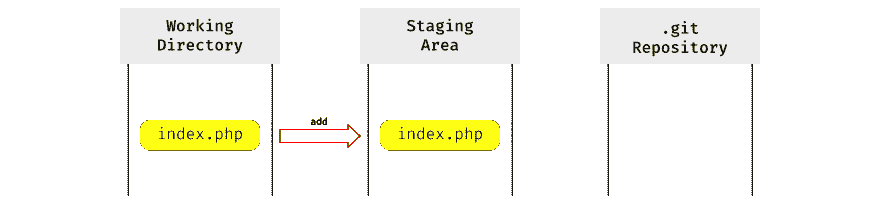](https://res.cloudinary.com/practicaldev/image/fetch/s--BV6fvqyD--/c_limit%2Cf_auto%2Cfl_progressive%2Cq_auto%2Cw_880/https://thepracticaldev.s3.amazonaws.com/i/i44nplrxytu1hv43vjgr.png)

现在运行`status`命令会告诉我们:

```
Changes to be committed:
  (use "git reset HEAD <file>..." to unstage)
modified:   index.php 
```

Enter fullscreen mode Exit fullscreen mode

因为`status`命令看到我们在工作目录和暂存区中有相同版本的`index.php`文件，但是在存储库中没有。

为了在那里添加它，我们使用`commit`命令:

[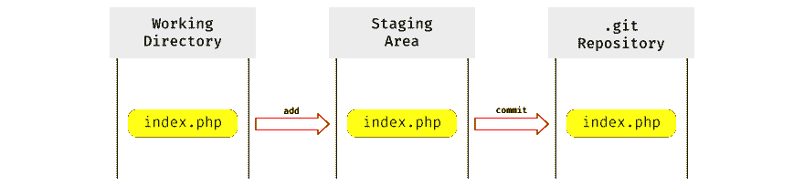](https://res.cloudinary.com/practicaldev/image/fetch/s--vkwpVAeD--/c_limit%2Cf_auto%2Cfl_progressive%2Cq_auto%2Cw_880/https://thepracticaldev.s3.amazonaws.com/i/uhv9ufeloh7dzkarfkk7.png)

而且现在工作目录，Staging Area 和 Repository 都包含了同一个版本的`index.php`，运行`git status`会告诉我们有:

```
nothing to commit, working tree clean 
```

Enter fullscreen mode Exit fullscreen mode

因此，`status`命令的工作方式是，它比较工作目录、暂存区和存储库中的文件版本，如果有不同的版本，就要暂存/提交文件。

* * *

假设我们现在重构了`index.php`文件，并再次执行整个添加/提交循环。
现在我们的工作目录、暂存区和存储库都包含了我们的`index.php`文件的新的第二个版本。

[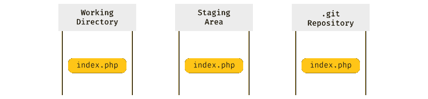](https://res.cloudinary.com/practicaldev/image/fetch/s--6vZFmSOj--/c_limit%2Cf_auto%2Cfl_progressive%2Cq_auto%2Cw_880/https://thepracticaldev.s3.amazonaws.com/i/wo5oov64zdbky534d7kg.png)

但是第一个版本呢？如果您还记得，我们说过存储库保存所有以前的提交，所以第一个版本的`index.php`文件仍然在那里:

[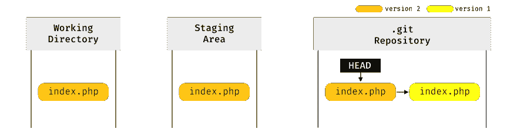](https://res.cloudinary.com/practicaldev/image/fetch/s--Y01IK8qZ--/c_limit%2Cf_auto%2Cfl_progressive%2Cq_auto%2Cw_880/https://thepracticaldev.s3.amazonaws.com/i/int99tvcvv72thk3cg3c.png)

为了跟踪我们的`index.php`文件的哪个版本是当前版本，存储库有一个名为`HEAD`的特殊指针，它指向当前版本(当与暂存区的版本进行比较时，`status`命令只查看`HEAD`指向的当前版本)。

* * *

现在我们已经了解了这一点，我们终于可以使用我们的`reset`命令，看看它是如何操作这些区域的内容的。

## 复位-软

第一种模式的`reset`命令只会做一件事:

*   移动`HEAD`指针。

在我们的例子中，我们将通过执行`git reset --soft HEAD~1`将它移动到前一次提交(`index.php`的第一个版本)

[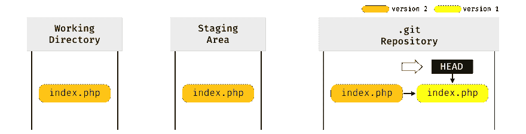](https://res.cloudinary.com/practicaldev/image/fetch/s--DikRtE1c--/c_limit%2Cf_auto%2Cfl_progressive%2Cq_auto%2Cw_880/https://thepracticaldev.s3.amazonaws.com/i/x3hcn3x96tu9ti4hxdqn.png)

git 的树现在看起来像这样:

[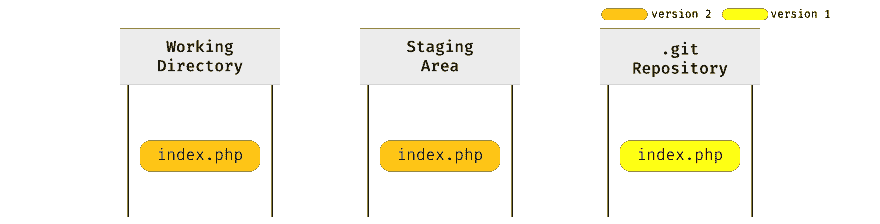](https://res.cloudinary.com/practicaldev/image/fetch/s--QUtbK82U--/c_limit%2Cf_auto%2Cfl_progressive%2Cq_auto%2Cw_880/https://thepracticaldev.s3.amazonaws.com/i/0fuznoq5a904nhm4tje8.png)

如果我们运行`git status`，我们会看到一个熟悉的消息:

```
Changes to be committed:
  (use "git reset HEAD <file>..." to unstage)
modified:   index.php 
```

Enter fullscreen mode Exit fullscreen mode

因此，运行`git reset --soft HEAD~1`基本上撤销了我们的最后一次提交，但是包含在该提交中的更改并没有丢失——它们在我们的暂存区和工作目录中。

## 重置-混合

`reset`命令的第二种模式将做两件事:

*   移动`HEAD`指针
*   更新临时区域(使用`HEAD`指向的内容)

因此，第一步与`--soft`模式相同。第二步获取`HEAD`指向的内容(在本例中，它是`index.php`文件的版本 1)并将其放入暂存区。

[](https://res.cloudinary.com/practicaldev/image/fetch/s--QUtbK82U--/c_limit%2Cf_auto%2Cfl_progressive%2Cq_auto%2Cw_880/https://thepracticaldev.s3.amazonaws.com/i/0fuznoq5a904nhm4tje8.png)

因此，在运行`git reset --mixed HEAD~1`之后，我们的区域看起来像这样:

[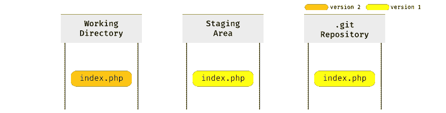](https://res.cloudinary.com/practicaldev/image/fetch/s--A6tQf-1z--/c_limit%2Cf_auto%2Cfl_progressive%2Cq_auto%2Cw_880/https://thepracticaldev.s3.amazonaws.com/i/voj8ggf56tnqx1tjbxe7.png)

如果我们现在运行`git status`，我们将再次看到一条熟悉的消息:

```
Changes not staged for commit:
  (use "git add <file>..." to update what will be committed)
  (use "git checkout -- <file>..." to discard changes in working directory)
modified:   index.php 
```

Enter fullscreen mode Exit fullscreen mode

因此，运行`git reset - mixed HEAD~1`撤销了我们上一次的提交，但是这次提交后的更改(只)在我们的工作目录中。

## 复位-硬

现在是臭名昭著的硬模式。运行`reset -- hard`将做三件事:

*   移动`HEAD`指针
*   更新临时区域(使用`HEAD`指向的内容)
*   更新工作目录以匹配临时区域

所以，前两步与`--mixed`相同。第三个使工作目录看起来像临时区域(已经填充了`HEAD`所指向的内容)。

[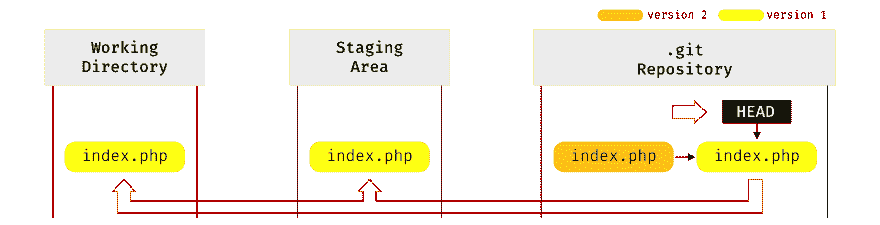](https://res.cloudinary.com/practicaldev/image/fetch/s--xWGxN1Yp--/c_limit%2Cf_auto%2Cfl_progressive%2Cq_auto%2Cw_880/https://thepracticaldev.s3.amazonaws.com/i/oyd3lrl6k3jg6o8s32vh.png)

因此，在运行`git reset --hard HEAD~1`之后，我们的区域看起来像这样:

[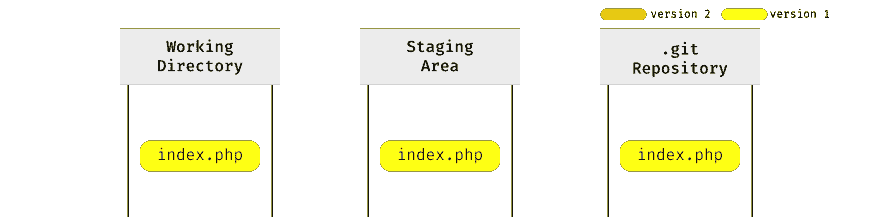](https://res.cloudinary.com/practicaldev/image/fetch/s--LkyybeKJ--/c_limit%2Cf_auto%2Cfl_progressive%2Cq_auto%2Cw_880/https://thepracticaldev.s3.amazonaws.com/i/shfnzr2d0drdd0fx9z62.png)

而运行`git status`会给我们:

```
nothing to commit, working tree clean 
```

Enter fullscreen mode Exit fullscreen mode

因此，运行`git reset - hard HEAD~1`已经撤销了我们的最后一次提交，并且该提交中包含的更改现在既不在我们的工作目录中，也不在暂存区中。但它们并没有完全消失。Git 不会从存储库中删除提交(实际上，有时会，但很少)，所以这意味着我们的第二个版本的提交仍然在存储库中，只是有点难以找到(你可以通过查看名为 *reflog* 的东西来跟踪它)。

那么，重置是危险的 T2 的名声是怎么回事呢？嗯，有一种情况下，一些更改可能会永久丢失。考虑这样一个场景，在第二次提交之后，您对您的`index.php`文件做了更多的更改，但是您没有暂存和提交它们:

[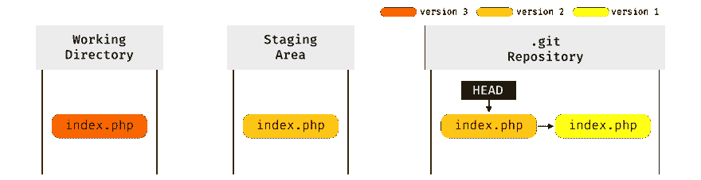](https://res.cloudinary.com/practicaldev/image/fetch/s--iT9Kjvbx--/c_limit%2Cf_auto%2Cfl_progressive%2Cq_auto%2Cw_880/https://thepracticaldev.s3.amazonaws.com/i/em97n1eqjue5x81fhf2f.png)

现在你跑`git reset --hard HEAD~1`:

[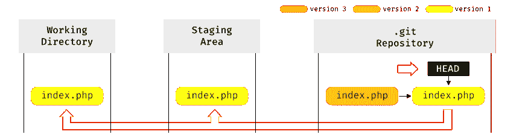](https://res.cloudinary.com/practicaldev/image/fetch/s--Q6I261yh--/c_limit%2Cf_auto%2Cfl_progressive%2Cq_auto%2Cw_880/https://thepracticaldev.s3.amazonaws.com/i/h7901w56tpcjl86js8v6.png)

由于`reset`命令将覆盖您的工作目录的内容以匹配暂存区域(即匹配`HEAD`)，并且您从未暂存和提交您的更改(存储库中没有提交这些更改)，所有这些更改现在都将及时丢失...像雨中的泪水。

硬重置的危险在于它不是工作目录安全的——这意味着如果您的工作目录中有文件更改，并且在运行时会被覆盖(和丢失),它不会给你任何警告。所以在硬重置时要格外小心。

* * *

这就是你要的:`reset`命令。我希望我解释得很好，并且你会同意这并不困难。是的，它可能是危险的，但只有在与`--hard`选项一起使用时。

正如开始所说，如果你想知道更多关于 git 的内部工作原理，你可以查看我的[理解 Git](https://hackernoon.com/https-medium-com-zspajich-understanding-git-data-model-95eb16cc99f5) 系列，如果你想更深入地了解`reset`命令，你可以查看 git pro 书中的[重置揭秘](https://git-scm.com/book/en/v2/Git-Tools-Reset-Demystified)章节。

### 附录:

*   在示例中，我们使用了`HEAD~1`作为`reset`命令的参数。您可能已经知道 git 中的每个提交都有一个唯一的标识符，称为校验和，我们也可以用它作为`reset`命令的参数

[](https://res.cloudinary.com/practicaldev/image/fetch/s--9jh2xiHc--/c_limit%2Cf_auto%2Cfl_progressive%2Cq_auto%2Cw_880/https://thepracticaldev.s3.amazonaws.com/i/na01nuo4po352azewbtl.png)

*   为了简化示例，我们只编辑和提交了一个文件，实际上，我们经常提交多个文件，所以一个特定的提交包含多个文件的不同版本。

[](https://res.cloudinary.com/practicaldev/image/fetch/s--FKjWO8eF--/c_limit%2Cf_auto%2Cfl_progressive%2Cq_auto%2Cw_880/https://thepracticaldev.s3.amazonaws.com/i/2fhxswfh7zkhtxwkz7pi.png)

*   特殊的`HEAD`指针通常不直接指向提交(为简单起见，如示例所示),而是指向一个分支指针，然后该分支指针指向一个特定的提交

[](https://res.cloudinary.com/practicaldev/image/fetch/s--e2qTeH9n--/c_limit%2Cf_auto%2Cfl_progressive%2Cq_auto%2Cw_880/https://thepracticaldev.s3.amazonaws.com/i/47dvuc7hubinjwsqnftp.png)