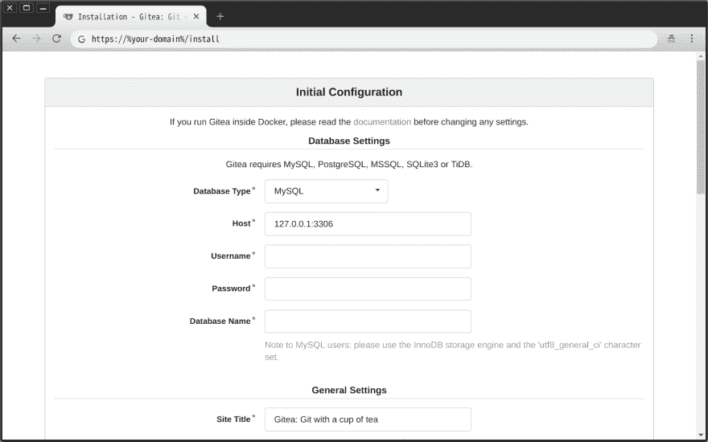

# OpenBSD 上的 Gitea:使用官方包

> 原文：<https://dev.to/nabbisen/gitea-on-openbsd-using-official-package-2ogl>

# 概述

"喝一杯茶吧"🍵
[Gitea](https://gitea.io/en-us/) 是自托管 Git 服务，轻量级代码托管解决方案，用 [Go](https://golang.org/) 编写。
是如今 [Gogs](https://gogs.io/) 和[维护良好的]((https://github.com/go-gitea/gitea))的社区托管叉。

[OpenBSD](https://www.openbsd.org/) 提供 Gitea 包(真的很感谢！)这对节省时间非常有用:)
这篇文章将告诉你如何安装和设置它。

### 环境

*   操作系统:OpenBSD 6.4 amd64
*   数据库: [MariaDB](https://mariadb.org/) 10.0
*   Web 服务器:OpenBSD [httpd](https://man.openbsd.org/httpd.8)
*   Git 服务:Gitea 1.5.0

<center>✿ ✿ ✿</center>

# 安装

### #1。正在准备数据库

Gitea 支持 MariaDB、 [PostgreSQL](https://www.postgresql.org/) 、 [SQLite3](https://www.sqlite.org/) 和 [TiDB](https://www.pingcap.com/) 等多种数据库。

如果是 MariaDB:

```
$ mysql -u root -p 
```

Enter fullscreen mode Exit fullscreen mode

创建数据库/用户:

```
CREATE DATABASE %db-name% DEFAULT CHARACTER SET `utf8mb4` COLLATE `utf8mb4_unicode_ci`;
GRANT ALL PRIVILEGES ON %db-name%.* TO %db-user% IDENTIFIED BY '%db-pass%';
FLUSH PRIVILEGES; 
```

Enter fullscreen mode Exit fullscreen mode

* * *

### #2。安装软件包

只需使用`pkg_add`就可以立即将我们带到大门:

```
#  pkg_add gitea
quirks-3.16 signed on 2018-10-12T15:26:25Z
gitea-1.5.0p0: ok
The following new rcscripts were installed: /etc/rc.d/gitea
See rcctl(8) for details.
New and changed readme(s):
        /usr/local/share/doc/pkg-readmes/gitea 
```

Enter fullscreen mode Exit fullscreen mode

此外，`/usr/local/share/doc/pkg-readmes/gitea`中的说明很清楚，也很有帮助。

##### #(注)GITEA_CUSTOM

[Gitea 的`custom/conf`](https://docs.gitea.io/en-us/customizing-gitea/) 这次不用，因为`/etc/rc.d/gitea`如下:

```
#!/bin/ksh
#
# $OpenBSD: gitea.rc,v 1.4 2018/01/11 19:27:11 rpe Exp $

daemon="/usr/local/sbin/gitea"
daemon_user="_gitea"
daemon_flags="web"

. /etc/rc.d/rc.subr

rc_bg=YES
rc_reload=NO

rc_start() {
        ${rcexec} "env HOME=/var/gitea USER=${daemon_user}  \ GITEA_WORK_DIR=/usr/local/share/gitea \ GITEA_CUSTOM=/etc/gitea \  ${daemon}  ${daemon_flags}"
}

rc_cmd $1 
```

Enter fullscreen mode Exit fullscreen mode

`GITEA_CUSTOM`定义为`/etc/gitea`。

* * *

### #3。设置 Gitea

每一步都是关于编辑 **`/etc/gitea/conf/app.ini`** 。

#### 服务器

转到`[server]`部分，按如下方式更改设置。

来自:

```
; The protocol the server listens on. One of 'http', 'https', 'unix' or 'fcgi'. PROTOCOL = http
DOMAIN = localhost
ROOT_URL = %(PROTOCOL)s://%(DOMAIN)s:%(HTTP_PORT)s/
; The address to listen on. Either a IPv4/IPv6 address or the path to a unix socket. HTTP_ADDR = 0.0.0.0
HTTP_PORT = 3000
...
; Local (DMZ) URL for Gitea workers (such as SSH update) accessing web service.
; In most cases you do not need to change the default value.
; Alter it only if your SSH server node is not the same as HTTP node.
; Do not set this variable if PROTOCOL is set to 'unix'. LOCAL_ROOT_URL = %(PROTOCOL)s://%(HTTP_ADDR)s:%(HTTP_PORT)s/ 
```

Enter fullscreen mode Exit fullscreen mode

致:

```
; The protocol the server listens on. One of 'http', 'https', 'unix' or 'fcgi'. PROTOCOL = fcgi
DOMAIN = %your-domain%
ROOT_URL = https://%your-domain%
; The address to listen on. Either a IPv4/IPv6 address or the path to a unix socket. HTTP_ADDR = 127.0.0.1
HTTP_PORT = 10787
...
; Local (DMZ) URL for Gitea workers (such as SSH update) accessing web service.
; In most cases you do not need to change the default value.
; Alter it only if your SSH server node is not the same as HTTP node.
; Do not set this variable if PROTOCOL is set to 'unix'. LOCAL_ROOT_URL = https://%your-domain%/ 
```

Enter fullscreen mode Exit fullscreen mode

#### 运行用户(可选)

文件顶部有`RUN_USER`定义。

```
; This file lists the default values used by Gitea
; Copy required sections to your own app.ini (default is custom/conf/app.ini)
; and modify as needed.
; see https://docs.gitea.io/en-us/config-cheat-sheet/ for additional documentation.
; App name that shows in every page title APP_NAME = Gitea: Git with a cup of tea
; Change it if you run locally RUN_USER = _gitea
; Either "dev", "prod" or "test", default is "dev" RUN_MODE = prod 
```

Enter fullscreen mode Exit fullscreen mode

#### 储存库(可选)

如果您希望将来有多个存储库具有不同目录的服务，请转到`[repository]`部分，并按如下方式更改设置。
这是为了让目录具有唯一性。

来自:

```
ROOT = /var/gitea/gitea-repositories 
```

Enter fullscreen mode Exit fullscreen mode

致:

```
ROOT = /var/www/%documen-root%/gitea/gitea-repositories 
```

Enter fullscreen mode Exit fullscreen mode

然后准备`RUN_USER` :
的目录

```
#  mkdir /var/www/%document-root%/gitea/gitea-repositories
#  chown _gitea:_gitea /var/www/%document-root%/gitea/gitea-repositories 
```

Enter fullscreen mode Exit fullscreen mode

#### 数据库(可选)

如果您使用另一个数据库而不是 SQLite3，请转到`[database]`部分，并按如下方式更改设置。

来自:

```
; Either "mysql", "postgres", "mssql" or "sqlite3", it's your choice DB_TYPE = sqlite3 
```

Enter fullscreen mode Exit fullscreen mode

致:

```
; Either "mysql", "postgres", "mssql" or "sqlite3", it's your choice DB_TYPE = mysql 
```

Enter fullscreen mode Exit fullscreen mode

嗯，其他设置不必编辑，因为稍后会在 web 安装程序中询问它们。

#### 压制 U2F(暂时？)

根据[Github 问题](https://github.com/go-gitea/gitea/issues/4692)(这确实发生在我身上！)，U2F 在启动时导致 Segfault ( `SIGSEGV`)附近的严重错误。
因此，我们不得不抑制它。

转到`[U2F]`部分，注释掉所有设置，如下所示。

来自:

```
[U2F]
; Two Factor authentication with security keys
; https://developers.yubico.com/U2F/App_ID.html APP_ID         = %(PROTOCOL)s://%(DOMAIN)s:%(HTTP_PORT)s/
; Comma seperated list of truisted facets TRUSTED_FACETS = %(PROTOCOL)s://%(DOMAIN)s:%(HTTP_PORT)s/ 
```

Enter fullscreen mode Exit fullscreen mode

致:

```
[U2F]
;; Two Factor authentication with security keys
;; https://developers.yubico.com/U2F/App_ID.html
;APP_ID         = %(PROTOCOL)s://%(DOMAIN)s:%(HTTP_PORT)s/
;; Comma seperated list of truisted facets
;TRUSTED_FACETS = %(PROTOCOL)s://%(DOMAIN)s:%(HTTP_PORT)s/ 
```

Enter fullscreen mode Exit fullscreen mode

#### 激活/启动守护进程

现在 Gitea 准备好了！

```
#  rcctl enable gitea
#  rcctl start gitea 
```

Enter fullscreen mode Exit fullscreen mode

嗯，如果这里出错了，使用`-d`选项将有助于调试`rcctl`:

[](/nabbisen) [## rcctl:如何在 OpenBSD 6.4 中调试

### 纳比森 11 月 23 日 183 分钟阅读

#openbsd #rcctl #debug #gitea](/nabbisen/debugging-rcctl-in-openbsd-3e70)

* * *

### #4。配置 httpd

首先，获得 HTTPS 连接的认证，因为稍后会在 web 安装程序中询问密码:

[](/nabbisen) [## 让我们加密:Certbot For OpenBSD 的 httpd

### nabbisen Dec 14 ' 184 分钟读数

#security #letsencrypt #certbot #openbsd](/nabbisen/lets-encrypt-certbot-for-openbsds-httpd-3ofd)

然后编辑 [`/etc/httpd.conf`](https://man.openbsd.org/httpd.conf.5) :

```
server "%your-domain%" {
        listen on $ext_addr port 80
        block return 301 "https://$SERVER_NAME$REQUEST_URI"
}
server "%your-domain%" {
        listen on $ext_addr tls port 443
        tls {
                certificate     "/etc/letsencrypt/live/%your-domain%/fullchain.pem"
                key             "/etc/letsencrypt/live/%your-domain%/privkey.pem"
        }
        connection { max requests 500, timeout 3600 }
        location "/*" {
                # before 6.7:
                #fastcgi socket ":10787"
                # as of 6.8 and greater:
                fastcgi socket tcp 127.0.0.1 10787
        }
} 
```

Enter fullscreen mode Exit fullscreen mode

重启守护进程:

```
#  rcctl restart httpd 
```

Enter fullscreen mode Exit fullscreen mode

* * *

### #5。通过 Web 安装程序初始化

目标快到了！
让我们使用网络浏览器访问网站，然后转到`/install`。
跟随网络安装程序给我们带来了温和的目标:

[](https://res.cloudinary.com/practicaldev/image/fetch/s--_0srbIuA--/c_limit%2Cf_auto%2Cfl_progressive%2Cq_auto%2Cw_880/https://thepracticaldev.s3.amazonaws.com/i/sy3muv23s0b2lhlt49fz.png)

如果你喜欢用 Gitea 托管代码，我很高兴: )

<center>✿ ✿ ✿</center>

快乐服务🌿