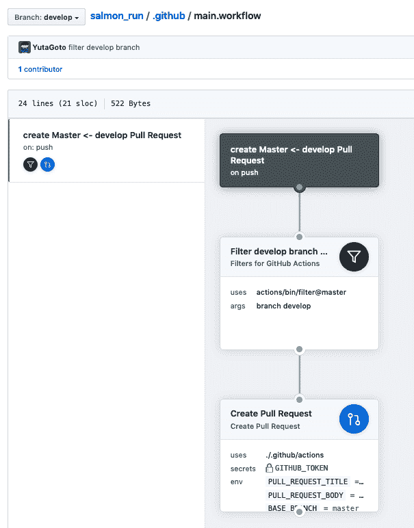
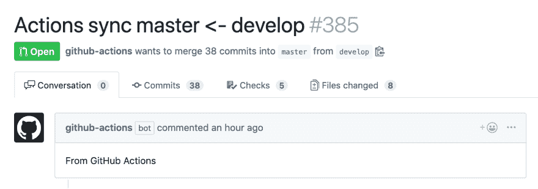

# 制作了用 GitHub Actions 自动发送 PullRequest 的东西

> 原文：<https://dev.to/yutagoto/github-actions-pullrequest-347l>

你好，.这边。

如标题所示，使用[GitHub Actions](https://developer.github.com/actions/) ，制定了自动发送 PullRequest 的结构。

## 尝试的资源库

## [yuta goto](https://github.com/YutaGoto)/[salmon _ run](https://github.com/YutaGoto/salmon_run)

### Splatoon2 的鲑鱼兰勃基变迁

<article class="markdown-body entry-content p-5" itemprop="text">

# 三文鱼 _ 奔跑

Splatoon2 的鲑鱼兰勃基变迁

这个存储库是非正式的，完全是出于个人兴趣制作的。

[](https://circleci.com/gh/YutaGoto/salmon_run)[](https://travis-ci.com/YutaGoto/salmon_run)[](https://greenkeeper.io/)[](https://codeclimate.com/github/YutaGoto/salmon_run/maintainability)[](https://codeclimate.com/github/YutaGoto/salmon_run/test_coverage)[](https://www.codacy.com/app/YutaGoto/salmon_run?utm_source=github.com&utm_medium=referral&utm_content=YutaGoto/salmon_run&utm_campaign=Badge_Grade)

[](https://raw.githubusercontent.com/YutaGoto/salmon_run/develop/salmon.gif)

## 投机

*   Ruby 版本:2.6.1
*   Rails 版本:5.2.3
*   PostgreSQL 版本:10.5
*   纱线版本:1.13.0
*   视图:v2.5.17
*   uikit: 3.0.0-rc.25
*   弹性搜索:5.6.14
*   graphql: 1.9.3

### 工具

*   [循环 2.0](https://circleci.com/)
*   [Sider](https://sider.review/)
*   [代码节拍](https://codebeat.co/)
*   [绿色守护者](https://greenkeeper.io/)
*   [气候代码](https://codeclimate.com/)
*   [Codacy](https://www.codacy.com/)
*   [Depfu](https://depfu.com/)

## 什么是三文鱼籽

*   [三文鱼籽 2](https://www.nintendo.co.jp/switch/aab6a/coop/index.html)

## Activity report

<details><summary>Blog List</summary>

*   [正在练习 Rails5 的条件](https://medium.com/@gggooottto/rails5%E3%81%AE%E7%B7%B4%E7%BF%92%E3%82%92%E3%81%97%E3%81%A6%E3%81%84%E3%82%8B%E4%BB%B6-a9b46a0fb6e5)
*   [正在练习 Rails5 的条件 2](https://medium.com/@gggooottto/rails5%E3%81%AE%E7%B7%B4%E7%BF%92%E3%82%92%E3%81%97%E3%81%A6%E3%81%84%E3%82%8B%E4%BB%B62-d4fdce635bcc)
*   [正在练习 Rails5 的条件 3](https://medium.com/@gggooottto/rails5%E3%81%AE%E7%B7%B4%E7%BF%92%E3%82%92%E3%81%97%E3%81%A6%E3%81%84%E3%82%8B%E4%BB%B63-40398a24e7b1)
*   [正在练习 Rails5 的条件 4](https://medium.com/@gggooottto/rails5%E3%81%AE%E7%B7%B4%E7%BF%92%E3%82%92%E3%81%97%E3%81%A6%E3%81%84%E3%82%8B%E4%BB%B64-a506426e1f71)
*   [正在练习 Rails5 的条件 5](https://medium.com/@gggooottto/rails5%E3%81%AE%E7%B7%B4%E7%BF%92%E3%82%92%E3%81%97%E3%81%A6%E3%81%84%E3%82%8B%E4%BB%B65-da554d093d73)
*   [正在练习 Rails5 的条件 6](https://medium.com/@gggooottto/rails5%E3%81%AE%E7%B7%B4%E7%BF%92%E3%82%92%E3%81%97%E3%81%A6%E3%81%84%E3%82%8B%E4%BB%B66-f0c80e802560)
*   [正在练习 Rails5 的件 7](https://medium.com/@gggooottto/rails5%E3%81%AE%E7%B7%B4%E7%BF%92%E3%82%92%E3%81%97%E3%81%A6%E3%81%84%E3%82%8B%E4%BB%B67-d28b7f3dc276)
*   [正在练习 Rails5 的条件 8](https://medium.com/@gggooottto/rails5%E3%81%AE%E7%B7%B4%E7%BF%92%E3%82%92%E3%81%97%E3%81%A6%E3%81%84%E3%82%8B%E4%BB%B68-4fe7a6ff8911)
*   [正在练习 Rails5 的条件 9](https://medium.com/@gggooottto/rails5%E3%81%AE%E7%B7%B4%E7%BF%92%E3%82%92%E3%81%97%E3%81%A6%E3%81%84%E3%82%8B%E4%BB%B69-aa11e2e22193)
*   [正在练习 Rails5 的条件 10](https://medium.com/@gggooottto/rails5%E3%81%AE%E7%B7%B4%E7%BF%92%E3%82%92%E3%81%97%E3%81%A6%E3%81%84%E3%82%8B%E4%BB%B610-9caea56d8ceb)
*   [正在练习 Rails5 的条件 11](https://medium.com/@gggooottto/rails5%E3%81%AE%E7%B7%B4%E7%BF%92%E3%82%92%E3%81%97%E3%81%A6%E3%81%84%E3%82%8B%E4%BB%B611-1a96f0c42c03)
*   [正在练习 Rails5 的条件 12](https://medium.com/@gggooottto/rails5%E3%81%AE%E7%B7%B4%E7%BF%92%E3%82%92%E3%81%97%E3%81%A6%E3%81%84%E3%82%8B%E4%BB%B612-7686dacc71ce)
*   [正在练习 Rails5 的条件 13](https://medium.com/@gggooottto/rails5%E3%81%AE%E7%B7%B4%E7%BF%92%E3%82%92%E3%81%97%E3%81%A6%E3%81%84%E3%82%8B%E4%BB%B613-67761b607bc8)
*   [正在练习 Rails5 的条件 14](https://medium.com/@gggooottto/rails5%E3%81%AE%E7%B7%B4%E7%BF%92%E3%82%92%E3%81%97%E3%81%A6%E3%81%84%E3%82%8B%E4%BB%B614-3fcbd3dd539d)
*   [正在练习 Rails5 的条件 15](https://medium.com/@gggooottto/rails5%E3%81%AE%E7%B7%B4%E7%BF%92%E3%82%92%E3%81%97%E3%81%A6%E3%81%84%E3%82%8B%E4%BB%B615-470ac03a05ae)
*   [正在练习 Rails5 的条件 16](https://medium.com/@gggooottto/rails5%E3%81%AE%E7%B7%B4%E7%BF%92%E3%82%92%E3%81%97%E3%81%A6%E3%81%84%E3%82%8B%E4%BB%B616-23381a85a76)
*   [正在练习 Rails5 的条件 17](https://medium.com/@gggooottto/rails5%E3%81%AE%E7%B7%B4%E7%BF%92%E3%82%92%E3%81%97%E3%81%A6%E3%81%84%E3%82%8B%E4%BB%B617-38ac0566efb6)
*   [正在练习 Rails5 的条件 18](https://medium.com/@gggooottto/rails5%E3%81%AE%E7%B7%B4%E7%BF%92%E3%82%92%E3%81%97%E3%81%A6%E3%81%84%E3%82%8B%E4%BB%B618-2ef4c5f7ef0)</details> 

### Fanbian

*   [GraphQLをやる](https://medium.com/@gggooottto/graphql%E3%82%92%E3%82%84%E3%82%8B%E8%A8%98%E4%BA%8B-d265c3d88363)

## 贡献的

1.  叉起来！
2.  创建您的特征分支:`git checkout -b my-new-feature`
3.  提交您的更改:`git commit -am 'Add some feature'`
4.  推到分支:`git push origin my-new-feature`
5.  提交拉式请求:D

## 许可证

用它

</article>

[View on GitHub](https://github.com/YutaGoto/salmon_run)

### 拉请求

[https://github.com/YutaGoto/salmon_run/pull/383](https://github.com/YutaGoto/salmon_run/pull/383)

### 码

```
# .github/main.workflow
workflow "create Master <- develop Pull Request" {
  on = "push"
  resolves = ["Create Pull Request"]
}

action "Filter develop branch only" {
  uses = "actions/bin/filter@master"
  args = "branch develop"
}

action "Create Pull Request" {
  uses = "./.github/actions"
  needs = ["Filter develop branch only"]
  secrets = [
    "GITHUB_TOKEN"
  ]
  env = {
    PULL_REQUEST_TITLE = "Actions sync master <- develop"
    PULL_REQUEST_BODY = "From GitHub Actions"
    BASE_BRANCH = "master"
    HEAD_BRANCH = "develop"
  }
} 
```

#### solution

[](https://res.cloudinary.com/practicaldev/image/fetch/s--qf-eEl8I--/c_limit%2Cf_auto%2Cfl_progressive%2Cq_auto%2Cw_880/https://thepracticaldev.s3.amazonaws.com/i/4i5sacrt0gzce1vg00qr.png)

## 解说一下

```
workflow "create Master <- develop Pull Request" {
  on = "push"
  resolves = ["Create Pull Request"]
} 
```

定义工作流本身。 这个 workflow 在某个存储库被`push`的时候运行。 首先执行`Create Pull Request`。

```
action "Create Pull Request" {
  uses = "./.github/actions"
  needs = ["Filter develop branch only"]
  secrets = [
    "GITHUB_TOKEN"
  ]
  env = {
    PULL_REQUEST_TITLE = "Actions sync master <- develop"
    PULL_REQUEST_BODY = "From GitHub Actions"
    BASE_BRANCH = "master"
    HEAD_BRANCH = "develop"
  }
} 
```

正在定义操作。 在此进行实际制作 PullRequest 的处理。
只是在那之前需要通过`Filter develop branch only`。
它通过后，根据`.github/actions`目录中的`Dockerfile`执行。 关于`Dockerfile`和`entrypoint.sh`的内容将在别的报道中写。

```
action "Filter develop branch only" {
  uses = "actions/bin/filter@master"
  args = "branch develop"
} 
```

浏览下面存储库中的内容。 判定在此操作中推送的分支是否为 develop。 如果不是 develop 分支，则不执行后续操作。

##  [动作](https://github.com/actions) / [宾](https://github.com/actions/bin)

### 用于开发和运行 GitHub 操作的实用程序集合

<article class="markdown-body entry-content p-5" itemprop="text">

# 箱子

GitHub 用于与 GitHub 操作交互的实用工具集。

## 使用

各个命令的用法信息可以在它们各自的目录中找到。

## 许可证

[麻省理工](https://raw.githubusercontent.com/actions/bin/master/LICENSE)。请查看每个子目录中的附加信息。

</article>

[View on GitHub](https://github.com/actions/bin)

## Results of the transfer

[](https://res.cloudinary.com/practicaldev/image/fetch/s--ssDL5enf--/c_limit%2Cf_auto%2Cfl_progressive%2Cq_auto%2Cw_880/https://thepracticaldev.s3.amazonaws.com/i/grbfheje0kj3634ekqxr.png)

## Feeling

一直以来，我都是亲手将 PullRequest 从 develop 分支发送到 master 分支的，但我知道这附近也可以自动化，所以就试着做了。
这样感觉比较麻烦的工作就少了一个就可以了。 。
我想，假设在业务上可以使用的感觉吧。 例如，从 develop 分支中伸出工作分支，合并后自动向 master 或 staging 分支自动发送 PullRequest 的机制。
如果被 master 或 staging 分支 merge 的话，可以自动到达 deploy 就完美了。 (还没做好。