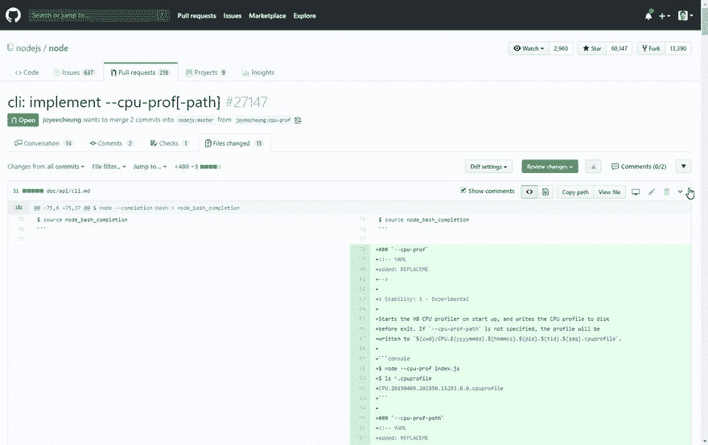

# GitHub 请求注释导航器

> 原文：<https://dev.to/giovannipuntil/github-pull-request-comments-navigator-nfc>

你好 Devs，

我在周末做了些东西。

添加一个选项，通过这个 Chrome 扩展可以轻松浏览任何 PR 中的评论。

[https://www . product hunt . com/posts/github-pull-request-comments-navigator](https://www.producthunt.com/posts/github-pull-request-comments-navigator)

请看下面的实际操作。

