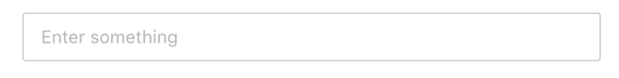
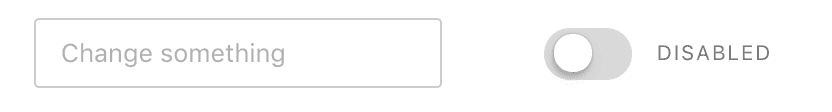

# 给行为命名，而不是互动

> 原文：<https://dev.to/siddharthkp/give-names-to-behaviors-not-interactions-5jf>

说到 React 组件，道具就是开发者消费的 API。一个好的 API 应该是显而易见的，开发者可以猜到的。你想让开发者更容易实现他们的特性并继续前进。

这不仅适用于创建组件库的开发人员，也适用于构建应用程序的开发人员。您的团队成员必须使用您创建的组件 API。

在阅读了一堆文章+演讲，并盘点了我们在 cosmos 中拥有的所有道具之后，我总结出了一些指导原则。

这是其中之一:

> 这个帖子最初是几周前发布在[我的简讯](https://sid.studio/newsletter)上的，只是说。

我们有这个接受道具的`Switch`组件，现在姑且称之为`something`。

使用我们组件的开发人员可以传递一个函数，当值改变时我们将调用它。

[](https://res.cloudinary.com/practicaldev/image/fetch/s--8AlbrbIa--/c_limit%2Cf_auto%2Cfl_progressive%2Cq_auto%2Cw_880/https://sid.studio/blog/22/switch.png)T3】

```
<Switch something={fn} /> 
```

React 让我们可以随心所欲地给道具取名- `handler` / `clickHandler` / `onClick` / `onToggle`等等。

用像`onClick`这样的‘on’来启动事件处理程序已经成为一种流行的惯例。这是因为 HTML 规范已经有了一堆遵循这个约定的处理程序:`onkeydown`、`onchange`、`onclick`等等。

重用一个已经存在的约定是一个好主意，你的开发者不需要学习一个新的东西。

好的，`onClick`怎么样？

```
<Switch onClick={fn} /> 
```

我不太喜欢这里的`onClick`处理程序，因为它假设鼠标点击是与该组件交互的唯一方式。

移动设备上的用户可以用手指`tap`开关或者`drag`向右移动。有视觉障碍的用户将使用屏幕阅读器和键盘`keyPress`。

作为一个使用这个组件的开发人员，我不想考虑终端用户如何与这个组件交互。我只想附加一个当值改变时调用的函数。

让我们使用一个交互不可知的 API:

```
<Switch onToggle={fn} /> 
```

有道理，对吧？两个值之间的转换。

在组件内部，您可能希望将所有可能的交互代理到同一个函数

```
function Switch(props) {
  return (
    <div
      className="switch"
      /* click for mouse users */
      onClick={props.onToggle}
      onKeyDown={function(event) {
        /* if the enter key is hit, call event handler */
        if (event.key === 'Enter') props.onToggle(event)
      }}
      onDrag={function(event) {
        /* pseudo code */
        if (event.toElement === rightSide) props.onToggle(event)
      }}
    />
  )
} 
```

我们已经内部化了所有的实现细节，为我们的用户(开发人员)公开了一个很好的 API。

现在，让我们来讨论一个我们都同意的组件——文本输入。

[](https://res.cloudinary.com/practicaldev/image/fetch/s--jJhQWIQg--/c_limit%2Cf_auto%2Cfl_progressive%2Cq_auto%2Cw_880/https://sid.studio/blog/22/input.png)T3】

```
<TextInput /> 
```

HTML 有一个 [`onchange`属性](https://developer.mozilla.org/en-US/docs/Mozilla/Tech/XUL/Attribute/onchange),[React 文档](https://reactjs.org/docs/forms.html)在它们的例子中也使用了`onChange`。围绕这一点似乎有共识。

```
<TextInput onChange={fn} /> 
```

很简单。

现在，让我们把这两个组件放在一起。

[](https://res.cloudinary.com/practicaldev/image/fetch/s--SXMMC96u--/c_limit%2Cf_auto%2Cfl_progressive%2Cq_auto%2Cw_880/https://sid.studio/blog/22/together.png)T3】

```
<TextInput onChange={fn} /> <Switch    onToggle={fn} /> 
```

注意到奇怪的事情了吗？

尽管这两个组件需要相似的行为，但是道具的名称不同。这些道具对于它们各自的组件来说是完美的，但是当你把你所有的组件放在一起看的时候，这是非常不一致的。

这对开发人员来说意味着你必须在使用它之前检查它的名字。不理想。

所以，这是给你的第二个建议:*目标是在组件间保持一致。*相同的行为应该在组件间有相同的属性。

这个技巧也可以表述为*以最小的 API 表面积为目标。你应该限制开发人员在开始工作之前必须学习的 API 的数量。*

这是一个很好的说法，所有的荣誉都归于塞巴斯蒂安·马克伯格。(我在这篇文章的最后链接了他的演讲)

实现这个技巧的方法是选择一个道具，并在所有组件中使用它。我们例子中的两个道具`onChange`也在 HTML 规范中，所以一些开发者可能已经听说过它。

[](https://res.cloudinary.com/practicaldev/image/fetch/s--SXMMC96u--/c_limit%2Cf_auto%2Cfl_progressive%2Cq_auto%2Cw_880/https://sid.studio/blog/22/together.png)T3】

```
<TextInput onChange={fn} /> <Switch    onChange={fn} /> <Select    onChange={fn} /> // etc. 
```

跨组件的一致性以及由此带来的学习 API 的便利性比拥有一个单独组件的完美道具更重要。

* * *

撑到了这里？太好了！这里给你一些加分内容。

让我们花点时间来讨论一下函数签名。

```
<TextInput onChange={fn} /> 
```

一个`onChange`事件处理程序(上例中的`fn`)接收一个参数——`event`。

输入的每次变化都会触发它。你可以从这个事件中得到很多有用的信息

```
function fn(event) {
  console.log(event.target) // input element
  console.log(event.target.value) // text inside the input element
  console.log(event.which) // which keyboard key was hit
} 
```

我假设大多数开发人员会对`event.target.value`感兴趣，这样他们就可以用它来完成其他任务——设置状态、提交表单等等。

在我们的定制`Switch`组件的例子中，每个动作公开一个不同的`event`。这个`event`对于一个`click`事件和一个`drag`事件将有不同的属性。我们如何确保 API 的一致性？

我们可以为每个事件手动设置`event.target.value`:

```
function Switch(props) {
  /* custom handler */
  const fireHandler = event => {
    const newValue = !oldValue

    /* consistent property that devs can rely on: */
    event.target.value = newValue

    /* fire the handler from props */
    props.onChange(event)
  }

  return (
    <div
      className="switch"
      /* click for mouse users */
      onClick={fireHandler}
      onKeyDown={function(event) {
        if (event.key === 'Enter') fireHandler(event)
      }}
      onDrag={function(event) {
        if (event.toElement === rightSide) fireHandler(event)
      }}
    />
  )
} 
```

如果你想了解这个概念的更多信息，请观看 Sebastian 的演讲:[最小 API 表面积](https://www.youtube.com/watch?v=4anAwXYqLG8s)

希望这对你的旅途有帮助

（同 suddenionosphericdisturbance）电离层的突然骚扰

> 这是正在进行的系列的一部分。如果你喜欢这个，那还有更多😉

[](https://sid.studio/newsletter)