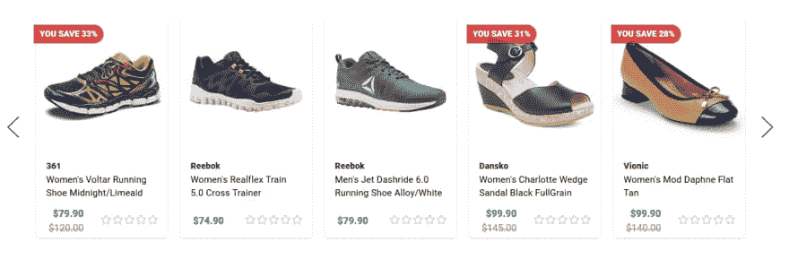

# 给定一排产品卡片，整张卡片应该是一个链接吗？

> 原文：<https://dev.to/jackharner/given-a-row-of-product-cards-should-the-whole-card-be-a-link-16m0>

# 给出该行产品卡片:

整张卡应该只与产品相关联，还是应该:

*   将品牌名称链接到同一品牌的更多产品。
*   将评论链接到产品的评论。
*   将图片和标题链接到产品。

## 我的想法

将产品封装在一个“卡片”中，尤其是在这种特定的布局中，通常意味着它基本上只是一个花哨的按钮。

### 但是...

因为那里有更多的信息(品牌、评论),这可能会导致人们试图找到更多的锐步产品，而不是单一产品，在那里他们可以找到更多的锐步产品。这是一个额外的步骤，但你仍然可以从单一产品中获得更多的锐步产品，如果这是他们想要的。

## 我很想知道你的想法。