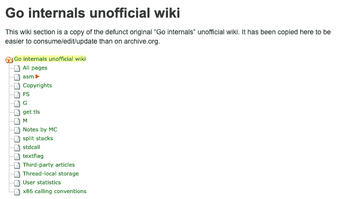

# Go internals 非官方维基

> 原文：<https://dev.to/fgm/go-internals-unofficial-wiki-1jhi>

[Google Go = Golang](https://blog.riff.org/topic/computing/golang)

goin.wikispot.org 上的“Go internals 非官方维基”曾经是对 Go 运行时的内部操作感兴趣的开发人员的宝贵资源，但在 2014 年 4 月 wikispot.org 宕机后消失了。

今天早上，我花了几个小时将它的内容恢复并重新格式化到 Audean wiki 上的 [Golang 部分。](https://wiki.audean.com/go/internals)

享受...但负责任的是:它的内容是在 2014 年新鲜出炉的，而不是上周...