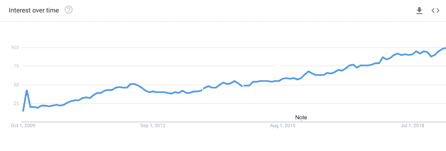
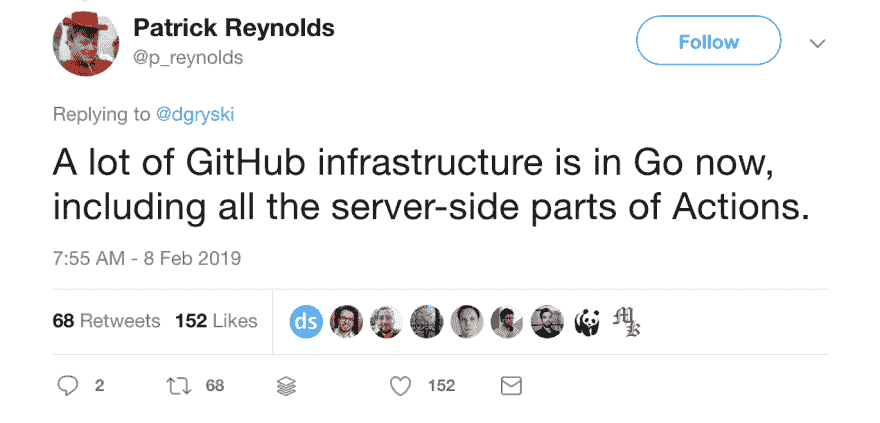
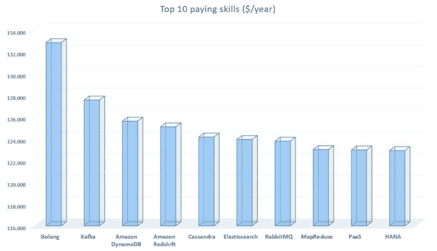
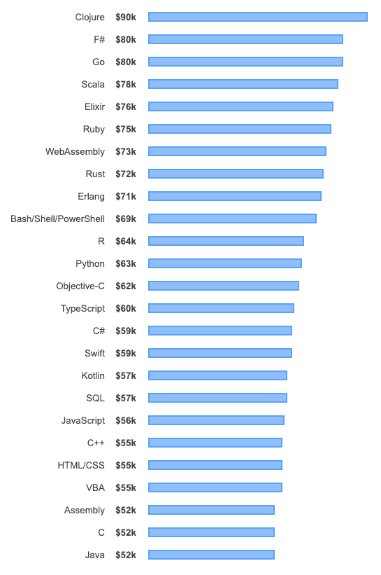
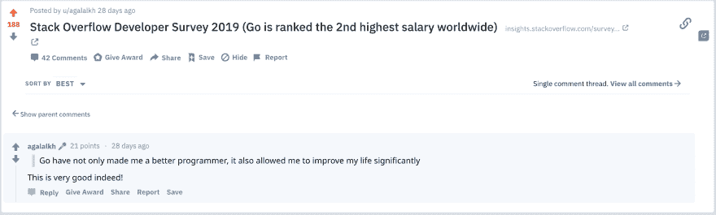
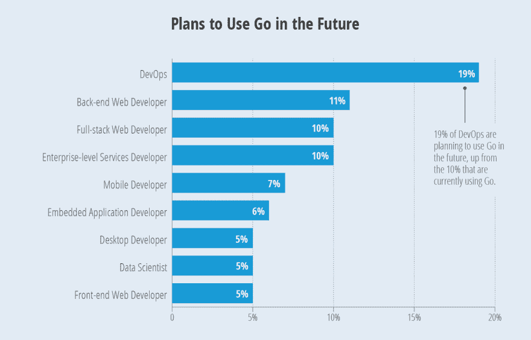
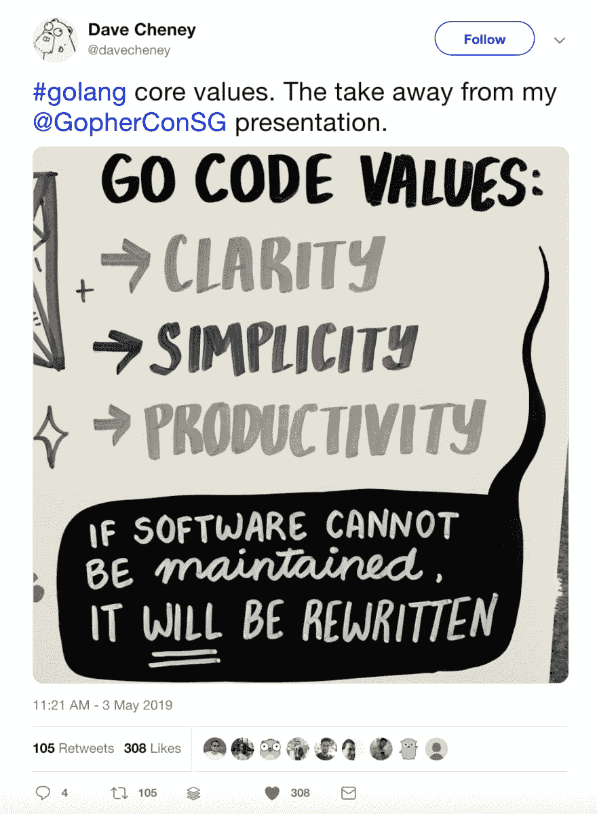
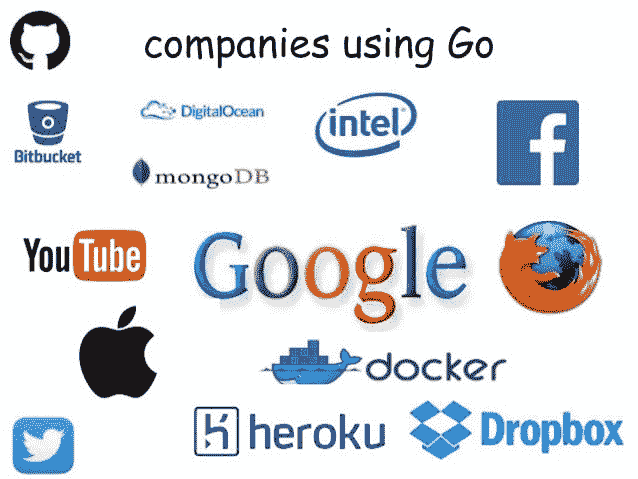

# go Lang & devo PS——天作之合？

> 原文：<https://dev.to/pavanbelagatti/go-lang-devops-a-match-made-in-heaven-4dbk>

## “围棋不是为了创新编程理论。这意味着创新编程实践。”—塞缪尔·特斯拉

最近，我们看到许多大公司将他们现有的企业应用程序从更传统的编程语言迁移到 Golang。

像脸书、推特、YouTube、苹果、Dropbox、Docker、优步、GitHub、Medium 等都使用 go lang。

这是谷歌的趋势。它在成长，在成长，并且始终如一，

### Biggies 用‘Go’——下面一些例子，

最近用 Golang 编写的优步服务之一。

Google——Google 在很多内部项目中都使用 Go。运行 dl.google.com 的服务 Chrome、Earth、Android SDK 和其他大型谷歌下载的来源——已经在 Go 中重写。

Twitter——每天有 50 亿次 Twitter 应用程序会话。

中-他们的 Neo4j 数据库由一个用 Go 编写的服务管理，他们称之为 GoSocial。

 
[推特致谢:帕特里克·雷诺兹](https://twitter.com/p_reynolds/status/1093697389075091457)

我觉得，Go 非常适合 DevOps，如果你看到，DevOps 的很多工具都是用 Go 写的。

### 为什么走？

[Go](https://golang.org/) “云编程语言”是世界上发展最快、排名第四的软件编程语言，被近 200 万开发者使用(基于 [2018 GitHub 使用情况](https://madnight.github.io/githut/#/pull_requests/2018/2))。

全世界都在说围棋，那我们走吧…

根据 2019 年的 Dice Tech 薪酬报告-如下图所示，Golanghas 已经成为美国市场薪酬最高的工作。

在最近的[栈溢出开发者调查](https://insights.stackoverflow.com/survey/2019#technology-_-what-languages-are-associated-with-the-highest-salaries-worldwide)中，Go 在收入最高的编程语言中排名第三。

 
如果以上货币因素还不能说服你，那么我就说说围棋郎是如何改变人们生活的。

 
[Reddit 讨论帖](https://www.reddit.com/r/golang/comments/bbczgv/stack_overflow_developer_survey_2019_go_is_ranked/eki3p35/)

也有人说，一个用 python 打印 Hello World 的容器，图像大小占用空间> 200MB，而 go < 200 kb。

此外，在 StackOverflow 开发人员调查中，很明显大多数 DevOps 人员喜欢使用“Go”

### 我也有一些其他确凿的事实，看看吧

1.  如果您的目标是多平台、多架构的环境，Go 使您能够编写一次并在任何地方运行。

2.  Go lang 最棒的一点就是代码交叉编译的便捷性，允许我们为其他团队和开发者提供工具，让他们在不同的环境下运行(笔记本电脑、ci/cd 服务器、docker/k8s 等。).

3.  从表演的角度热爱这门语言。

4.  Go 是一种轻量级编程语言。关于 Go，我们最喜欢的是整个项目的单一二进制。例子包括执政官，地形，金库，普罗米修斯等。都是 DevOps 相关的工具。

5.  Go 最突出的一个特点就是 Google 像 k8s 一样支持它。

 
[推特致谢:戴夫·切尼](https://twitter.com/davecheney/status/1124189742113779712?ref_src=twsrc%5Etfw%7Ctwcamp%5Etweetembed%7Ctwterm%5E1124189742113779712&ref_url=https%3A%2F%2Fmedium.com%2Fmedia%2F11ed5a858d1ba572929c6964be87d4d5%3FpostId%3Da24d5de45e26)

成功的大公司都使用 Go，并且在他们的工程博客中写了很多关于 Golang 使用成功的故事。这一点我在开始时已经分享过了。

## 走朗资源:

[关于 Go 编程语言的免费书籍](https://www.programming-books.io/essential/go/)

[Go Cheat Sheet](https://devhints.io/go)

[这是一个最受欢迎的围棋库列表，按星数排序](https://github.com/kaxap/arl/blob/master/README-Go.md)

【Gophercon 2018 的教程、演讲和视频汇编。

[围棋编程语言](https://golang.org/doc/effective_go.html)

[免费学习教程和课程](https://hackr.io/tutorials/learn-golang?sort=upvotes&type_tags%5B%5D=1&languages%5B%5D=en)

[对于新来的围棋程序员](https://dave.cheney.net/resources-for-new-go-programmers)

[举例说明](https://gobyexample.com/)

[Go-perfbook:编写高性能 Go 代码的最佳实践](https://github.com/dgryski/go-perfbook)

顺便说一下， [GoCenter](https://search.gocenter.io/stats) 是一个免费的、开源的、世界标准的围棋软件包平台，由 [JFrog](https://jfrog.com) 为广大的围棋社区提供。

你怎么想呢?Go lang 很适合 DevOps 生态系统？

让我们在 [Twitter](https://twitter.com/Pavan_Belagatti) 上连接，进行一次 DevOps 聊天。