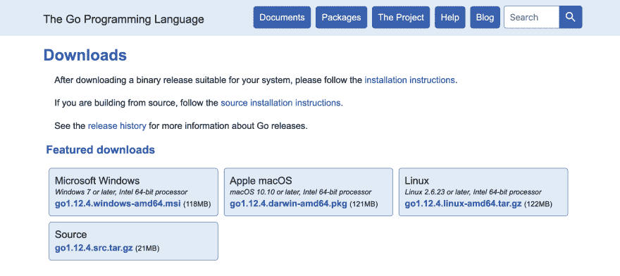
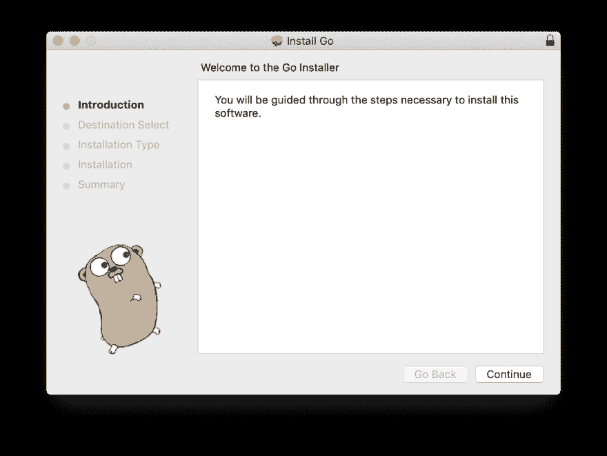
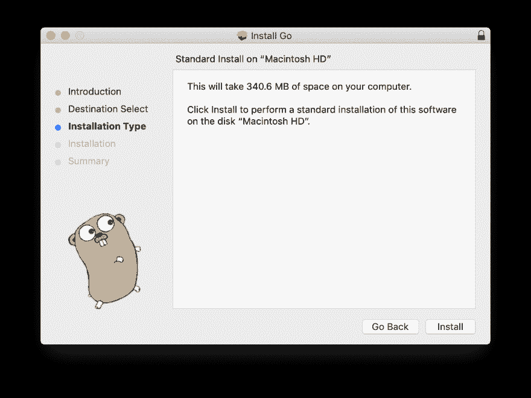
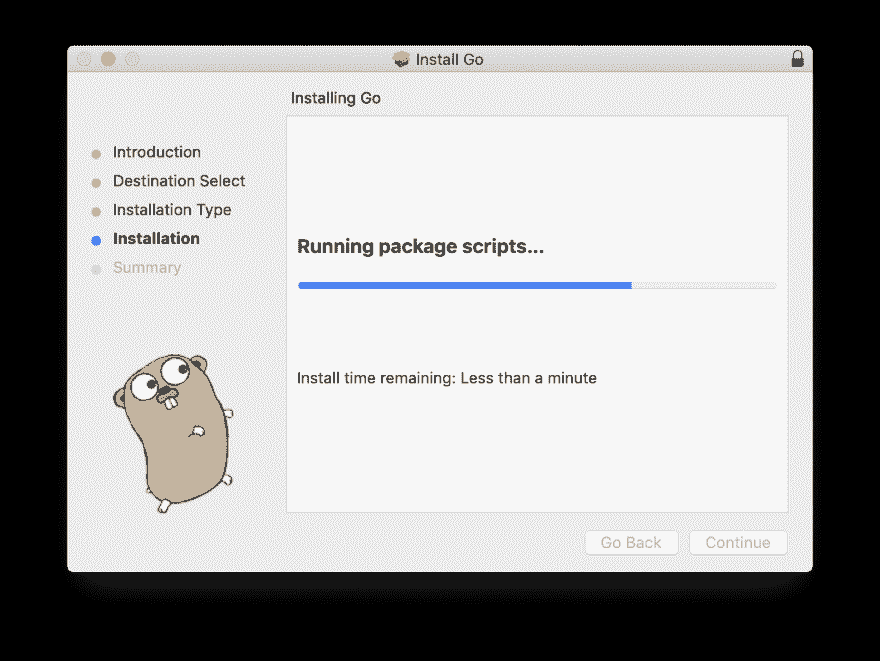
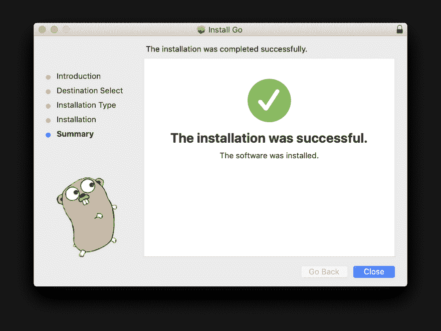
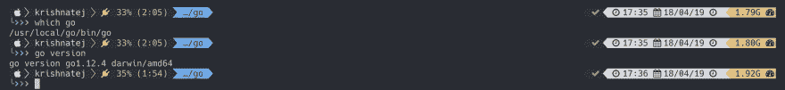

# Go Lang 安装

> 原文：<https://dev.to/chkrishnatej/go-lang-installation-3b32>

## 先决条件

* * *

`go`支持多种操作系统。有两种方法可以在系统上安装`go`。

*   双星
*   从源头开始构建

我正在使用 Mac 二进制文件将它安装在装有 macOS Mojave v10.14.4 的 MacBook Pro 上。

你可以从这里获得下载链接

[](https://res.cloudinary.com/practicaldev/image/fetch/s--dGvHFc4R--/c_limit%2Cf_auto%2Cfl_progressive%2Cq_auto%2Cw_880/https://chkrishnatej.cimg/golang/download_page.png)

如上图所示，根据操作系统选择相关的软件包。我已经下载了`Apple macOS`的那个。

*   下载文件

## 安装

* * *

安装是相当直的。您可以使用如下所示的默认值。

[](https://res.cloudinary.com/practicaldev/image/fetch/s--IXxHR8fs--/c_limit%2Cf_auto%2Cfl_progressive%2Cq_auto%2Cw_880/https://chkrishnatej.cimg/golang/installation_step_1.png)

[](https://res.cloudinary.com/practicaldev/image/fetch/s--E0xNTgj8--/c_limit%2Cf_auto%2Cfl_progressive%2Cq_auto%2Cw_880/https://chkrishnatej.cimg/golang/installation_step_2.png)

[](https://res.cloudinary.com/practicaldev/image/fetch/s--oIUjOph_--/c_limit%2Cf_auto%2Cfl_progressive%2Cq_auto%2Cw_880/https://chkrishnatej.cimg/golang/installation_step_3.png)

[](https://res.cloudinary.com/practicaldev/image/fetch/s--Qn5KB8EX--/c_limit%2Cf_auto%2Cfl_progressive%2Cq_auto%2Cw_880/https://chkrishnatej.cimg/golang/installation_success.png)

## 验证

* * *

要验证`go`是否已经成功，可以从命令行进行验证

您可以在终端中使用以下命令进行验证。

```
>>> which go # Returns path where go is installed/usr/local/go/bin/go>>> go version # Returns the version of the go installedgo version go1.12.4 darwin/amd64 
```

[](https://res.cloudinary.com/practicaldev/image/fetch/s--0RoALpPT--/c_limit%2Cf_auto%2Cfl_progressive%2Cq_auto%2Cw_880/https://chkrishnatej.cimg/golang/verify_installation.png)

如果终端显示如上，则`go` lang 已成功安装。

## 设置工作空间

* * *

`Go`遵循不同的方法来管理需要设置项目工作空间的代码。这意味着所有的`go`项目都应该在定义的工作空间中开发和维护。

### 设置工作区的步骤

* * *

打开位于`HOME`目录下的 shell config。

**注:**

*   `bash_profile`或`.bashrc`为*迎头痛击*

## - `.zshrc`为*哦我的 Zsh！*

将以下变量添加到外壳配置中

```
>>> export GOPATH=$HOME/<go-workspace> # <go-workspace> is a filler. Fill it with proper path>>> export PATH=$PATH:$GOPATH/bin>>> export GOROOT=/usr/local/opt/go/libexec>>> export PATH=$PATH:$GOROOT/bin 
```

*   `$GOPATH/src` : Go 项目源代码
*   `$GOPATH/pkg`:包含导入的包
*   `$GOPATH/bin`:编译后的二进制文件首页

这就完成了`go`的设置。并且系统已经准备好了一些**代码**。