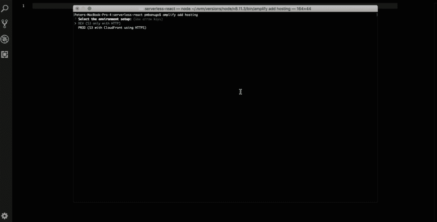
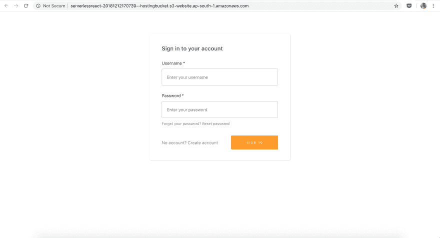
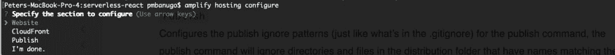

# 使用 React 和 AWS Amplify 实现无服务器第 4 部分:托管

> 原文：<https://dev.to/pmbanugo/going-serverless-with-react-and-aws-amplify-part-4-hosting-2p91>

无服务器是一种云计算执行模型，其中云提供商负责通过在需要时动态分配资源来运行代码，从而执行一段代码。在之前的文章中，我们了解了什么是无服务器，并且我们设置了我们的计算机来使用 AWS Amplify 构建无服务器应用程序。我们启动了一个 React 项目，并使用 Amplify CLI 提供了一个安全的后端 API、一个 NoSQL 数据库和 Amazon Pinpoint 用于使用跟踪。在这篇文章中，我将向您展示如何在 AWS 上托管我们构建的 React 应用程序。

亚马逊简单存储服务(S3)可用于托管 web 应用程序。要做到这一点，你需要上传你的网站文件到一个 S3 桶，然后配置托管桶。我们希望简化这个过程，所以我们将使用 AWS Amplify CLI 来配置 React 应用程序的主机。打开命令行，切换到包含 React 项目的目录，按照下面的说明将托管资源添加到 Amplify 项目中。

1.  运行命令`amplify add hosting`。这将提示您选择一个部署环境设置。选择`Dev`并按回车键。
2.  系统将提示您输入存储桶名称。按 Enter 键使用默认的建议名称。
3.  接下来的两个提示要求提供 web 应用程序的索引和错误文档。我们会用 index.html。按 Enter 键选择默认 index.html。

这在本地添加了托管资源。如果你打开文件夹 **amplify/backend** ，你会发现一个托管文件夹，里面有一个**S3 和 CloudFront/template.json** 文件，表示托管配置的信息。我们将这些文件推送到云中，AWS CloudFormation 将创建和配置 S3 和 CloudFront 来运行我们的应用程序。打开命令行，运行`amplify publish`。它显示了您的 Amplify 项目资源的状态，并提示您是否应该继续执行该命令。您应该注意到列出了一个新的托管资源，操作标记为 Create。按 Enter 键让 CLI 运行其操作。

命令`amplify publish`将我们后端资源的更新推送到云端。根据命令行中记录的信息，您会注意到它使用正确的策略创建了一个 S3 桶，并对其进行了托管配置，从而打印了访问它的 URL。一旦完成，它就运行脚本来构建 React 项目，从而生成可以部署到 S3 的文件。当项目成功构建后，它将文件上传到为托管而创建的 S3 桶中，并在浏览器中打开 URL。

万岁！我们发布了该应用程序，可以通过公共网址访问。如果您想要更改网站索引和错误文档，或者配置 CloudFront，可以更新托管资源。您可以通过在命令行中运行`amplify hosting configure`命令来实现。这将为您提供 3 个选项:

1.  网站:该选项用于配置静态托管的 S3 桶。这是您指定索引和错误文档的地方。默认情况下，这些被设置为**index.html**。
2.  CloudFront:该选项用于将 CloudFront 配置为内容交付网络。在这里，您可以启用 CloudFront(如果在初始设置时没有添加的话),设置默认的缓存行为，并配置定制的错误响应。
3.  发布:该选项配置发布忽略模式(就像。gitignore)用于发布命令。publish 命令将忽略分发文件夹中名称与模式匹配的目录和文件。

您可以进一步配置 Amazon Route 53，为应用程序注册一个自定义域。您可以按照这个[指南](https://docs.aws.amazon.com/AmazonS3/latest/dev/website-hosting-custom-domain-walkthrough.html#root-domain-walkthrough-add-arecord-to-hostedzone)为应用程序注册和配置一个自定义域。

## 这就结束了

在这篇文章中，我向您展示了如何使用 AWS Amplify CLI 设置和托管您的 web 应用程序。我们使用命令`amplify add hosting`将托管添加到项目中，使用`amplify publish`构建并上传最新代码到 S3 存储桶进行托管。这表明，有了 AWS Amplify，只需两个命令就能在 15 分钟内完成托管和部署。

在以前的帖子中，我介绍了如何安装和配置 AWS Amplify CLI、初始化 Amplify 和 React 项目、构建和使用 API，然后跟踪使用指标。在下一篇文章中，我们将通过查看 Amplify Console 来结束这个系列，这是一个针对移动 web 应用程序的持续部署和托管服务。

下面的链接将带你进入这个系列的不同文章:

1.  [使用 React 和 AWS Amplify 实现无服务器化:开发环境设置](https://www.pmbanugo.me/blog/2019-01-07-going-serverless-with-react-and-aws-amplify-development-environment-set-up/)
2.  [使用 React 和 AWS 实现无服务器扩展第 2 部分:创建和使用无服务器服务](https://www.pmbanugo.me/blog/2019-01-14-going-serverless-with-react-and-aws-amplify-part-2-creating-and-using-serverless-services/)
3.  [使用 React 和 AWS Amplify 实现无服务器第 3 部分:跟踪应用程序使用情况](https://www.pmbanugo.me/blog/2019-01-24-going-serverless-with-react-and-aws-amplify-part-3-tracking-app-usage/)
4.  React 和 AWS Amplify 的无服务器化第 4 部分:托管。