# 再见 2017 和 2018！你好 2019！

> 原文：<https://dev.to/vintharas/goodbye-2017-and-2018-hello-2019-263a>

*本文最初发布于[barbarianmeetscoding.com](https://www.barbarianmeetscoding.com/blog/2018/12/30/goodbye-2017-2018-hello-2019)。😊*

你好！不敢相信又一年过去了！但它已经发生了，这意味着是时候[进行年度反思总结](http://www.barbarianmeetscoding.com/blog/categories/year-summary/)的传统了，这是一个总结性的博客，各种回顾，关于我在过去一年中取得的成就，我最大的*失败*，我学到的东西以及我计划在 2019 年做的事情。

这一次的总结有些特别，因为它将包括 2017 年和 2018 年。没错。去年，我的儿子 Teo 只是一个很小很小的婴儿，我没有精力，没有兴趣，也没有意志力去做一个总结。事实上，从 2017 年 10 月开始直到最近，我几乎放弃了博客(和生活)。

开始了。！

## 在 **2017** ...

2017 年是家人和朋友的一年。大部分是家人。那年发生了两件很棒的事情。我[和我现在的妻子马林](https://www.youtube.com/watch?v=XwxfSqIzq6g)在五月结婚(耶！能够给她的妻子打电话真是太棒了)八月底我们有了第一个儿子 Teo。随着这一年围绕着筹备婚礼，准备成为一名父亲，支持马林，以便她可以有一个愉快的怀孕(只要怀孕可以是愉快的)，并成为第一次为人父母的幸存者，其他一切都处于次要地位。我在谷歌的工作排在第二位，除此之外的任何工作都排在第三位、第四位，或者干脆掉下悬崖。

**[婚礼](https://www.youtube.com/watch?v=XwxfSqIzq6g)令人惊叹**。我的家人和朋友从西班牙来到斯德哥尔摩，并且能够让他们成为我在这里新生活的一部分，这真是太棒了。同时也带来一些我在阿斯图里亚斯长大的习俗，让我的瑞典朋友和家人也体验一下。我的父母以前从未来过这里，所以向他们展示瑞典真是太酷了(我从 2010 年开始就住在瑞典，甚至在 2007 年至 2009 年作为大学生住在这里)。马林怀孕了，我哭了大部分的仪式哈哈。

养育孩子的头几个月非常艰难。我一生中从未经历过如此美妙的事情。我不知道我能在如此极端的条件下工作。这对我们的关系来说是极其紧张的(也是一个很好的发展机会),因为完全的睡眠剥夺、疲惫加上哭闹的婴儿会让人变得烦躁和敌对。我可以写一整篇关于我第一次当爸爸的经历的文章，但这里有一个很好的总结:在你成为父母之前，你最关心的是你自己，成为父母是婴儿在几天、几周或几个月内摧毁你和你的自我的过程，直到你重新成为一个有爱心的父母。破坏和重建是身体和精神上的痛苦。

**育儿教会了我很多东西**。我能不假思索地想到其中一些，排名不分先后:

*   我们比自己想象的要坚强得多。有很多次我觉得自己濒临崩溃，但我没有。还有更多的可以给予。
*   我培养了大量的耐心(我重新发现了我的西班牙寒冷)。有了孩子，一切都需要更多的时间，所以要冷静，要有耐心。你不能把你的意志强加给另一个活着的人(他们碰巧有自己的意志)。**协作和伙伴关系工作得更好**。这也适用于成年人。
*   我已经学会和我的妻子成为一个更好的团队。我比以前更健谈了。我更有同理心和观察力，所以我能从一种情况的字里行间读出意思，并更经常地提供帮助或支持。
*   我也学会了变得更加无私，把别人放在我自己的欲望和需求的前面。我在事物中找到很多快乐，只是因为 Teo 或 Malin 喜欢它们。
*   我更擅长**做事情**。我曾经是一个极其迟钝的人。在开始一个想法之前，我总是需要热身。*我会这么做的，但首先我要喝杯咖啡，冷静一分钟*我常说。现在我只是做事，不需要热身，也不需要废话。
*   要**放下期望**。如果你稍微反思一下你变得愤怒或烦躁的时候，你会发现很多时候这是由于期望的破灭而发生的。你期望某人会按照某种方式行事，但他们没有，你期望你有时间做某事，但有些事情阻碍了你，你期望某事会按照计划进行，但它没有。生孩子是训练放弃期望的好方法，因为几乎没有事情会按计划进行。放手，[做水](https://www.youtube.com/watch?v=TQ683zlrUSI)或者永远暴躁易怒。
*   对**对焦**。你可能不相信，直到你经历过，但婴儿可以很容易地吞下你所有的时间。到了极点，你找不到时间去上厕所，或者洗澡，或者吃饭。你也许能在中间找到一些时间。如果你想在这段时间里做些事情而不是休息，你最好集中精力。一个相关的事情是停止在社交网络和无意识刷屏这样的垃圾上浪费时间。
*   为了**认识自己**。为人父母是经历和感受的旋风，这是了解你自己和你在极端情况下如何表现的一个很好的训练场。此外，当你休育儿假时，你有很多时间去思考和反省。小睡，散步，玩 320 次同样的游戏，所有这些都是自省，思考，反省和提高的好地方。

就在 Teo 出生后，我设法完成了我的第二本书[JavaScript-mancy:OOP——掌握 JavaScript](https://leanpub.com/javascript-mancy-object-oriented-programming)T3 中召唤对象的神秘艺术。我不知道我是怎么做到的。我模糊不清地记得在这中间写下了打字稿的最后几章。在那些短暂的时刻，马林会给 Teo 喂奶，或者 Teo 会在我旁边的沙发上睡一个超级短的午觉...向我致敬。耶！

我**在这个博客**写了 16 篇文章。有些是关于 JavaScript OOP 的，有些是关于 Angular 的。特别开心的有[小屁孩](https://www.barbarianmeetscoding.com/blog/2017/06/09/from-idea-to-reality-in-under-50-minutes-mostly-with-angular-and-firebase)、[超级名模](https://www.barbarianmeetscoding.com/blog/2017/01/31/building-beautiful-web-apps-with-angular-material-part-i)、[打字稿](https://www.barbarianmeetscoding.com/blog/2017/08/17/typescript-javascript-and-types-equal-awesome-developer-productivity)和[如何写书不死不尝试](https://www.barbarianmeetscoding.com/blog/2017/09/19/how-to-write-a-book-and-not-die-trying-the-story-of-how-i-wrote-javascript-mancy-or-everything-i-learned-from-writing-two-books)。

我**设法[读了 43 本书](https://www.barbarianmeetscoding.com/reading/)** 。其中许多可能是有声读物。白天，Teo 只有在你推着婴儿车带他出去散步的时候才会睡觉。所以在那些日子里，两三个小时的散步是很常见的。我经常下班后，带上 Teo 去山上跑步，这样 Malin 就可以有一些再生的独处时间(睡觉)。有声读物或[播客](http://localhost:8000/podcasts/)的最佳时间。2017 年我最喜欢的书是:

*   在科幻小说中，[波比弗斯系列](http://amzn.to/2lNIYZI)和[不朽的雇佣兵系列](http://amzn.to/2zzO3XE)(最后一个不是超级好，但它是/是我罪恶的快乐)。
*   在《幻想》中， [Oathbringer](http://amzn.to/2BVygsj) ，Stormlight 档案的第三本书和[哀悼乐队](http://amzn.to/2iS6HTr)。
*   在非小说类作品中，[深度工作:在分心的世界中专注成功的规则](http://amzn.to/2nBZtVY)，在我们的意识被社交网络和无数干扰窃取的今天，依然如此。[领袖吃最后一个](http://amzn.to/2DVtMPR)，任何东西都是金子。还有[智人](http://amzn.to/2jxJAwr)和[枪支、病菌和钢](http://amzn.to/2gXU3pu)虽然它们**非常**密集。
*   在编程方面，我喜欢[构建渐进式 Web 应用程序:将 Native 的力量带入浏览器](http://amzn.to/2xaHSbb)和[学习 React:使用 React 和 Redux 进行功能性 Web 开发](http://amzn.to/2tXR0CG)。还有[破解编码面试](http://amzn.to/2DVsuV1)成了我的好朋友。
*   在育儿方面，[帕帕洛吉](https://www.adlibris.com/se/bok/pappalogi-handbok-for-pappor-fran-produktionssex-till-vab-9789175034263)和[大脑掌管婴儿](http://amzn.to/2wH0Xqc)。

今年年初，我在一些活动和会议上发言，并帮助组织这些活动和会议。我非常非常喜欢在会议上发言。我喜欢提出一个古怪、怪异的演讲，然后围绕它创建一个演示文稿，并为观众提供娱乐(和学习)。我希望我有更多的时间做那件事。我也喜欢组织活动，把开发者社区拉在一起。我想从三月份开始，我不再在正常工作时间做任何工作之外的事情，所以不再说话、组织或做任何类似的事情。再见开发者社区！我会回来的！:D

年底，我参加了谷歌软件工程师职位的面试，并成功了！[一边照顾一个婴儿一边准备面试是极其艰难的。我非常感谢我的经理和同事在过渡过程之前和期间给予我的大力支持。](https://www.barbarianmeetscoding.com/blog/2018/12/12/thoughts-on-interviewing-at-big-tech-companies)

[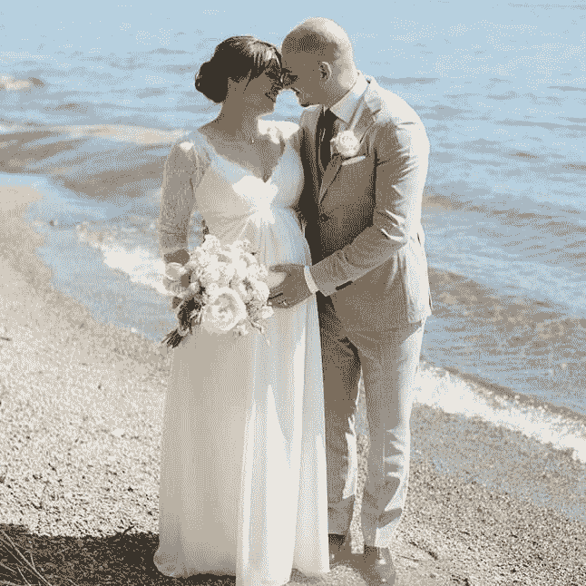](https://res.cloudinary.com/practicaldev/image/fetch/s--ZvDN_S9---/c_limit%2Cf_auto%2Cfl_progressive%2Cq_auto%2Cw_880/http://vintharas.github.cimg/malin-and-jaime-wedding.jpg)

[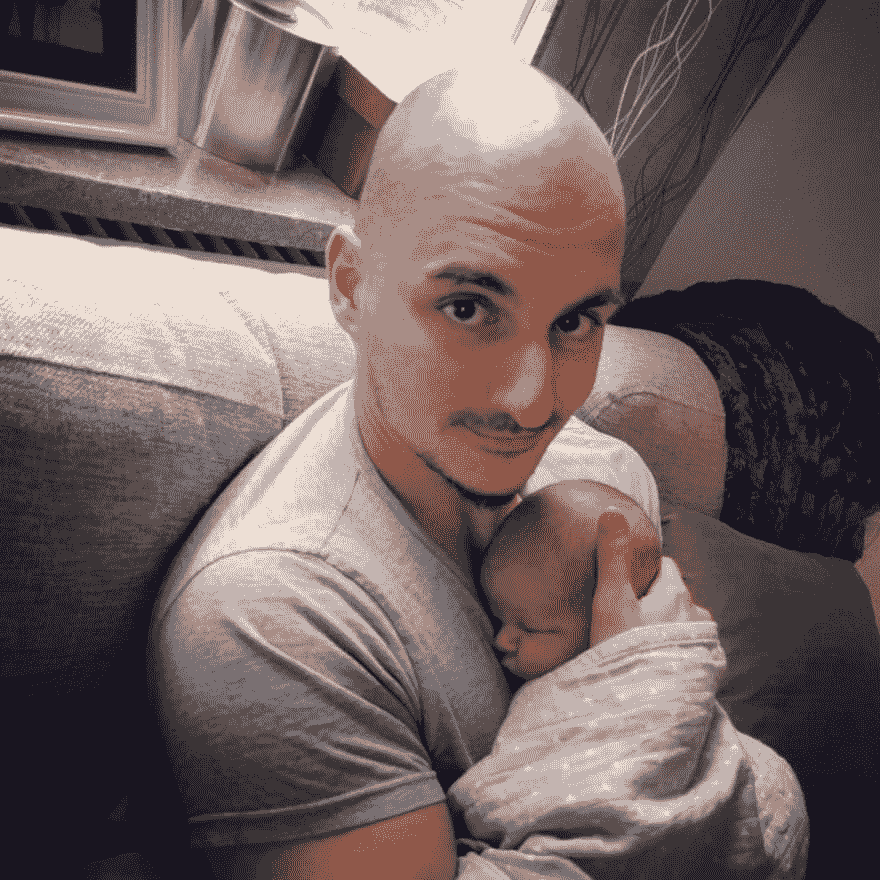](https://res.cloudinary.com/practicaldev/image/fetch/s--Q7D5yNI3--/c_limit%2Cf_auto%2Cfl_progressive%2Cq_auto%2Cw_880/http://vintharas.github.cimg/teo-jaime.jpg)

[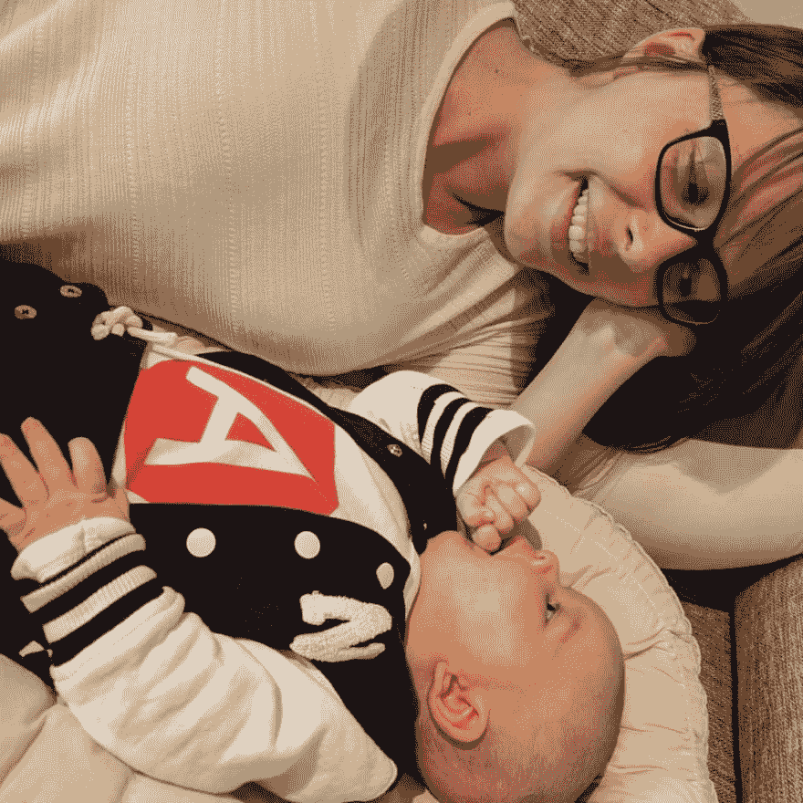](https://res.cloudinary.com/practicaldev/image/fetch/s--U7Pu0YYy--/c_limit%2Cf_auto%2Cfl_progressive%2Cq_auto%2Cw_880/http://vintharas.github.cimg/teo-malin.jpg)

[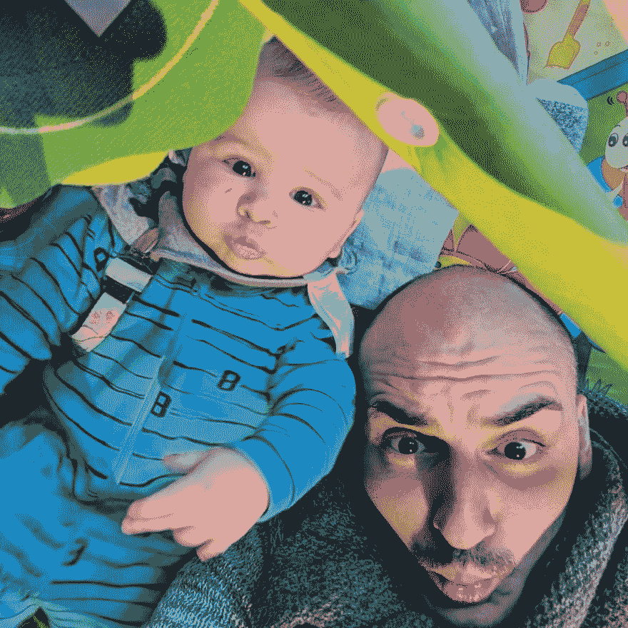](https://res.cloudinary.com/practicaldev/image/fetch/s--ePPlBfCf--/c_limit%2Cf_auto%2Cfl_progressive%2Cq_auto%2Cw_880/http://vintharas.github.cimg/teo-jaime-redux.jpg)

[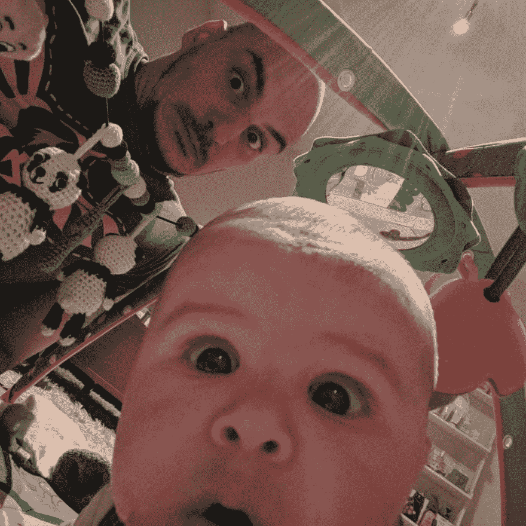](https://res.cloudinary.com/practicaldev/image/fetch/s--IwLiwWyG--/c_limit%2Cf_auto%2Cfl_progressive%2Cq_auto%2Cw_880/http://vintharas.github.cimg/teo-jaime-reredux.jpg)

[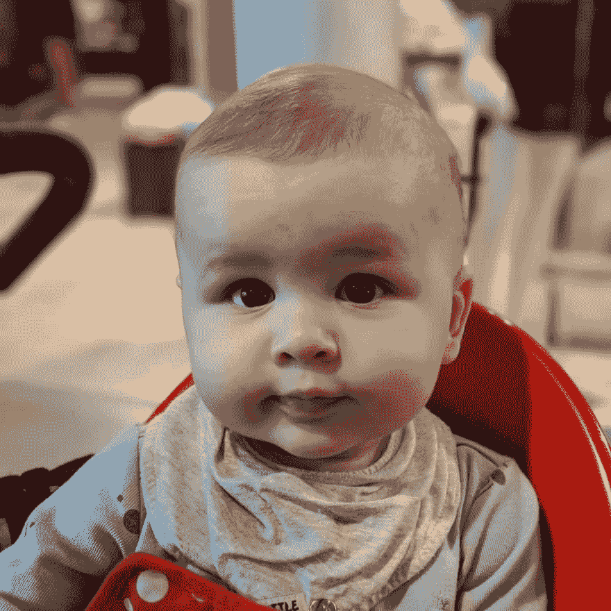](https://res.cloudinary.com/practicaldev/image/fetch/s--B402HwQK--/c_limit%2Cf_auto%2Cfl_progressive%2Cq_auto%2Cw_880/http://vintharas.github.cimg/teo-small-cute.jpg)

## 在 **2018** ...

2018 年我继续专注于**做一个好爸爸好丈夫**。随着时间的推移，家庭动力慢慢地从极度缺乏睡眠的生存模式转变为一种更加稳定的平衡状态。我从 7 月份开始休育儿假，能够花这么多宝贵的时间来了解我的儿子真是太棒了。**瑞典**和**谷歌**在这方面都很突出。Teo 是这个宇宙中最可爱最有爱的东西。每次他抓住我的手，开始用他小小的手指爱抚它的时候，都会让我的心融化。那是宇宙中最好的东西。

我们买了一套新公寓并搬进去了！！巨大的里程碑，我们对我们的新家非常满意。我们以前住在一个小公寓里，在四楼，没有电梯。每天带着 Teo 在楼梯上爬上爬下 4-5 次是很有趣的。

这一年，我回到了全职软件开发人员的岗位。去年四月，我成为了谷歌的一名软件工程师，我仍然对此欣喜若狂(谈论梦想成真)。我**非常高兴**再次专注于软件开发，我甚至无法用语言来形容。感觉就像星星再次排成一行，我再次进入状态，完全，完整，充满能量去做令人敬畏的事情。虽然我很享受和 Teo 在一起的时光，但我对回去工作的前景和看到这个领域的未来感到非常兴奋。

去年八月，我参加了我的第一个游戏 jam ，用不到 13 Kb 的 JavaScript 写了一个游戏。那非常有趣，我全心全意地推荐它。**像这样的小项目是学习知识、享受乐趣和在结束时有所表现的好方法。2019 年更多这种！Plz！**

我已经在 [**投入了大量**时间**(事实上是我爸爸大部分的空闲时间)来提高我的 vim 技能**](https://www.barbarianmeetscoding.com/blog/2018/10/14/exploring-vim) 。这是一个如此令人惊讶的编辑器，无论是在概念上还是在实践中。我一直在我的博客中分享我的探索。我也开始写一本以 JavaScript-mancy 的幻想世界为背景的关于 Vim 的书: **[巫师使用 Vim](https://leanpub.com/wizardsusevim)** 。我觉得会很棒的...很奇怪。

[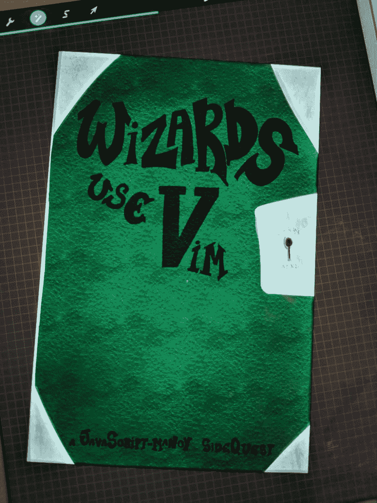](https://res.cloudinary.com/practicaldev/image/fetch/s--jPtJacFs--/c_limit%2Cf_auto%2Cfl_progressive%2Cq_auto%2Cw_880/http://vintharas.github.cimg/book-wizards-use-vim-draft-001.jpg)

[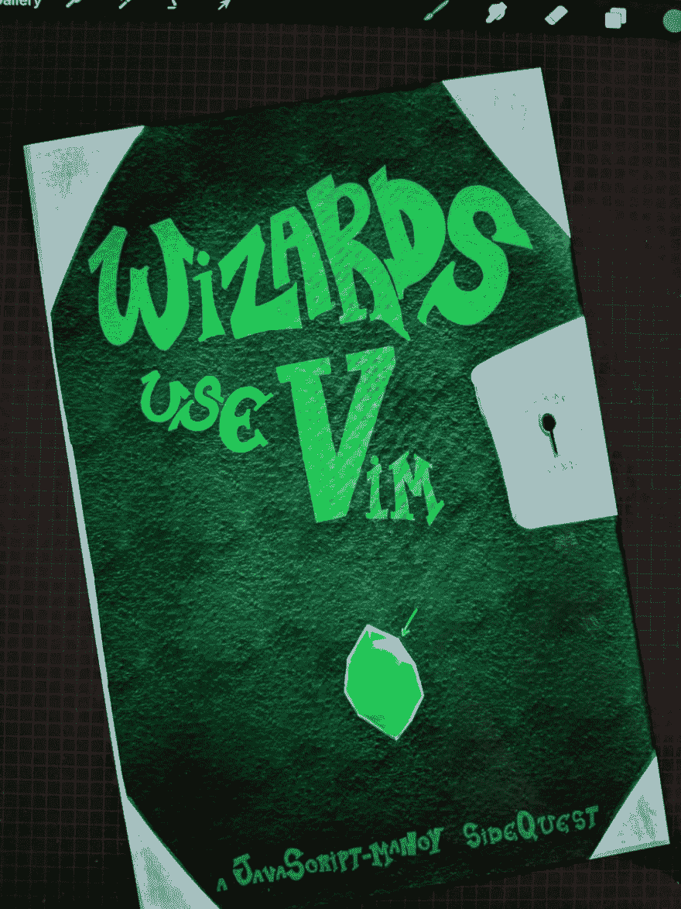](https://res.cloudinary.com/practicaldev/image/fetch/s--VSGYNKD_--/c_limit%2Cf_auto%2Cfl_progressive%2Cq_auto%2Cw_880/http://vintharas.github.cimg/book-wizards-use-vim-draft-002.jpg)

我对自己在亚马逊和谷歌 T3 这样的大型科技公司面试的经历做了一些反思。如果你自己打算加入这些公司，并且在准备面试时寻求一些指导或支持，你会发现这很有用。

我花了很多时间反思我把宝贵的时间投资到了哪里。由于我的大部分时间都花在了 Teo 上，结果发现它已经所剩无几了。我写了几篇关于如何 [**让你的时间回到**](https://www.barbarianmeetscoding.com/blog/2018/10/05/how-to-be-more-productive-and-have-a-happier-life-in-5-easy-steps) 的文章，还有[关于**当你有了孩子**](https://www.barbarianmeetscoding.com/blog/2018/12/04/advice-for-new-parents-who-want-to-find-more-time-to-code) 后如何找到时间编码的文章。在读完《原子习惯》之后，我一直在用更多深思熟虑的习惯技巧来补充我的系统。

我已经开始 [**重新设计野蛮人遇上编码**](https://www.barbarianmeetscoding.com/) ，我认为进展非常顺利。我喜欢这个新设计。它融合了幻想、漫画、编码和像素艺术。如果你有一段时间没去过，那么[来看看，告诉我你的想法](https://www.barbarianmeetscoding.com/)。

我也**在这个博客里写了 [15 篇文章](http://localhost:8000/blog/archives)** 。在这个美丽的知识和智慧的花园里，我正兴致勃勃地回来写作，与你我分享。

我[学会了适当的做**像素艺术**](https://www.barbarianmeetscoding.com/wiki/pixel-art/) (或者更好)。那是**非常非常酷的**。能够创作出令我满意的像素艺术，真是令人耳目一新，充满力量。这张真的让我自己都很惊讶。在我的生活中，我学到了很多东西，但这个特别的东西非常特别。这让我觉得自己有能力学习任何东西。期待在不久的将来做更多的像素艺术，并在这方面做得更好。

我 **[读了 28 本书](https://www.barbarianmeetscoding.com/reading/)** 。今年的阅读量比往年少多了。Teo！:D:也许我只是没有仔细计算，因为我用博客来计算。可能两者都有。总之，今年我最喜欢的书是:

*   在科幻中， [Anathem](https://amzn.to/2Qi1owF) 。那本书很厚，但是当你读得越来越多的时候，你会意识到这是天才**的作品。[阿尔忒弥斯](https://amzn.to/2Nbpdoe)也很有趣，非常轻松。**
*   在幻想中，[破土三部曲](https://amzn.to/2Stb60O)非常有趣，令人耳目一新。它从一声巨响开始。你从来没有读过这样的东西。
*   总之，[我们为什么睡觉](https://amzn.to/2uscci8)是一个清醒的帐户，说明睡眠对你是多么重要。以及缺乏睡眠对你的身心健康有多糟糕(太好了，我剥夺自己的睡眠已经很多年了)。我也喜欢[像艺术家一样偷窃](https://amzn.to/2ulHgAZ)像[奥斯汀·克莱恩](https://austinkleon.com/)推出的任何东西一样超级鼓舞人心和激励人心。如果你喜欢时事通讯，他有很棒的时事通讯。哈！我刚注意到我的列表里没有[原子习惯](https://amzn.to/2GMUIXl)！(想知道我还少了多少本书。).詹姆斯·克利尔的《原子习惯》无疑是我今年最喜欢的书之一。这是我将来肯定会重读的书之一。最后，[选项 B:面对逆境，建立适应力，寻找快乐](https://amzn.to/2Q80kQf)是一篇难读的文章。[雪莉·桑德伯格](https://twitter.com/sherylsandberg?lang=en)告诉你她如何面对丈夫的突然离世，并分享其他幸存者的故事以及你可以从他们身上学到的东西。

哦！我真的，真的，今年非常喜欢玩《巫师 3》[。如此精美的游戏。它给了我很多绘画、写作和创作的灵感。这也提醒了我沉浸式和故事驱动的 RPG 是多么有趣。](https://thewitcher.com/en/witcher3)

哦！哦！我在我的 [YouTube 频道](https://www.youtube.com/channel/UCCbO782lk1tvKgc7uU14mZQ?view_as=subscriber) 上录制了一些**新视频。录制视频非常有趣。一种完全不同的新的创作媒介，我还没有探索那么多。期待着做更多这样的事情。制作的质量一般，但我告诉自己，在我让自己创作出 50 个视频之前，我不会购买任何更好的设备。**

今年我也恢复了力量训练，并且在过去的 4 个月里每隔一天进行一次训练。快走快走。

[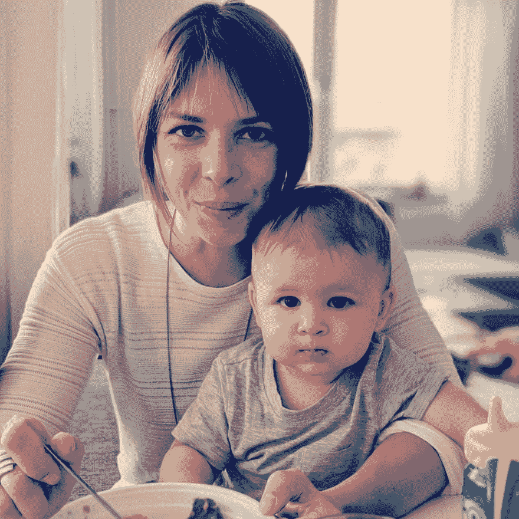](https://res.cloudinary.com/practicaldev/image/fetch/s--sO-6AMdb--/c_limit%2Cf_auto%2Cfl_progressive%2Cq_auto%2Cw_880/http://vintharas.github.cimg/malin-and-teo.jpg)

[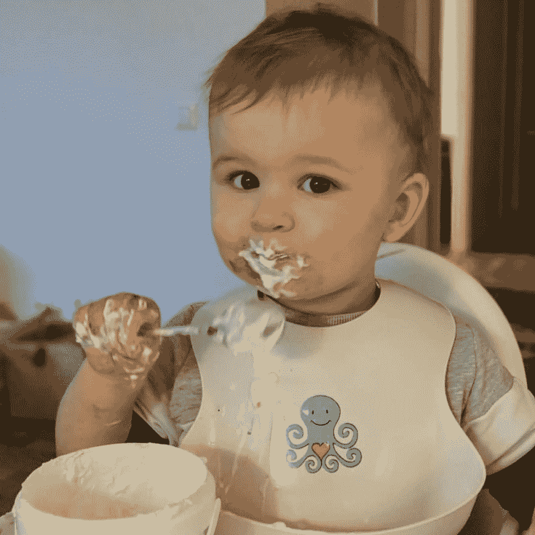](https://res.cloudinary.com/practicaldev/image/fetch/s--drDyKhp8--/c_limit%2Cf_auto%2Cfl_progressive%2Cq_auto%2Cw_880/http://vintharas.github.cimg/teo-eating-chaos.jpg)

[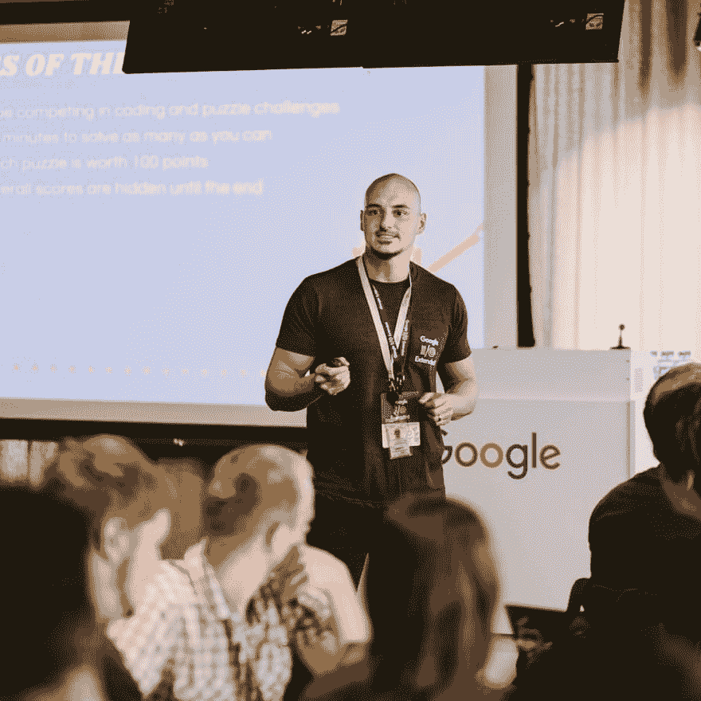](https://res.cloudinary.com/practicaldev/image/fetch/s--GvRr8RCx--/c_limit%2Cf_auto%2Cfl_progressive%2Cq_auto%2Cw_880/http://vintharas.github.cimg/jaime-google.jpg)

*在斯德哥尔摩组织当地的谷歌 IO 活动*

## 我的大失败在 2017 年和 2018 年

*   JavaScriptmancy 系列还没有我期望的那么大的成功。我知道很多人真的很喜欢这些书，但这个系列并没有像我希望的那样影响到很多人。我没有在营销上投入我应该投入的努力。但事后看来，我认为将这一系列的书籍(如此强烈地)针对 C#开发人员可能是一个错误。我非常强烈地考虑做下一个版本，其中该系列不是明确地面向 C#开发人员，而是面向所有对学习 JavaScript 感兴趣的人，他们喜欢幻想，在讲故事和娱乐中学习。
*   大部分时间在业余时间做软件开发，而有一份非全职的软件开发工作很糟糕。在很多不同的层面上。我不想再犯同样的错误。
*   我学了又忘了反应 4 次。:D
*   我几乎不再做开发者关系、聚会、会议和其他类似的事情。有了孩子，你只需要分清轻重缓急，有些东西会掉下来。在过去的两年里，我学会了说“不”,并且不会为此感到难过。
*   我没有设法创造一个常规、习惯、空间、时间来记录更多的视频。
*   对我的妻子和/或儿子来说，我一直是个混蛋。

## 2019 年我想...

*   我还有 2.5 个月的育儿假，Teo 和我打算共度一段美好时光:游泳！博物馆！足球！滑冰！下雪了！图书馆！菲卡！还有更多！
*   随着 Teo 睡眠变得更加稳定， **Malin 和我发现有更多的高质量时间在一起。耶！我们有了新的惯例，在 Teo 睡觉后，我们一起喝茶聊天。太棒了。我们已经好几个月没有这样做了。期待今年能有更多这样的机会。**
*   没想到，Teo 给我们的生活带来了丰富得多的社交生活。因此，我期待着建立更强大和持久的友谊，以及 Teo 可以成长的朋友小圈子。
*   我期待着回去工作，踢一些屁股。我将带着雷鸣般的能量和无穷的力量回来。
*   我不知道在工作和 Teo 之间我还有多少时间。他很快就要开始上幼儿园了，我听说那是一个艰难的时期。无论如何，如果 Teo 允许的话，我很乐意关注这些事情:
    *   我想**学习很多东西**,尝试很多稀奇古怪的兼职项目。今年我想关注的一些主题是:
    *   谷歌内部有很多东西；)
    *   精力
    *   任何前端的东西。我觉得这里有很多东西我需要并且想要赶上。
    *   艺术:像素艺术，绘画，着色，动画，音乐都是我想追求的东西。我对 Udemy 的课程质量感到惊喜。所以我肯定会做更多这样的事情。
    *   我会完成**巫师使用 Vim** 会很牛逼。
    *   我将带着一本关于 JavaScript 中的**函数式编程的新书回到 JavaScript-mancy 系列。**
    *   我想把变成令人愉快的东西。
    *   我计划做更多的事情**写博客、[写博客](https://www.youtube.com/channel/UCCbO782lk1tvKgc7uU14mZQ)和[写新闻](https://www.barbarianmeetscoding.com/newsletter/)** 。我想继续一点一点地重新设计和改进博客本身。
    *   游戏开发很有趣，也是一项有趣的技术挑战。今年我想更深入地研究游戏开发，尤其是生成算法之类的。
    *   今年我很想投资的一个很基本的东西就是**睡眠**和**健身房**。我通常去健身房没问题，但睡眠是另一个问题。更多的睡眠，如此简单的一件事，却能对你的日常生活产生如此大的影响。睡觉的时候生活更美好(还有健身房)。

你呢？2019 年你想实现什么？**我祝你在新的一年里一切顺利，愿你实现所有的目标和梦想！**哦，如果你需要一些帮助来完成工作，[看看我的“系统”！](https://www.barbarianmeetscoding.com/blog/2015/06/04/want-to-get-stuff-done-behold-the-ultimate-system/)