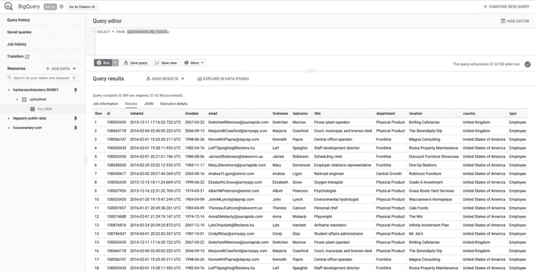

# Google BigQuery 的 Python SDK:以编程方式创建表

> 原文：<https://dev.to/hackersandslackers/google-bigquerys-python-sdk-creating-tables-programmatically-3cof>

[](https://res.cloudinary.com/practicaldev/image/fetch/s--gcBPG_-5--/c_limit%2Cf_auto%2Cfl_progressive%2Cq_auto%2Cw_880/https://res-5.cloudinary.com/hackers-and-slackers/image/upload/f_auto%2Cq_auto/img/bigquery101.jpg)

GCP 正在崛起，如果不解决房间里 500 磅重的大猩猩:谷歌大查询，围绕数据进行对话变得越来越难。随着大多数企业舒适地安顿在基于 Apache 的大数据栈中，BigQuery 打破了许多人的常规。幸运的是，黑客和懒鬼没有这样的企业。因此，我们不怕问这个大问题:有了 BigQuery，生活会轻松多少？

## 大数据，BigQuery

简而言之，BigQuery 淡化了对多个不可预测的数据源进行查询的行为。为了更好地理解这在什么情况下有用，它可以更好地帮助我们识别 BigQuery 可以回答的问题类型。比如:

*   我们的用户在我们的多个系统中做什么？我们如何利用多个系统输出的日志文件来找出答案？
*   当员工信息、工资和福利都存在于孤立的系统中时，我们如何整合这些信息呢？
*   我该拿这些电子表格怎么办？

与以前的解决方案不同，BigQuery 在单一产品中解决了这些问题，并通过**类似 SQL 的查询语法、**一个 **web 界面**和 **7 原生客户端库来实现。**有很多理由喜欢 BigQuery，但是让我们从我们最近已经讨论过的一个开始:表模式的*自动生成*。

Matt 已经演示了如何在熊猫的帮助下手动解决这个问题[。我通过利用](https://dev.to/hackersandslackers/code-snippet-corner-using-pandas-assign-function-on-multiple-columns-1bdp-temp-slug-2841368) [Python 表模式库](https://dev.to/hackersandslackers/from-csvs-to-tables-infer-schema-data-types-from-raw-spreadsheets-4gb6)提供了一种更巧妙的方法。有了 BigQuery，我们找到了另一个既不是手工也不是噱头的选择:非常适合那些懒惰、富有、要求完美的人(也可能是你的客户)。

首先，我们需要将数据放入 BigQuery

## 通过 Python SDK 上传数据到谷歌云存储

BigQuery 要求我们在将数据输入到表中之前，通过 Google 云存储作为缓冲。没什么大不了的，我们写个剧本！

我们假设您对 Google Cloud、Google Cloud Storage 以及如何下载一个 [JSON 服务帐户密钥](https://cloud.google.com/bigquery/docs/reference/libraries)来本地存储(提示:点击链接)有基本的了解。

```
from google.cloud import storage

bucket_uri = 'gs://your-bucket/'
bucket_name = 'your-bucket'
bucket_target = 'datasets/data_upload.csv'
local_dataset = 'data/test.csv'

def upload_blob(bucket_name, source_file_name, destination_blob_name):
    """Upload a CSV to Google Cloud Storage.

    1\. Retrieve the target bucket.
    2\. Set destination of data to be uploaded.
    3\. Upload local CSV.
    """
    storage_client = storage.Client()
    bucket = storage_client.get_bucket(bucket_name)
    blob = bucket.blob(destination_blob_name)
    # Commence Upload
    blob.upload_from_filename(source_file_name)
    print('File {} uploaded to {}.'.format(
        source_file_name,
        destination_blob_name))

upload_blob(bucket_name, local_dataset, bucket_target) 
```

以上几乎是 Google Cloud 对 Google 云存储 Python SDK 的样本代码的复制+粘贴:

*   `bucket_uri`通过查看 Google Cloud 上的任意桶的信息找到。
*   `bucket_name`是...你知道的。
*   `bucket_target`表示完成时代表保存的 CSV 的结果文件结构。
*   是我们本地存储的 CSV 文件的路径:我们可以假设我们从某个地方抓取了一些数据，比如一个 API，并临时放入本地文件。

成功执行上述操作会产生以下消息:

```
File data/test.csv uploaded to datasets/data_upload.csv. 
```

## 从云存储中插入数据到 BigQuery

那是容易的部分。让我们转到好的方面:

```
from google.cloud import storage
from google.cloud import bigquery

bucket_uri = 'gs://your-bucket/'
bucket_name = 'your-bucket'
bucket_target = 'datasets/data_upload.csv'
local_dataset = 'data/test.csv'
bucket_target_uri = bucket_uri + bucket_target
bigquery_dataset = 'uploadtest'
bigquery_table = 'my_table'

def upload_blob(bucket_name, source_file_name, destination_blob_name):
    """Upload a CSV to Google Cloud Storage.

    1\. Retrieve the target bucket.
    2\. Set destination of data to be uploaded.
    3\. Upload local CSV.
    """
    storage_client = storage.Client()
    bucket = storage_client.get_bucket(bucket_name)
    blob = bucket.blob(destination_blob_name)
    # Commence Upload
    blob.upload_from_filename(source_file_name)
    print('File {} uploaded to {}.'.format(
        source_file_name,
        destination_blob_name))

def insert_bigquery(target_uri, dataset_id, table_id):
    """Insert CSV from Google Storage to BigQuery Table.

    1\. Specify target dataset within BigQuery.
    2\. Create a Job configuration.
    3\. Specify that we are autodetecting datatypes.
    4\. Reserve row #1 for headers.
    5\. Specify the source format of the file (defaults to CSV).
    6\. Pass the URI of the data storage on Google Cloud Storage from.
    7\. Load BigQuery Job.
    8\. Execute BigQuery Job.
    """
    bigquery_client = bigquery.Client()
    dataset_ref = bigquery_client.dataset(dataset_id)
    job_config = bigquery.LoadJobConfig()
    job_config.autodetect = True
    job_config.skip_leading_rows = 1
    job_config.source_format = bigquery.SourceFormat.CSV
    uri = target_uri
    load_job = bigquery_client.load_table_from_uri(
        uri,
        dataset_ref.table(table_id),
        job_config=job_config) # API request
    print('Starting job {}'.format(load_job.job_id))
    # Waits for table load to complete.
    load_job.result()
    print('Job finished.')

upload_blob(bucket_name, local_dataset, bucket_target)
insert_bigquery(bucket_target_uri, bigquery_dataset, bigquery_table) 
```

我们添加了函数`insert_bigquery()`来处理从 CSV 创建 BigQuery 表。

在我们设置了客户端之后，我们创建了一个**数据集引用**。在 BigQuery 中，表可以属于一个“数据集”，即一组表。将这个概念与 MongoDB 的**集合、**或 PostgreSQL 的**模式**进行比较。注意，这个过程因为我们将项目密钥存储在本地而变得更加容易:否则，我们必须指定我们要寻找的 Google Cloud 项目，等等。

指定数据集后，我们开始用`LoadJobConfig`构建我们的“job”对象。这就像在面对我们的问题发射散弹枪之前先给枪上膛一样。或者，更相关的比较可以是 Python `requests`库和在执行前准备 API 请求的行为。

显然，我们将`job_config.autodetect`设置为`True`。`job_config.skip_leading_rows`保留我们的标题行，以免把事情搞砸。

`load_job`将我们的请求放在一起，`load_job.result()`执行所述作业。`.result()`方法优雅地暂停了我们脚本的其余部分，直到指定的任务完成。在我们的例子中，我们希望这样:它简化了我们的脚本，这样我们就不需要在继续之前手动验证这一点。

让我们看看在 BigQuery UI 中使用我们的假数据运行该作业是什么样子的:

[](https://res.cloudinary.com/practicaldev/image/fetch/s--GO_wuZMO--/c_limit%2Cf_auto%2Cfl_progressive%2Cq_auto%2Cw_880/https://res-1.cloudinary.com/hackers-and-slackers/image/upload/f_auto%2Cq_auto/img/Screen-Shot-2019-02-01-at-7.42.52-PM.png) 

<figcaption>我所有的假朋友都在这里！</figcaption>

## 得到我们完美推断的表模式

BigQuery 有时肯定会得到错误的表模式。也就是说，我还没有看到它发生。让我们总结一下这个脚本:

```
from google.cloud import storage
from google.cloud import bigquery
import pprint

bucket_uri = 'gs://your-bucket/'
bucket_name = 'your-bucket'
bucket_target = 'datasets/data_upload.csv'
local_dataset = 'data/test.csv'
bucket_target_uri = bucket_uri + bucket_target
bigquery_dataset = 'uploadtest'
bigquery_table = 'my_table'

def upload_blob(bucket_name, source_file_name, destination_blob_name):
    """Upload a CSV to Google Cloud Storage.

    1\. Retrieve the target bucket.
    2\. Set destination of data to be uploaded.
    3\. Upload local CSV.
    """
    storage_client = storage.Client()
    bucket = storage_client.get_bucket(bucket_name)
    blob = bucket.blob(destination_blob_name)
    # Commence Upload
    blob.upload_from_filename(source_file_name)
    print('File {} uploaded to {}.'.format(
        source_file_name,
        destination_blob_name))

def insert_bigquery(target_uri, dataset_id, table_id):
    """Insert CSV from Google Storage to BigQuery Table.

    1\. Specify target dataset within BigQuery.
    2\. Create a Job configuration.
    3\. Specify that we are autodetecting datatypes.
    4\. Reserve row #1 for headers.
    5\. Specify the source format of the file (defaults to CSV).
    6\. Pass the URI of the data storage on Google Cloud Storage from.
    7\. Load BigQuery Job.
    8\. Execute BigQuery Job.
    """
    bigquery_client = bigquery.Client()
    dataset_ref = bigquery_client.dataset(dataset_id)
    job_config = bigquery.LoadJobConfig()
    job_config.autodetect = True
    job_config.skip_leading_rows = 1
    job_config.source_format = bigquery.SourceFormat.CSV
    uri = target_uri
    load_job = bigquery_client.load_table_from_uri(
        uri,
        dataset_ref.table(table_id),
        job_config=job_config) # API request
    print('Starting job {}'.format(load_job.job_id))
    # Waits for table load to complete.
    load_job.result()
    print('Job finished.')

def get_schema(dataset_id, table_id):
    """Get BigQuery Table Schema.

    1\. Specify target dataset within BigQuery.
    2\. Specify target table within given dataset.
    3\. Create Table class instance from existing BigQuery Table.
    4\. Print results to console.
    5\. Return the schema dict.
    """
    bigquery_client = bigquery.Client()
    dataset_ref = bigquery_client.dataset(dataset_id)
    bg_tableref = bigquery.table.TableReference(dataset_ref, table_id)
    bg_table = bigquery_client.get_table(bg_tableref)
    # Print Schema to Console
    pp = pprint.PrettyPrinter(indent=4)
    pp.pprint(bg_table.schema)
    return bg_table.schema

upload_blob(bucket_name, local_dataset, bucket_target)
insert_bigquery(bucket_target_uri, bigquery_dataset, bigquery_table)
bigquery_table_schema = get_schema(bigquery_dataset, bigquery_table) 
```

加上`get_bigquery_schema()`，我们的剧本就完成了！

`TableReference()`类似于我们之前讨论过的数据集引用，只适用于表(咄)。这允许我们调用`get_table()`，它返回一个代表我们刚刚创建的表的表类。在该类的方法中，我们可以调用`.schema()`，这正是我们想要的:一个表模式的漂亮表示，从原始 CSV 信息生成，而以前没有。

看你的劳动成果:

```
[ SchemaField('id', 'INTEGER', 'NULLABLE', None, ()),
    SchemaField('initiated', 'TIMESTAMP', 'NULLABLE', None, ()),
    SchemaField('hiredate', 'DATE', 'NULLABLE', None, ()),
    SchemaField('email', 'STRING', 'NULLABLE', None, ()),
    SchemaField('firstname', 'STRING', 'NULLABLE', None, ()),
    SchemaField('lastname', 'STRING', 'NULLABLE', None, ()),
    SchemaField('title', 'STRING', 'NULLABLE', None, ()),
    SchemaField('department', 'STRING', 'NULLABLE', None, ()),
    SchemaField('location', 'STRING', 'NULLABLE', None, ()),
    SchemaField('country', 'STRING', 'NULLABLE', None, ()),
    SchemaField('type', 'STRING', 'NULLABLE', None, ())] 
```

你有它；从一开始就不完全干净的数据中推断出一个正确的模式(我们的日期格式是 **MM/DD/YY** 而不是 **MM/DD/YYYY** ，但是 Google 仍然得到了正确的结果。怎么会？因为谷歌)。

### 这还没有结束

我希望不用说，滥用 Google BigQuery 的 API 来为您生成模式只是 Google BigQuery 打算做什么以及它能为您做什么的一个小的、模糊的用例。也就是说，在任何人意识到我将永远免费推广他们的产品之前，我需要停止这个 fanboying 帖子(我想我可能已经过了那个点)。

如果你感兴趣的话，这个脚本的源代码已经作为要点[上传到这里](https://gist.github.com/toddbirchard/a743db3b8805dfe9834e73c530dc8a6e)。试着去做吧，记得要有远大的目标*****。

*不是真正的商标，我又在瞎编了。