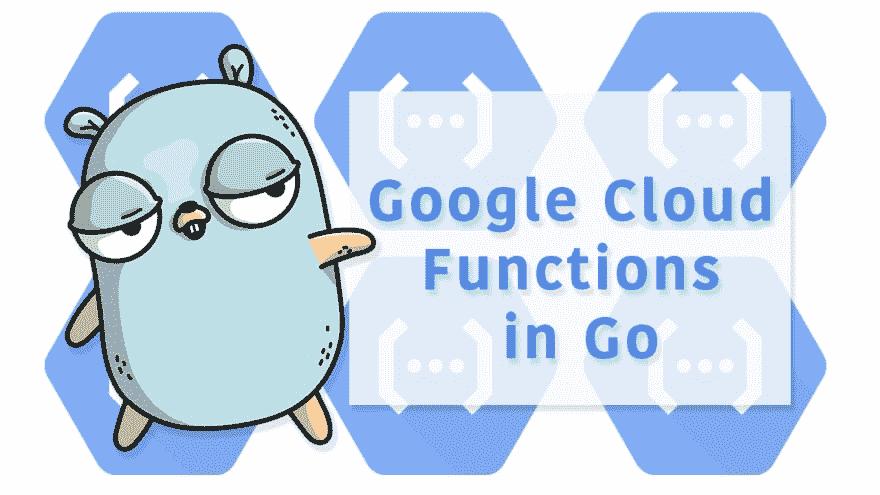

# Go 中的谷歌云功能

> 原文：<https://dev.to/plutov/google-cloud-functions-in-go-43e0>

[](https://res.cloudinary.com/practicaldev/image/fetch/s--JOzvy7qL--/c_limit%2Cf_auto%2Cfl_progressive%2Cq_auto%2Cw_880/https://thepracticaldev.s3.amazonaws.com/i/ip7n3fos5ldresu28l53.png)

本月早些时候，谷歌云功能团队终于宣布了对 Go 的 beta 支持，运行时使用 Go 1.11，其中包括我们所知的 Go 模块。

在这篇文章中，我将展示如何编写和部署两种类型的函数:HTTP 函数和后台函数。

HTTP 函数是由 HTTP 请求调用的函数。他们遵循 http。标准库中的 HandlerFunc 类型。

相反，后台功能是响应事件而触发的。例如，您的函数可能会在每次云发布/订阅服务中有新消息时运行。

第一步是确保你有一个带付费设置的谷歌云平台账户。请记住，当你注册谷歌云时，总会有一个免费层，你也可以使用它。

设置好项目后，下一步是为项目启用 Google Cloud Functions API。你可以从云控制台或使用`gcloud`工具从你的终端完成。

```
gcloud services enable cloudfunctions.googleapis.com 
```

## HTTP 功能

这将是一个简单的 HTTP 函数，它生成一个随机数，并将其发送到云发布/订阅主题。

让我们首先创建我们的主题:

```
gcloud pubsub topics create randomNumbers 
```

我将为这个函数创建一个单独的文件夹/包。

```
package  api  import  (  "context"  "math/rand"  "net/http"  "os"  "strconv"  "time"  "cloud.google.com/go/pubsub"  )  const  topicName  =  "randomNumbers"  // Send generates random integer and sends it to Cloud Pub/Sub  func  Send(w  http.ResponseWriter,  r  *http.Request)  {  ctx  :=  context.Background()  client,  err  :=  pubsub.NewClient(ctx,  os.Getenv("PROJECT_ID"))  if  err  !=  nil  {  w.WriteHeader(http.StatusInternalServerError)  w.Write([]byte(err.Error()))  return  }  topic  :=  client.Topic(topicName)  rand.Seed(time.Now().UnixNano())  result  :=  topic.Publish(ctx,  &pubsub.Message{  Data:  []byte(strconv.Itoa(rand.Intn(1000))),  })  id,  err  :=  result.Get(ctx)  if  err  !=  nil  {  w.WriteHeader(http.StatusInternalServerError)  w.Write([]byte(err.Error()))  return  }  w.WriteHeader(http.StatusCreated)  w.Write([]byte(id))  } 
```

我们的包使用了`cloud.google.com/go/pubsub`包，所以我们来初始化 go 模块。

```
export GO111MODULE=on
go mod init
go mod tidy 
```

如果您有外部依赖项，您必须在部署之前在本地库包中提供它们。

```
go mod vendor 
```

现在是时候部署它了:

```
gcloud functions deploy api --entry-point Send --runtime go111 --trigger-http --set-env-vars PROJECT_ID=projectname-227718 
```

其中`api`是名字，`Send`是入口点函数，`--trigger-http`告知是 HTTP 函数。我们还设置了一个 PROJECT_ID 环境变量。

部署可能需要几分钟时间。

不需要额外的 API 网关层就可以实现 HTTP 功能。云函数给你一个 HTTPS 网址。部署该函数后，您可以通过在浏览器中输入 URL 来调用该函数。

输出:

```
availableMemoryMb: 256
entryPoint: Send
environmentVariables:
  PROJECT_ID: projectname-227718
httpsTrigger:
  url: https://us-central1-projectname-227718.cloudfunctions.net/api 
```

## 后台功能

由于 Google Cloud 后台函数可以从 Pub/Sub 中触发，所以我们只需编写一个函数来记录触发它的事件负载。

```
package  consumer  import  (  "context"  "log"  )  type  event  struct  {  Data  []byte  }  // Receive func logs an event payload  func  Receive(ctx  context.Context,  e  event)  error  {  log.Printf("%s",  string(e.Data))  return  nil  } 
```

注意:我们在消费者中不需要 go 模块。

部署部分非常类似于 HTTP 函数，除了我们如何触发这个函数。

```
gcloud functions deploy consumer --entry-point Receive --runtime go111 --trigger-topic=randomNumbers 
```

现在让我们在执行后检查日志。

```
gcloud functions logs read consumer 
```

## 结论

请分享您在 Go 中使用 Google Cloud 功能的体验，您是否遗漏了任何功能，或者遇到了任何问题。

## 清理

为了清理，让我们删除我们创建的所有内容:函数和发布/订阅主题。

```
gcloud functions delete api
gcloud functions delete consumer
gcloud pubsub topics delete randomNumbers 
```

## 视频

本文为[package main # 15:Go](https://youtu.be/RitskkjSih0)中的谷歌云功能的文字版。