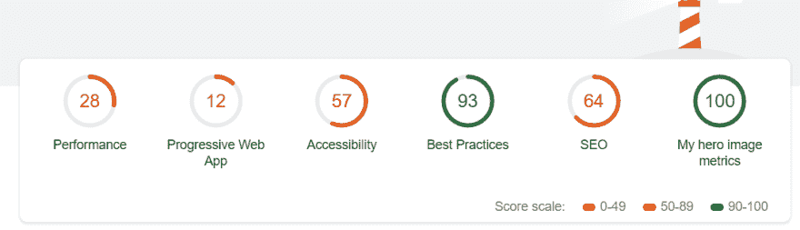
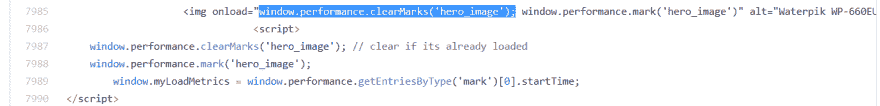
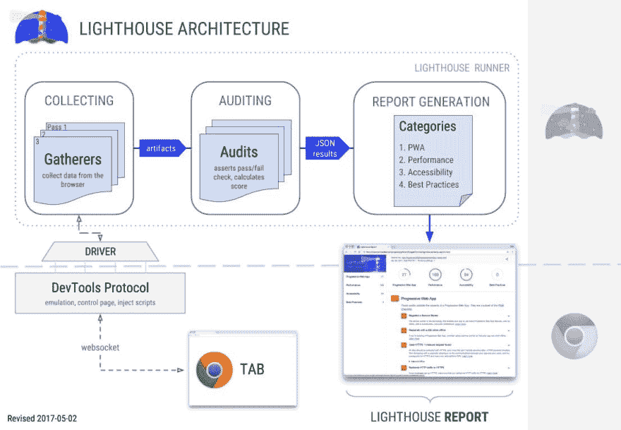

# 谷歌灯塔自定义审计教程

> 原文：<https://dev.to/loukilaymen/google-lighthouse-custom-audits-173l>

在这篇文章中，我想向你展示如何使用 **Google** **Lighthouse 来测试**你的网络应用程序中的特定内容，这要归功于它的自定义审计“隐藏”功能。自定义审计在许多情况下很有帮助:

*   扩展灯塔的力量！
*   网络测试和质量保证
*   搜索引擎优化测试(我强烈建议你检查一下[迈克·金·布莱顿搜索引擎优化幻灯片](https://bit.ly/2Q7Amvs)
*   Web 性能自定义指标

## 谷歌灯塔是什么？

谷歌灯塔是由谷歌 Chrome 团队开发的开源工具。Lighthouse 对一个网页(认证后的公共或私有)运行许多自动审计，并生成一个包含通过和失败测试的报告，以提高许多类别的质量(性能、渐进式 web 应用 PWA、 [SEO](https://www.aymen-loukil.com/en/international-seo-consultant/) 、最佳实践和可访问性)。它可以在多个工作流上运行(在 Chrome DevTools 中，作为扩展，从命令行或作为 node.js 模块)。

## 自定义指标和自定义审计:

在 web 性能优化中，我们(包括提供商、工具、开发人员、SEO、me)过于关注标准指标(基于浏览器),如 FMP、FCP、速度指数。这些指标有助于提高整体性能，获得更好的分数，但没有关注最重要的东西:用户的性能体验！

为此，我们应该尝试回答这些问题:在每一页上，我的英雄元素是什么？向我的用户提供最快的元素必须是什么？

答案取决于您的业务类型:

*   新闻网站的英雄元素可能是文章的文字和标题

*   **电子商务产品页面**英雄元素肯定是产品的形象/价格

*   电子商务类别页面英雄元素:猫销售横幅，产品的缩略图，过滤器，方面..

*   目录/分类广告网站主页英雄元素可以是搜索栏

*   Twitter timeline hero 元素可能是显示的第一条推文(第一条推文的时间)

在本教程中，我将解释我如何创建一个 Lighthouse 自定义审计来检查一个电子商务英雄图像是否可以快速显示。下面是最终结果的截图:

[](https://res.cloudinary.com/practicaldev/image/fetch/s--UpRlwBxA--/c_limit%2Cf_auto%2Cfl_progressive%2Cq_auto%2Cw_880/https://www.aymen-loukil.com/wp-content/uploads/2018/11/lighthouse-custom-audit-report-1.png)

在 Lighthouse 报告摘要中，我们看到一个新的审计类别被添加到默认类别旁边:“我的英雄形象指标”酷！

## 创建灯塔自定义审计需要什么？

如你所知， **Lighthouse 对网页进行审计**，因此我们需要:

1.  一个包含图像的产品页面，当然，为此我只是“得到”一个真正的亚马逊产品页面
2.  在 Lighthouse 中创建了一个**自定义审计**

### 1-为自定义审计配置您的网页:

我们的页面应该**给出图像何时显示的信息**。为此，我们将使用[用户计时 API](https://developer.mozilla.org/en-US/docs/Web/API/User_Timing_API) ，帮助开发人员测量他们应用程序的性能。有了这个 API，我们可以创建应用特定的时间戳。换句话说，您可以测量和报告页面渲染、JavaScript 代码执行或网站中特定事件的性能..等等。

用户计时 API 提供了一些有用的方法来标记和测量网页中的许多事件。对于本教程，我们将只使用:window.performance.mark()来创建由应用程序在特定位置触发的性能条目。在我们的例子中，当产品的图像被加载时，页面将创建一个性能标记。我们在脚本标签中 img 元素之后添加了另一个标记创建。 [Steve Souders 建议](https://www.stevesouders.com/blog/2015/05/12/hero-image-custom-metrics/)在其测试中采用较高的值，因为图像的加载时间和显示时间之间可能存在差异...反正是另一个话题。

[](https://res.cloudinary.com/practicaldev/image/fetch/s--OAg0GkMr--/c_limit%2Cf_auto%2Cfl_progressive%2Cq_auto%2Cw_880/https://thepracticaldev.s3.amazonaws.com/i/x6rrmkqow74528dz2i07.PNG)

我们在每个 performance.mark()之前添加 performance.clearMarks()，以消除之前可能的标记。现在，当英雄图像加载时，页面会创建一个名为“hero_image”的性能标记，稍后 Lighthouse 会使用它，这是目前为止最重要的一点:)

重要提示:第 9 行:我们创建一个变量来存储我们的英雄图像加载/显示的时间。这将是我们对灯塔的唯一投入。我们进行下一步吧！

### 2-在 Lighthouse 中创建自定义审计:

我们首先简单提醒一下灯塔建筑。Lighthouse 通过一个驱动程序与 Chrome DevTools 协议进行通信，以便通过 gatherers 从网页中收集数据。然后，审计在给定的工件上运行测试，并将输出结果(JSON)提供给报告生成组件。简单的没有？！

[caption id = " attachment _ 572 " align = " align center " width = " 812 "][](https://res.cloudinary.com/practicaldev/image/fetch/s--azjNHiDK--/c_limit%2Cf_auto%2Cfl_progressive%2Cq_auto%2Cw_880/https://www.aymen-loukil.com/wp-content/uploads/2018/11/Lighthouse-architecture-min.jpg)灯塔建筑- [来源](https://github.com/GoogleChrome/lighthouse/blob/master/docs/architecture.md) [/caption]

对于我们的定制审计(如这里提到的)，我们需要**两个组件**来创建定制审计:

1- **一个收集器**:这个*将从网页*中收集需要的数据

2- **审计**:这将*运行测试，并告知它是否通过*

除了 gatherer 和 audit，我们还必须创建一个定制的配置文件:这将**告诉 Lighthouse core 运行我们的定制审计**。

让我们从创建灯塔收集器开始:

```
'use strict';

const Gatherer = require('lighthouse').Gatherer;

class TimeToHeroImg extends Gatherer {
  afterPass(options) {
    const driver = options.driver;
    return driver.evaluateAsync('window.myCustomMetric')
      // Ensure returned value is what we expect.
      .then(loadMetrics => {
        if (!loadMetrics) {
          // Throw if page didn't provide the metrics we expect. This isn't
          // fatal -- the Lighthouse run will continue, but any audits that
          // depend on this gatherer will show this error string in the report.
          throw new Error('Unable to find load metrics in page');
        }
        return loadMetrics;

      });
  }

}

module.exports = TimeToHeroImg;
```

We are creating here a class named "TimeToHeroImg" that extends the generic Lighthouse Gatherer module. Line 10 : we get the variable that we created (window.myCustomMetric) from the brwoser And simply return the value in order to pass it to the audit. FYI : Lighthouse gatherer could do much more things then our simple example : driver.evaluateAsync() could also evaluate JavaScript so that we make less modifications to our production website. Let's create the audit file now :

```
'use strict';

const Audit = require('lighthouse').Audit;

const MAX_LOAD_TIME = 3000;

class LoadAudit extends Audit {
  static get meta() {
    return {
      id: 'heroimage-audit',
      title: 'hero image is loaded',
      failureTitle: 'Hero image is slow to load. More than 3000ms',
      description: 'Used to measure time from navigationStart to when the hero image is loaded',

      // We mention here our custom gatherer
      requiredArtifacts: ['TimeToHeroImg'],
    };
  }

  static audit(artifacts) {
    const loadMetrics = artifacts.TimeToHeroImg;

    // This score will be binary, so will get a red ✘ or green ✓ in the report.
    const belowThreshold = loadMetrics <= MAX_LOAD_TIME;

    return {
      rawValue: loadMetrics,
      // Cast true/false to 1/0
      score: Number(belowThreshold),
    };
  }
}
module.exports = LoadAudit;
```

In this audit we simply extends the Lighthouse Audit module (line 9), we declare our threshold for this test as 3000ms (line5), define the properties of the audit and precise which gatherer are we using (line 10-20). Line 23 : We get the value from our gatherer. We test if it is lower than our threshold [3s] (line 26) and give the score (line 28-31). We have now the gatherer and the audit, we should create a Lighthouse custom config now:

```
'use strict';

module.exports = {
  // 1\. Run your custom tests along with all the default Lighthouse tests.
  extends: 'lighthouse:default',

  // 2\. Add gatherer to the default Lighthouse load ('pass') of the page.
  passes: [{
    passName: 'defaultPass',
    gatherers: [
      'heroimage-gatherer',
    ],
  }],

  // 3\. Add custom audit to the list of audits 'lighthouse:default' will run.
  audits: [
    'heroimage-audit',
  ],

  // 4\. Create a new section in the default report for our results.
  categories: {
    mysite: {
      title: 'My hero image metrics',
      description: 'Is my hero image loading fast ?',
      auditRefs: [
        // When we add more custom audits, `weight` controls how they're averaged together.
        {id: 'heroimage-audit', weight: 1},
      ],
    },
  },
};

```

评论写得太清楚了。首先，我们告诉 Lighthouse 照常运行默认审计(性能、PWA、SEO...).其次，我们指向我们的**收集器和审计**，最后我们创建我们的**定制审计**部分属性【类别】。目前，我们只有一个审计要运行，所以分数将只是这个审计的结果(0 如果失败，100 如果成功)。

我们准备运行我们的第一个 Lighthouse 自定义审计(确保首先安装 light house:NPM 安装-g light house):

```
lighthouse --config-path=custom-config.js https://www.aymen-loukil.com/amazon.html
```

Lighthouse 将运行，并显示一个 Chrome 实例。最后，文件夹中会生成一个 HTML 报告。

## 现在怎么样了？只有灯塔？

我们修改了我们的网站，只是为了测试灯塔？好消息是市场上的许多监控工具越来越支持用户计时 API，例如

[Dareboost，](https://blog.dareboost.com/en/2018/05/custom-timings-monitoring/) [SpeedCurve，](https://speedcurve.com/blog/user-timing-and-custom-metrics/) [严谨性](https://rigor.com/blog/2018/07/new-feature-custom-user-timings)， [Newrelic](https://docs.newrelic.com/docs/agents/manage-apm-agents/agent-data/collect-custom-metrics) 和 [Goole Analytics](https://developers.google.com/analytics/devguides/collection/analyticsjs/user-timings) 。

### 获取这个定制审计的源代码，并开始构建您的！

要使用这个自定义审计，您可以从我的 Github
中提取它

##  [ AymenLoukil ](https://github.com/AymenLoukil) / [谷歌-灯塔-定制-审计](https://github.com/AymenLoukil/Google-lighthouse-custom-audit)

### 使用 Lighthouse 和用户定时 API 进行自定义性能审计——测试英雄图像是否显示速度很快

<article class="markdown-body entry-content container-lg" itemprop="text">

# 谷歌-灯塔-自定义-审计

使用 Lighthouse 和用户计时 API 进行自定义性能审计。我们测试我们的产品页面(克隆的亚马逊产品页面)hero 图片加载的速度。看我的教程:[https://www . ay men-Lou kil . com/en/blog-en/Google-light house-custom-audits/](https://www.aymen-loukil.com/en/blog-en/google-lighthouse-custom-audits/)

# 奔跑

light house-config-path = custom-config . js[https://your URL](https://yourURL)或者托管文件的 URL。

</article>

[View on GitHub](https://github.com/AymenLoukil/Google-lighthouse-custom-audit)

如果您有任何问题或评论，请在评论中告诉我，您的下一次灯塔定制审计是什么？

感谢点评:[帕特里克·胡尔塞](https://twitter.com/patrickhulce) [巴托兹·戈洛维奇](https://twitter.com/bart_goralewicz) [托梅克·鲁兹基](https://twitter.com/TomekRudzki) [托马斯·斯坦纳](https://twitter.com/tomayac) [约诺·奥尔德逊](https://twitter.com/jonoalderson) [保罗·夏皮罗](https://twitter.com/fighto) [鲍里斯·沙皮拉](https://twitter.com/borisschapira)