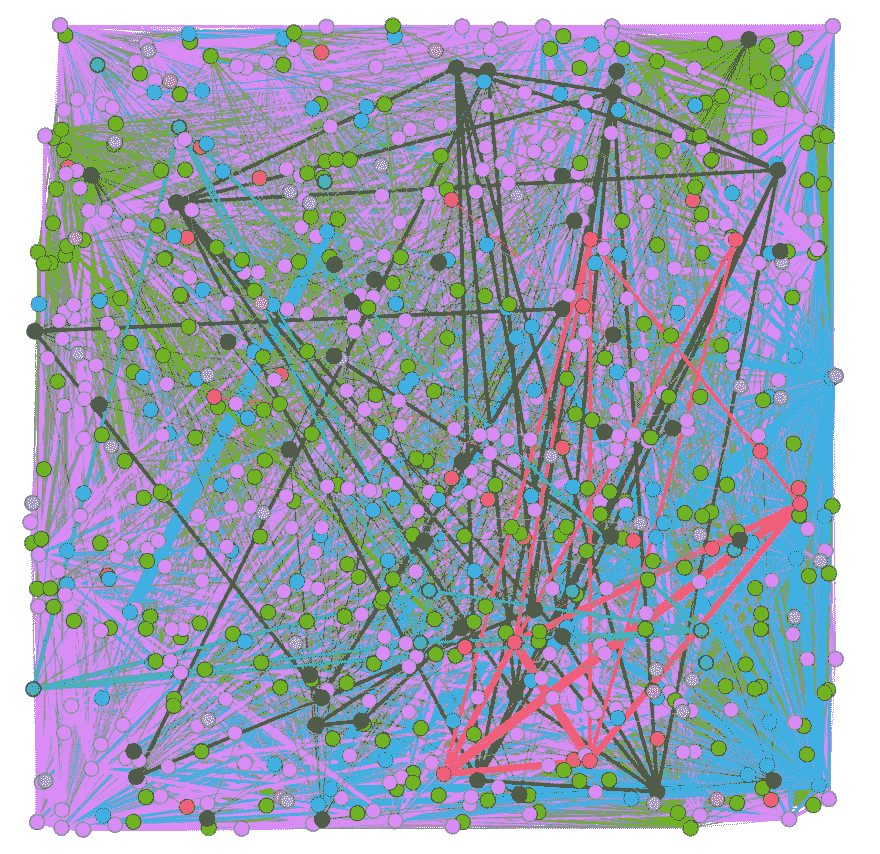
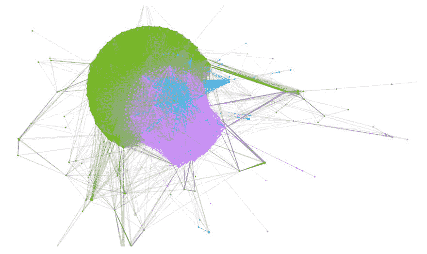
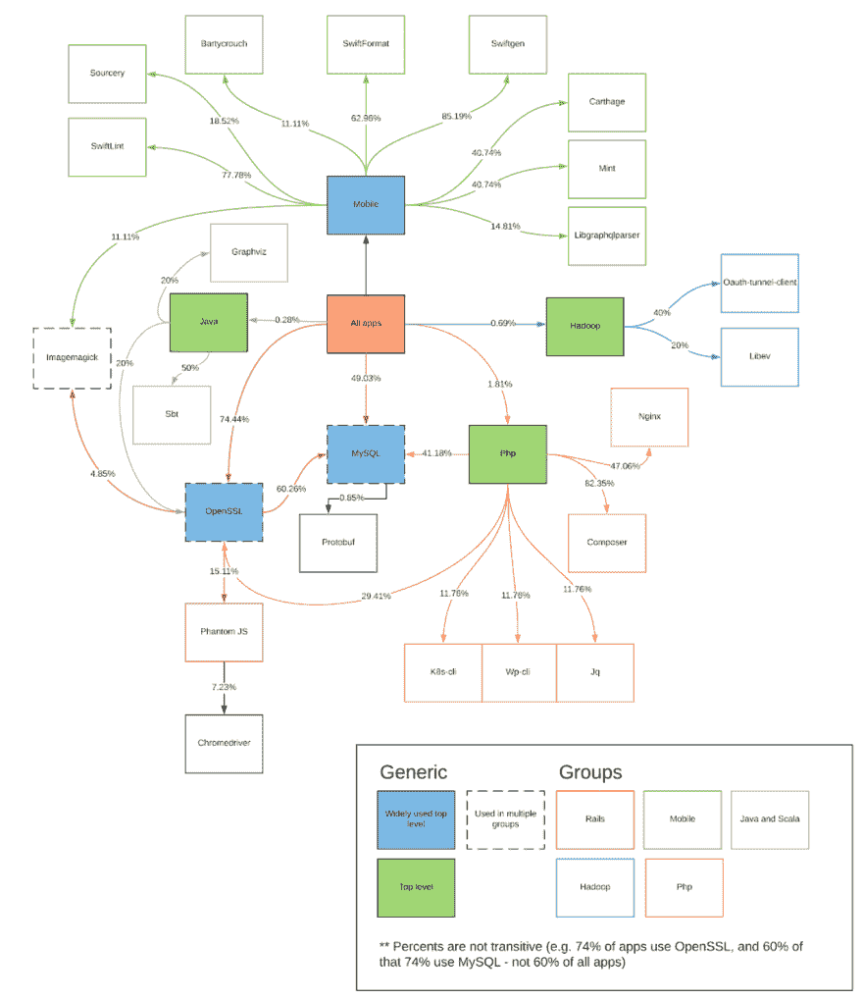

# 绘制 1000 个存储库以识别关键项目类型

> 原文：<https://dev.to/jules2689/graphing-1000-repositories-to-identify-key-project-types-5di6>

当我与我的前雇主一起工作时，我正在开发一个系统来帮助管理和优化大约 1000 个存储库、项目和服务的依赖关系。他们给我们带来了一些相互关联的依赖和不断的破坏的麻烦，我在发布的[中描述了这些问题。](https://dev.to/jules2689/the-common-edge-case-all-dependency-managers-miss-in4)

为了确保项目的成功，我需要确保我们在测试任何新系统时，项目的子集能够最好地代表公司中运行的所有系统。然而，对于大约 1000 种服务，没有人对所有这些服务有足够的了解来准确地识别模式，也没有人知道公司中所有的新兴趋势，即使在一个部门内也是如此。

为了解决这个问题，我求助于一个涉及项目数据分析的实验。我的理论是，如果我将应用程序之间的所有共享依赖关系用图表表示出来，我会发现自然的集群，这将表明公司使用的不同类型的技术。

## 实验

每个项目使用一个名为`dev.yml`的文件来指定几个依赖项。在这些依赖项中，很大一部分是使用自制软件安装的(该公司只使用 Mac 电脑进行开发)。这些相关性是本实验中使用的关键数据点。

每个`dev.yml`文件都被解析以提取声明的自制依赖项，并用来创建这个图。

这个图是通过将每个存储库绘制成一个节点来创建的。节点/仓库之间的边表示共享依赖关系，边的权重等于共享依赖关系的数量。

### 模块化

上图相当密集，用处不大。它几乎只能用来显示有大量的连接(大约 700-1000 次转发之间有近 200，000 次！).

为了让这个图更有用，我在节点网络上应用了一个[模块化算法](https://en.wikipedia.org/wiki/Modularity_(networks))。该算法生成一个名为“模块化类”的属性，这是一种用于帮助确定[社区](https://en.wikipedia.org/wiki/Community_structure)的分类，这是“这些回购紧密相连”的一种奇特说法换句话说，这决定了一个回购与另一个回购的关联程度。

在应用模块化算法和基于结果对图进行颜色编码时，创建了新的图。

 。

### 图表的布局

由此产生的彩色编码图比第一个更有帮助。可以开始从视觉上拼凑一些信息，但还是很难理解。

为了尝试进一步改善视觉方面，我进一步应用了一个 [ForceAtlas 2 布局算法](https://journals.plos.org/plosone/article?id=10.1371/journal.pone.0098679)来尝试给一个连贯和可理解的图形一些外观。结果让我开始识别一些集群，如下图所示。

### 分组数据

布局合理的图表要好得多，为我们提供了一些视觉效果来帮助解释我们在数据中看到的东西。然而，我们仍然没有实际数据可以分享。

为了确定一些具体的事实，我们可以使用前面的模块化类来划分节点。基于模块化类别的每个节点分区代表一个高度连接的 repos 组。模块化类源自节点之间的边，这些边表示共享依赖关系的数量。因此，模块化类也代表了一组并发的依赖关系——或者用更简单的术语“共享许多依赖关系的 repos”

我使用这些类对存储库进行分组，然后在每个组中递归地应用相同的模块化算法。这种方法产生了大约 5 组由自制程序依赖项代表的应用程序。

我导出了这些组中的每一个，并确定了它们经常出现的依赖关系，并用图表表示出来。下图是实验的结果。它是根据集群的结果创建的，并结合了一些基于应用程序常见依赖关系的简单计算(例如，74.44%的应用程序使用 OpenSSL 作为依赖关系，其中 15.11%的应用程序使用 PhantomJS)。该图进一步进行了颜色编码以显示各组，这些组根据该组中常见的技术进行标记(我根据系统中的经验和专业知识确定了技术标签)。

 
*注意:Javascript 和 Golang 组在这里并没有表现出来，而是在这个实验之外被确定的两个组。这种遗漏的表现是由于这两种技术通常不包括自制软件依赖性。然而，由于系统中的专业知识，这些团体是存在的。*

这张最终的图表提供了我需要的关键信息，以确定需要关注的领域。从这个图表中，我能够找到应用程序列表，并根据这些列表来测试任何重大的变化。总的来说，图表和实验让团队有信心开始一个更大的项目。