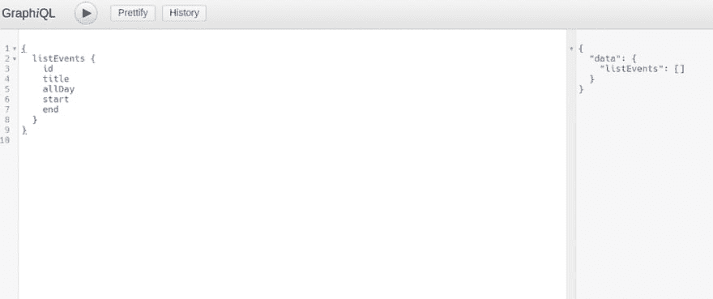
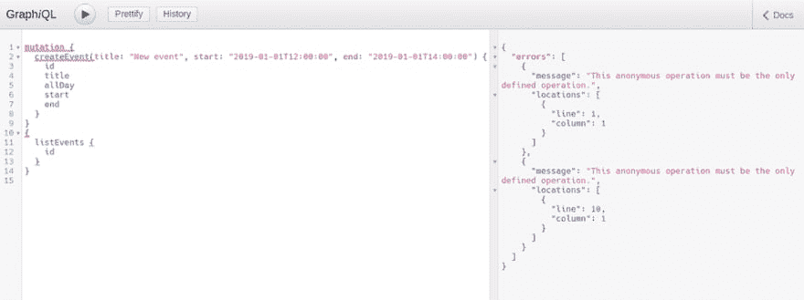
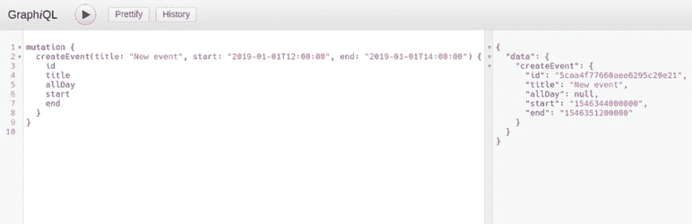
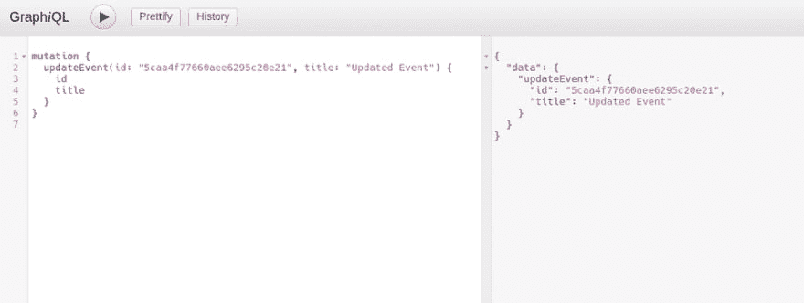

# 使用 MongoDB 和 Koa 的 GraphQL 服务器

> 原文：<https://dev.to/thorning_m/graphql-server-with-mongodb-and-koa-14ij>

关于使用 Gatsby，我最喜欢的事情之一是学习使用 GraphQL。我刚刚开始创建一个需要将日历事件保存到数据库的应用程序，所以我认为如果我能创建一个 GraphQL 服务器而不是像我通常那样使用 [REST](https://en.wikipedia.org/wiki/Representational_state_transfer) 端点，那将会很酷。事实证明，创建一个支持基本 [CRUD](https://en.wikipedia.org/wiki/Create,_read,_update_and_delete) 的 GraphQL 服务器比我预期的要容易得多，下面是我是如何做到的。

## 什么是 GraphQL

首先，大概值得写几句关于 GraphQL 是什么的话。GraphQL 是一种用于 API 的查询语言。该规范是由脸书创建的，但是对于不同的语言有许多不同的实现。与拥有多个端点的 REST 不同，GraphQL 处理类型和字段；您调用一个端点(通常是'/graphql ')并指定想要从数据集返回的类型(稍后将详细介绍)和字段。因为您告诉 API 您需要哪些字段，所以 GraphQL 是防止数据“过量提取”的一种很好的方式，过量提取会对使用移动数据或在网速差的地区的用户产生负面影响。

## 套餐

我用 JavaScript 写这篇文章，因为这是我唯一真正了解的语言，我和其他人也有涉猎，但是除非你日复一日地使用一门语言，否则很难坚持下去。除此之外，JavaScript 能做的事情太多了，除了好奇之外，我还没有找到足够好的理由去使用另一种语言。

通常我用 Express 编写节点服务器，这次我认为尝试一下 [Koa](https://koajs.com/) 会很有趣。Koa 是由 Express 的创建者制作的，使用 ansync 函数而不是回调，它也非常轻量级，没有任何中间件，所以你可以只添加你需要的东西(我们将使用 koa-mount 来设置路由，使用 koa-graphql 来使用 graphql)。如果您想使用 Express，那么下面的代码仍然可以工作，您只需要使用 Express GraphQL 中间件。

我还将[mongose](https://mongoosejs.com/)用于数据库层，它允许您为持久存储在 [MongoDB](https://www.mongodb.com/) 中的数据创建模型。

## 入门

您需要做的第一件事是用`npm init`建立一个空项目，然后安装上面提到的包以及主 GraphQL 包，它是我们用来创建模式和类型的构造函数的集合:

```
npm install koa koa-mount koa-graphql graphql mongoose 
```

您还需要安装并运行 MongoDB。你可以直接把它安装在你的电脑上，或者像我一样在 Docker 容器中运行它。不过，在这里我不打算详细说明如何做到这一点，如果你不能解决这个问题，请告诉我，我会帮忙的。

## Server.js

要写的第一个文件是 entrypoint，我把它命名为 *server.js* ，但是你可以随便叫它什么！文件全文如下:

```
const koa = require('koa');
const graphqlHTTP = require('koa-graphql');
const mount = require('koa-mount');
const schema = require('./graphql/schema');
const mongoose = require('mongoose');
const root = require('./graphql/root');

mongoose.connect(`mongodb://localhost/calendar`, {
  useNewUrlParser: true
});

const db = mongoose.connection
db.on('error', console.error.bind(console, 'connection error:'));
db.once('open', () => console.log('Database connected.'));

const app = new koa();
app.listen(9000);

app.on('error', err => {
  console.log('Server error', err);
});

app.use(
  mount(
    '/graphql',
    graphqlHTTP({
      schema,
      rootValue: root,
      graphiql: true
    })
  )
); 
```

在文件的顶部，我们需要用到所有的包。在第 8 行的*上，我们调用`mongoose.connect`，它打开了与我们的 MongoDB 的连接(确保它正在运行！)并连接到一个名为`calendar`的数据库。如果指定的数据库不存在，那么 Mongoose 会自动为你创建一个。传递选项`{ useNewUrlParser: true }`可以防止您在控制台中收到“弃用警告”消息。*

接下来，我们监听 Mongoose，让我们知道连接是否成功；在这两种情况下，我都只记录消息。如果您愿意，可以将初始化数据库连接的代码行移动到一个单独的文件中，以使事情变得更干净，出于本文的目的，我将把它们留在这里。

在*第 16 行*我们创建了一个新的 Koa 应用程序，并告诉它监听端口 9000，然后进行一些错误处理，再次记录错误消息。

最后，在第 23 行我们添加了中间件。我们使用`koa-mount`来创建路线`/graphql`；对这个 URL 的任何请求都被传递给 koa-graphql 中间件。GraphQL 中间件接受一个模式和一个根值，我们将在后面编写，我们还告诉它使用`graphiql`(发音为“graphical”)。

Graphiql 是一个很棒的工具，让你在开发服务器和开发使用它的前端时，可以对服务器进行查询。Graphiql 还自动为您创建文档，向使用您的 API 的任何人展示哪些类型和字段是可用的，以及每个类型和字段的功能。

## 猫鼬模型

Mongoose 使用从模式构建的模型。我们只需要一个模型，但最好将它们放在自己的文件夹中，以防需要添加更多。到目前为止的目录结构如下:

```
src
 ├── models
 │   └── event.js
 └── server.js 
```

新文件名为`event.js`，这里是:

```
const mongoose = require('mongoose');

const EventSchema = new mongoose.Schema({
  title: String,
  start: Date,
  end: Date,
  allDay: Boolean
});

module.exports = mongoose.model('Event', EventSchema); 
```

这应该是不言自明的。首先，我们创建一个模式，其中我们声明了每个模型将拥有的字段以及它们将拥有的数据类型。然后，Mongoose 从这个模式中创建一个模型，我们将其导出。我要解释的一件事是，`mongoose.model` ( *第 10 行*)的第一个参数是干什么的。`'Event'`是 Mongoose 将在数据库中查找的集合的单数名称。它会进行复数和小写，所以在这种情况下，Mongoose 会寻找一个名为“events”的集合，如果没有这个名称的集合，它会为我们创建一个。

## 查询

GraphQL 能够处理查询和变异。查询用于从 API 获取数据，突变用于添加、编辑或删除数据。让我们从添加一个查询类型开始，该查询类型具有一个字段，该字段将返回一个包含*事件*集合中所有记录的数组。

首先，我们需要创建一个模式。这是在 server.js 的第 27 行传递给 GraphQL 中间件的文件。我将把这个文件放在它自己的 *graphql* 文件夹:

```
src
  ├── graphql
  │   └── schema.js
  ├── models
  │   └── event.js
  └── server.js 
```

```
const { buildSchema } = require('graphql');

module.exports = buildSchema(`
  type Event {
    id: ID,
    title: String
    allDay: Boolean
    start: String,
    end: String
  }
  type Query {
    listEvents: [Event]
  }
`); 
```

用包含用 GraphQL 自己的模式语言编写的模式的字符串调用`buildSchema`函数。正如我前面提到的，GraphQL 是围绕类型组织的；有根`Query`型和根`Mutation`型。其中每个包含更多类型的字段，这些字段包含更多类型的字段，以此类推，像树的分支一样展开，直到达到标量类型(Int、Boolean、String)。标量类型被称为叶子，因为树初始化。

我们在模式中声明的第一个类型是`Event`类型，这是我们的查询和突变将使用的输出类型。在内部，我们声明所有可以返回的字段以及每个字段中包含的数据类型。记住，除了我们在这里使用的标量类型之外，还可以包含其他定制的 GraphQL 类型。

接下来，在*的第 11 行*，我们声明我们的根查询类型。我们将添加一个查询，`listEvents`，它将返回一个`Event`类型的数组。

现在我们需要添加解析器函数，它将从我们的 MongoDB 中获取数据。我将在 *graphql* 文件夹中添加另一个文件，名为*root . js*；这是 server.js 中另一个丢失的文件，它被添加到 GraphQL 中间件的*第 28 行* :

```
src
  ├── graphql
  │   ├── root.js
  │   └── schema.js
  ├── models
  │   └── event.js
  └── server.js 
```

```
const Event = require('../models/event');

module.exports = {
  listEvents() {
    return Event.find();
  },
} 
```

这就是我们获取数据所需要做的一切！我已经导入了 mongose`Event`模型，当进行`listEvents`查询时，我们只需要不带任何参数地调用`.find`来获取集合中的所有记录。让我们试一试...

打开你的浏览器，进入‘localhost:9000/graphql’(我们在 *server.js* 中设置的端口和 URL)，你应该会看到 graph QL 界面。

首先我想告诉你文件在哪里。如果您点击屏幕右上角的链接，调用 *Docs* ，然后点击 *Query* ，您应该能够找到我们刚刚创建的查询。点击直到您找到我们在模式中的事件类型中列出的字段。这似乎是显而易见的，但我花了比我想承认的更长的时间才意识到医生在那里！

现在您已经看到了文档是如何工作的，我们可以查询我们的 API 了。将以下内容复制到左侧窗格:

```
{
  listEvents {
    id
    title
    allDay
    start
    end
  }
} 
```

如果一切正常，您应该看到以下内容:

[](///static/728094527bbfbd7e7f9f1694cf512b4b/1525c/graphiql_query.png)

答案在右侧窗格中。目前，数组是空的，因为我们还没有添加任何东西，所以让我们写一个突变，以便我们可以添加一些数据。

## 创建事件

首先，我们需要将根突变类型添加到我们的 *schema.js* 中，并添加`create`字段。

```
const { buildSchema } = require('graphql');

module.exports = buildSchema(`
  type Event {
    id: ID,
    title: String
    allDay: Boolean
    start: String,
    end: String
  }
  type Query {
    listEvents: [Event]
  }
  type Mutation {
    createEvent(title: String!, start: String, end: String, allDay: Boolean): Event
  }
`); 
```

新代码已添加到*14 线*。如果您再次查看 Graphiql 中的 docs 部分，您应该能够在根查询类型下看到新的根类型`Mutation`。如果你点击它，你应该看到它包含了新的`create`字段。

`create`字段接受圆括号中声明的参数(以及它们的类型),我们在冒号后声明了返回类型；`Event`，这是我们从*线 4* 输出的类型。

现在，让我们将解析器函数添加到我们的 *root.js* 文件:

```
const Event = require('../models/event');

module.exports = {
  listEvents() {
    return Event.find();
  },
  createEvent(input) {
    const newEvent = new Event(input);
    return newEvent.save();
  },
} 
```

我们的`create`函数用请求中发送的`input`创建一个`new Event`。在 Mongoose 模型上调用`save()`会将它添加到数据库的集合中。

我们来添加一个事件！将此复制到 Graphiql:
的左侧窗格中

```
mutation {
  createEvent(title: "New event", start: "2019-01-01T12:00:00", end: "2019-01-01T14:00:00") {
    id
    title
    allDay
    start
    end
  }
} 
```

这里要提到几件事。在用我们想要设置的值调用了`create`之后，我们列出了我们想要服务器从新创建的记录中响应的字段。因为我们将模式中的返回类型设置为`Event`，并从解析器函数返回新创建的事件，GraphQL 希望我们用希望它响应的字段来跟随我们的变化；如果我们不这样做，我们将得到一个错误。

您可能已经注意到，我们已经用单词`mutation`开始了我们的请求。当我们之前进行查询时，我们不需要标记它，因为 GraphQL 假设您正在进行查询，除非您另有说明。如果您希望在同一个请求中进行查询和变异，那么您需要标记它们，否则您将收到一个错误:

[](///static/aa58189097da75908de8413420afb537/b54d2/graphiql_error.png)

希望你不会得到一个错误！您应该得到这样的结果:

[](///static/fe9e1c207fcdd2346fb65fd19d4adfaa/de00b/graphiql_create.png)

您可以看到服务器已经用我们从新创建的事件中请求的字段进行了响应。这个 ID 是 MongoDB 为我们创建的，这非常有用，因为我们现在可以使用这个 ID 来选择我们想要更新和删除的事件。

## 更新&删除事件

到目前为止，您应该能够看到这有多简单，我将一次性添加更新和删除方法，这样我们就可以演示完整的 CRUD。需要更新模式，使其看起来像这样:

```
const { buildSchema } = require('graphql');

module.exports = buildSchema(`
  type Event {
    id: ID,
    title: String
    allDay: Boolean
    start: String,
    end: String
  }
  type Query {
    listEvents: [Event]
  }
  type Mutation {
    createEvent(title: String!, start: String, end: String, allDay: Boolean): Event
    updateEvent(id: String!, title: String, start: String, end: String, allDay: Boolean): Event
    deleteEvent(id: String!): String
  }
`); 
```

我们添加了两个额外的突变，注意这两个突变都需要事件的`id`(类型声明中的感叹号意味着它不能为空)此外，删除字段返回一个`String`。

下面是 *root.js* 文件:

```
const Event = require('../models/event');

module.exports = {
  listEvents() {
    return Event.find();
  },
  createEvent(input) {
    const newEvent = new Event(input);
    return newEvent.save();
  },
  updateEvent(input) {
    const { id, ...rest } = input;
    return Event.findByIdAndUpdate(id, { $set: rest }, { new: true }).catch(
      err => console.error(err)
    );
  },
  deleteEvent({ id }) {
    return Event.findByIdAndDelete(id)
      .then(event => event.remove())
      .then(() => `${id} successfully deleted`)
      .catch(err => console.error(err));
  }
}; 
```

`update`解析器(*第 11 行*)使用析构将 id 从我们想要改变的字段中分离出来。然后我们使用`findByIdAndUpdate`找到正确的记录，并用新数据更新它(`{ $set: rest }`)。传递选项`{ new: true }`使 MongoDB 返回更新后的记录，而不是更新前的记录。我们还捕捉任何错误并记录下来。

`delete`解析器只需要`id`，所以它直接析构它，并使用`findByIdAndDelete`找到记录并删除它。还记得模式中这个方法返回一个字符串吗？因为我们已经删除了记录，所以返回它没有什么意义，相反，我们在第 20 行的*上回复一条确认消息。*

让我们尝试更新我们的记录:

[](///static/9386136690d92c29c1d52ec1445b45ca/943a9/graphiql_update.png)

正如您在回复中看到的，我们记录的标题已被正确更新。现在让我们删除它:

[](///static/a1c4ba44988377db4b4aa6fcdde402bc/43efa/graphiql_delete.png)

这是我们的确认信息，非常成功！👍

* * *

我们有完整的 CRUD，几乎不用写任何代码！显然，在这被认为是生产就绪之前，还有其他考虑要做，例如安全性、验证和错误处理，但是我对使用这些技术来制作一个正常工作的后端是多么容易印象深刻。我还有另外一个提示作为坚持到最后的奖励。Graphiql 是一个很好的工具，但是它有其局限性。相反，我一直在使用一个名为[失眠症](https://dev.to/scottw/insomnia-rest-client-578d-temp-slug-9682618)的开源应用程序进行 API 调用；你可以设置不同的请求，并把它们组织到文件夹中，这非常方便，看看吧！