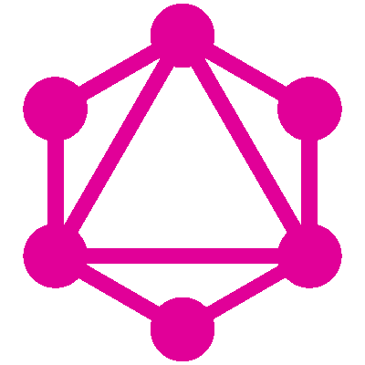

# 拯救 GraphQL 简介

> 原文：<https://dev.to/irina_scurtu/graphql-to-the-rescue-a-short-introduction-4d7e>

### GraphQL 来救援——简短介绍

[](https://res.cloudinary.com/practicaldev/image/fetch/s--nAEjGTCA--/c_limit%2Cf_auto%2Cfl_progressive%2Cq_auto%2Cw_880/https://cdn-images-1.medium.com/max/400/1%2AhueWCEA-faaVRBK88SOMLQ.png)

GraphQL 是一种由脸书发明的查询语言，并于 2015 年向公众公开。是一个开放的规范，允许您以灵活和直观的方式查询 API。

我们不断听到有关 GraphQL 的消息，以及它如何为您编写应用程序的方式带来了一场革命，以及 GraphQL 如何优于 REST 或它如何是 REST 2.0。这不是为了更好，而是为了解决 REST 的一些缺陷，并对 REST 进行补充。

我们中的大多数人，当我们谈论 API 时，我们指的是 REST API，或者至少是想要 REST API 的人。

### REST 约束的简短总结

1.  **客户端—服务器** —它假设存在客户端和服务器，并且服务器不应该知道客户端的存在
2.  **无状态** —服务器不保留任何踪迹，也不保留任何标识符，如果有踪迹，也包含在请求中。服务器将每个请求视为一个新请求，没有历史记录
3.  **缓存**

缓存是 [HTTP RFC](https://www.ietf.org/rfc/rfc2616.txt) 最重要的规范之一。有了它，客户机可以根据需要发出尽可能多的请求，但服务器不一定要去数据库获取相同的数据。这是一种指导方式

**4。分层系统** —客户端不知道它是否与代理或负载均衡器对话，只要响应被接收，它不应该关心

1.  **统一资源**

有 4 个子约束

*   **资源的识别** —每个资源都应该是可识别和可寻址的
*   **通过表示操纵资源** s —客户端永远不会与数据库资源交互，它最有可能与资源的表示交互。该表示可以是例如数据库实体的合成表示或子表示
*   **自描述消息** —每个请求/响应应包含所有必要的内容，以便各方能够正确理解。它应该包含正确的 HTTP 方法(以预期的使用方式)、正确的状态代码和正确的标头(例如 Accept、Content-Type 或任何自定义标头)
*   作为应用状态引擎的超媒体

假设客户端能够执行的下一步将作为一个单独的区域包含在响应中。

```
{
    "links": {
        "self": { "href": "/speakers" },      
        "next": { "href": "/speakers?page=2" }     
    }
} 
```

Enter fullscreen mode Exit fullscreen mode

换句话说， [Roy Fielding](https://www.ics.uci.edu/~fielding/pubs/dissertation/top.htm) 认为客户不应该知道 API 的任何东西，除了它最初的 URI 和适当的媒体类型和动词。这样，如果客户机在请求中包含了所有必要的信息，服务器将能够理解所请求的内容并做出相应的响应。

从那时起，所有的应用程序状态转换都将由客户机选择从服务器接收的表示来驱动，或者由用户操作它们来驱动。

作为一种架构风格，REST 非常强大，它的目标是将所有东西都视为完全可寻址的资源，利用正确的响应代码、正确的 HTTP 动词和 HTTP 头，同时不保留任何关于先前请求的痕迹。

它旨在允许服务器和客户机独立发展，并允许服务器通过利用 HATEOAS 和超媒体类型来驱动应用程序状态。

不幸的是，很多 API 完全忽略了 HATEOAS 部分——借口是它增加了每个响应的开销，或者添加它没有真正的好处。

在某些情况下，这可能是真的，但是如果正确实现，它也会带来很大的威力，这取决于您的设计，做还是不做。

### REST API 的问题

REST APIs 即使有它们展示的结果，也有两个主要问题。

*   **过度提取** —我们努力做到与 REST 保持一致，但大部分通过网络传输的数据最终被忽略，没有显示在 UI 中，并且被丢弃。
*   **不足提取** —与过度提取同时出现，当消费者被迫再次呼叫某个端点以获取其他数据时，就会出现这种情况

有人说过度蚀刻是糟糕的设计，或者缺乏趣味性，是可以避免的。可以，但你并不总是能控制消费者应用。

一旦你向公众公开你的 API——供第三方使用，或者如果客户端应用程序是在其他地方开发的，你就几乎失去了对 API 设计的控制。

如果他们只使用一个字段、两个字段或整个回答，您将无法从您的回答中看出他们使用了什么数据。

虽然你可以做任何事情来公开一个高性能的 API，但是你不能为每一个可能的场景和任何潜在的客户或消费者应用定制它。

### GraphQL 来救援了

使用 GraphQL，您将能够以一种非常类似于图形的方式对您公开的数据进行建模。您将拥有相关数据的节点，消费者可以“导航”这些节点。

```
query   {
  talks{
    description
    title
    feedbacks{
      comments
      delivery
    }
    speakers{
      companyName
    }
  }
} 
```

Enter fullscreen mode Exit fullscreen mode

这种请求非常直观，对这种查询的响应将只通过网络带来所请求的数据，因此为潜在的消费者提供了很大的灵活性。

GraphQL 允许您的用户按照您在服务器端定义的方式操作分层数据，并动态地创建查询和变异。

GraphQL 可能证明其威力的场景之一是微服务架构。

为此，您可以创建一个类似网关的 API，它将聚合来自几个 API 的数据，并依次向客户端应用程序公开查询和变化。

通过这种方式，您可以允许您的消费者只获得他们需要的数据，但是您认为合适的嵌套程度，所有这些都只需要对服务器进行一次调用。

不再需要后续调用不同的端点，不再需要端点链接地狱，不再需要端点！您将只有一个端点可供任何可能存在的消费者使用。

想想看，就好像你想把石头和沙子分开，然后你筛选非常细的沙子。

### 你能用 GraphQL 做什么

### graph QL 中的查询

GraphQL 中的查询几乎是可以从外部“询问”的一切，允许消费者指定需要从 API 返回什么数据。

查询可以在同一个调用中并行执行。

```
 query {
      talk(id: 1) {
        description
        title
        speaker{
          lastName
        }
      }
    } 
```

Enter fullscreen mode Exit fullscreen mode

### graph QL 中的突变

GraphQL 中的突变几乎是改变某个状态的所有东西。修改某些内容的 POST、PUT、DELETE 请求。

突变将按顺序执行，而不是并行执行。

```
 mutation($talk: talkInput!) {
      createTalk(talkInput: $talk) {
        title
        description
        speakerId
      }
    } 
```

Enter fullscreen mode Exit fullscreen mode

### graph QL 的缺点

虽然，你不能说 GraphQL 比 REST 更好——因为这是两个不同的概念，当然你可以利用两者来充分利用你的 API，但是你需要意识到缺陷— **缓存**

缓存是 HTTP 最重要的规范之一。我们用它来提高性能，以节省从 web 服务器到数据库服务器的行程，并且我们用它来欺骗用户一切都运行得非常快。

当我们谈论 GraphQL 时，您将有一个从中获取数据的 URL，但是该请求可以用不同的主体或参数发出。

脸书开始大肆宣传，现在 GitHub 宣布他们 API 的 v4 将完全基于 GraphQL。

我的意思是，如果他们不能缓存对改进的感知性能的响应，他们为什么要这样做呢？

他们有如此多的客户端和端点，所以转向 GraphQL 并给予消费者所需的灵活性是很有意义的。最后，他们不能确定他们从回答中使用了什么数据。

仅仅因为这些巨头使用 GraphQL，并不意味着您也应该使用它。

你需要分析你的情况，利弊，并确切知道你的最终目标是什么。你只是想使用它，你想要它的灵活性，你愿意为了灵活性牺牲缓存吗？没有真正的理由不要随便用。

*原载于 2019 年 4 月 9 日*[*【irinascurtu.net】*](https://irinascurtu.net/tech-articles/graphql-to-the-rescue-a-short-introduction/)*。*