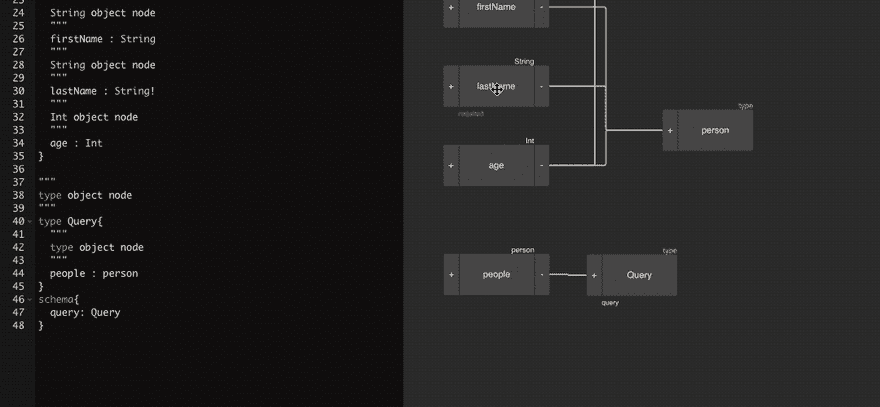
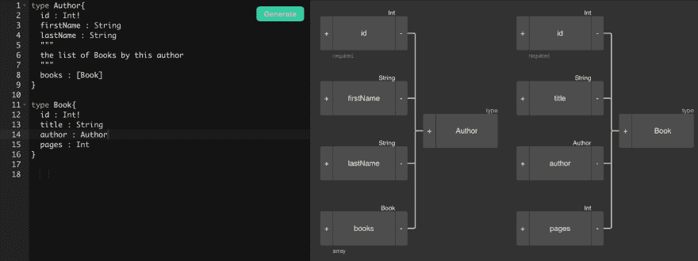

# GraphQL 新手教程- cheatsheet

> 原文：<https://dev.to/robmatyszewski/graphql-tutorial-for-newbies---cheatsheet-gb5>

## 简介

我是 GraphQL 的[可视化编辑器的创始人。这篇博文是新手教程的一部分。关注我以获取更多信息并查看其他文章。我已经介绍了 GraphQL、简介和模式定义语言的基础知识。请随意评论，建议修改。](https://graphqleditor.com)

## 类型定义

```
scalar > Scalar type
type > Object type
interface > Interface type
union > Union type
enum > Enumerable type
input > Input object type 
```

Enter fullscreen mode Exit fullscreen mode

[](https://app.graphqleditor.com/demo/blog-sample)

## 标量类型

```
String - set of characters in UTF-8 format,
Int - 32-bit integer,
Float - floating point number,
Boolean - value true or false
ID - a type representing the unique identifier for the object. 
```

Enter fullscreen mode Exit fullscreen mode

[](https://app.graphqleditor.com/demo/blog-sample)

## 类型修饰符

```
String > Nullable string
String! > Required string
[String] > List of strings
[String]! > Required list of strings
[String!]! > Required list of required strings 
```

Enter fullscreen mode Exit fullscreen mode

[](https://app.graphqleditor.com)

## 一个 GraphQL 模式的例子

```
type Author {
  id: Int!
  firstName: String
  lastName: String
  """
  the list of Books by this author
  """
  books: [Book]
}
type Book {
  id: Int!
  title: String
  author: Author
  pages: Int
} 
```

Enter fullscreen mode Exit fullscreen mode

在 GraphQL 的[可视化编辑器](https://graphqleditor.com)中探索这个例子

[](https://app.graphqleditor.com/demo/blog-sample2)

## 该模式允许以下查询:

```
type Query {
  book: [Book]
  author(id: Int!): Author
} 
```

Enter fullscreen mode Exit fullscreen mode

## 输入自变量

# 基本输入

```
type Root {
  users(limit: Int): [User]!
} 
```

Enter fullscreen mode Exit fullscreen mode

# 用默认值输入

```
type Root {
  users(limit: Int = 10): [User]!
} 
```

Enter fullscreen mode Exit fullscreen mode

# 输入多个参数

```
type Root {
  users(limit: Int, sort: String): [User]!
} 
```

Enter fullscreen mode Exit fullscreen mode

# 输入多个参数和默认值

```
type Root {
  users(limit: Int = 10, sort: String): [User]!
} 
```

Enter fullscreen mode Exit fullscreen mode

### 或

```
type Root {
  users(limit: Int, sort: String = "asc" ): [User]!
} 
```

Enter fullscreen mode Exit fullscreen mode

## 界面

```
interface Publication {
  title: String!
  releasedDate: String!
}
type Magazine implements Publication {
  title: String!
  releasedDate: String!
  version: Int!
}  
type Book implements Publication {
  title: String!
  releasedDate: String!
  pages: Int!
} 
```

Enter fullscreen mode Exit fullscreen mode

# 工会

```
union SearchResult = Book | Author

type Query {
  search(text: String!): SearchResult
}

query {
  search(text: "Park") {
    ... on Book {
      title
    }
    ... on Author {
      name
    }
  }
} 
```

Enter fullscreen mode Exit fullscreen mode

## 枚举

```
enum RGB {
  RED
  GREEN
  BLUE
}
type Root {
  color: RGB
} 
```

Enter fullscreen mode Exit fullscreen mode

## 输入对象类型

```
input ListUsersInput {
  limit: Int 
  since_id: ID
}
type Root {
  users(params: ListUsersInput): [Users]!
} 
```

Enter fullscreen mode Exit fullscreen mode

如果你正在寻找最好的 graphql 教程，请查看这个[帖子](https://blog.graphqleditor.com/top-graphql-tutorials-reviewed-2019)。