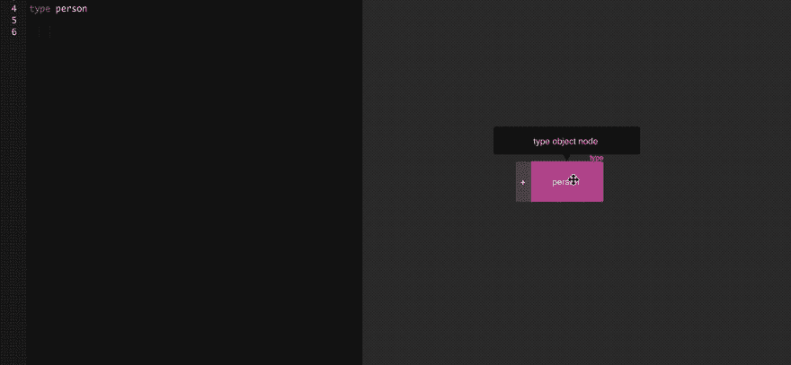
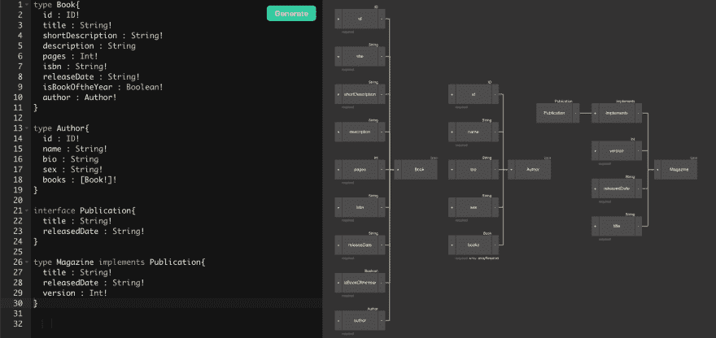
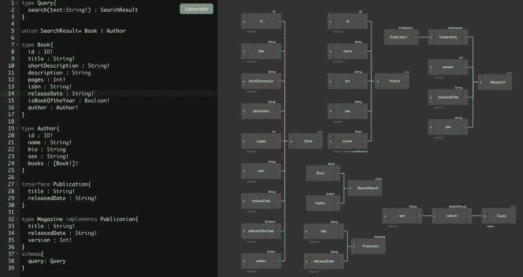

# GraphQL 新手教程-模式定义

> 原文：<https://dev.to/robmatyszewski/graphql-tutorial-for-newbies---schema-definition-7dm>

这篇博文是新手教程的一部分。跟随我获取更多信息。

有了上一篇关于 GraphQL 的文章中的理论介绍，我们可以继续描述该标准的一个重要部分，即类型系统，它允许您定义 API 模式——graph QL 模式定义语言(SDL)。它是一种特殊的语法，已经被很好地记录和创建，无论使用何种语言或框架，您都可以使用它。

## 类型系统

GraphQL 是强类型的，这意味着每个定义都必须有特定的类型。类型系统附带了帮助，它为定义我们的 API 元素提供了几种可能性。让我们考虑一下图书馆应用程序(书籍和作者)声明我们的 API 的第一个类型。点击图片转到书籍样本。

[](https://app.graphqleditor.com/demo/blog-sample)

整个难题中最重要和最常用的元素是对象类型，用最简单的术语来说就是字段的集合。上面的例子:使用类型 Book {}和类型 Author {}定义声明了两个对象，而在这些声明中，您可以看到某些类型的字段，例如 name: String！，或 isBookOftheYear: Boolean！。

## 标量类型

在 GraphQL 中，有几个用于字段声明的内置标量类型:

*   字符串-UTF 8 格式的字符集，
*   Int - 32 位整数，
*   Float -浮点数，
*   布尔值真或假
*   ID -表示对象的唯一标识符的类型，最常用于重新下载(由缓存使用)。它的序列化方式与字符串类型相同。

[](https://app.graphqleditor.com/demo/blog-sample)

## 界面

GraphQL 的类型系统以接口为特色。接口公开了一组特定的字段，类型必须包含这些字段来实现接口。例如，我们可以将一个发布界面表示为一本书或一本杂志。这些类型有共同的特征，包括标题和发布日期。

[](https://app.graphqleditor.com/demo/blog-sample)

很有可能作者既可以出版书籍也可以出版杂志，由于这个接口，你不需要依赖于特定类型的出版物，在这种情况下，我们可以使用一个更大的抽象，即出版物。

## 工会

一个有趣的机制是联合类型，它允许您表示一组没有相同字段的对象。一个很好的例子是对一个搜索引擎的查询，这个搜索引擎可以搜索书名和作者的名字。有了这个声明，您可以像这样查询:

```
union SearchResult = Book | Author

type Query {
  search(text: String!): SearchResult
}

query {
  search(text: "Park") {
    ... on Book {
      title
    }
    ... on Author {
      name
    }
  }
} 
```

Enter fullscreen mode Exit fullscreen mode

结果我们会看到答案:

```
 {
      "data": {
        "search": [
          {
            "name": "Jurassic Park",
          },
          {
            "name": "Jessica Park",
          }
        ]
      }
    } 
```

Enter fullscreen mode Exit fullscreen mode

检查它在可视化编辑器上的外观:

[](https://app.graphqleditor.com/demo/blog-sample)

## 申报方案

在定义 API 模式时，有两个顶级元素可用——query 和 mutation，它们是以与所有其他元素相同的方式创建的普通对象。在它们内部，我们声明了 API 的可能性。该方案本身的定义很简单:

```
schema {
  query: Query
  mutation: Mutation
}

type Query {
}

type Mutation {
} 
```

Enter fullscreen mode Exit fullscreen mode

## 查询

查询是模式中的强制元素，负责读取 API。该对象中所有定义的字段都可以与各种 API 端点进行比较。公认的原则是，通过 query 发布的元素是明确指定要下载的实体的名词——在上面的例子中，它们是 book 和 author。为了更好地说明整体，您可以将以前定义的对象移到查询中。

```
schema {
  query: Query
}

type Query {
  book(id: ID!): Book
  author(id: ID!): Author
}

type Book {
  id: ID!
  title: String!
  shortDescription: String!
  description: String
  pages: Int!
  isbn: String!
  releaseDate: String!
  isBookOftheYear: Boolean!
  author: Author!
}

type Author {
  id: ID!
  name: String!
  bio: String
  sex: String!
  books: [Book!]!
} 
```

Enter fullscreen mode Exit fullscreen mode

## 论据

在某些行中，您可以看到与前面的情况略有不同的字段声明(例如，book (id: String！))，除了字段名之外，您还可以看到带有另一个声明的圆括号——这只不过是向查询输入一个参数——在此基础上，您可以根据想要下载的数据传递一些参数。在上面的示例中，需要用户的 id，执行的查询如下所示:

```
query {
  book(id: "1234") {
    title
    isbn
  }
} 
```

Enter fullscreen mode Exit fullscreen mode

## 突变

突变是一个可选的部分，允许您通过 API 在我们的应用程序中添加、编辑或删除项目。它的定义与类型查询相同。唯一的区别是定义字段的原则——与变异中的查询相反，字段通常被称为动词，它们清楚地定义了执行的动作。作为对上述例子的补充，有必要增加创作新书的可能性。

## 输入类型

在我们讨论变异声明的例子之前，在讨论与类型系统相关的所有基本类型时，有必要再介绍一个类型。为了通过 GraphQL 在应用程序中修改或创建新元素，创建了一个特定的类型输入，它的行为非常像一个常规对象，不同之处在于在声明期间使用输入而不是关键字类型。

```
schema {
  query: Query
  mutation: Mutation
}

type Mutation {
  createAuthor(input: AuthorInput): Author
  updateAuthor(id: ID!, input: AuthorInput): Author
}

input AuthorInput {
  name: String!
  bio: String
  sex: String!
} 
```

Enter fullscreen mode Exit fullscreen mode

在上面的示例中，您可以观察到 createAuthor 和 updateAuthor 操作期望 AuthorInput 对象作为参数，并返回 Author 对象。对于声明的方案，创建新书需要类似的操作:

```
mutation {
  createAuthor(input: {
    name: String!
    bio: String
    sex: String!
  }) {
    id
    title
  }
} 
```

Enter fullscreen mode Exit fullscreen mode

如果你正在寻找最好的 graphql 教程，请查看这个[帖子](https://blog.graphqleditor.com/top-graphql-tutorials-reviewed-2019)。