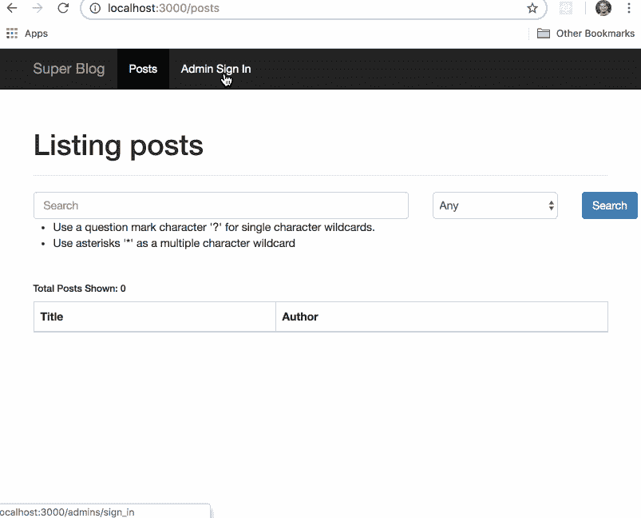

# 天哪！日常网站开发的定时攻击演示

> 原文：<https://dev.to/simple_thread/great-scott-timing-attack-demo-for-the-everyday-webdev-53ch>

组成 web 应用程序数据的一种更阴险的方式是通过计时攻击。你的应用程序处理一个请求所花费的时间可以揭示比你想象的更多的信息。虽然成功的计时攻击需要某些成分，但表面积很大，我们不能依赖库来保护我们免受所有情况的影响。

在理解了计时攻击的来龙去脉之后，您可能会惊讶地发现审计自己的 web 应用程序。以下是从易受攻击的演示应用程序中提取机密数据的完整过程。

脚本是用 Ruby 写的，虽然我们喜欢它，但是如果那不是你的语言，不要担心！每个代码片段都有书面解释。

演示应用程序和这个定时攻击演练中的所有代码可以在简单线程 Github 页面的[这里](https://github.com/simple-thread/great_scott)找到。

## 演示应用概述

在我们得到好的东西之前，这里有一个易受攻击的演示应用程序，我们将它称为 Great Scott，一个标准的 CRUD 博客。任何访问该网站的用户都可以通过标题(不区分大小写)或作者来搜索帖子。当您以管理员身份登录时，您可以创建和发布帖子。只有管理员可以看到未发布的博客帖子。

定时攻击载体将滥用搜索功能，通过测量服务器响应所需的时间来获取未发布博客文章的标题。

## 极小的证明

作为攻击者，最容易的起点是创建一个最小的测试，看看是否有可能进行定时攻击。最小测试的目标不是完全提取秘密标题。我们将传递两个搜索查询并测量结果。一个会匹配标题的一部分，另一个不会。

让我们设置实验室环境，尽可能多地消除计时攻击的变量。我们将在同一个机器上运行我们的漏洞脚本和应用服务器，因此通过开放互联网引起的抖动不会成为问题。此外，我们将杀死任何资源饥渴的进程。最后，我们希望我们的应用程序中只存在一个博客帖子，并且应该是未发布的。指南的其余部分假定这篇文章的标题是“伟大的斯科特！我们必须回到未来"

在运行任何脚本之前，请确保您只有一个未发布的帖子！额外的帖子会增加“噪音”，我们稍后会讨论如何克服这个问题。您可以运行[自述文件](https://github.com/simple-thread/great_scott/blob/master/README.md)中列出的设置命令来重置数据库并创建这篇未发布的文章。

首先，我们将构建一个简单的方法来包装搜索路径。实际上，这基本上是旋度。