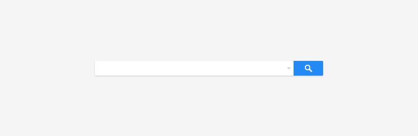
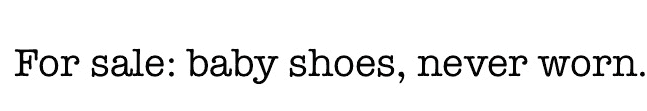
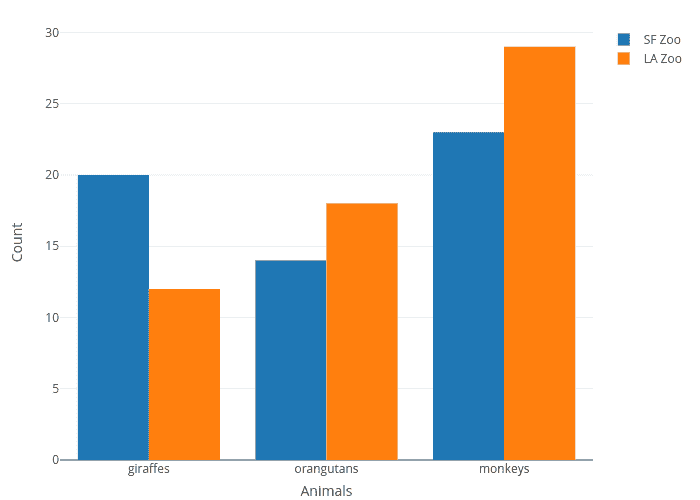

# 在图像上使用替代文本的指南

> 原文：<https://dev.to/lauragift21/guide-to-using-alternative-text-on-images-ob2>

今天，许多开发人员都熟悉图像的`alt`属性。我可以说，我们大多数人都知道这是使网页可访问的一种方式，但我们真的了解替代文本的范围，何时使用它，如何使用它吗？我同意这是成为可访问性倡导者的一步，所以这就是为什么在这篇文章中，我将详细解释 alt 属性，以及实践它如何从长远来看提高 web 可访问性。

坦白说，在我真正开始接触可访问性之前，我不明白为网络上的所有图片提供描述性文本的重要性。我最大的缺点是将`alt`属性留空。现在我知道得更多了，我不能把它藏在心里，这也是我写这篇文章的原因之一，与大家分享我获得的新知识。

## 什么是替代文字？

替代文本或 alt 文本，因为它被亲切地称为是一个书面文字描述的图像在网络上。
替代文本非常有用，在以下任何情况下都能派上用场:

*   使用屏幕阅读器等辅助技术的人。
*   由于网络连接不良而关闭设备图像的人。
*   它有助于提高网页的搜索引擎优化。

为图像编写好的替代文本是非常重要的，不应该被忽视。为了显示这一点的重要性，网页内容可访问性指南文档 [WCAG 2.1](https://www.w3.org/TR/WCAG21/#text-alternatives) 中有第一条规则，显示了它的重要性。

> 准则 1.1 文本替代方案:为任何非文本内容提供文本替代方案，以便可以将其转换为人们需要的其他形式，如大号字体、盲文、语音、符号或更简单的语言。

## 如何使用 Alt 文本

通常，当向网页添加图像时，我们使用 HTML 图像元素来表示图像，并使用图像标签上的 alt 属性来描述图像。这里有一个例子:

[](https://res.cloudinary.com/practicaldev/image/fetch/s--MQ6tekXM--/c_limit%2Cf_auto%2Cfl_progressive%2Cq_auto%2Cw_880/https://res.cloudinary.com/lauragift/image/upload/v1554123305/photo-1551212721-f0d4160f0abd_fxpx0w.jpg)T3】

```
 
```

Enter fullscreen mode Exit fullscreen mode

上面的 alt 属性描述了图像的上下文。在这种情况下，如果在此页面上使用了屏幕阅读器。它将读取替代文本，用户将获得所用图像的描述性上下文。在编写替代文本时，还有其他需要考虑的事情。这只是为图像编写描述性替代文本的初级读本。我将回顾在网页上使用图片时需要注意的重要概念。

网页上的所有图片都必须有描述图片功能的替代文字。
在网上使用图片有七个概念，我将逐一介绍，它们包括:

1.  **信息图像:**信息图像是描述一条信息或概念的图像。描述的信息可以是任何东西，从情感/印象到标签或链接中使用的文件格式。信息图像的文本替换应该传达图像的含义或内容。这里有一个例子:

[](https://res.cloudinary.com/practicaldev/image/fetch/s--MCfUW3co--/c_limit%2Cf_auto%2Cfl_progressive%2Cq_auto%2Cw_880/https://res.cloudinary.com/lauragift/image/upload/v1554128116/photo-1492633423870-43d1cd2775eb_xgcd0p.jpg)T3】

```
 
```

Enter fullscreen mode Exit fullscreen mode

上图展示了一个女孩的情感。因此，我们的想法是让替代文本传达这一信息。

1.  **装饰图像:**装饰图像是不一定传达意义或信息的图像。这些图像没有向页面内容添加信息，主要是因为已经提供了内容描述或者图像用于样式目的。因此，`alt`属性未被提供或留空`(alt="")`。这样做的原因是为了避免辅助技术(如屏幕阅读器)向用户阅读冗余文本。完全忽略`alt`属性并不是一个好的做法，因为有些屏幕阅读器会显示图像的文件名。下面显示了一个示例:

```
 
```

Enter fullscreen mode Exit fullscreen mode

1.  **功能图像:**功能图像是传达要采取的行动的图像，而不是仅传达图像信息的信息图像。它们主要用于链接、按钮和其他交互元素。替代文本应该传达要采取的行动，而不是图像的描述。例如，将`a microscope`替换为`search list`，或者将`image of a printer`替换为`print page`。拥有一个空的`alt`属性也不会有什么帮助，因为你希望能够通知使用屏幕阅读器浏览你的站点的用户，你希望他们在那个时候采取行动。这里有一个例子:

[](https://res.cloudinary.com/practicaldev/image/fetch/s--stl35MqA--/c_limit%2Cf_auto%2Cfl_progressive%2Cq_auto%2Cw_880/https://res.cloudinary.com/lauragift/image/upload/v1554130730/how-to-search-gmail_etobms.jpg)T3】

```
<input type="image" src="search.png" alt="search this page"> 
```

Enter fullscreen mode Exit fullscreen mode

1.  **图片文字:**图片文字顾名思义就是描述图片中所说明的文字。这很少使用，因为在大多数现代浏览器中，我们可以使用 CSS 样式化文本，使其看起来完全符合我们的要求，而不是使用图像来表示文本。使用文本而不是图像来显示内容有更多的优势，因为文本可以很容易地缩放或调整大小而不会失去清晰度，但使用图像时，文本会变形并失去图像质量。如果唯一可能的选项是使用图像来描述文本，则替换文本也必须包含图像中的文本。例如，我们可以有:

[](https://res.cloudinary.com/practicaldev/image/fetch/s--pzJR5-pm--/c_limit%2Cf_auto%2Cfl_progressive%2Cq_auto%2Cw_880/https://res.cloudinary.com/lauragift/image/upload/c_crop%2Ch_111/v1554131437/Screen_Shot_2019-04-01_at_4.10.10_PM_mkphqf.png)T3】

```
 
```

Enter fullscreen mode Exit fullscreen mode

1.  **图像组:**这种类型的图像表示组合在一起传达单一信息的图像。一个例子可以是代表评级的心形图标的集合。在为每个图像添加描述性文本时，只有一个图像的 alt 属性应该有图像组的描述，而其他图像有一个空的`alt`属性，因此它们会被屏幕阅读器忽略。这里有一个例子:

[](https://res.cloudinary.com/practicaldev/image/fetch/s--YSGoxmdb--/c_limit%2Cf_auto%2Cfl_progressive%2Cq_auto%2Cw_880/https://res.cloudinary.com/lauragift/image/upload/v1554132040/lLdzWnJ_v1o7ie.png)T3】

```


 
```

Enter fullscreen mode Exit fullscreen mode

1.  复杂图像:复杂图像传达了非常详细和大量的信息。这些类型的图像包括图表、条形图、显示位置的地图以及图表或插图等。在这些情况下，提供了两个文本替代描述。第一个是图像的简短描述。二是对图像的长篇描述，以充分说明图像所传达的信息。这里有一个例子:

[](https://res.cloudinary.com/practicaldev/image/fetch/s--4ks2IZdE--/c_limit%2Cf_auto%2Cfl_progressive%2Cq_auto%2Cw_880/https://res.cloudinary.com/lauragift/image/upload/v1554132643/count-vs-animals_kjpeh5.png)T3】

```
<figure role="group">
  
  <figcaption>
    <p>The bar chart shows a population of the animals in South African Zoo compared to Los Angelos Zoo. With the number of giraffes, monkeys and orangutans compared in both zoos.</p>
  </figcaption>
</figure> 
```

Enter fullscreen mode Exit fullscreen mode

1.  **图像地图:**图像地图是被分成不同区域的图像，每个区域由`area`元素表示。组织结构图就是一个例子。使用``和`<map>`元素创建图像映射。在`img`元素和每个`area`元素上都需要文本替换。下面的示例展示了一个组织结构图，其中每个节点都代表组织中的一个人。

[](https://res.cloudinary.com/practicaldev/image/fetch/s--m2TzGpcQ--/c_limit%2Cf_auto%2Cfl_progressive%2Cq_auto%2Cw_880/https://res.cloudinary.com/lauragift/image/upload/v1554133167/orgchart-b583d8ff_b3fqaw.png)T3】

```

<map name="Map" id="Map">
    <area
        shape="rect"
        coords="176,14,323,58"
        href="…"
        alt="Davy Jones: Chairman"
    >
 ...
</map> 
```

Enter fullscreen mode Exit fullscreen mode

列出了所有这些图像类型后，如何知道在实现 alt 文本时使用哪一种呢？[备选决策树](https://www.w3.org/WAI/tutoriaimg/decision-tree/)是帮助您做出决定的指南。因此，如果有疑问，请使用 alt 决策树。

## 写替代文字时要注意的小技巧

*   用句号结束替代文本。这将使屏幕阅读器在阅读其他内容之前暂停一会儿。这改善了用户的体验。
*   不要以`image of`或`photo of`开始替换文本。
*   描述图像时要具体。
*   避免为了搜索引擎优化的目的而使用关键词。
*   不要在`alt`文本中添加换行符。这可能会导致屏幕阅读器在描述图像时出现奇怪的停顿。
*   将空的`alt`属性`alt=""`用于装饰图像。例如，网站的背景图像，因为不需要理解这里使用的上下文。

## 结论

在本文中，我已经详细解释了对图像使用替代文本的好处，以及如何在不同的上下文中使用它们。我很高兴你读到这里，因此我的要求不仅仅是阅读，还要学会实践。我相信通过每个人的集体努力，网络将变得更容易访问。