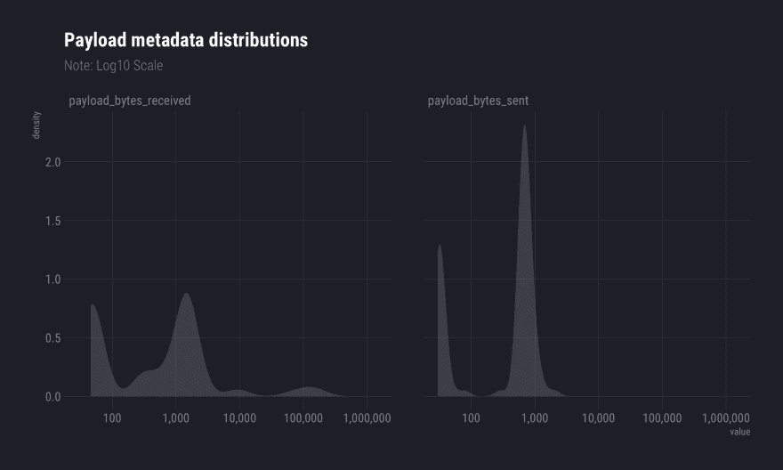

# 像老板一样处理和分享 PCAPs

> 原文：<https://dev.to/hrbrmstr/handling--sharing-pcaps-like-a-boss-with-packettotal-k21>

在 [@PacketTotal](http://twitter.com/PacketTotal) 的优秀人员给我留下了一个 API 令牌，所以我为它制作了一个 [R 包](https://cinc.rud.is/web/packages/packettotal/)，以实现更动态的调查工作(RStudio 是一个令人惊叹的事件响应调查控制台，因为你可以用多种语言编写脚本，用 C[++]编写代码，并同时使用 R‘projects’编写文档，并具有完全的源代码控制)。

由于我使用了`DT`包，我通常的“将 markdown 复制并粘贴到 WordPress 中”是行不通的，我也不打算仅仅为了一篇介绍性的文章而做两个`saveWidget()`并在你们身上强加两个 iframes，所以 R markdown 输出[在这里](https://rud.is/rpubs/2019-03-17-pt-example.html)可用。

你也可以在这里找到 R markdown 文档[中使用的 R 代码的源代码。](https://paste.sr.ht/~hrbrmstr/47f667b009b8dbf044d5722c2606363854cc02b7)