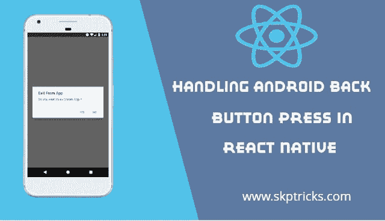

# 在 React Native 中处理 Android 后退按钮按下

> 原文：<https://dev.to/skptricks/handling-android-back-button-press-in-react-native-ga1>

来源:[在 React Native 中处理 Android 后退按钮按下](https://www.skptricks.com/2019/04/handling-android-back-button-press-in-react-native.html)

在本教程中，我们将讨论如何在 React 本机应用程序中按下硬件后退按钮时让应用程序退出。与 iOS 设备不同，Android 设备有硬件后退按钮，用于浏览之前的屏幕。有时，您可能需要在按下后退按钮时让应用程序退出。硬件返回键是每一部安卓手机最重要的部分。后退按钮为我们提供了返回到先前活动的功能，无需在应用程序中进行任何定制。如果我们将在主主页活动屏幕上，那么默认情况下，按下返回按钮将退出我们的应用程序。在 react native 中，我们可以修改 android 的硬件后退按钮行为，并根据我们的要求覆盖它。

[在 React Native 中处理 Android 后退按钮按下](https://www.skptricks.com/2019/04/handling-android-back-button-press-in-react-native.html)

[点击此处观看演示](https://www.skptricks.com/2019/04/handling-android-back-button-press-in-react-native.html)