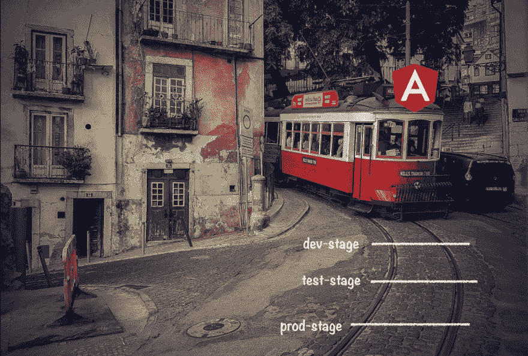

# 处理连续交付中的角度环境

> 原文：<https://dev.to/kreuzerk/handling-angular-environments-in-continuous-delivery-22k5>

#### 将连续交货与有角度的想法结合起来

在重要的业务应用程序中，我们现在经常遇到具有多个阶段的连续交付设置。

每个阶段都有其访问特定环境外围系统的配置。为此，我们需要处理基于阶段的配置。

Angular CLI 已经提供了一些内置概念来处理不同的环境。

但是，在持续交付的环境中，它们有多可靠呢？🤔

[了解更多信息...](https://blog.angularindepth.com/handling-angular-environments-in-continuous-delivery-eeaee96f0aae)