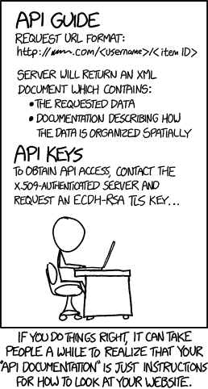

# 用 NodeJS 中的 OpenAPI (Swagger)文档处理 API 验证。

> 原文：<https://dev.to/scampiuk/handling-api-validation-with-openapi-swagger-documents-in-nodejs-17d0>

<figure> 

<figcaption>照片由 [Tim Gouw](https://unsplash.com/@punttim?utm_source=medium&utm_medium=referral) 上 [Unsplash](https://unsplash.com?utm_source=medium&utm_medium=referral)</figcaption>

</figure>

这篇文章最初发表在我的媒体博客上。

我总是发现 API 工作最难的是文档。

当然，有很多很好的工具可以帮助你定义它，提供很好的前端等等，但是维护它远没有完成实际工作有趣。很快，你就得到有小错误的陈旧文档，和不完全匹配的验证规则。

最近一个 NodeJS API 项目出现在我面前，它已经拥有的几个端点的 OpenAPI 3 文档已经过期，但我们知道我们将开始更多地使用它，所以它需要达到标准。

> **OpenAPI 规范**(以前的 Swagger 规范)是 REST APIs 的 API 描述格式

我想，如果我们要维护这个 OpenAPI 规范，它包含了端点的所有验证规则，那么一定有一种方法可以节省我们的时间。

如果我们可以使用这个规范来执行验证，会怎么样？如果我们能把它作为端点测试的基础会怎么样？

如果我们能得到这两样东西，我们就有了 OpenAPI 规范的完美组合，验证需要编写才能工作，验证不能偏离规范——所以不再有危险的文档，其中参数被记录为 int，但它实际上是 float..

..如果我们可以根据文档构建测试，那么我们所有的输出都必须是定义好的，这样 API 的消费者就不会因为我们发送了一个对象，而他们期望的是一个数组而感到困扰。

使用 OpenAPI 规范来执行验证，并成为测试的关键，执行 API 的良好定义，并删除所有困扰 API 开发的讨厌的小“哦，是的，如果 Y，只返回 IMHO。

因此，让我们停止在这里闪烁其词，创建一些简单的东西来证明这是如何工作的。

<figure>

<figcaption>——[https://xkcd.com/1481/](https://xkcd.com/1481/)</figcaption>

</figure>

首先，我们将指定我们的端点。为了节省时间，我使用了一个样本规范作为基础。在[https://editor.swagger.io/](https://editor.swagger.io/)有一个非常好的编辑器/可视化工具来处理你的规格文件。

下面是我们要看的规范子集: