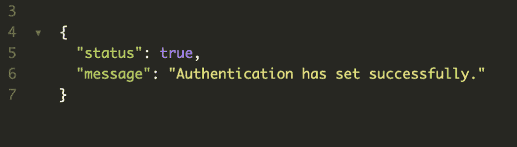

# 处理来自 Guzzle FileCookieJar 的 Cookie

> 原文：<https://dev.to/_mertsimsek/handling-cookie-from-guzzle-filecookiejar-3m2h>

今天，在这篇文章中，我想提一下狂饮的饼干概念。我在网上查看了这个问题，但我甚至在文档中找不到明确的解决方案。我的场景是这样的，我想通过使用用户名和密码来验证一个系统。除此之外，我希望 Guzzle 将 cookie 数据存储到一个 json 文件中。通过这种方式，我将该文件提交给请求进一步查询的人。

首先，我想向 request 展示我的 auth 方法。

```
 /**
     * @param Client $client
     * @return array
     * @throws GuzzleException
     */
    public function auth(Client $client): array
    {
        try {
            $apiUrl = getenv('API_URL');
            $username = getenv('USERNAME');
            $password = getenv('PASSWORD');

            $postData = array('email' => $username, 'password' => $password, 'keep_logged_in' => true);

            $response = $client->request('POST', $apiUrl . '/rest/authenticate', [
                'json' => $postData,
                'cookies' => new FileCookieJar('/Users/mertsimsek/Development/app/assets/cookies.json')
            ]);
            $results = \GuzzleHttp\json_decode($response->getBody()->getContents(), true);

            return ($results['success']) ? array('status' => true, 'message' => 'Authentication has set successfully.') : array('success' => false, 'message' => 'Authentication wasn\'t able to set.');
        } catch (RequestException $e) {
            return
                array(
                    'status' => false,
                    'message' => $e->getMessage()
                );
        }
    } 
```

通过`FileCookieJar`,我能够将 cookie 数据存储到 JSON 格式的文件中。因此，我将阅读此文件，以进一步的要求。我创建了一个新方法来读取这个文件。

```
 /**
     * @return CookieJar
     */
    public function getCookieJarFromFile(): CookieJar
    {
        $cookieData = json_decode(file_get_contents('/Users/mertsimsek/Development/app/assets/cookies.json'));
        foreach ($cookieData as $cookie) {
            //If there are multiple cookie data, you could filter according to your case
            $cookie = json_decode(json_encode($cookie), TRUE);
            $setCookie = new SetCookie($cookie);
        }

        $jar = new CookieJar();
        $jar->setCookie($setCookie);

        return $jar;
    } 
```

好了，从现在开始，我有了一个从文件中获取 cookie 数据的方法。现在，我们可以创建一个请求新查询的方法。只要我请求`auth` path，我就会得到这个结果，json 文件将由 Guzzle 创建。

[](https://res.cloudinary.com/practicaldev/image/fetch/s---i92jtL2--/c_limit%2Cf_auto%2Cfl_progressive%2Cq_auto%2Cw_880/https://thepracticaldev.s3.amazonaws.com/i/fcrrh5st9cpy4mfmur22.png)

[](https://res.cloudinary.com/practicaldev/image/fetch/s--HGLEGMzU--/c_limit%2Cf_auto%2Cfl_progressive%2Cq_auto%2Cw_880/https://thepracticaldev.s3.amazonaws.com/i/djcgxrvnv3zjiz7m0djp.png)

对，我们可以用这个文件请求从 API 中清楚地获取数据。如您所见，我从该文件中获取 cookie 数据，并使用 Guzzle 库进行请求。

```
 /**
     * @param Client $client
     * @return array
     * @throws GuzzleException
     */
    public function requestToApi(Client $client): array
    {
        $apiUrl = getenv('API_URL');
        $postData = array();

        try {
            $jar = $this->getCookieJarFromFile();

            $response = $client->request('GET', $apiUrl . '/rest/getUsers', [
                'json' => $postData,
                'cookies' => $jar
            ]);
            $results = \GuzzleHttp\json_decode($response->getBody()->getContents(), true);

            return ($results['success']) ? array('status' => true, 'message' => 'Authentication has set successfully.') : array('success' => false, 'message' => 'Authentication wasn\'t able to set.');
        } catch (RequestException $e) {
            return
                array(
                    'status' => false,
                    'message' => $e->getMessage()
                );
        }
    } 
```

希望这篇文章能真正帮助你使用 **FileCookieJar** 。如果你有困难，不要犹豫，保持联系。