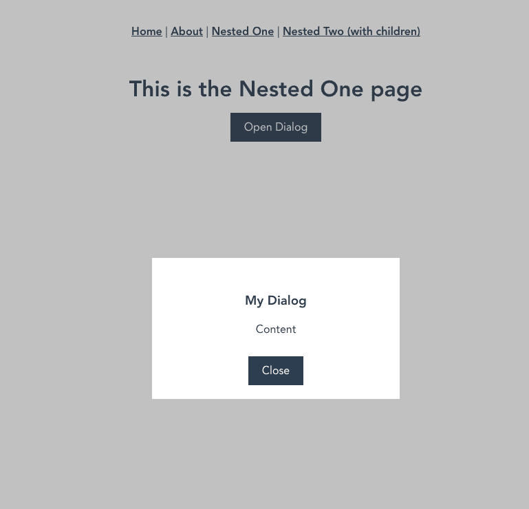

# 使用 Vue 路由器处理对话

> 原文：<https://dev.to/berniwittmann/handling-dialogs-with-vue-router-29ji>

在这个关于 Vue 路由器架构的小系列的第一部分，我写了关于用 Vue 路由器处理嵌套路由的[。如果您已经阅读过，可能会更容易理解，但这里有一个非常简短的总结:
该教程引入了一个用于处理嵌套路由的`EmptyRouterView`组件。](https://dev.to/berniwittmann/my-approach-on-vue-router-architecture-and-nested-routes-2kmo)

但是我们也可以使用这个组件来处理像这样的对话框:

[](https://res.cloudinary.com/practicaldev/image/fetch/s--kMz3XVs9--/c_limit%2Cf_auto%2Cfl_progressive%2Cq_auto%2Cw_880/https://thepracticaldev.s3.amazonaws.com/i/ti1j95m95u9oafo4qbx3.png)

[](https://i.giphy.com/media/1M9fmo1WAFVK0/giphy.gif)

通过使用 vue router 处理对话框的可见性，我们可以通过导航到相应的 URL 来轻松切换它们。在我看来，这会产生一个更干净的代码库。那么我们该怎么做呢？

### 步骤 1:更新我们的`EmptyRouterView`组件

首先我们需要编辑我们的`EmptyRouterView`组件:

```
<template>
  <div>
    <router-view name="dialog"></router-view>
    <router-view></router-view>
  </div>
</template> 
```

Enter fullscreen mode Exit fullscreen mode

该组件现在包含两个`router-views`。下面的一个(默认的)用于显示背景(或者在不应该显示对话框的情况下显示正常页面)。同时，用于对话的那个将包含我们对话的内容。

### 第二步:为我们的对话框创建一个组件

现在我们必须为我们的对话框创建一个组件:

```
template>
  <div class="dialog">
    <div class="dialog__inner">
      <h3>My Dialog</h3>
      <p>Content</p>
      <a class="btn" @click="close">Close</a>
    </div>
  </div>
</template>

<script>
export default {
  methods: {
    close () {
      this.$router.back()
    }
  }
}
</script>

<style lang="scss">
.dialog {
  # Styling for the background overlay of the dialog

  &__inner {
    # Styling for the dialog itself
  }
}
</style> 
```

Enter fullscreen mode Exit fullscreen mode

这是一个非常简单的组件，但是你需要一些样式使它看起来像一个对话框(你也可以为它使用 bootstraps 类，或者其他东西)。也许你已经注意到我已经包含了一个后退按钮。我们可以简单地使用`router.back()`方法导航一个页面来关闭模型，因为我们从 Vue-Router 切换了路由的可见性。

### 第三步:更新路由配置

最后但同样重要的是，我们必须在我们的`router.js`配置:
中指定 Vue 路由器的路由配置

```
routes: [{
    path: '/nested,
    component: EmptyRouterView,
    children: [{
        name: 'nested',
        path: '',
        component: MyPageView
    }, {
        name: 'nested.dialog',
        path: 'dialog',
        components: {
            default: MyPageView,
            dialog: MyDialogComponent
        }
    }]
}] 
```

Enter fullscreen mode Exit fullscreen mode

对于 url `/nested/dialog`处名为`nested.dialog`的对话路由，我们将组件`MyPageView`指定为背景，将`MyDialogComponent`指定为对话本身。由于该路由是具有`EmptyRouterView`组件的路由的子路由，这些组件直接填充我们的`EmptyRouterView`组件中指定的`router-views`。

已经是这样了。现在我们可以在`/nested/dialog`导航到我们的路线，您会看到对话框:

[](https://res.cloudinary.com/practicaldev/image/fetch/s--kMz3XVs9--/c_limit%2Cf_auto%2Cfl_progressive%2Cq_auto%2Cw_880/https://thepracticaldev.s3.amazonaws.com/i/ti1j95m95u9oafo4qbx3.png)

您也可以在我创建的回购中使用它:

## [【bernwittmann】](https://github.com/BerniWittmann)/[vista 路由器体系结构](https://github.com/BerniWittmann/vue-router-architecture)

### 我的 Vue 路由器架构方案

<article class="markdown-body entry-content container-lg" itemprop="text">

# 我的 Vue 路由器架构方法

这个库应该展示我在 Vue 路由器架构和嵌套路由上的基本方法。它还显示了使用 Vue 路由器处理对话的可能性

我使用一个名为`EmptyRouterView`的视图(它只包含一个路由器视图和一个对话框视图)来实现一种简洁的方式来构建我的嵌套路由配置和一种简单的方式来处理对话框。

> 相应的博文可以在 [dev.to](https://dev.to/berniwittmann/) 上找到
> 
> [第一部分:路线处理](https://dev.to/berniwittmann/my-approach-on-vue-router-architecture-and-nested-routes-2kmo)
> 
> [第二部分:对话处理](https://dev.to/berniwittmann/handling-dialogs-with-vue-router-29ji)

## 项目设置

```
npm install 
```

### 为开发进行编译和热重新加载

```
npm run serve 
```

## ❓ 有什么问题吗？

不要犹豫，给我发电子邮件到[dev@bernhardwittmann.com](https://github.com/BerniWittmann/vue-router-architecturemailto:dev@bernhardwittmann.com)

</article>

[View on GitHub](https://github.com/BerniWittmann/vue-router-architecture)

暂时就这样了。请随时让我知道你对此的想法😁