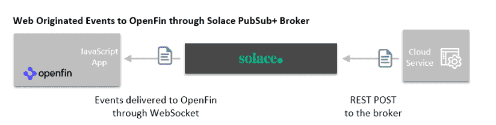
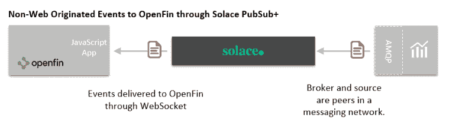
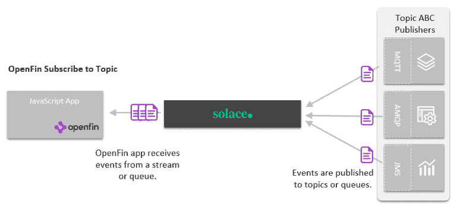
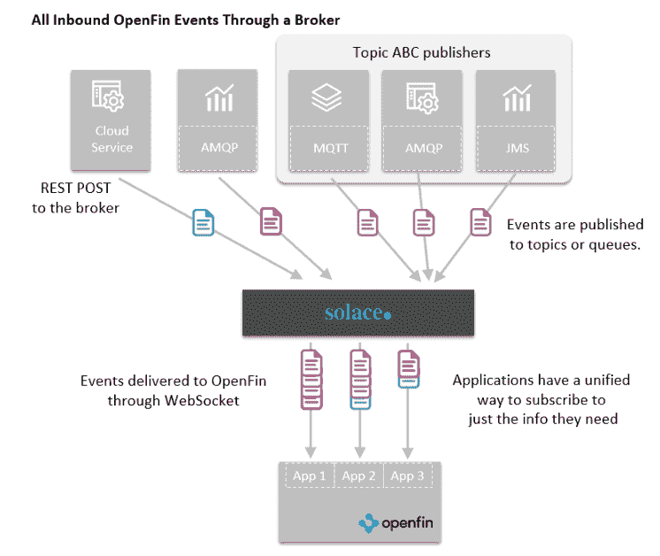

# 处理来自混合云的开放入站事件

> 原文：<https://dev.to/tkthetechie/handling-openfin-inbound-events-from-the-hybrid-cloud-5ab0>

将 OpenFin 应用程序与远程服务完全集成需要一个如何与这些服务进行最佳交互的计划。大多数金融服务公司有数百个应用程序和数千个微服务，其中一些使用事件，一些生成事件。有些提供 web 原生 API，而许多则没有。

我们之前已经讨论过如何增强 REST 来处理许多出站交换模式。在本帖中，我们将讨论组织 OpenFin 入站事件的更好方法。

## 什么是进站事件？

出于本文的目的，我们将入站事件定义为从远程源接收的任何异步事件。入站事件有两种主要类型:

1.  **由服务触发的通知。**在大多数情况下，这些将响应用户对相关事件的兴趣(明确的或隐含的)。例如，价格警报、违反风险阈值、欺诈事件或与投资组合资产相关的新闻。
2.  对先前请求的异步回复。 JavaScript 鼓励使用非阻塞资源，一个远程请求可能会导致完成某项工作的时间长短不一，从几毫秒到几分钟不等。大多数 OpenFin 应用程序希望将请求和响应分离，并将后者视为入站事件。例如，如果您代表客户提交一篮子交易，您可能希望在所有交易完成时收到一个事件。

## 处理呼入事件

实时入站事件的客户端非常简单。您为预期的不同类型的事件设置了连接和回调。JavaScript 使得在事件到来时将控制传递给函数变得容易。

更棘手的是选择连接的另一端是什么。您的应用程序可能正在与一个或多个远程服务对话。它可以在数据中心内部，在私有或公共云中，或者在第三方服务中。远程服务可以呈现 web、消息传递或遗留接口。远程服务也可以提供不同的安全方法。

有许多事情需要考虑，以提供最佳行动方案。这里有三个:

1.  DIY 选项是编写自己的 WebSocket 服务器，自己处理一切。例如，如果远程服务不提供 WebSocket 事件 API。您的代码将需要与源代码集成，协商握手，重新格式化有效负载，每隔一段时间发送心跳 pings 以确保连接保持活动，并处理一系列错误。
2.  一些基于云和 web 的 API 将在它们的 API 中包含一个 WebSocket 服务接口，为您完成这项工作。您编写 API 代码，事件处理在幕后进行。
3.  支持 WebSocket 的多协议事件代理可以充当中介。例如，Solace PubSub+ broker 可以与许多服务协调，并通过一个或多个 WebSocket 链接将入站事件整合回 OpenFin 客户端。

如果您只与一个远程服务进行交互，并且它实现了一个 WebSocket 服务器，那么针对其 API 的编码方向可能是一个可靠的选择。该服务将记录如何处理匹配的 WebSocket 客户端，或者提供一个客户端 JavaScript API 来处理连接和事件管理。

在所有其他情况下，最简单的方法是使用一个[事件代理](https://dev.to/what-is-an-event-broker/)来协调远程服务。让我们看看 Solace PubSub+ broker 简化事件处理的许多方式。

## 为 OpenFin App 提供统一的用户模型

无论你的后端是一个基于网络的应用编程接口的云服务，一个连接到 AMQP 网络的内部服务，还是一个保存着传统皇冠珠宝的陈旧主机，你的 OpenFin 应用程序只需连接到代理。代理处理各种网络拓扑的所有复杂性和连接协议的差异。然后，代理将对事件进行流式处理或排队，供您的应用程序使用。安全性由代理定义的访问控制列表(ACL)来处理，以验证每个用户或应用程序可以使用哪些远程资源以及如何使用。

让我们看看代理如何传递来自几种不同服务类型的事件。

### 网络服务事件

使用 REST 发布到云或基于 web 的服务总是很容易的，但是如何最好地接收异步事件就不那么清楚了。云架构通常依赖于使用某种中间存储，如 AWS S3 或数据库，然后请求调用应用程序轮询以读取存储的数据。有时，远程服务会包含一个 WebSocket 服务器，并提供一个 JavaScript API 来发出事件以反馈您的回调。

我们的许多客户使用 REST 编写他们的远程服务向 Solace 发送事件，Solace 可以通过 WebSocket 将事件转发到客户端。在 OpenFin 中，开发人员使用 Solace JavaScript API，而 Solace 使用 WebSocket 来通知该应用程序到达的任何东西。

### 事件来自非 Web 服务

如果该服务不提供网络友好的 API，Solace 将成为任何流行的消息传递网络上的一个对等点，并将事件转发回 OpenFin。例如，Solace 将订阅 JMS 或 AMQP 主题，或者代表 OpenFin 应用程序标识队列名称，以通过 WebSocket 接收和转发入站事件。Solace 甚至可以通过一个桥到达像 MQ 或 Kafka 这样的专有协议，这样这些事件也可以到达 OpenFin 应用程序。

### 从多个服务订阅事件

在关于出站请求的配套博客文章[中，我们展示了 Solace 如何允许将 REST 文章映射到发布/订阅网络，以交付给许多服务。相反的模式也适用于入站。一个从许多服务接收事件的应用程序可以通过让一个代理作为中介将事件流或队列化来简化。](https://dev.to/blog/openfin-apps-rest)

### 事件来源于“上述的一切”

当您有数据来往于许多服务时，代理是最有用的。在大型 OpenFin 安装中，许多源和许多应用程序需要自由交换信息是非常常见的。

## 用多协议代理协调入站事件

虽然您可能对 OpenFin 环境有严格的控制，但这些应用程序交互的数据源分布在云和数据中心，并且是在几十年的时间里用不同的技术创建的。就像一个代理可以帮助你用 REST 做更多的事情一样，同样的架构也可以简化入站事件管理。

有关该主题的更多信息，请下载我们的[OpenFin 连接指南](https://try.solace.com/wp-download-openfin-guide-to-connectivity/)，该指南概述了开发人员和架构师可以选择的三种架构方法，用于将 open fin 应用连接到各种数据源:

处理来自混合云的 OpenFin 入站事件的帖子[首先出现在](https://solace.com/blog/openfin-inbound-events-hybrid-cloud/) [Solace](https://solace.com) 上。