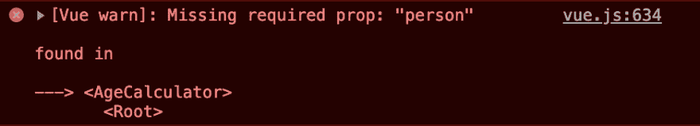

# 初学者实用 Vue.js(第 6 部分)

> 原文：<https://dev.to/marinamosti/hands-on-vuejs-for-beginners-part-6-5e7l>

让我们来谈谈计算属性。

到目前为止，您已经了解了 **Vue** 如何处理它自己的本地状态，即我们放在`data`中的状态，以及一个组件如何处理它的`prop`属性——由父组件传递下来的属性。

然而， **Vue** 中有一类属性叫做**计算属性**。今天就来看看这些。

我们今天要从头开始，这样我们就可以建立一个清晰的例子。这是代码。

```
<html>

<head>
  Vue 101
</head>

<body>
  <div id="app">
    <age-calculator></age-calculator>
  </div>

  <script src="https://cdn.jsdelivr.net/npm/vue/dist/vue.js"></script>

  <script>
    Vue.component('age-calculator', {
      template: `
        <p>
          NAME has been kicking butt for X days!
        </p>
      `
    });

    const app = new Vue({
      el: '#app'
    });
  </script>
</body>

</html> 
```

我已经为一个`age-calculator`组件添加了脚手架，现在它只输出一个带有 X 的`<p>`标签，我们将在这里执行某种计算。我也给`div#app`添加了相应的标签`<age-calculator>`。

如果你需要复习基本组件，看看这个系列的第五部分，或者更好的是，猛跌[官方文件](https://vuejs.org/v2/guide/components.html)！

# 当一个简单的道具还不够

在我们写任何代码之前，让我们来讨论一下我们想要完成什么。

我想有一个组件，我传递给它某人的年龄，它会告诉我们有多少天，他们一直在享受鳄梨。如果你不喜欢鳄梨，那么我们的关系到此为止，祝你生活愉快。

让我们来处理我们已经知道如何完成的简单任务，首先我们需要一组不同年龄的人，这样我们就可以遍历它并输出一堆组件。我们来加上相应的`data`。

```
const app = new Vue({
  el: '#app',
  data: {
    people: [
      { name: 'Mario', age: 38 },
      { name: 'Luigi', age: 38 },
      { name: 'Samus', age: 31 },
      { name: 'Link', age: 20 },
      { name: 'Marina', age: 32 },
      //Add yourself here :)
    ]
  }
}); 
```

现在，让我们设置我们的`v-loop`来为每个输出一个`age-calculator`。

```
<div id="app">
  <age-calculator v-for="person in people" :key="person.name"></age-calculator>
</div> 
```

太棒了，现在让我们允许`age-calculator`组件接收一个`person`，记住我们是用一个`prop`来完成的。首先，让我们将这个新的`prop`添加到组件中。

```
Vue.component('age-calculator', {
  props: {
    person: {
      type: Object,
      required: true
    }
  },
  template: `
    <p>
      {{ person.name }} has been kicking butt for X days!
    </p>
  `
}); 
```

**奖金！**在你了解到声明一个组件可以接收的属性之前，你设置了一个字符串数组`props: ['person']`，这在大多数情况下都没问题。但是，如果我们想要更多的控制，会发生什么呢？

你也可以像在这个例子中一样，设置`props`等于一个**对象**。在这个对象中，我们可以为每个想要声明的属性创建一个属性。

在属性声明中，在本例中是`person`，我们可以设置一些配置值。

`type`来声明我们正在传递哪(duh) **类型**的数据，所以以`Object`、`Array`、`String`、`Number`为例。

`required`是一个**布尔值**，它允许我们将该属性标记为组件工作所需的属性。

您也可以设置一个`default`值，但是我们在这里不打算使用它。

接下来看模板。我们现在将这个人的名字`{{ person.name }}`输出到`<p>`标签上。

在我们可以在浏览器中运行它之前，还有一件事。你能看出我们错过了什么吗？

我们仍然需要将实际的`person`传递给`age-calculator`组件！

进入渲染循环并传入我们的变量。

```
<age-calculator 
  v-for="person in people" 
  :person="person"
  :key="person.name"></age-calculator> 
```

继续在您的浏览器中运行这个程序，检查一切是否正常。一步一步来！

**注意**在我们继续之前，如果你想知道设置一个`prop`到**必需的**会为你做什么，试着去掉我们在把人传递给组件时做的最后一点，并在控制台部分查看你的开发工具。

[](https://res.cloudinary.com/practicaldev/image/fetch/s--KWJjm9jG--/c_limit%2Cf_auto%2Cfl_progressive%2Cq_auto%2Cw_880/https://thepracticaldev.s3.amazonaws.com/i/0uhzn5szgsbdfscmm64j.png)

很方便，不是吗？👌

# 实际计算出的属性

好了，足够的设置和审查。

我们的组件中还有一个特性需要处理，我们希望**计算**每个人已经活了多少天。

当然，这不是一个很难的计算，我们只需要乘以 365 年的数量(我们不打算在这里使用 JS 日期)。事实上，我们可以直接把它放到模板里。

```
template: `
        <p>
          {{ person.name }} has been kicking butt for {{ person.age * 365 }} days!
        </p>
      ` 
```

这在某种程度上是可行的。但是当你需要更多的逻辑时会发生什么呢？更难的`computation`，一些如果/和/或/何时/啤酒？那么你就遇到了一个真正的问题，因为你真的不能把那么多的逻辑放入模板中，否则它会很快变得难以控制。

这里是**计算属性**的亮点。计算的属性在结束函数中，它将执行一些代码，并返回一个值。这个值现在被视为一个属性，这意味着我们可以直接在模板中使用它。

让我们看看如何设置它。首先，让我们将计算好的包装器添加到组件中。

```
Vue.component('age-calculator', {
  props: {
    person: {
      type: Object,
      required: true
    }
  },
  template: `
    <p>
      {{ person.name }} has been kicking butt for {{ person.age * 365 }} days!
    </p>
  `,
  computed: {
    // Computed props go here
  }
}); 
```

到目前为止一切顺利，事实上这个结构和我们在`methods`中使用的完全一样，记得吗？(如果你认为一种方法也能解决我们的问题，那你就对了——我们一会儿再谈这个。)

让我们创建一个名为`daysAlive`的新的**计算的**属性，它需要是一个函数，并且需要返回一些东西。

```
computed: {
  daysAlive() { //Remember, computed props are functions in the end
    return this.person.age * 365
  }
} 
```

注意，就像在`methods`中一样，我们需要通过`this`访问`person`道具，只有在模板内部我们才能直接使用它！除此之外，没有什么特别的事情发生。

现在让我们在模板中使用这个新的`daysAlive`道具。

```
template: `
  <p>
    {{ person.name }} has been kicking butt for {{ daysAlive }} days!
  </p>
`, 
```

注意，我们输出的是`daysAlive` - **属性** -(啊哈时刻到了)。Vue 将计算道具视为道具——所以我们可以像使用`props`道具或`data`道具一样使用它。

事实上， **Vue** 使得如果你需要在`method`中使用这个道具，你必须通过`this.daysAlive`来访问它。整洁对吗？它实际上变成了一个道具。🤯

耶，在浏览器中运行它，享受你的精彩吧。

[](https://res.cloudinary.com/practicaldev/image/fetch/s--voSNWVXV--/c_limit%2Cf_auto%2Cfl_progressive%2Cq_auto%2Cw_880/https://thepracticaldev.s3.amazonaws.com/i/0q9lul5pzyjq6p8z03sh.jpg)

# 方法 vs 计算属性

你可能已经注意到了方法和计算属性之间的许多相似之处，我的意思是，它们在代码级别上基本上是相同的。然而，为了充分利用它们，您需要理解一个核心区别。

**计算的属性**被缓存。

这意味着，用最简单的方式来解释，在幕后 **Vue** 将“读取”你的代码，并寻找**反应依赖** - so `data`道具和`props`道具。它将**观察**这些属性，每当它们改变时， **Vue** 将重新计算你的计算属性的值。如果它们没有改变，它将使用一个缓存/存储的值。

另一方面，方法每次都运行——没有缓存，没有代码读取，没有魔法。它们只是普通的旧函数。

为什么这很重要？这些函数什么时候被调用？

每次你的组件/应用程序重新呈现时(每次组件的数据改变，或者每次它的父数据改变)， **Vue** 将判断该数据是否绑定到一个**计算的**属性，如果不是，它不会再次调用这个函数。但是对于常规方法，每次都要重新运行！

在这个例子中，我们对这几个物体做了一个非常简单的计算，坦白地说，这并不重要。但是，当您开始在一千个组件上进行一些重要的代码提升时，您将会希望利用这种缓存，否则您的应用程序将会在每个渲染周期受到影响。

如果你想了解更多，这里有一个关于[计算属性](https://vuejs.org/v2/guide/computed.html)的官方文档链接。

这是今天的完整代码。

```
<html>

<head>
  Vue 101
</head>

<body>
  <div id="app">
    <age-calculator 
      v-for="person in people" 
      :person="person"
      :key="person.name"></age-calculator>
  </div>

  <script src="https://cdn.jsdelivr.net/npm/vue/dist/vue.js"></script>

  <script>
    Vue.component('age-calculator', {
      props: {
        person: {
          type: Object,
          required: true
        }
      },
      template: `
        <p>
          {{ person.name }} has been kicking butt for {{ daysAlive }} days!
        </p>
      `,
      computed: {
        daysAlive() {
          return this.person.age * 365
        }
      }
    });

    const app = new Vue({
      el: '#app',
      data: {
        people: [
          { name: 'Mario', age: 38 },
          { name: 'Luigi', age: 38 },
          { name: 'Samus', age: 31 },
          { name: 'Link', age: 20 }
        ]
      }
    });
  </script>
</body>

</html> 
```

今天到此为止！感谢阅读，下周我们继续`watchers`！🕵️‍♀️ 👀