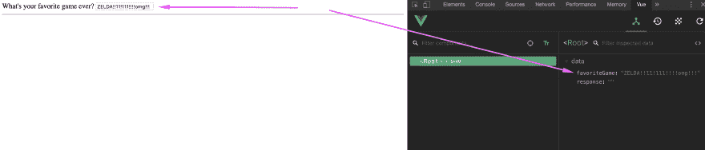

# 初学者实用 Vue.js(第 7 部分)

> 原文：<https://dev.to/marinamosti/hands-on-vuejs-for-beginners-part-7-3e1c>

我们已经接近旅程的终点，你也差不多准备好从 Vue 学徒级别毕业了。但是首先**观察者**，你必须学会。

我们今天将处理两个非常重要的概念，如上所述的**观察器**，以及表单**输入绑定**。

让我们开始吧，我们将构建一个超级简单的表单来展示这些奇妙的特性。

```
<html>

<head>
  Vue 101
</head>

<body>
  <div id="app">
    <label>What's your favorite game ever?</label>
    <input type="text" >

    <hr>

    <p>{{ response }}</p>
  </div>

  <script src="https://cdn.jsdelivr.net/npm/vue/dist/vue.js"></script>

  <script>
    const app = new Vue({
      el: '#app',
      data() {
        return {
          favoriteGame: null,
          response: ''
        }
      }
    });
  </script>
</body>

</html> 
```

让我们看看我们在这里做什么。

在我们的`<div id="app">`中，我们创建了一个标签和一个最基本的`<input>`标签。之后，我们输出一个`response`属性的结果。

在我们的 **Vue** 实例中，我们声明了一个包含两个属性`favoriteGame`和`response`的本地状态。还要注意，这次我们将`data()`用作带有`return`语法的函数，如果我们不这样做，v-model 将无法工作。

这里的想法是，我们希望首先能够将用户在`<input>`字段中输入的任何内容存储到一个变量中，这样我们就可以在以后合适的时候使用它。

在普通的 JS 甚至 jQuery 中，你可能试图用一个`$('input')`或`document.querySelector`来捕获`input`元素，但是在 **Vue** 中，我们有一个更简单的方法来完成这个平凡的任务。

介绍`v-model`。

# 虚拟模型

正如你之前所学的，所有以`v-`开头的都是 **Vue 指令**。用非常简单的话来说，`v-model`具体翻译过来就是:

* * *

## **Vue** ，我要你抓住我把这个`v-model`指令放进去的这个输入，并与它建立双向关系。我将给你一个`property`，每当我在代码中的任何地方改变这个属性，我希望你在输入端改变它，同样地，每当这个输入改变，我希望你在我的 prop 中反映这些改变。

让我们试着将它付诸实践，转到`<input>`声明，并在其中添加`v-model`指令。

```
<input type="text" v-model="favoriteGame"> 
```

现在在你的浏览器中运行这个，在你神奇的善良输入框中输入一些东西。Taaaaa...达？

好吧，尽管什么都没发生。继续打开你的 **Vue** devtools，检查`<Root>`元素的数据。是啊。进步！

[](https://res.cloudinary.com/practicaldev/image/fetch/s--DdZgRMFo--/c_limit%2Cf_auto%2Cfl_progressive%2Cq_auto%2Cw_880/https://thepracticaldev.s3.amazonaws.com/i/me1nmdwfmhv5plz1x2bg.png)

现在进入开发工具，将`favoriteGame`的值改为其他值(不要忘记用引号将它括起来，这里我们需要一个字符串)。EZ-BINDS-R-US💪

**Vue** 在如何绑定各种类型的原生 HTML 表单输入方面非常聪明，所以你真的只需要投入`v-model`炸弹和利润，但是当你开始构建自己的包装器组件并按菜单使用它时，v-model 的威力才真正显示出来。

幕后的`v-model`实际上是设置一个`v-bind:value`和一个`v-on:input`事件绑定，但是深入讨论这个有点超出范围，所以如果你有兴趣看得更远，我会给你一个链接。[部件上的 v 型](https://vuejs.org/v2/guide/components.html#Using-v-model-on-Components)

# 观察者

既然我们已经有了甜蜜的双向绑定，让我们实际上做点什么吧。

你已经知道了用 state `data` prop 你可以用`{{ favoriteGame }}`把它放到你的模板中，所以没有必要再重复一遍。你已经学会了如何在`method`和`computed`道具和`this.favoriteGame`中使用它——所以没必要重做。但是，当您想要“听”或“反应”这个属性实际上被修改时，会发生什么呢？

Computed properties 在重新计算内容和返回值方面非常出色，但是如果我们想在这个值改变时修改应用程序上的另一个状态，或者甚至触发某种异步请求，该怎么办呢？在这些特殊情况下，来拯救世界吧。

让我们添加样板文件来创建一个被监视的道具。

```
<script>
  const app = new Vue({
    el: '#app',
    data() {
      return {
        favoriteGame: null,
        response: ''
      }
    },

    // Watchers here
    watch: {
      favoriteGame(newValue, oldValue) {
        console.log('Favorite game was ' + oldValue + ' and now is ' + newValue)
      }
    }
  });
</script> 
```

观察器是在我们的实例或组件中的一个`watch`属性中定义的，我们传递给它一个对象，该对象将包含我们想要观察的每一个道具的属性。

简单来说，每个你想观察/反应的`data`道具或`props`道具都需要放在这个`watch: {}`里面，并附上它的名字。所以如果你的道具被命名为`favoriteGame`，那就是你的函数的名字。

这些函数中的每一个都有两个参数传递给它，第一个是这个道具正在获取的`newValue`，第二个是它在改变之前曾经拥有的`oldValue`。

检查`console.log`语句并刷新浏览器窗口。尝试在`<input>`中输入一些内容，然后查看您的控制台输出。每次我们的`favoriteGame`道具有任何变化，这个观察者都会被解雇。

现在让我们用它来做一些很酷的事情。记得我们的`response`道具吗？让我们根据用户的回答在其中加入一些东西，并从中获得一些乐趣。

```
watch: {
  favoriteGame(newValue, oldValue) {
    if (!newValue) return // If its an empty string, pass

    // If the new value contains the keyword metroid
    if (newValue.toLowerCase().indexOf('metroid') !== -1) {
      this.response = 'Ceres station is under attack!'
      return
    }

    // If the new value contains the word zelda
    if (newValue.toLowerCase().indexOf('zelda') !== -1) {
      this.response = 'Its dangerous to go alone, take this 🗡️'
      return
    }

    // If the OLD value was metroid, and user changed it something else
    if (
      oldValue.toLowerCase().indexOf('metroid') !== -1 &&
      newValue.toLowerCase().indexOf('metroid') === -1
    ) {
      this.response = 'GET TO DA CHOPPA NAO'
      return
    }

    // Default response
    this.response = 'Sure, why not?'
  }
} 
```

如果您不知道，`indexOf`检查字符串，如果没有匹配，则返回`-1`,否则返回我们正在搜索的字符串在被搜索的字符串中的位置。

继续玩吧，做一些新的例子，在你的浏览器里玩玩。

我希望你现在能看到被监视属性的威力，我发现它有用的方式是思考，如果我的属性改变了，我需要以编程的方式对它做出反应(通过 ajax 调用、外部函数、更新二级值等)，那么观察器通常是一个好的调用。对于其他任何东西，请使用计算属性。

```
<html>

<head>
  Vue 101
</head>

<body>
  <div id="app">
    <label>What's your favorite game ever?</label>
    <input type="text" v-model="favoriteGame">

    <hr>

    <p>{{ response }}</p>
  </div>

  <script src="https://cdn.jsdelivr.net/npm/vue/dist/vue.js"></script>

  <script>
    const app = new Vue({
      el: '#app',
      data() {
        return {
          favoriteGame: null,
          response: ''
        }
      },
      watch: {
        favoriteGame(newValue, oldValue) {
          if (!newValue) return

          if (newValue.toLowerCase().indexOf('metroid') !== -1) {
            this.response = 'Ceres station is under attack!'
            return
          }

          if (newValue.toLowerCase().indexOf('zelda') !== -1) {
            this.response = 'Its dangerous to go alone, take this 🗡️'
            return
          }

          if (
            oldValue.toLowerCase().indexOf('metroid') !== -1 &&
            newValue.toLowerCase().indexOf('metroid') === -1
          ) {
            this.response = 'Nothing is true , everything is permitted'
            return
          }

          this.response = 'Sure, why not?'
        }
      }
    });
  </script>
</body>

</html> 
```

# 结论

恭喜你走到这一步！

我保证，你现在已经拥有了在 **Vue** 中构建一个真正酷的实用应用的基本工具。然而，为了让您从这个框架中榨出每一寸汁液，仍然有许多要学习和探索的东西。

但是不要担心，我之前已经说过了，今天我袖手旁观了，我最喜欢的一个关键方面是[文档](https://vuejs.org)。

我记得当我刚开始编程时，我真的很害怕阅读文档，因为它们通常解释得很差，并且假设我对语言和我试图使用的框架/库有很高的理解水平。

令人欣慰的是，Vue docs 团队做了一项出色的工作，制作了一个完整的指南，其中包含了我们在本指南中涵盖的所有内容的示例，以及您在该框架中取得优势所需的所有其他内容。

Vue 初学者系列到此结束！

如果你想了解我的文章，请关注我的推特账号 [@marinamosti](https://twitter.com/MarinaMosti) 并查看我在[进步博客](https://www.telerik.com/blogs/author/marina-mosti)上的其他文章！

当心神奇鳄梨的力量，感谢阅读！♥