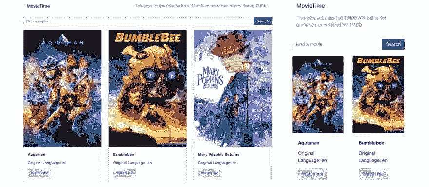

# 在 Reactstrap 中利用自举的力量

> 原文：<https://dev.to/ilonacodes/harnessing-the-power-of-bootstrap-in-react-with-reactstrap-40ma>

现在有很多用于 React 的 UI 框架，比如 Bootstrap、UIKit、语义 UI 等等。根据项目的复杂性和需求，您决定使用哪个前端框架，因为主要原因是为了简化您的开发过程。

纯 JavaScript 实现无法很好地与 React 这样的状态驱动框架一起工作，因此软件开发人员和工程师开始寻找 React 组件来满足样式需求。

我真的很喜欢使用 [Bootstrap](https://getbootstrap.com/) 工作，它通常帮助我在用户界面中放入漂亮且一致的元素。此外，它由 CSS、JS 和作为 npm 包分发的静态资产组成。

然而，早先当我在 Bootstrap 项目中工作时，我发现为每个 DOM 元素使用一堆类来使设计变得花哨和有响应性会有点混乱。

事实上，它促使我改用 CSS flexbox 布局来润色 UI，在应用程序元素之间对齐和分配空间。

直到我尝试了 [Reactstrap](https://reactstrap.github.io/) 。

它使用非常简单，支持 Bootstrap 4 并且维护良好——只需查看它的[文档](https://reactstrap.github.io/components/alerts/)。

Reactstrap 类似于 Bootstrap，但是作为用类名标记`<div />`的自包含组件。基本上，所有必需的组件都是作为构建 UI 所需的一堆元素导入的。

在我看来，自包含组件确实比大型样式表、div soup、类名和查询挂钩有优势。

如果你需要一个按钮，你可以导入一个`<Button />`。因此，它的行为就像是开箱即用的，尽管它也可以用通用 CSS 重新设计。

为了说服您尝试 Reactstrap，我准备了一个使用 MovieTime API 的示例 web 应用程序。MovieTime 网站允许用户搜索电影，并在检索到的电影列表中阅读每部电影的电影详细信息。

我通过电影 Db API 获取的电影列表，并用 Reactstrap 进行了样式化。

该应用程序有三个主要部分:导航、搜索栏和电影列表。

```
<Container>
    {/*Navigation*/}
    <Row>
        <Col sm="12">
            {/*...*/}
        </Col>
    </Row>

    {/*Search field and button*/}
    <Row className="search">
        <Col sm="12">
            {/*...*/}
        </Col>
    </Row>

    {/*The fetched list of movies*/}
    <Row className="content">
        {/*...*/}
    </Row>
</Container> 
```

Enter fullscreen mode Exit fullscreen mode

有一个大的`<Container>`包含了所有的 app 元素。每个部件都封装在`<Row>`内。虽然只有三排。

每行至少有一个或多个`<Col>`有水平填充，用于控制它们之间的间距。`<Col>`的宽度取决于`<Col>`类，它指示行中的列数(不超过 12)。

如果你已经使用过 Bootstrap，你应该知道它的类顺序。首先，需要创建一个类名为 **"container"** 的`<div>`元素，然后用 **"row"** 类嵌套一个新的`<div>`，并在这个元素内部放置一个具有 **"col"** 类的新的`<div>`元素。

`<Container>`、`<Row>`、`<Col>`为布局组件。每个组件都有可以改变的道具来定制它的设计。

在 Reactstrap 中，网格断点基于最小宽度媒体查询(例如。col-sm-4 适用于小型、中型、大型和超大型设备，但不适用于第一个 xs 断点)。

这个系统与 Bootstrap 的网格系统非常相似。

下面是代码示例:

```
import React from 'react';
import {
    Button, Col,
    Container,
    Input,
    InputGroup,
    InputGroupAddon,
    Nav,
    Navbar,
    NavbarBrand,
    NavItem,
    NavLink,
    Row
} from "reactstrap";
import {Movie} from "./Movie";

class Dashboard extends React.Component {
    constructor(props) {
         // ...
    }

    render() {
        return (
            <Container>
                {/*Navigation*/}
                <Row>
                    <Col sm="12">
                        <Navbar color="light" light expand="md">
                            <NavbarBrand href="/">MovieTime</NavbarBrand>
                            <Nav className="ml-auto" navbar>
                                <NavItem>
                                    <NavLink href="https://www.themoviedb.org">
                                        This product uses the TMDb API but is
                                        not endorsed or certified by TMDb
                                    </NavLink>
                                </NavItem>
                            </Nav>
                        </Navbar>
                    </Col>
                </Row>

                {/*Search field and button*/}
                <Row className="search">
                    <Col sm="12">
                        <InputGroup>
                            <Input placeholder="Find a movie"/>
                            <InputGroupAddon addonType="prepend">
                                <Button color="success" 
                                        className="search-button">
                                    Search
                                </Button>
                            </InputGroupAddon>
                        </InputGroup>
                    </Col>
                </Row>

                {/*The fetched list of movies*/}
                <Row className="content">
                    {
                        this.state.movies.map(movie =>
                            <Col xs="6" sm="4" 
                                 key={movie.id}
                                 className="movie">
                                <Movie movie={movie} />
                            </Col>
                        )
                    }
                </Row>
            </Container>
        );
    }
};

export default Dashboard; 
```

Enter fullscreen mode Exit fullscreen mode

正如您所注意到的，所有必需的类包装组件都是从**‘reacts trap’**包中导入的。此外，还需要安装 Bootstrap 库，并将相应的链接导入到“create-react-app”的 index.js 文件中点击阅读更多关于如何开始[的细节。](https://reactstrap.github.io/)

桌面和移动视图的结果:

[](https://res.cloudinary.com/practicaldev/image/fetch/s--Nv1pRest--/c_limit%2Cf_auto%2Cfl_progressive%2Cq_auto%2Cw_880/https://thepracticaldev.s3.amazonaws.com/i/sx7wawr83fwnst2mj4jf.png)

就是这样。**感谢您的阅读！**

你想试试 Reactstrap 吗，如果不想为什么？
你对 JavaScript/React 的哪个领域感兴趣？
留下评论或[发推文](https://twitter.com/@ilonacodes)让我知道，这样我就可以写下一篇了。

或者你可能想将你的专业扩展到 fullstack，然后在我的 [YouTube 频道](https://www.youtube.com/watch?v=kI1luxh-Hyg&list=PL3VhbJS_wXnEmeY4T6urz_fy_U03S9fqr)上查看**“frontend 2 full stack”**视频系列。

祝你周末愉快，尽你所能！