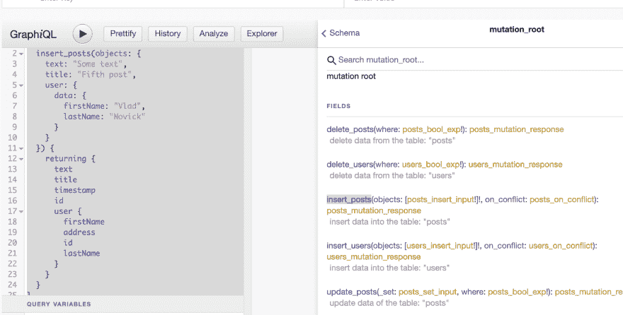
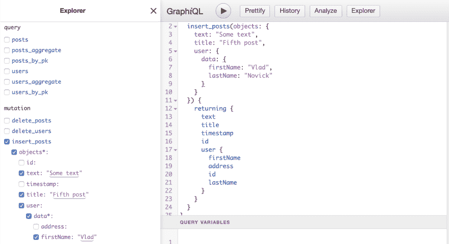

# 作为控制台的一部分或独立的 Hasura Explorer 功能

> 原文：<https://dev.to/hasurahq/hasura-explorer-feature-as-part-of-the-console-or-stand-alone-14ie>

如果你一直在使用 Hasura，你可能已经看到 Hasura 以特定的方式自动生成 GraphQL API。它给了你一堆帮助输入类型，你可以用来排序，比较，等等。有时候写下面的变化可能是一个文档查找和尝试的过程。这就是为什么我们集成了一个由 [OneGraph](https://www.onegraph.com/) 的优秀人员构建的浏览器，它将简化您的查询/突变/订阅编写。你可以查看 OneGraph 浏览器[这里](https://github.com/OneGraph/graphiql-explorer)

那么它是做什么的。

考虑下面的突变

```
mutation {
  insert_posts(objects: {
    text: "Some text", 
    title: "Fifth post", 
    user: {
      data: {
        firstName: "Vlad", 
        lastName: "Novick"
      }
    }
  }) {
    returning {
      text
      title
      timestamp
      id
      user {
        firstName
        address
        id
        lastName
      }
    }
  }
} 
```

Enter fullscreen mode Exit fullscreen mode

如果您是 Hasura 控制台的新手，尤其是如果您不熟悉这个特定的 GraphQL 模式，那么编写这样的代码将意味着在 docs:

[](https://res.cloudinary.com/practicaldev/image/fetch/s--f2NGy12g--/c_limit%2Cf_auto%2Cfl_progressive%2Cq_auto%2Cw_880/https://thepracticaldev.s3.amazonaws.com/i/31inr6emgztovaqo2zjf.png)

取而代之的是 Hasura 的一个新特性，现在叫做 Explorer。

当你点击浏览器按钮时，你会看到下面的侧边栏，你可以很容易地选择你想要查询/订阅或变异的复选框，查询/变异/订阅将自动为你编写

[](https://res.cloudinary.com/practicaldev/image/fetch/s--yA45PcMa--/c_limit%2Cf_auto%2Cfl_progressive%2Cq_auto%2Cw_880/https://thepracticaldev.s3.amazonaws.com/i/t9gyvbxvu5v5svqo5d8c.png)

重要的是要注意，这个浏览器尊重 Hasura 访问控制规则，如果用户不被允许查看部分数据，他/她将无法看到资源管理器中的字段。

我们在 Hasura 也意识到这个工具通常对生态系统有益，所以我们也将它作为一个工具开源，这样你就可以使用 Explorer 特性，甚至可以用于你自己的定制 GraphQL 服务器，包括为你的 GraphQL 端点传递你的定制头。你可以在 [github](https://github.com/hasura/graphql-engine/tree/master/community/tools/graphiql-online) 上找到它

或者查一下它的网络版，这里有:
[https://graphiql-online.com](https://graphiql-online.com)

该工具还支持可以发送到 GraphQL 端点的自定义头，因此也可以轻松地探索使用授权头的 graphql 端点。

享受吧。