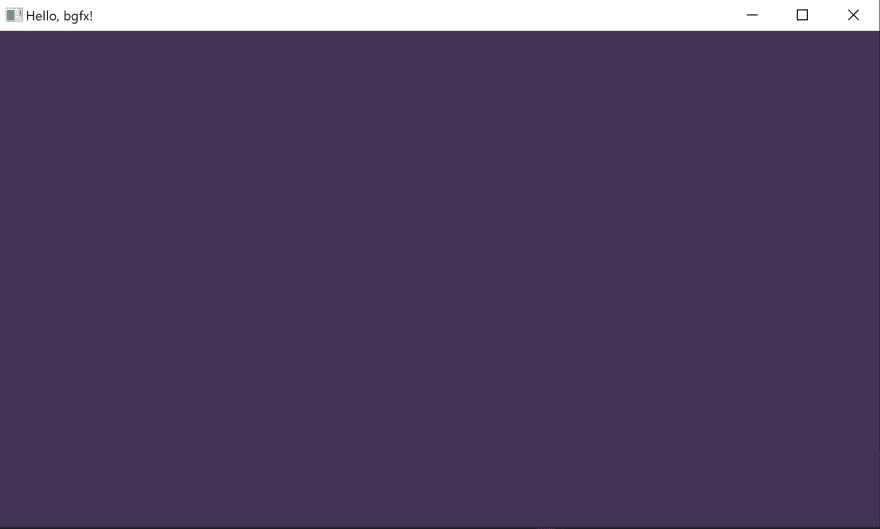
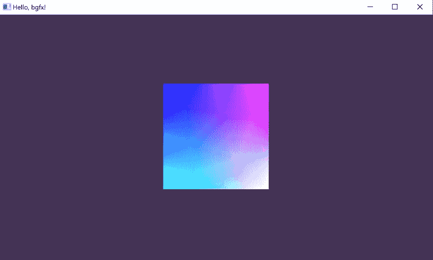
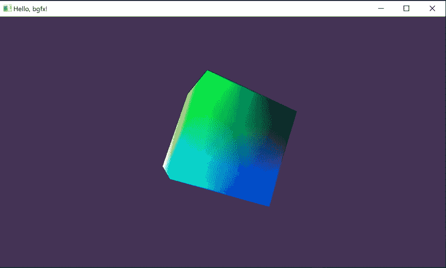

# 你好，bgfx！

> 原文：<https://dev.to/pperon/hello-bgfx-4dka>

Bgfx 是一个渲染库，支持跨 11 个平台的 Direct3D、Metal 和 OpenGL 变体。它很容易构建，并且有许多例子可以帮助您沉浸在细节中。理解 bgfx 和示例代码之间的分界线相对容易，但花费的时间比我想象的要多。如果您对如何在自己的项目中使用 bgfx 的快速示例感兴趣，请继续阅读。

我假设你以前有一些图形编程经验，并且你已经遵循了这里的构建指令。我将借用 *example-01-cubes* 项目，所以如果你想继续的话，请确保使用 **- with-examples** 选项来构建。

您将在一个名为 *winXX_vs20XX* 的文件夹中找到调试和发布库。构建目录(确保链接 bgfx*。lib，bimg*。lib 和 bx*。lib)。为了测试是否一切正常，调用 [bgfx::init](https://bkaradzic.github.io/bgfx/bgfx.html#_CPPv2N4bgfx4initERK4Init) 函数。

```
#include "bgfx/bgfx.h"

int main(void)
{
    bgfx::init();
    return 0;
} 
```

有了所有这些，您应该能够正确地初始化系统。

我们需要一个窗口来渲染。我用 [GLFW](https://www.glfw.org/docs/latest/quick_guide.html) 但是 [SDL](http://wiki.libsdl.org/Introduction) 或者其他什么都可以。

```
#include "bgfx/bgfx.h"
#include "GLFW/glfw3.h"

#define WNDW_WIDTH 1600
#define WNDW_HEIGHT 900

int main(void)
{
    glfwInit();
    GLFWwindow* window = glfwCreateWindow(WNDW_WIDTH, WNDW_HEIGHT, "Hello, bgfx!", NULL, NULL);
    bgfx::init();
    return 0;
} 
```

现在我们必须确保 bgfx 有一个本机窗口的句柄。这是通过 [bgfx::PlatformData](https://bkaradzic.github.io/bgfx/bgfx.html#_CPPv2N4bgfx12PlatformDataE) 结构和‘nwh’成员完成的。如果您使用的是 GLFW，请确保定义了 GLFW_EXPOSE_NATIVE_WIN32 并包含了 glfw3native 头。现在也是正确定义一个 [bgfx::Init](https://bkaradzic.github.io/bgfx/bgfx.html#_CPPv2N4bgfx4InitE) 对象的好时机。

```
...
#define GLFW_EXPOSE_NATIVE_WIN32
#include "GLFW/glfw3native.h"
...
    bgfx::PlatformData pd;
    pd.nwh = glfwGetWin32Window(window);
    bgfx::setPlatformData(pd);

    bgfx::Init bgfxInit;
    bgfxInit.type = bgfx::RendererType::Count; // Automatically choose a renderer.
    bgfxInit.resolution.width = WNDW_WIDTH;
    bgfxInit.resolution.height = WNDW_HEIGHT;
    bgfxInit.resolution.reset = BGFX_RESET_VSYNC;
    bgfx::init(bgfxInit);
... 
```

我们来渲染一下。我们将设置视图清除标志并创建一个简单的渲染循环。

```
...
    bgfx::setViewClear(0, BGFX_CLEAR_COLOR | BGFX_CLEAR_DEPTH, 0x443355FF, 1.0f, 0);
    bgfx::setViewRect(0, 0, 0, WNDW_WIDTH, WNDW_HEIGHT);

    unsigned int counter = 0;
    while(true) {   
        bgfx::frame();
        counter++;
    }
... 
```

您应该会看到一个紫色背景的窗口。沉浸在美妙之中。
[](https://res.cloudinary.com/practicaldev/image/fetch/s--zjHpR7Ys--/c_limit%2Cf_auto%2Cfl_progressive%2Cq_auto%2Cw_880/https://thepracticaldev.s3.amazonaws.com/i/1cpsv5px4dd3zkom1xub.jpg) 
此时，我们准备进行一些更有趣的事情。我们将从一个示例文件中窃取一个立方体网格。

```
struct PosColorVertex
{
    float x;
    float y;
    float z;
    uint32_t abgr;
};

static PosColorVertex cubeVertices[] =
{
    {-1.0f,  1.0f,  1.0f, 0xff000000 },
    { 1.0f,  1.0f,  1.0f, 0xff0000ff },
    {-1.0f, -1.0f,  1.0f, 0xff00ff00 },
    { 1.0f, -1.0f,  1.0f, 0xff00ffff },
    {-1.0f,  1.0f, -1.0f, 0xffff0000 },
    { 1.0f,  1.0f, -1.0f, 0xffff00ff },
    {-1.0f, -1.0f, -1.0f, 0xffffff00 },
    { 1.0f, -1.0f, -1.0f, 0xffffffff },
};

static const uint16_t cubeTriList[] =
{
    0, 1, 2,
    1, 3, 2,
    4, 6, 5,
    5, 6, 7,
    0, 2, 4,
    4, 2, 6,
    1, 5, 3,
    5, 7, 3,
    0, 4, 1,
    4, 5, 1,
    2, 3, 6,
    6, 3, 7,
}; 
```

现在我们需要根据顶点声明来描述网格， [bgfx::VertexDecl](https://bkaradzic.github.io/bgfx/bgfx.html#_CPPv2N4bgfx10VertexDeclE) 。

```
...
    bgfx::setViewRect(0, 0, 0, WNDW_WIDTH, WNDW_HEIGHT);

    bgfx::VertexDecl pcvDecl;
    pcvDecl.begin()
        .add(bgfx::Attrib::Position, 3, bgfx::AttribType::Float)
        .add(bgfx::Attrib::Color0, 4, bgfx::AttribType::Uint8, true)
    .end();
    bgfx::VertexBufferHandle vbh = bgfx::createVertexBuffer(bgfx::makeRef(cubeVertices, sizeof(cubeVertices)), pcvDecl);
    bgfx::IndexBufferHandle ibh = bgfx::createIndexBuffer(bgfx::makeRef(cubeTriList, sizeof(cubeTriList)));

    unsigned int counter = 0;
... 
```

我们快到了。我们只需要加载一个 bgfx 着色器，我们将从 examples/runtime/shaders 目录中的示例文件中借用它。为此，我们需要在将着色器文件内容传递给 [bgfx::createShader](https://bkaradzic.github.io/bgfx/bgfx.html#_CPPv2N4bgfx12createShaderEPK6Memory) 之前，在 [bgfx::Memory](https://bkaradzic.github.io/bgfx/bgfx.html#_CPPv2N4bgfx6MemoryE) 对象中加载着色器文件内容。

```
bgfx::ShaderHandle loadShader(const char *FILENAME)
{
    const char* shaderPath = "???";

    switch(bgfx::getRendererType()) {
        case bgfx::RendererType::Noop:
        case bgfx::RendererType::Direct3D9:  shaderPath = "shaders/dx9/";   break;
        case bgfx::RendererType::Direct3D11:
        case bgfx::RendererType::Direct3D12: shaderPath = "shaders/dx11/";  break;
        case bgfx::RendererType::Gnm:        shaderPath = "shaders/pssl/";  break;
        case bgfx::RendererType::Metal:      shaderPath = "shaders/metal/"; break;
        case bgfx::RendererType::OpenGL:     shaderPath = "shaders/glsl/";  break;
        case bgfx::RendererType::OpenGLES:   shaderPath = "shaders/essl/";  break;
        case bgfx::RendererType::Vulkan:     shaderPath = "shaders/spirv/"; break;
    }

    size_t shaderLen = strlen(shaderPath);
    size_t fileLen = strlen(FILENAME);
    char *filePath = (char *)malloc(shaderLen + fileLen);
    memcpy(filePath, shaderPath, shaderLen);
    memcpy(&filePath[shaderLen], FILENAME, fileLen);

    FILE *file = fopen(FILENAME, "rb");
    fseek(file, 0, SEEK_END);
    long fileSize = ftell(file);
    fseek(file, 0, SEEK_SET);

    const bgfx::Memory *mem = bgfx::alloc(fileSize + 1);
    fread(mem->data, 1, fileSize, file);
    mem->data[mem->size - 1] = '\0';
    fclose(file);

    return bgfx::createShader(mem);
} 
```

现在我们可以创建一个着色器程序并完成立方体的渲染。bx 库有矩阵助手方法或者使用你自己的方法。无论哪种方式，构建投影矩阵和设置视图转换应该看起来很熟悉。在推进下一帧之前，不要忘记设置顶点和索引缓冲区，并提交我们刚刚创建的程序。

```
...
    bgfx::ShaderHandle vsh = loadShader("vs_cubes.bin");
    bgfx::ShaderHandle fsh = loadShader("fs_cubes.bin");
    bgfx::ProgramHandle program = bgfx::createProgram(vsh, fsh, true);

    unsigned int counter = 0;
    while(true) {
        const bx::Vec3 at = {0.0f, 0.0f,  0.0f};
        const bx::Vec3 eye = {0.0f, 0.0f, -5.0f};
        float view[16];
        bx::mtxLookAt(view, eye, at);
        float proj[16];
        bx::mtxProj(proj, 60.0f, float(WNDW_WIDTH) / float(WNDW_HEIGHT), 0.1f, 100.0f, bgfx::getCaps()->homogeneousDepth);
        bgfx::setViewTransform(0, view, proj);

        bgfx::setVertexBuffer(0, vbh);
        bgfx::setIndexBuffer(ibh);

        bgfx::submit(0, program);
        bgfx::frame();
        counter++;
    }
... 
```

[](https://res.cloudinary.com/practicaldev/image/fetch/s--Mwi9daPn--/c_limit%2Cf_auto%2Cfl_progressive%2Cq_auto%2Cw_880/https://thepracticaldev.s3.amazonaws.com/i/ojjwm29ruie7pw76qwin.jpg) 
看哪！一个立方体。让它动起来。

```
...
    bgfx::setViewTransform(0, view, proj);
    float mtx[16];
    bx::mtxRotateXY(mtx, counter * 0.01f, counter * 0.01f);
    bgfx::setTransform(mtx);        

    bgfx::submit(0, program);
... 
```

我们完事了。
[](https://res.cloudinary.com/practicaldev/image/fetch/s--2hcb8MVD--/c_limit%2Cf_auto%2Cfl_progressive%2Cq_auto%2Cw_880/https://thepracticaldev.s3.amazonaws.com/i/l21ynxn1wzlhi5d9nhs9.jpg) 
你可以在这里查看完成的例子[。请注意，我保留了错误处理和回调，以更好地突出 bgfx 的使用方式。希望这能让你对事物如何工作有一个基本的概念，并使你能够掌握更高级的技术。请务必花些时间浏览](https://gist.github.com/pperon/5df815df55d6c39db004f46f6cb9837b)[示例代码](https://bkaradzic.github.io/bgfx/examples.html)和 [API 文档](https://bkaradzic.github.io/bgfx/index.html)。祝好运，快乐渲染！

【T10】欢呼[欢呼！](https://twitter.com/bkaradzic)