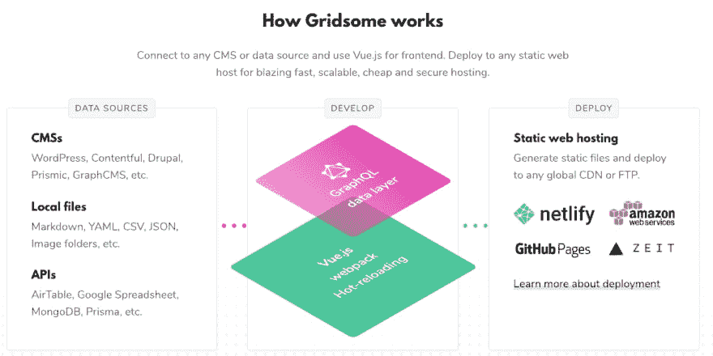

# 你好，格里德索姆！

> 原文：<https://dev.to/therealdanvega/hello-gridsome-2boo>

我想告诉你我的一个新的副业。我想我应该借此机会告诉你创建这个网站的动机和支持它的技术。

*TLDR；我想把我的[博客](https://www.therealdanvega.com)从 WordPress 转移到 Gridsome。*

## 写博客

在写这篇文章的时候，我翻了翻我的档案，发现我的第一篇博文写于 2005 年 10 月 7 日。这意味着我将在今年晚些时候庆祝我写博客 14 周年，一方面这很令人惊讶，另一方面这让我觉得自己真的老了。

### 我为什么开始写博客

我开始写博客是因为我认为这是一个了解开源软件如何工作的好机会。当时我是 ColdFusion 的开发人员， [BlogCFC](https://github.com/teamcfadvance/BlogCFC5) 是由 [Raymond Camden](https://www.raymondcamden.com/) 编写的一个流行的开源博客平台。通过观察其他人如何编写代码和构建项目，我学到了很多东西，我将永远感谢这种经历。

我开始写博客的另一个原因是加入社区。有很多真正伟大的开发人员经常在博客上谈论他们的工作，我非常尊敬他们。我想成为酷孩子中的一员，告诉别人我在做什么。

最后，我认为这是一个帮助别人的好机会。在早期，我经常发现自己在项目中挣扎，心想一定有人和我经历了同样的问题。这对我来说是一个很好的机会，我可以把我学到的东西与其他开发人员分享，这样他们就不会犯和我一样的错误。

### 移动到 WordPress

2014 年，我决定将我的博客转移到 WordPress。我已经有一段时间没有使用 ColdFusion 了，我只是不想再维护它了。我也认为这是一个让博客焕然一新的好机会。向 WordPress 的迁移相当顺利，这部分归功于开源。有一些迁移脚本帮助我完成了这个过程。

虽然 WordPress 平台这些年来为我提供了很好的服务，但我也遇到了一些问题。首先，我最初在数字海洋水滴上运行这个网站，每月 5 美元，这很棒，因为当时它并没有产生任何收入。

我很快发现 WordPress 在这个计划上表现不好，因为它是一个巨大的资源猪。它会经常宕机，需要我登录并重启服务器。升级到每月 20 美元的计划后，很多问题都消失了。

还有一个问题是我必须管理一台服务器。我不是服务器管理员，真的不喜欢随之而来的一切。我最终非常幸运地找到了一个人来管理服务器。他的名字是贾斯汀，他能够修复我的服务器时，当它关闭，并确保服务器是最新的安全补丁。他经营一家名为 [Big Scoots](https://bigscoots.com/) 的托管公司，现在我的网站就托管在这里。如果你想找一个 WordPress 主机，我怎么推荐他或他的公司都不为过。自从搬到那里后，我没有遇到任何问题。

我对 WordPress 的另一个主要问题是，我不是 PHP 开发人员，也不想成为。我已经能够进入那里，摆弄布局和模板，但这是我所能做到的。我也没有安装本地 WordPress，所以主题更新对我来说并不容易。

虽然我有一些问题，但我确实认为 WordPress 是一个了不起的产品。它不再适合我了。

### 新方案需求

现在你知道了我的故事和我去过的地方，我们可以谈谈我在寻找什么了。我已经成为了代表**J**avaScript+**A**PI+**M**arkup 的 **JAMStack** 的超级粉丝。这背后的想法非常简单，提供一个静态站点来提供你所能提供的一切，然后通过一个 API 来提供你的站点所需要的任何数据或功能。这是对过去传统的服务器端单一应用程序的一个巨大转变，我对此非常兴奋。

像 [Gatsby](https://www.gatsbyjs.org/) 这样的静态站点生成器(SSG)已经变得非常流行，它们有自己的优势。首先，我们开始为我们的用户提供一个静态网站，这意味着它会非常快。我的访问者来我的网站是为了检查内容，而不是一些加载栏。另一个很大的优势是我们在托管静态站点时有多种选择。如果你想把它放在像[亚马逊网络服务(AWS)](https://aws.amazon.com/free/free-tier/) 这样的平台上，它会非常便宜。在 [Netlify](https://www.netlify.com/) 附近还有一个我最喜欢的服务，就是针对个人项目的**免费**。

这种方法的另一个优点是我不依赖于某种服务器端语言。我开始用老式的 HTML/CSS/JavaScript 构建我的布局和视图。我正在寻找的另一个功能是能够在 Markdown 中写我所有的博客文章。我为工作和我的个人项目写了大量的文档，所以用这种格式写已经很舒服了。

建设这个新网站时，我有很多选择。我迫不及待地想告诉你我的发现，但是现在，我只想谈谈我最后使用的那个。

## 网格体

我早些时候提到了盖茨比，虽然这对我来说绝对是一个可能的解决方案，但我想要一些基于 Vue 的东西。我真的很喜欢 Vue、生态系统和社区，所以我想要一个能让我留在那里的解决方案。环顾四周，创建了几个项目后，我决定选择 Gridsome。

### 什么是网格体

Gridsome 是一个静态的站点生成器，类似于 Gatsby(虽然还很新，所以功能不丰富)的 [Vue](https://vuejs.org/) 框架。Gridsome 有很多特性，但这里只是其中的几个。对我来说，这意味着我可以编写 Vue 应用程序，然后生成一个静态网站。现在我知道你在想什么，Vue 可以自己做到这一点，你是对的。再来看看 Gridsome 的几个特性。

### grid some 如何工作

如果你只是想要一个简单的静态站点，你并不需要 Gridsome 这样的东西。Gridsome 真正出彩地方是它能够使用多个数据源并将它们组合到一个 GraphQL 数据层中。这意味着你可以像 Markdown 一样处理本地文件，也可以像 WordPress、Contentful 等无头 CMS。如果你是 GraphQL 的新手，不要担心，我也是，它很容易上手。

[](https://res.cloudinary.com/practicaldev/image/fetch/s--epXfMsJK--/c_limit%2Cf_auto%2Cfl_progressive%2Cq_auto%2Cw_880/https://s3.amazonaws.com/danvega-me/how-gridsome-works.png)

### 降价销售

正如我提到的，其中一个数据源是 Markdown，这让我非常高兴，因为我可以在一个熟悉的环境中开始写作。我将在另一篇文章中详细介绍这一点，但快速的版本是，这真的很容易设置。你开始用一些配置来使用插件`@gridsome/source-filesystem`

```
module.exports = {
  plugins: [
    {
      use: '@gridsome/source-filesystem',
      options: {
        path: 'blog/**/*.md',
        typeName: 'Post',
        route: '/blog/:slug',
        resolveAbsolutePaths: true,
        remark: {
          autolinkClassName: 'fas fa-hashtag',
          externalLinksTarget: '_blank',
          externalLinksRel: ['nofollow', 'noopener', 'noreferrer'],
          plugins: [
            [ 'gridsome-plugin-remark-shiki', { theme: 'nord' } ]
          ]
        }
      }
    }
  ]

} 
```

在这个插件中，你可以配置一些选项，比如路径和处理类型的组件。我还使用了[Gridsome Transformer Remark](https://www.npmjs.com/package/@gridsome/transformer-remark)插件，它是 grid some 的 Markdown transformer。[备注](https://github.com/remarkjs/remark)可以包括许多选项和插件本身，其中之一是一个名为 [shiki](https://github.com/EldoranDev/gridsome-plugin-remark-shiki) 的语法高亮器，它格式化了上面的代码。

### Gridsome 牛逼

这只是 Gridsome 所能做的事情的开始。我有很多东西要分享，所以我希望你能注册我的时事通讯或者在 Twitter 上关注我，了解你在 Gridsome 和 Vue 中可以做的所有很酷的事情。

## 我应该移动我现有的网站吗？

现在真正的问题比简单的是或不是要困难得多。我应该把我现有的网站移到 Gridsome 吗？我真的很高兴这个网站和我为它添加新内容的工作流程。

移动我的近 1000 篇博客文章说起来容易做起来难。一个问题是，我是不是应该删除所有我认为没什么分量的帖子？这可以大大简化迁移过程。这些是我在做决定前必须考虑的一些问题。

*   现有的网址必须保持相同的格式/月/日/年/段塞
*   我有很多图片，也许应该把它们移到 S3 之类的地方
*   我在帖子上有照片库，该怎么办。
*   我需要确保现有的代码块与这个新的语法高亮工作。
*   我应该使用 [Disqus](https://disqus.com/) 评论(免费还是付费)还是用 Firebase 推出我自己的评论？
*   我想在帖子中显示推文。
*   当我在社交媒体上分享帖子时，会有一些元标签来定制显示。
*   SSL:我需要确保整个网站运行在 https 上。

## 结论

我还有一些事情要考虑，但我很想听听你对此的想法。如果你已经从 WordPress 迁移到 Gridsome，我真的很想听听这个过程对你来说是什么样的。如果你有兴趣听听我是如何决定使用 Gridsome 或者我是如何创建这个网站的，请继续关注！同时，你可以在这里查看这个网站的源代码。

编码快乐！
丹

*这篇文章最初是在 https://www.danvega.dev/blog 的[发表在我的博客上的。如果你觉得这篇文章有趣，请考虑](https://www.danvega.dev/blog)[订阅我的时事通讯](https://www.danvega.dev/signup/)或者在 [Twitter](http://twitter.com/therealdanvega) 上关注我。*