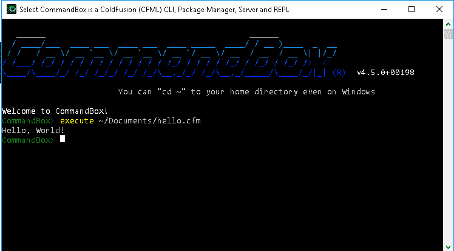

# Coldfusion 中的 Hello World

> 原文：<https://dev.to/mikeborn/hello-world-in-coldfusion-39ck>

既然你已经读过我的[为什么选择 Coldfusion？](https://dev.to/mikeborn/why-cf-3jal)帖子(你有吧？)，让我们做一个简单的 Hello World 只是为了尝试一些样本 CF 代码。

## 安装命令框

安装 Coldfusion 就像下载 [Commandbox](https://www.ortussolutions.com/products/commandbox#download) 并放到一个文件夹中一样简单。在 Linux 上，你会想把它放在你的`$PATH`——也许是`/usr/bin`——的某个文件夹中。否则(Windows 或 Mac)只需把它放到一个文件夹中，然后把可执行文件拖到任务栏上，给自己一个漂亮的快速启动图标。

## 你好世界

让我们做一个快速的 Hello World，这样我们就知道我们面对的是什么了。

1.  创建一个`hello.cfm`文件。某处。(*任何地方！*
2.  编辑那个`hello.cfm`。
3.  键入以下代码:

```
<cfscript>
    writeOutput( 'Hello, World!' );
</cfscript> 
```

好了，这就是现代 Coldfusion 标记(`.cfm`)文件的要点。这个文件做两件事:

1.  使用`<cfscript></cfscript>`表示 Coldfusion 脚本语法

这只是 CF 版的 PHP 的`<?php ... ?>`分隔符。现在，有了一个完全支持的、完全有能力的标记语法，但是除了模板之外，我更喜欢脚本语法。我认为总的来说，现代 CF 应用程序最好使用 CFscript 语法——但这只是我的看法。哦，你只需要在`.cfm`文件中使用这个`<cfscript>`标签——组件中的任何东西(`.cfc`文件)都可以直接进入脚本语法。

1.  使用`writeOutput()`函数将字符串值打印到缓冲区

希望这很简单——我们将输出写入缓冲区。在本例中，我们将使用 CommandBox 来运行该文件，因此输出将内联返回到 CommandBox CLI。

## 在 CommandBox 中执行 CFM 文件

下面是我们如何使用 CommandBox 运行我们的`hello.cfm`文件。首先，您需要通过点击启动器或在 Mac/Linux 终端中键入`box`来启动 Commandbox。一旦进入 CommandBox，我们将使用`execute`命令运行脚本并返回输出:

```
execute hello.cfm 
```

嘣！试用 Coldfusion*就是这么简单。不需要编译，不需要构建，也不需要下载成百上千的依赖项——只需运行脚本。

如果你想看那到底是什么样子，给你。

[](https://res.cloudinary.com/practicaldev/image/fetch/s--3y4cKI9p--/c_limit%2Cf_auto%2Cfl_progressive%2Cq_auto%2Cw_880/https://thepracticaldev.s3.amazonaws.com/i/2zm6zixvxryjkxn9rai6.png)

**请注意，这不是一种生产就绪的格式——为此，您需要运行`server start engine=lucee@5.2`来安装和启动开源 Lucee 服务器。如果你也想看这方面的教程，请告诉我——我很乐意帮助你开始！*