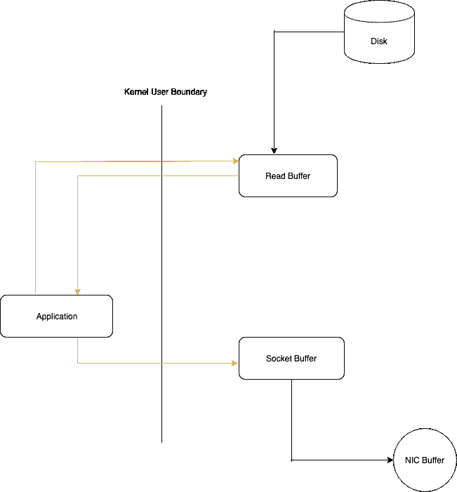
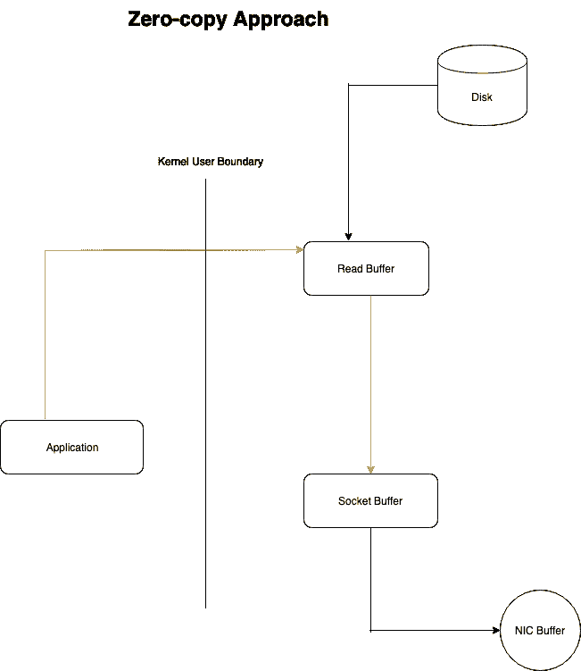

# 这里是什么让阿帕奇卡夫卡如此之快:卡夫卡系列-第 3 部分

> 原文：<https://dev.to/ganeshmani/here-s-what-makes-apache-kafka-so-fast-kafka-series-part-3-17g>

这是卡夫卡系列的第三部分。阅读以前的博客文章。

[博客系列卡夫卡-第一部分](https://cloudnweb.dev/2019/04/how-apache-kafka-works-kafka-getting-started-part-1/)

[卡夫卡系列——第二部](https://cloudnweb.dev/2019/04/kafka-getting-started-kafka-series-part-2/)

Kafka 是一个分布式流平台，支持高吞吐量、高度分布式、容错和低延迟的消息传递。

### 低延迟 IO:

在这里，我们将看到卡夫卡如何实现低延迟的消息传递

在消息传递中实现低延迟的旧的传统方法之一是通过随机存取存储器(RAM)。虽然这种方法使它们更快，但 RAM 的成本比磁盘高得多。当您拥有数百 GB 的数据时，这样一个系统的运行成本通常会更高。

Kafka 依靠磁盘进行存储和缓存。但问题是，磁盘比 RAM 慢。

它通过顺序 IO 实现了作为随机存取存储器(RAM)的低延迟。

### 什么是顺序 IO？

这里有一个很好的类比，它以更简单的方式解释了顺序 IO

[了解顺序 IO](https://flashdba.com/2013/04/15/understanding-io-random-vs-sequential/)

### 让我们来理解是什么让卡夫卡如此之快

#### 零拷贝本金。

根据维基百科，

***零拷贝**描述的是 [CPU](https://en.wikipedia.org/wiki/Central_processing_unit) 不执行将数据从一个[内存](https://en.wikipedia.org/wiki/RAM)区拷贝到另一个的计算机操作。当通过网络传输文件时，这通常用于节省 CPU 周期和内存带宽。[【1】](https://en.wikipedia.org/wiki/Zero-copy#cite_note-lj-zerocopy-1)*

令人困惑。对吗？

让我们用一个简单的例子来看看这个概念。让我们考虑一种传统的文件传输方式。当客户从静态网站请求文件时。首先，从磁盘中读取网站静态文件，并将完全相同的文件写入响应套接字。这是一个非常低效的活动，尽管看起来 CPU 在这里没有执行太多的活动。

内核从磁盘中读取数据，并将其跨内核-用户边界推给应用程序，然后应用程序将数据跨内核-用户边界推回，以写出到套接字。实际上，应用程序充当了从磁盘文件到套接字获取数据的低效中介。

<figure> 

<figcaption>传统数据复制方法</figcaption>

</figure>

每次有超出用户边界内核的数据传输，都会消耗 CPU 周期和内存带宽，导致性能下降，尤其是当数据量非常大时。这正是**零拷贝主体**要解决的问题。

Kafka 通过请求内核将数据移动到套接字，而不是通过应用程序移动数据，来利用这个**零拷贝原则**。

零拷贝大大提高了应用程序性能，减少了内核和用户模式之间的上下文切换次数。

<figure> 

<figcaption>零复制方法。
</figcaption>

</figure>

#### 还有什么？

除了上面提到的技术之外，Kafka 还使用了许多其他技术来提高系统的速度和效率:

*   批处理数据以减少网络调用，并将大量随机写入转换为顺序写入。
*   使用 [LZ4](https://en.wikipedia.org/wiki/LZ4_%28compression_algorithm%29) 、 [SNAPPY](https://en.wikipedia.org/wiki/Snappy_%28compression%29) 或 [GZIP](https://en.wikipedia.org/wiki/Gzip) 编解码器压缩批量(而非单个消息)。一个批处理中的许多消息数据是一致的(例如，消息字段和元数据信息)。这可以带来更好的压缩比。

想更多地了解卡夫卡，

[卡夫卡系列——第一部](https://cloudnweb.dev/2019/04/how-apache-kafka-works-kafka-getting-started-part-1/)

[卡夫卡系列——第二部](https://cloudnweb.dev/2019/04/kafka-getting-started-kafka-series-part-2/)