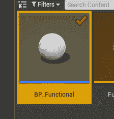
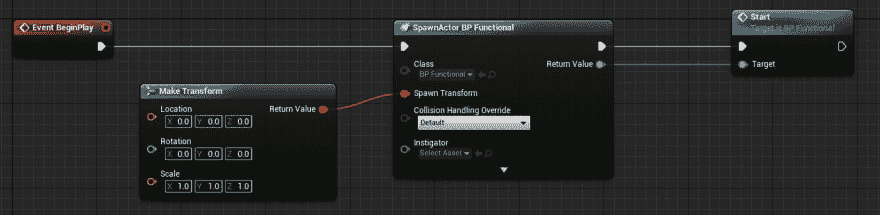
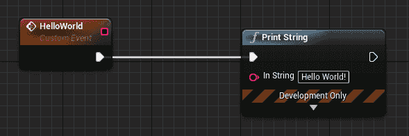
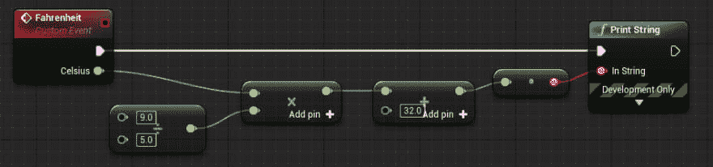
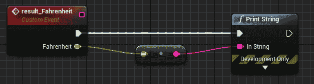
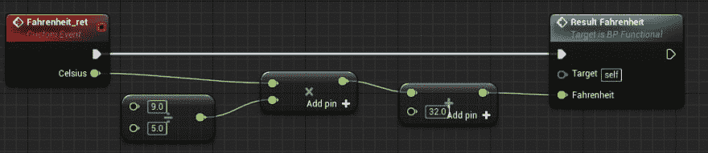
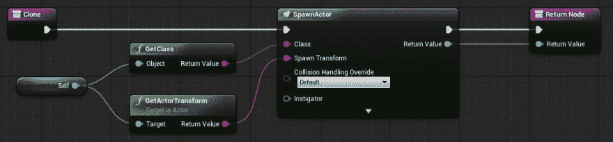
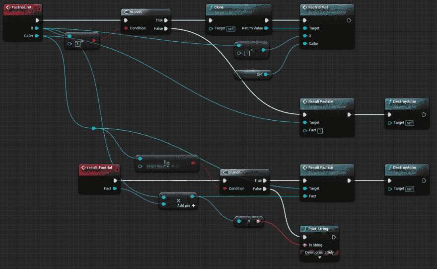
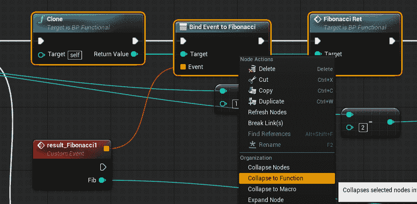
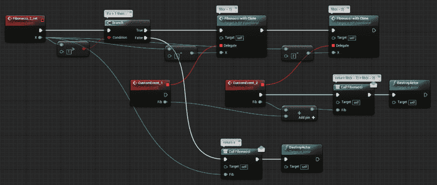

# 高阶蓝图

> 原文：<https://dev.to/torus/higher-order-blueprint-22oi>

在本文中，我们将看到如何在虚幻引擎 4 上使用 Blueprint 进行高阶/函数式编程。

## 演员作为环境

创建新的演员蓝图。

[](https://res.cloudinary.com/practicaldev/image/fetch/s--rHAjJo-U--/c_limit%2Cf_auto%2Cfl_progressive%2Cq_auto%2Cw_880/https://thepracticaldev.s3.amazonaws.com/i/5a78990dvt65p5zdo09s.png)

打开级别蓝图，并在 BeginPlay 事件上生成 Actor 类的一个实例。

[](https://res.cloudinary.com/practicaldev/image/fetch/s--ZSjqpZXC--/c_limit%2Cf_auto%2Cfl_progressive%2Cq_auto%2Cw_880/https://thepracticaldev.s3.amazonaws.com/i/akd1qlphgmih3b9egksz.png)

您可以将 actor 的实例直接放在级别上，但是每次修改 Actor 蓝图时，级别也会不知何故地更新。这对于源代码控制来说很烦人。

## 事件为函数

我们用事件来表示功能。您也可以使用 Blueprint 函数，但是在本文中，我们将事件视为函数。

让我们创造一个你好的世界！

[](https://res.cloudinary.com/practicaldev/image/fetch/s--gkQauiRm--/c_limit%2Cf_auto%2Cfl_progressive%2Cq_auto%2Cw_880/https://thepracticaldev.s3.amazonaws.com/i/kkmdzhrbwx9bixeh1dyu.png)

另一个例子，摄氏到华氏转换器，可以是这样的:

[](https://res.cloudinary.com/practicaldev/image/fetch/s--HPuxJX3Z--/c_limit%2Cf_auto%2Cfl_progressive%2Cq_auto%2Cw_880/https://thepracticaldev.s3.amazonaws.com/i/jrn99d6en2jb6dty24r2.png)

## 用另一个事件返回值

如上所述，事件可以像函数一样运行。但与函数不同，事件不能返回值。

为了将一些值从函数传递给调用者，让我们创建另一个事件来接收函数的结果。

[](https://res.cloudinary.com/practicaldev/image/fetch/s--ML9MwOps--/c_limit%2Cf_auto%2Cfl_progressive%2Cq_auto%2Cw_880/https://thepracticaldev.s3.amazonaws.com/i/6q2zv9etqdmjilypugdg.png)

然后，带有返回值的摄氏到华氏转换器可以如下所示:

[](https://res.cloudinary.com/practicaldev/image/fetch/s--_r4s54hr--/c_limit%2Cf_auto%2Cfl_progressive%2Cq_auto%2Cw_880/https://thepracticaldev.s3.amazonaws.com/i/bgnyub755v97ygfnyxk2.png)

## 递归调用

事件没有变量范围，不使用变量就不可能递归调用事件。

让我们看一个用 JavaScript 实现的阶乘函数:

```
function fact(x) {
    if (x == 1) {
        return 1
    }
    return x * fact(x - 1)
} 
```

在本例中，从`fact()`函数内部调用`fact()`。使用 JavaScript，`x`的值存储在调用堆栈中。所以，不同级别的每个`x`可以保存不同的值。

为了模拟这一点，我们可以创建另一个 Actor 实例来表示另一个堆栈帧。

在实现阶乘函数的蓝图版本之前，让我们创建一个实用函数，一个真正的蓝图函数，以生成一个实例。

[](https://res.cloudinary.com/practicaldev/image/fetch/s--CPwN_Bea--/c_limit%2Cf_auto%2Cfl_progressive%2Cq_auto%2Cw_880/https://thepracticaldev.s3.amazonaws.com/i/hg7a9171hd2qql7i29ui.png)

有了这个函数，我们来做阶乘函数。

[](https://res.cloudinary.com/practicaldev/image/fetch/s--Dpg4Kf9i--/c_limit%2Cf_auto%2Cfl_progressive%2Cq_auto%2Cw_880/https://thepracticaldev.s3.amazonaws.com/i/bo3mh7qxd7wh1lvxgkus.png)

## 延续传球风格

在上面的例子中，我们使用了一个事件来接收一个函数(事件)的返回值。但是这不是很灵活。factorial 函数无法将结果返回给顶级调用方。

为了更加灵活，我们可以使用事件调度程序。使用事件调度程序，我们可以指定不同种类的事件来相应地处理返回值。

让我们看看斐波那契函数。可以用 JavaScript 写成如下:

```
function fib(x) {
    if (x < 2) {
        return x
    }
    return fib(x - 1) + fib(x - 2)
} 
```

在这段代码中，`fib()`被调用了两次。因此，需要对它们各自的返回值进行不同的处理。

在 Blueprint 中，可以实现如下:

[](https://res.cloudinary.com/practicaldev/image/fetch/s--sC8nHNcN--/c_limit%2Cf_auto%2Cfl_progressive%2Cq_auto%2Cw_880/https://thepracticaldev.s3.amazonaws.com/i/dimkvokxnby4fu5xyr9q.png)

事件`result_Fibonacci1`和`result_Fibonacci2`处理每个内部函数调用的返回值。

此外，您可以通过“折叠到函数”来稍微简化这个图表。

[](https://res.cloudinary.com/practicaldev/image/fetch/s--WT5XRzaH--/c_limit%2Cf_auto%2Cfl_progressive%2Cq_auto%2Cw_880/https://thepracticaldev.s3.amazonaws.com/i/380qq6uapgjzoj4jvmwa.png)

请注意，如果您折叠一些节点，包括将事件绑定到事件调度程序，那么生成的函数将有一个委托输入。

下面是结果:

[](https://res.cloudinary.com/practicaldev/image/fetch/s--5Ka5YbwU--/c_limit%2Cf_auto%2Cfl_progressive%2Cq_auto%2Cw_880/https://thepracticaldev.s3.amazonaws.com/i/s9740f5d1cvgzn3mhgvw.png)

有了事件调度程序和事件来处理返回值，我们就可以用连续传递的方式编写函数。

## 地图

将一个数组映射到另一个数组的函数。

For 循环。

(TBD)

## 折叠

将数组中的所有值累加成一个值的函数。

(TBD)