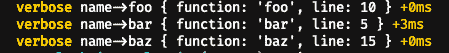

# 可怕的如何将堆栈附加到调试

> 原文：<https://dev.to/samrocksc/horrible-howto-attach-a-stack-to-debug-3ln>

因此，几年前，在我学习如何使用 Javascript 的初期，我遇到了一种情况，我真的想学习如何将函数名和文件名附加到我的函数上。当时，我认为我没有真正理解堆栈跟踪的概念，以及错误的价值。

### 情况

假设如果你愿意的话:

1.  你正处于云功能(如 lambda)开发周期的早期
2.  部署您的功能需要一些时间，所以每次您运行它时，您都希望从它那里得到尽可能多的有效反馈。
3.  因为您正在部署一个云功能，所以通过调试器检查它的能力受到严重限制。您需要能够显示一些断点，或者至少显示您的函数在哪里中断。

它来了......[调试](https://www.npmjs.com/package/debug)模块....

调试模块的基础是我们可以用一个环境变量打开调试，然后关闭它！这符合所有的条件。我们不必在生产中运行它，而且它有些受限。

### 首发出场

让我们从根据文档声明几个变量和调试开始:

blah.js:

```
const v = require('debug')('verbose');

v('test'); 
```

现在，如果我们要传递环境变量`DEBUG=verbose`，我们将得到类似于
的结果

```
verbose test +0ms 
```

我们在它的末端有一个漂亮的计时器，如果你在本地使用它，它会有一些颜色。

### 建筑堆栈

不幸的是，Javascript 实际上并不支持全局堆栈(我发现这很像 glibc)。获取堆栈历史最便宜的方法是将函数实际置于错误状态。对于我们提出的用例来说，这个*不应该是一个问题，因为我们是出于调试的目的来使用它的。* 

```
const buildStack = () => {
  const depth = 3;
  if (!this.stackIs) {
    Object.defineProperty(this, 'stackIs', {
      get: function() {
        const orig = Error.prepareStackTrace;
        Error.prepareStackTrace = function(_, stack) {
          return stack;
        };
        const err = new Error();
        Error.captureStackTrace(err, arguments.callee);
        const stack = err.stack;
        Error.prepareStackTrace = orig;
        return stack;
      },
    });
  }

  if (!this.lineIs) {
    Object.defineProperty(this, 'lineIs', {
      get: function() {
        return this.stackIs[depth].getLineNumber();
      },
    });
  }

  if (!this.functionIs) {
    Object.defineProperty(this, 'functionIs', {
      get: function() {
        return this.stackIs[depth].getFunctionName();
      },
    });
  }

  return {
    function: this.functionIs,
    line: this.lineIs,
  };
}; 
```

我们使用漂亮的显示模式打印出一个对象，在那里我们调试，瞧！我们现在有非常棒的调试！

[](https://res.cloudinary.com/practicaldev/image/fetch/s--Ixw8rKNG--/c_limit%2Cf_auto%2Cfl_progressive%2Cq_auto%2Cw_880/https://thepracticaldev.s3.amazonaws.com/i/6gbgqlv61cdmvq3gxjcf.png)

总片段[此处](https://gist.github.com/samrocksc/2b9639c99538848be7bb80f99ca63f83)

来源:[堆栈溢出](https://stackoverflow.com/questions/14172455/get-name-and-line-of-calling-function-in-node-js)