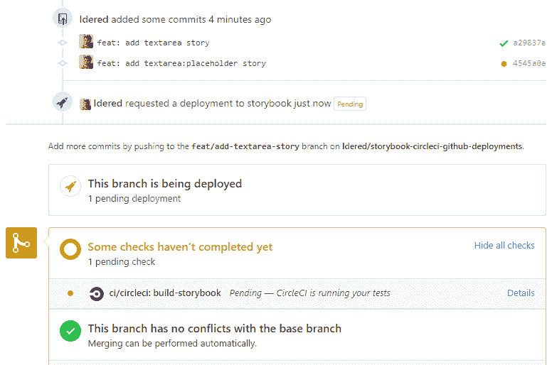
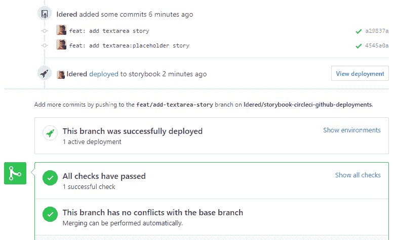
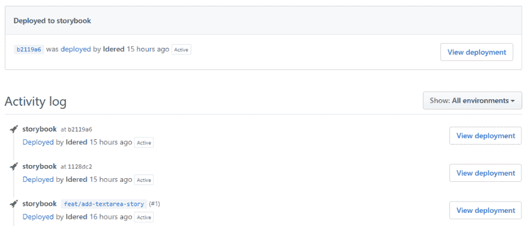

# 针对 CircleCI 和 GitHub 部署的每个拉请求的主机故事书

> 原文：<https://dev.to/idered/host-storybook-with-circleci-and-github-deployments-4eoj>

最初发布于 [kasper.io](https://kasper.io/host-storybook-with-circleci-and-github-deployments/)

最近在公司，我们有很多使用 React 开发 UI 组件的工作。多亏了故事书，一切都很顺利。我们托管 Storybook 为每个 push to branch 生成的文件，这对质量保证过程非常有帮助。

Storybook 是一个独立开发 UI 组件的工具。虽然这个工具对于本地开发很有用，但是也可以构建 Storybook 的静态版本并托管它。我将展示如何为每个推送到存储库的操作配置部署。

您将学习如何在 [CircleCI](https://circleci.com/) 上构建故事书，并将其用作主机。您还将学习如何使用 [GitHub 部署](https://developer.github.com/v3/repos/deployments/)。部署是部署特定分支、提交、标记的请求。外部服务可以监听这些请求并采取行动。

**本指南假设您已经使用`@storybook/cli`初始化了 Storybook。如果没有，去[这里](https://storybook.js.org/docs/guides/quick-start-guide/)学习如何做。**

> **TL；DR** :这里是一个配置了整个流程的[库](https://github.com/Idered/storybook-circleci-github-deployments)。此处可查看部署列表[，此处](https://github.com/Idered/storybook-circleci-github-deployments/deployments)可查看分配给拉式请求的部署[。](https://github.com/Idered/storybook-circleci-github-deployments/pull/1)

整个过程看起来是这样的:

*   推送至存储库
*   CircleCI 构建被触发
*   [GitHub 部署](https://developer.github.com/v3/repos/deployments/)被创建
*   安装依赖项
*   构建故事书
*   将生成的文件保存为 CircleCI 工件
*   如果整个过程成功，添加成功部署状态
*   如果整个过程不成功，添加错误部署状态
*   我们可以在[部署页面](https://github.com/Idered/storybook-circleci-github-deployments/deployments) 上看到生成文件的链接
*   我们可以在相关的[拉取请求](https://github.com/Idered/storybook-circleci-github-deployments/pull/1) 中看到生成文件的链接

## 设置 CircleCI

转到 [CircleCI 仪表板](https://circleci.com/dashboard)并添加您的项目。开始构建过程-一开始会失败，但我们会在接下来的步骤中修复它。

### 创建 CircleCI 配置文件

在您的 git 存储库中，创建`.circleci/config.yml` :

```
version: 2.1

jobs:
  build-storybook:
    working_directory: ~/repo
    docker:
      - image: circleci/node:lts
    steps:
      - checkout
      - run:
          name: Create GitHub Deployment
          command: ./tasks/deployment/start.sh > deployment
      - restore_cache:
          keys:
            - cache-{{ checksum "package.json" }}
            # fallback to using the latest cache if no exact match is found
            - cache-
      - run:
          name: Installing Dependencies
          command: npm install
      - run:
          name: Build Storybook
          command: npm run build-storybook
      - store_artifacts:
          path: storybook-static
      - run:
          name: Add GitHub Deployment success status
          command: ./tasks/deployment/end.sh success
          when: on_success
      - run:
          name: Add GitHub Deployment error status
          command: ./tasks/deployment/end.sh error
          when: on_fail
      - save_cache:
          paths:
            - node_modules
          key: cache-{{ checksum "package.json" }}

workflows:
  deploy:
    jobs:
      - build-storybook 
```

Enter fullscreen mode Exit fullscreen mode

有 3 个部分与创建和添加 GitHub 部署的状态更新相关。该命令将创建一个部署，并将其 id 保存到`deployment`文件中。部署将在相关的拉取请求中显示为待定。

```
 - run:
      name: Create GitHub Deployment
      command: ./tasks/deployment/start.sh > deployment 
```

Enter fullscreen mode Exit fullscreen mode

其他两个命令中只有一个会执行。执行基于整个构建的状态。

```
 - run:
      name: Add GitHub Deployment success status
      command: ./tasks/deployment/end.sh success
      when: on_success
  - run:
      name: Add GitHub Deployment error status
      command: ./tasks/deployment/end.sh error
      when: on_fail 
```

Enter fullscreen mode Exit fullscreen mode

### 创建部署脚本

现在创建 2 个文件:
`tasks/deployment/start.sh`——这将创建一个 GitHub 部署。

```
 #!/bin/sh

  set -eu

  token=${GITHUB_DEPLOYMENTS_TOKEN:?"Missing GITHUB_TOKEN environment variable"}

  if ! deployment=$(curl -s \
                    -X POST \
                    -H "Authorization: bearer ${token}" \
                    -d "{ \"ref\": \"${CIRCLE_SHA1}\", \"environment\": \"storybook\", \"description\": \"Storybook\", \"transient_environment\": true, \"auto_merge\": false, \"required_contexts\": []}" \
                    -H "Content-Type: application/json" \
                    "https://api.github.com/repos/${CIRCLE_PROJECT_USERNAME}/${CIRCLE_PROJECT_REPONAME}/deployments"); then echo "POSTing deployment status failed, exiting (not failing build)" 1>&2
    exit 1
  fi

  if ! deployment_id=$(echo "${deployment}" | python -c 'import sys, json; print json.load(sys.stdin)["id"]'); then echo "Could not extract deployment ID from API response" 1>&2
    exit 3
  fi echo ${deployment_id} > deployment 
```

Enter fullscreen mode Exit fullscreen mode

`tasks/deployment/end.sh` -这将把部署状态更新为成功或错误。

```
#!/bin/sh

set -eu

token=${GITHUB_DEPLOYMENTS_TOKEN:?"Missing GITHUB_TOKEN environment variable"}

if ! deployment_id=$(cat deployment); then echo "Deployment ID was not found" 1>&2
  exit 3
fi

if [ "$1" = "error" ]; then curl -s \
    -X POST \
    -H "Authorization: bearer ${token}" \
    -d "{\"state\": \"error\", \"environment\": \"storybook\"" \
    -H "Content-Type: application/json" \
    "https://api.github.com/repos/${CIRCLE_PROJECT_USERNAME}/${CIRCLE_PROJECT_REPONAME}/deployments/${deployment_id}/statuses"
  exit 1
fi

if ! repository=$(curl -s \
                  -X GET \
                  -H "Authorization: bearer ${token}" \
                  -d "{}" \
                  -H "Content-Type: application/json" \
                  "https://api.github.com/repos/${CIRCLE_PROJECT_USERNAME}/${CIRCLE_PROJECT_REPONAME}"); then echo "Could not fetch repository data" 1>&2
  exit 1
fi

if ! repository_id=$(echo "${repository}" | python -c 'import sys, json; print json.load(sys.stdin)["id"]'); then echo "Could not extract repository ID from API response" 1>&2
  exit 3
fi path_to_repo=$(echo "$CIRCLE_WORKING_DIRECTORY" | sed -e "s:~:$HOME:g")
url="https://${CIRCLE_BUILD_NUM}-${repository_id}-gh.circle-artifacts.com/0${path_to_repo}/storybook-static/index.html"

if ! deployment=$(curl -s \
                  -X POST \
                  -H "Authorization: bearer ${token}" \
                  -d "{\"state\": \"success\", \"environment\": \"storybook\", \"environment_url\": \"${url}\", \"target_url\": \"${url}\", \"log_url\": \"${url}\"}" \
                  -H "Content-Type: application/json" \
                  "https://api.github.com/repos/${CIRCLE_PROJECT_USERNAME}/${CIRCLE_PROJECT_REPONAME}/deployments/${deployment_id}/statuses"); then echo "POSTing deployment status failed, exiting (not failing build)" 1>&2
  exit 1
fi 
```

Enter fullscreen mode Exit fullscreen mode

> 可能需要将脚本文件模式更新为可执行:

```
git update-index --add --chmod=+x ./tasks/deployment/start.sh
git update-index --add --chmod=+x ./tasks/deployment/end.sh 
```

Enter fullscreen mode Exit fullscreen mode

### 配置 GitHub 访问令牌

转到[https://github.com/settings/tokens](https://github.com/settings/tokens)并创建新的访问令牌。要求的范围:

*   `repo:status`
*   `repo_deployment`
*   `public_repo`

复制新令牌并转到 CircleCI 项目中的`Environment Variables`配置部分。如果找不到，使用这个 url，只需用有效值替换 GITHUB_USERNAME 和 REPOSITORY _ NAME:

```
https://circleci.com/gh/GITHUB_USERNAME/REPOSITORY_NAME/edit#env-vars 
```

Enter fullscreen mode Exit fullscreen mode

在 CircleCI 上添加变量:

```
name: GITHUB_DEPLOYMENTS_TOKEN
value: xxxx-xxxx-xxxx-your-github-token 
```

Enter fullscreen mode Exit fullscreen mode

### 结果

现在，每当你把一个新的提交推送到你的存储库，你就会得到一个托管在 CircleCI 上的故事书。故事书的链接将被添加到存储库[部署页面](https://github.com/Idered/storybook-circleci-github-deployments/deployments)和与[相关的拉请求](https://github.com/Idered/storybook-circleci-github-deployments/pull/1)。

### 奖金

你在公司工作吗？创建一个公司 github bot 帐户，并使用其个人访问令牌进行部署。定制它的名字和头像。