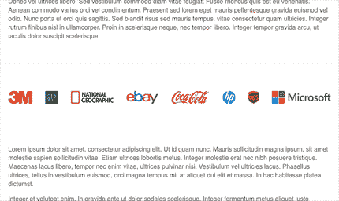
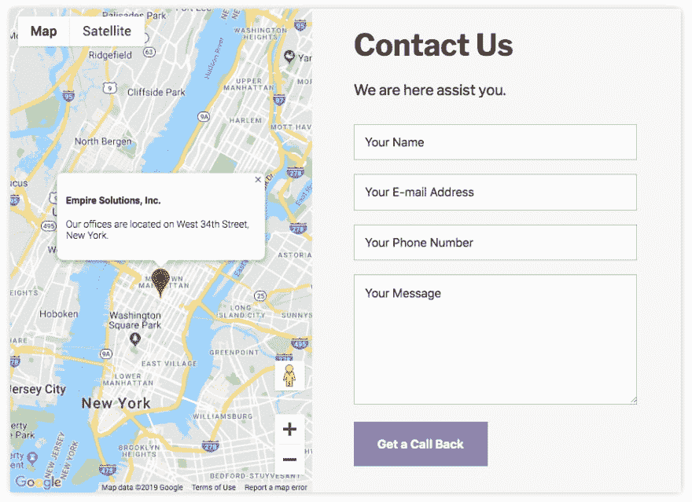
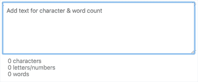

# 热点、社交证明、地图表格|模块周一 39

> 原文：<https://dev.to/tyrw/hotspots-customers-map-form-module-monday-39-478p>

## 你可以在任何地方添加模块化代码

下面所有的 mod 都是开源的，可以在你选择的任何项目中免费使用——因为有了 [Anymod](https://anymod.com) ，它们可以在任何网站或网络应用上工作。

单击一个 mod 来查看它的运行及其源代码。

## 图像热点

突出显示图像的某些部分，以便进一步操作。
[查看 mod](https://anymod.com/mod/image-hotspots-rambna?v=20)
  

## 客户部分

展示您的客户或合作伙伴关系。
[观 mod](https://anymod.com/mod/customer-display-bambdd?v=20)
  

## 用地图联系表格

一体式接触部分。
[查看 mod](https://anymod.com/mod/contact-form-with-map-mlnkbd?v=20)
  

## 团队卡

展示你的团队在一个英俊的网格格式。
[查看 mod](https://anymod.com/mod/team-cards-nkabdn?v=20)
  

## 字符计数器

演示了如何实时计算字符数。
[查看 mod](https://anymod.com/mod/word-character-counter-onnml?v=30)
  

* * *

我每周一都会在这里发布新的模块——我希望你会觉得它们有用！

快乐编码✌️