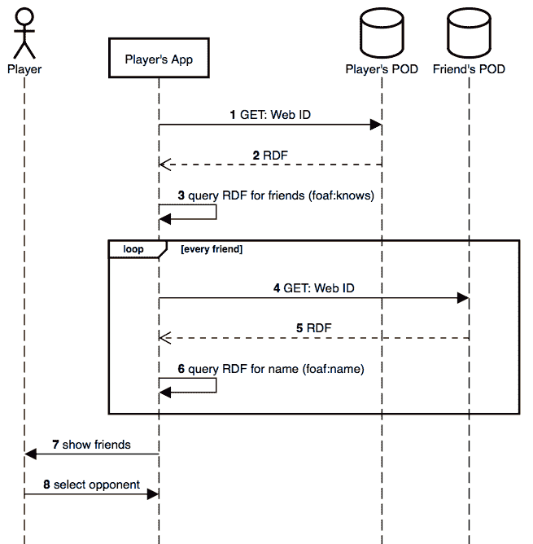
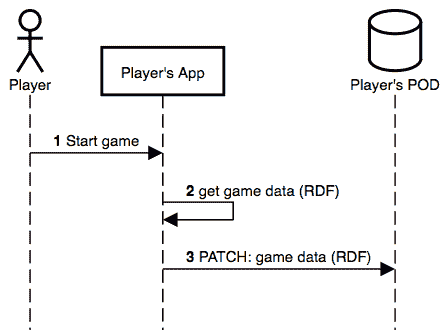
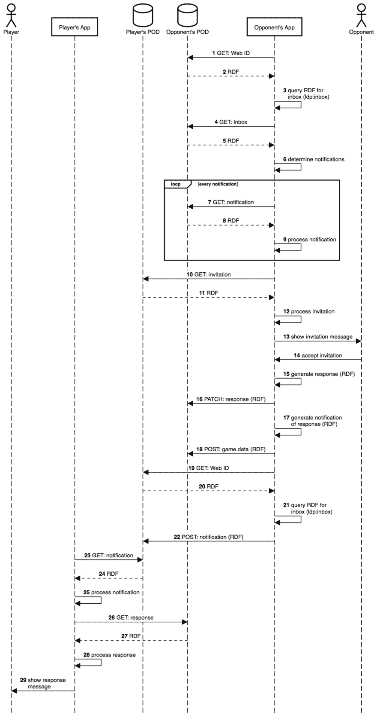
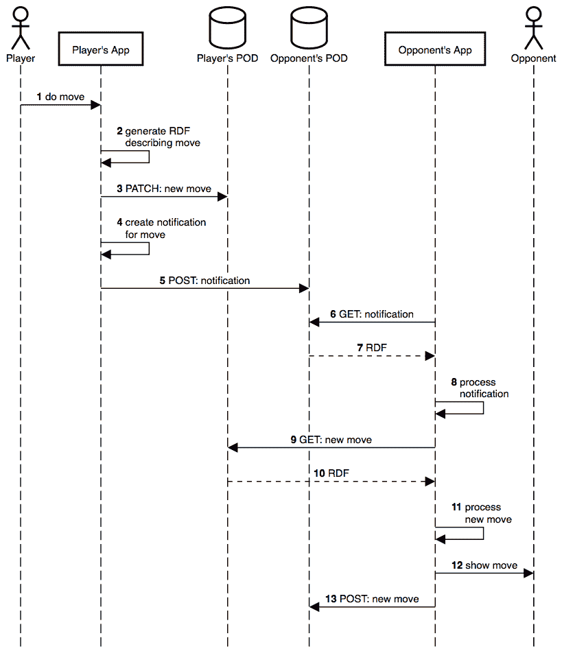
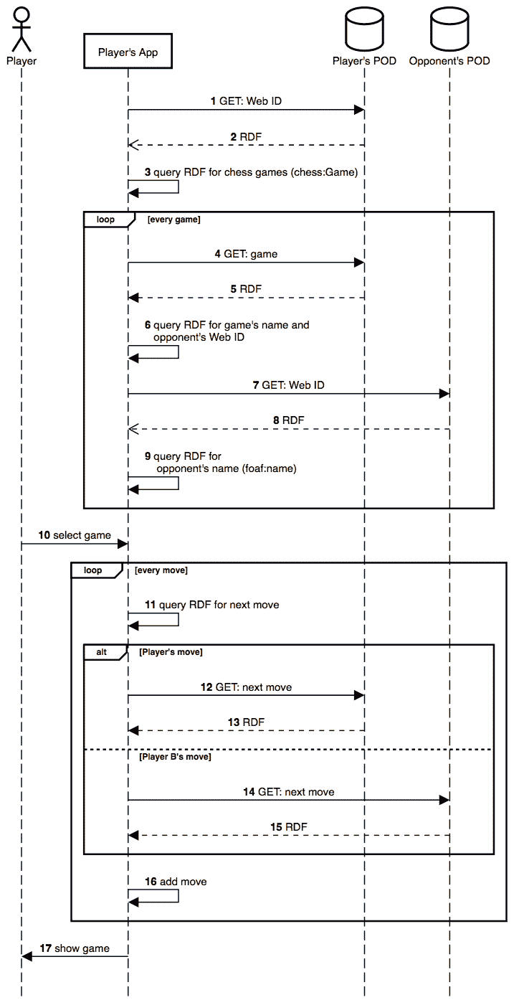

# 象棋应用程序如何与 Solid 交互

> 原文：<https://dev.to/heypieter/how-a-chess-app-interacts-with-solid-409a>

去年，我开始尝试蒂姆·伯纳斯·李推出的[固体平台](https://solid.inrupt.com)。为了更熟悉所使用的不同概念和技术，我创建了一个概念验证应用程序:一个[浏览器象棋游戏](https://github.com/pheyvaer/solid-chess)。

Solid 平台的主要概念是使用 Solid PODs，它提供个人在线数据存储。Solid 的想法是，用户有一个或多个 pod 来存储他们的数据，不同的应用程序能够与这些 pod 进行交互，但这些应用程序只能读写用户授权他们访问的数据。因此，用户现在不必将所有用户的所有数据存储在每个应用程序的单个服务器上，而是存储和控制(！)自己的数据，导致了一种分散的方法。这篇博客文章的重点是应用程序和 Solid PODs 之间的交互。

首先，我们列出象棋 app 的不同[功能](#features)。其次，我们详细说明应用程序的三个[高级组件](#high-level-components)。第三，我们列出了玩家做某些[动作](#actions)时采取的不同步骤。最后，我们讨论这个应用程序生成的数据如何被其他应用程序使用。

## 特性

该应用程序提供以下功能:

*   认证玩家
*   开始新的国际象棋游戏，并邀请您的对手
*   加入你被邀请参加的国际象棋比赛
*   在国际象棋中走几步
*   继续现有的国际象棋游戏

## 高级组件

该应用程序由三个高级组件组成:GUI、象棋游戏引擎和与 POD 的交互。GUI 使用了[棋盘. js](https://github.com/oakmac/chessboardjs) 库，它提供了棋盘和玩家与棋盘的交互，比如棋子的移动。它不提供国际象棋引擎，也就是说，它不会检查移动是否有效，也不会跟踪轮到哪个玩家了。为此，我们使用了 [chess.js](https://github.com/jhlywa/chess.js) 库。尽管它提供了下棋所需的信息，但数据并没有以链接数据的形式呈现，而这正是 Solid 平台所偏好的。[链接数据](https://en.wikipedia.org/wiki/Linked_data)是一种发布结构化数据的方法，通过语义查询使其可以相互链接并变得更加有用。因此，我围绕 chess.js 创建了一个名为 [semantic-chess](https://github.com/pheyvaer/solid-chess) 的“包装器”库，它输出 RDF，这是一种用于物化链接数据的技术，可以在应用程序与 POD 的交互过程中使用。这篇博文的重点就是这种互动。

## 动作

### 认证

当应用程序启动时，玩家做的第一件事就是登录。为此，我们使用了 [solid-auth-client](https://github.com/solid/solid-auth-client) 库。它跟踪会话，并提供一个 fetch 方法，每当我们想要与 POD 交互时就使用这个方法。每当玩家登录时，fetch 方法能够存储和读取登录玩家可以访问的 pod 中的数据。

[](https://res.cloudinary.com/practicaldev/image/fetch/s--U9IFPBx9--/c_limit%2Cf_auto%2Cfl_progressive%2Cq_auto%2Cw_880/https://thepracticaldev.s3.amazonaws.com/i/uc6ivzlttvm39ghx0zud.png) 
图 1:点击 app 中的“登录”按钮时出现的弹出窗口。

在 GUI 中有一个经典的登录按钮。单击时，会出现一个弹出窗口，允许选择您想要认证的[身份提供者](https://en.wikipedia.org/wiki/Identity_provider)(参见图 1)。您可以提供自己的 HTML 文件来呈现弹出窗口，也可以使用库提供的默认文件。成功登录后，弹出窗口关闭，焦点回到应用程序上。

`solid-auth-client`库跟踪到一个玩家已经登录，现在一个会话对象是可用的。例如，这个会话对象包含登录玩家的 Web ID。Web ID 是一个 HTTP URI，表示基于 HTTP 的网络上的代理。根据关联数据原则，当 Web ID 被解引用时，它将解析为描述其引用对象(即玩家)的配置文件。此外，库提供的 fetch 方法现在将代表玩家。

### 开始新游戏

当玩家开始一个新游戏时，他需要选择一个对手，应用程序需要在玩家的 POD 上存储游戏数据，并邀请对手。

#### 选择对手

[](https://res.cloudinary.com/practicaldev/image/fetch/s--mU_1X6iY--/c_limit%2Cf_auto%2Cfl_progressive%2Cq_auto%2Cw_880/https://thepracticaldev.s3.amazonaws.com/i/c7q1mnetu4uw5ppkuxb5.png) 
图 2:玩家选择对手时所采取步骤的序列图。

通过这个动作，玩家为新游戏选择一个对手。在图 2 中，我们描述了玩家、玩家的 app、玩家的 POD 和他的朋友的 POD 之间的对应步骤。这些步骤是:

1)应用程序获取玩家的 Web ID。如果玩家的网络 ID 是

```
https://player.solid.community/profile/card#me 
```

那么对应的`curl`命令就是

```
curl https://player.solid.community/profile/card#me 
```

2)玩家的 POD 返回描述玩家的 RDF。这种 RDF 的一个例子是

```
@prefix : <https://player.solid.community/profile/card#>.
@prefix inbox: <https://player.solid.community/inbox/>.
@prefix ldp: <http://www.w3.org/ns/ldp#>.
@prefix foaf: <http://xmlns.com/foaf/0.1/>.
@prefix c0: <https://opponent.solid.community/profile/card#>.

:me ldp:inbox inbox:;
  foaf:knows c0:me;
  foaf:name "Player". 
```

3)应用程序通过谓词`foaf:knows`查询 RDF 来确定玩家的朋友。使用这个谓词的 SPARQL 查询的一个例子是

```
PREFIX foaf: <http://xmlns.com/foaf/0.1/>
PREFIX player: <https://player.solid.community/profile/card#>

SELECT ?friend 
WHERE {
  player:me foaf:knows ?friend.
} 
```

对于每一个朋友，我们都采取以下三个步骤。

4)应用程序获取朋友的网络 ID。如果玩家的网络 ID 是

```
https://opponent.solid.community/profile/card#me 
```

那么对应的`curl`命令就是

```
curl https://opponent.solid.community/profile/card#me 
```

5)朋友的 POD 返回描述朋友的 RDF。这个 RDF 类似于步骤 2 的 RDF。这种 RDF 的一个例子是

```
@prefix : <https://opponent.solid.community/profile/card#>.
@prefix inbox: <https://opponent.solid.community/inbox/>.
@prefix ldp: <http://www.w3.org/ns/ldp#>.
@prefix foaf: <http://xmlns.com/foaf/0.1/>.
@prefix player: <https://player.solid.community/profile/card#>.

:me ldp:inbox inbox:;
  foaf:knows player:me;
  foaf:name "Opponent". 
```

6)应用程序通过谓词`foaf:name`查询 RDF 来确定朋友的名字。SPARQL 查询的一个例子，使用这个谓词查询一个 Web ID 为
的朋友

```
https://opponent.solid.community/profile/card#me 
```

是

```
PREFIX foaf: <http://xmlns.com/foaf/0.1/>
PREFIX opponent: <https://opponent.solid.community/profile/card#>

SELECT ?name 
WHERE {
  opponent:me foaf:name ?name.
} 
```

7)应用程序向玩家显示朋友列表。玩家选择想要的朋友作为他的对手。

**备注**

*   SPARQL 用于查询 RDF 来查找朋友及其姓名，因为它是 RDF 的默认查询语言。然而，也有其他选择，如 [LDFlex](https://github.com/solid/query-ldflex) 和 [GraphQL-LD](https://github.com/rubensworks/graphql-to-sparql.js) 。
*   前缀为`foaf`的 FOAF 本体是[Schema.org](http://schema.org)和 [vCard](https://www.w3.org/TR/vcard-rdf/) 等几种本体中的一种，可以用来描述一个人的基本信息。在写作的时候，当创建一个默认的配置文件与固体大多是 FOAF 使用。然而，请记住，其他实体荚可能使用(组合)其他本体。
*   我们只在玩家的 POD 上存储玩家朋友的 Web IDs，因为可以通过从朋友的 POD 下载数据来获取关于朋友的额外信息。

#### 在 POD 上存储游戏数据

[](https://res.cloudinary.com/practicaldev/image/fetch/s--puAypOaF--/c_limit%2Cf_auto%2Cfl_progressive%2Cq_auto%2Cw_880/https://thepracticaldev.s3.amazonaws.com/i/1oh0lvfv4q1z7bcv76x8.png) 
图 3:在 POD 上存储游戏数据时所采取的步骤的顺序图。

通过这个动作，新游戏的游戏数据被存储在玩家的 POD 上。在图 3 中，我们描述了播放器、播放器的应用程序和播放器的 POD 之间的相应步骤。这些步骤是:

1)玩家开始游戏。2)玩家的应用程序生成 RDF，描述象棋游戏的具体实例。这种 RDF 的一个例子是

```
 @prefix : <https://player.solid.community/public/chess.ttl#>.
 @prefix chess: <http://purl.org/NET/rdfchess/ontology/>.
 @prefix stor: <http://example.org/storage/>.
 @prefix schema: <http://schema.org/>.
 @prefix player: <https://player.solid.community/profile/card#>.
 @prefix opponent: <https://opponent.solid.community/profile/card#>.

 :game
   a chess:ChessGame;
   stor:storeIn :;
   chess:providesAgentRole :jo8deywv, :jo8deyww;
   chess:starts :jo8deywv;
   schema:name "Test game".

 :jo8deywv a chess:WhitePlayerRole;
   chess:performedBy player:me.

 :jo8deyww a chess:BlackPlayerRole;
   chess:performedBy opponent:me. 
```

它包括

*   游戏的唯一 URL:在网络上唯一地标识这个特定的国际象棋游戏
*   游戏名称:显示在应用程序中
*   两个玩家的 Web IDs:在 Web 上唯一地标识这个特定国际象棋游戏的玩家
*   每个玩家的颜色

3)玩家的应用程序用一个 SPARQL 更新查询用 RDF 对玩家的 POD 进行修补。使用补丁是因为玩家选择的我们想要存储 RDF 的文件可能已经包含了我们不想覆盖的数据。这种补丁的一个例子是

```
PREFIX : <https://player.solid.community/public/chess.ttl#>
PREFIX chess: <http://purl.org/NET/rdfchess/ontology/>
PREFIX stor: <http://example.org/storage/>
PREFIX schema: <http://schema.org/>
PREFIX player: <https://player.solid.community/profile/card#>
PREFIX opponent: <https://opponent.solid.community/profile/card#>

INSERT DATA {
  :game a chess:ChessGame;
    stor:storeIn <>;
    chess:providesAgentRole :jo8deywv, :jo8deyww;
    chess:starts :jo8deywv;
    schema:name "Test game".

    :jo8deywv a chess:WhitePlayerRole; 
      chess:performedBy player:me.

    :jo8deyww a chess:BlackPlayerRole; 
      chess:performedBy opponent:me.
} 
```

#### 邀请对手

[](https://res.cloudinary.com/practicaldev/image/fetch/s---58Pth10--/c_limit%2Cf_auto%2Cfl_progressive%2Cq_auto%2Cw_880/https://thepracticaldev.s3.amazonaws.com/i/pysxqun1hsekzqtuqgyo.png) 
图 4:邀请对手时采取的步骤顺序图。

通过该动作，向对手发送加入新创建的游戏的邀请。在图 4 中，我们描述了
玩家的 app 和对手的 POD 之间的对应步骤。这些步骤是:

1)玩家的应用程序生成描述邀请的 RDF。这种 RDF 的一个例子是

```
@prefix : <https://player.solid.community/public/chess.ttl#>.
@prefix schema: <http://schema.org/>.
@prefix player: <https://player.solid.community/profile/card#>.
@prefix opponent: <https://opponent.solid.community/profile/card#>.

:invitation a schema:InviteAction>;
  schema:event :game;
  schema:agent player:me;
  schema:recipient opponent:me. 
```

2)玩家的应用程序使用 SPARQL 更新查询来将邀请存储在玩家的 POD 上。这种补丁的一个例子是

```
 PREFIX schema: http://schema.org/>
 PREFIX : <https://player.solid.community/public/chess.ttl#>
 PREFIX player: <https://player.solid.community/profile/card#>
 PREFIX opponent: <https://opponent.solid.community/profile/card#>

 INSERT DATA {
   :invitation a schema:InviteAction;
     schema:event :game;
     schema:agent player:me;
     schema:recipient opponent:me.
 } 
```

3)玩家的应用程序为邀请通知生成 RDF。这种通知的 RDF 示例是

```
@prefix schema: <http://schema.org/> .
@prefix : <https://player.solid.community/public/chess.ttl#>.

:invitation a schema:InviteAction . 
```

4)玩家的应用程序获取对手的 Web ID。如果玩家的网络 ID 是

```
https://player.solid.community/profile/card#me 
```

那么对应的`curl`命令就是

```
curl https://player.solid.community/profile/card#me 
```

5)对手的 POD 返回描述对手的 RDF。这种 RDF 的一个例子是

```
@prefix : <https://opponent.solid.community/profile/card#>.
@prefix inbox: <https://opponent.solid.community/inbox/>.
@prefix ldp: <http://www.w3.org/ns/ldp#>.
@prefix foaf: <http://xmlns.com/foaf/0.1/>.
@prefix c0: <https://player.solid.community/profile/card#>.

:me ldp:inbox inbox:;
  foaf:knows c0:me;
  foaf:name "Opponent". 
```

6)玩家的 app 通过谓词`ldp:inbox`查询 RDF 确定对手的收件箱。使用这个谓词的 SPARQL 查询的一个例子是

```
PREFIX ldp: <http://www.w3.org/ns/ldp#>

SELECT ?inbox
 HERE {
  <https://opponent.solid.community/profile/card#> ldp:inbox ?inbox.
} 
```

7)玩家的应用程序向收件箱发送邀请通知。当我们向收件箱发送邮件时，会在收件箱中创建一个包含通知的新文件。

### 加入游戏

[](https://res.cloudinary.com/practicaldev/image/fetch/s--TN_Ozq_B--/c_limit%2Cf_auto%2Cfl_progressive%2Cq_auto%2Cw_880/https://thepracticaldev.s3.amazonaws.com/i/plsg5y0rfgi4hohos8y9.png) 
图 5:对手加入游戏时所采取步骤的顺序图。

通过这个动作，对手加入了他收到邀请的游戏。在图 5 中，我们描述了玩家、对手、玩家的 app、玩家的 POD、对手的 app 和对手的 POD 之间的对应步骤。这些步骤是:

1)对手的应用程序获取登录用户的 Web ID，在本例中是对手。
2)对手的 POD 返回描述对手的 RDF。这种 RDF 的一个例子是

```
@prefix : <https://opponent.solid.community/profile/card#>.
@prefix inbox: <https://opponent.solid.community/inbox/>.
@prefix ldp: <http://www.w3.org/ns/ldp#>.
@prefix foaf: <http://xmlns.com/foaf/0.1/>.
@prefix player: <https://player.solid.community/profile/card#>.

:me ldp:inbox inbox:;
  foaf:knows player:me;
  foaf:name "Opponent". 
```

3)对方的 app 通过谓词`ldp:inbox`查询 RDF 确定对方的收件箱。使用这个谓词的 SPARQL 查询的一个例子是

```
PREFIX ldp: <http://www.w3.org/ns/ldp#>
PREFIX opponent: <https://opponent.solid.community/profile/card#>

SELECT ?inbox
WHERE {
  opponent:me ldp:inbox ?inbox.
} 
```

4)对手的应用程序访问收件箱，其中包含标识不同通知的链接。
5)对方的 POD 返回描述收件箱的 RDF。这种 RDF 的一个例子是

```
@prefix inbox: <https://opponent.solid.community/inbox/>.
@prefix ldp: <http://www.w3.org/ns/ldp#>.
@prefix terms: <http://purl.org/dc/terms/>.
@prefix XML: <http://www.w3.org/2001/XMLSchema#>.
@prefix st: <http://www.w3.org/ns/posix/stat#>.

inbox:
  a ldp:BasicContainer, ldp:Container;
  terms:modified "2019-01-10T15:00:26Z"^^XML:dateTime;
  ldp:contains inbox:765a0510-14e8-11e9-a29e-5d8e3e616ac9, n0:;
  st:mtime 1547132426.207;
  st:size 4096.

inbox:765a0510-14e8-11e9-a29e-5d8e3e616ac9
  a ldp:Resource;
  terms:modified "2019-01-10T15:00:26Z"^^XML:dateTime;
  st:mtime 1547132426.207;
  st:size 1369. 
```

6)对手的应用程序通过类`ldp:Resource`查询 RDF 以确定通知，即它们的链接。使用这个谓词的 SPARQL 查询的一个例子是

```
PREFIX ldp: <http://www.w3.org/ns/ldp#>

SELECT ?notification
WHERE {
  ?notification a ldp:Resource .
} 
```

对手的应用程序迭代收件箱中的所有通知。
7)对手的应用程序访问通知的链接。
8)对方的 POD 返回描述通知的 RDF。
这种 RDF 的一个例子是

```
@prefix schema: <http://schema.org/> .
@prefix : <https://player.solid.community/public/chess.ttl#>.

:invitation a schema:InviteAction . 
```

9)应用程序通过类`schema:InviteAction`查询 RDF 以确定通知是否包含邀请。一个相应的 SPARQL 查询的例子是

```
PREFIX schema: <http://schema.org/>

SELECT ?invitation
WHERE {
  ?invitation a schema:InviteAction .
} 
```

10)如果通知包含邀请，对方的应用程序会获取邀请的链接。
11)玩家的 POD 返回描述邀请的 RDF。这种 RDF 的一个例子是

```
@prefix : <https://player.solid.community/public/chess.ttl#>.
@prefix schema: <http://schema.org/>.
@prefix player: <https://player.solid.community/profile/card#>.
@prefix opponent: <https://opponent.solid.community/profile/card#>.

:invitation a schema:InviteAction;
  schema:event :game;
  schema:agent player:me;
  schema:recipient opponent:me. 
```

12)对手的 app 查询 RDF，确定游戏的链接和对手的 Web ID。一个相应的 SPARQL 查询是

```
PREFIX : <https://player.solid.community/public/chess.ttl#>
PREFIX schema: <http://schema.org/>   

SELECT ?game ?opponent
  WHERE {
   :invitation schema:event ?game;
     schema:agent ?opponent.
  } 
```

13)对手的 app 显示对对手的邀请。对手接受了邀请。
15)对手的 app 生成描述响应的 RDF。这种 RDF 的一个例子是

```
@prefix response: <https://opponent.solid.community/public/chess.ttl#response>.
@prefix invitation: <https://player.solid.community/public/chess.ttl#invitation>.
@prefix schema: <http://schema.org/>.
@prefix player: <https://player.solid.community/profile/card#>.
@prefix opponent: <https://opponent.solid.community/profile/card#>.

response: a schema:RsvpAction;
  schema:rsvpResponse schema:RsvpResponseYes;
  schema:agent opponent:me;
  schema:recipient player:me.

invitation: schema:result response:. 
```

16)对手的应用程序确实用 SPARQL 更新查询打补丁，将响应存储在对手的 POD 上。这种补丁的一个例子是

```
PREFIX response: <https://opponent.solid.community/public/chess.ttl#response>
PREFIX invitation: <https://player.solid.community/public/chess.ttl#invitation>
PREFIX schema: <http://schema.org/>
PREFIX player: <https://player.solid.community/profile/card#>
PREFIX opponent: <https://opponent.solid.community/profile/card#>

INSERT DATA {
  response: a schema:RsvpAction;
    schema:rsvpResponse schema:RsvpResponseYes;
    schema:agent opponent:me;
    schema:recipient player:me.

  invitation: schema:result response:.
} 
```

17)玩家的应用程序为响应的通知生成 RDF。这种通知的 RDF 示例是

```
@prefix response: <https://opponent.solid.community/public/chess.ttl#response>.
@prefix schema: <http://schema.org/>.

response: a schema:RsvpAction. 
```

18)对手的 app 对对手的 POD 做补丁，存储相关的游戏数据。这大多是后来知道对手在参与游戏的数据。关于游戏的细节并不存储在对手的 POD 上，因为它们存储在玩家的 POD 上，并且可以通过访问游戏的链接来检索。对手的应用程序获取玩家的网络 ID。此 Web ID 可通过邀请获得。
20)玩家的 POD 返回描述玩家的 RDF。这种 RDF 的一个例子是

```
@prefix : <https://player.solid.community/profile/card#>.
@prefix inbox: <https://player.solid.community/inbox/>.
@prefix ldp: <http://www.w3.org/ns/ldp#>.
@prefix foaf: <http://xmlns.com/foaf/0.1/>.
@prefix opponent: <https://opponent.solid.community/profile/card#>.

:me ldp:inbox inbox:;
  foaf:knows opponent:me;
  foaf:name "Player". 
```

21)应用程序通过谓词`ldp:inbox`查询 RDF 以确定玩家的收件箱。
22)应用程序向玩家的收件箱发送回复通知。
23)玩家的应用程序收到通知。为了清楚起见，我们跳过不同通知的迭代，因为这与前面的相同。
24)玩家的 POD 返回描述通知的 RDF。这种 RDF 的一个例子是

```
@prefix response: <https://opponent.solid.community/public/chess.ttl#response>.
@prefix schema: <http://schema.org/>.

response: a schema:RsvpAction. 
```

25)玩家的应用程序通过类`schema:RsvpAction`查询 RDF 以确定通知是否包含响应。
26)如果通知包含响应，应用程序会获取响应的链接。
27)对方的 POD 返回描述响应的 RDF。这种 RDF 的一个例子是

```
@prefix response: <https://opponent.solid.community/public/chess.ttl#response>.
@prefix invitation: <https://player.solid.community/public/chess.ttl#invitation>.
@prefix schema: <http://schema.org/>.
@prefix player: <https://player.solid.community/profile/card#>.
@prefix opponent: <https://opponent.solid.community/profile/card#>.

response: a schema:RsvpAction;
  schema:rsvpResponse schema:RsvpResponseYes;
  schema:agent opponent:me;
  schema:recipient player:me.

invitation: schema:result response:. 
```

28)玩家 app 查询响应确定对应的邀请，从中可以确定对应的游戏。一个相应的 SPARQL 查询的例子是

```
PREFIX schema: <http://schema.org/>

SELECT ?invitation 
WHERE {
  response: schema:result ?invitation. 
} 
```

29)玩家的 app 显示对玩家的响应。

### 做移动

[](https://res.cloudinary.com/practicaldev/image/fetch/s--xS53gh4N--/c_limit%2Cf_auto%2Cfl_progressive%2Cq_auto%2Cw_880/https://thepracticaldev.s3.amazonaws.com/i/5y9t01fmmfqomgvqbw68.png) 
图 6:玩家做一个动作时所走步骤的序列图。

通过这个动作，玩家做了一个新的动作，这个动作被展示给对手。
在图 6 中，我们描述了玩家、玩家的 app、玩家的 POD、对手的 app、对手的 POD 之间的对应步骤。这些步骤是:

1)玩家做了一个动作。2)玩家的应用程序生成描述这一步棋的 RDF。这种 RDF 的一个例子是

```
@prefix : <https://player.solid.community/public/chess.ttl#>.
@prefix schema: <http://schema.org/>.
@prefix chess: <http://purl.org/NET/rdfchess/ontology/>.
@prefix opponent: <https://opponent.solid.community/public/chess.ttl#>.

:game chess:hasHalfMove :move2.

:move2 a chess:HalfMove;
  schema:subEvent :game;
  chess:hasSANRecord "e3"^^xsd:string;
  chess:resultingPosition "rnbqkbnr/pppp1ppp/4p3/8/8/4P3/PPPP1PPP/RNBQKBNR w KQkq -".

opponent:move1 chess:nextHalfMove :move2. 
```

其中

```
https://player.solid.community/public/chess.ttl#move2 
```

是新招和
的链接

```
https://opponent.solid.community/public/chess.ttl#move1 
```

是上一步棋的链接。玩家的应用程序对玩家的 POD 做了一个补丁来存储移动。
4)玩家的应用程序生成移动通知。这种 RDF 的一个例子是

```
@prefix : <https://player.solid.community/public/chess.ttl#>.
@prefix opponent: <https://opponent.solid.community/public/chess.ttl#>.

opponent:move1 chess:nextHalfMove :move2. 
```

5)玩家的应用程序使用此通知向对手的 POD 进行发布。
6)对手的应用程序访问通知的链接。
7)对手的 POD 返回描述移动的 RDF。这种 RDF 的一个例子是

```
@prefix : <https://player.solid.community/public/chess.ttl#>.
@prefix opponent: <https://opponent.solid.community/public/chess.ttl#>.

opponent:move1 chess:nextHalfMove :move2. 
```

8)对手的应用程序查询 RDF 以确定通知是否包含移动。
9)对手的应用程序进入了移动的链接。
10)玩家的 POD 返回描述移动的 RDF。这种 RDF 的一个例子是

```
@prefix : <https://player.solid.community/public/chess.ttl#>.
@prefix schema: <http://schema.org/>.
@prefix chess: <http://purl.org/NET/rdfchess/ontology/>.

:move2 a chess:HalfMove;
  schema:subEvent :game;
  chess:hasSANRecord "e3"^^xsd:string;
  chess:resultingPosition "rnbqkbnr/pppp1ppp/4p3/8/8/4P3/PPPP1PPP/RNBQKBNR w KQkq -". 
```

11)对手的应用程序查询 RDF 以确定移动的细节。一个相应的 SPARQL 查询是

```
PREFIX : <https://player.solid.community/public/chess.ttl#>
PREFIX schema: <http://schema.org/>
PREFIX chess: <http://purl.org/NET/rdfchess/ontology/>

SELECT ?game ?san
WHERE {
  :move2 schema:subEvent ?game;
  chess:hasSANRecord ?san.
} 
```

12)对手的 app 给对手展示新的招式。
13)对手的 app 在对手的 POD 上存储了新招式的链接。这样做是为了根据单个移动的顺序重新构建国际象棋游戏。

### 继续游戏

[](https://res.cloudinary.com/practicaldev/image/fetch/s--9vyyt2Ub--/c_limit%2Cf_auto%2Cfl_progressive%2Cq_auto%2Cw_880/https://thepracticaldev.s3.amazonaws.com/i/edk6a9amlhkqk7arzbkd.png) 
图 7:玩家继续游戏时所采取步骤的顺序图。

通过这个动作，玩家继续他之前开始的游戏。国际象棋不一定要实时进行，也就是说，有可能一个棋手在早上走一步棋，而对手只在晚上走下一步棋。因此，玩家应该能够在任何时间点继续游戏。在图 7 中，我们描述了玩家、玩家的 app、玩家的 POD 和对手的 POD 之间的对应步骤。这些步骤是:

1)玩家的应用程序获取玩家的 Web ID。
2)玩家的 POD 返回描述玩家的 RDF。这种 RDF 的一个例子是

```
@prefix : <https://player.solid.community/profile/card#>.
@prefix inbox: <https://player.solid.community/inbox/>.
@prefix ldp: <http://www.w3.org/ns/ldp#>.
@prefix foaf: <http://xmlns.com/foaf/0.1/>.
@prefix c0: <https://opponent.solid.community/profile/card#>.

:me ldp:inbox inbox:;
  foaf:knows c0:me;
  foaf:name "Player". 
```

3)玩家的 app 查询 RDF，确定玩家参加的棋局。该应用程序迭代所有游戏。玩家的应用程序可以访问每场游戏的链接。
5)玩家的 POD 返回描述游戏的 RDF。这种 RDF 的一个例子是

```
@prefix : <https://player.solid.community/public/chess.ttl#>.
@prefix chess: <http://purl.org/NET/rdfchess/ontology/>.
@prefix stor: <http://example.org/storage/>.
@prefix schema: <http://schema.org/>.
@prefix player: <https://player.solid.community/profile/card#>.
@prefix opponent: <https://opponent.solid.community/profile/card#>.

:game a chess:ChessGame;
  stor:storeIn :;
  chess:providesAgentRole :jo8deywv, :jo8deyww;
  chess:starts :jo8deywv;
  schema:name "Test game".

:jo8deywv a chess:WhitePlayerRole;
  chess:performedBy player:me.

:jo8deyww a chess:BlackPlayerRole; 
  chess:performedBy opponent:me. 
```

6)玩家的 app 查询 RDF，确定游戏名称和对手的 Web ID。一个相应的 SPARQL 查询的例子是

```
PREFIX : <https://player.solid.community/public/chess.ttl#>
PREFIX chess: <http://purl.org/NET/rdfchess/ontology/>
PREFIX schema: <http://schema.org>
PREFIX player: <https://player.solid.community/profile/card#>

SELECT ?name ?opponent
WHERE {
  :game schema:name ?name;
    chess:providesAgentRole ?role.

  ?role chess:performedBy ?opponent.

  MINUS {?role chess:performedBy player:me}
} 
```

7)玩家的应用程序访问对手的网络 ID。
8)对手的 POD 返回描述对手的 RDF。这种 RDF 的一个例子是

```
@prefix : <https://opponent.solid.community/profile/card#>.
@prefix inbox: <https://opponent.solid.community/inbox/>.
@prefix ldp: <http://www.w3.org/ns/ldp#>.
@prefix foaf: <http://xmlns.com/foaf/0.1/>.
@prefix player: <https://player.solid.community/profile/card#>.

:me ldp:inbox inbox:;
  foaf:knows player:me;
  foaf:name "Opponent". 
```

9)玩家的应用程序通过谓词`foaf:name`查询 RDF 以确定玩家的名字。SPARQL 查询的一个例子，使用这个谓词查询一个 Web ID 为
的朋友

```
https://opponent.solid.community/profile/card#me 
```

是

```
PREFIX foaf: <http://xmlns.com/foaf/0.1/>
PREFIX opponent: <https://opponent.solid.community/profile/card#>

SELECT ?name 
WHERE {
  opponent:me foaf:name ?name.
} 
```

10)玩家选择他想要继续的游戏。玩家的应用程序迭代所选游戏的所有移动。
12)如果移动来自玩家，那么玩家应用程序的移动链接将转到玩家的 POD。
13)玩家的 POD 返回描述移动的 RDF。这种 RDF 的一个例子是

```
@prefix : <https://player.solid.community/public/chess.ttl#>.
@prefix chess: <http://purl.org/NET/rdfchess/ontology/>.
@prefix schema: <http://schema.org>.

:move2 a chess:HalfMove;
  schema:subEvent :game;
  chess:hasSANRecord "e3"^^xsd:string;
  chess:resultingPosition "rnbqkbnr/pppp1ppp/4p3/8/8/4P3/PPPP1PPP/RNBQKBNR w KQkq -". 
```

14)如果移动来自对手，则玩家应用程序的移动链接将转到对手的 POD。对手的 POD 返回描述移动的 RDF。这种 RDF 的一个例子是

```
@prefix : <https://opponent.solid.community/public/chess.ttl#>.
@prefix player: <https://opponent.solid.community/public/chess.ttl#>.
@prefix chess: <http://purl.org/NET/rdfchess/ontology/>.
@prefix schema: <http://schema.org>.

:move1 a chess:HalfMove;
  schema:subEvent :game;
  chess:hasSANRecord "e6"^^xsd:string;
  chess:resultingPosition "rnbqkbnr/pppp1ppp/4p3/8/8/8/PPPPPPPP/RNBQKBNR w KQkq -";
  chess:nextHalfMove player:move2. 
```

16)玩家的应用程序将移动添加到游戏的实例中。玩家的应用程序向玩家展示游戏。

## 超越本 app

这个应用程序生成的数据并不绑定到这个特定的应用程序，因为数据被具体化为 RDF 并遵循关联数据原则。此外，它存储在玩家的 pod 中，由玩家自己控制。因此，这些数据可以被其他应用程序使用，完全独立于这篇博文中描述的应用程序。此类其他应用程序的示例包括:

*   可以继续现有游戏的其他国际象棋应用程序
*   列出最佳玩家的排行榜应用程序
*   人工智能应用程序，分析玩家的动作，目的是向玩家提供如何提高技能的建议

* * *

如果您有任何问题或意见，请随时通过[电子邮件](//mailto:pheyvaer.heyvaert@ugent.be)或[推特](https://twitter.com/phadventure)联系我。