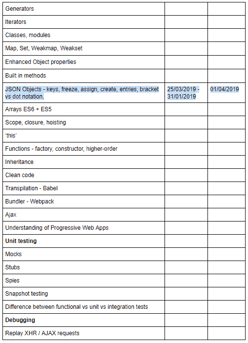

# 学习计划如何帮助我成长。

> 原文：<https://dev.to/csamywilliams_0/how-a-learning-plan-has-helped-me-grow-1app>

我发现与日新月异的技术保持同步是非常困难的，我总是感觉自己在逆流而上，只是为了保持漂浮。有时我想放弃，想换个职业，但我决定改变我的态度，不再专注于我不擅长的事情，而是制定一个计划变得更好。

我决定制定一个学习计划，我使用谷歌文档，列出所有我目前不知道的关于网络开发的事情。有些是非常高的水平，但这是一个开始。这是它的一个小预览，因为目前它有 3 页长。

每周，我都要思考我的计划，并腾出一个小时来做清单上的事情。到目前为止，我试着保持一致，利用周二下班。我称之为#TechyTuesday。

为了让它更容易学习，我建立了一个 Codepen 帐户，我可以在任何时候访问，只写博客和小笔只是为了学习我清单上的东西。在几周的时间里，我学会/创造了以下内容:

*   ES6 特性，如默认参数、模板文字、作用域变量
*   JSON 对象及其函数，如冻结、赋值、创建、键
*   CSS 中的动画蜜蜂

通过这样做，我不仅提高了我的技术技能，还提高了软技能，例如:

*   阅读和文档
*   从 MDN 了解和寻找质量文件
*   排除故障
*   使用开发工具
*   使用降价

最棒的是，获得更多的知识，分享它，然后把它从清单上划掉，这种感觉真的很好。

因此，如果你在网站开发方面没有经验或有经验，我建议你制定一个小的可管理的任务计划，每周完成一次。

还有人有类似的学习方式吗？