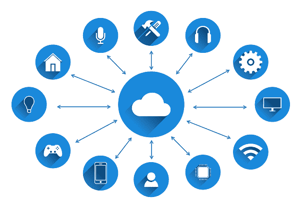

# Android 如何成为物联网应用背后的驱动力

> 原文：<https://dev.to/geekktech/how-android-has-been-the-driving-force-behind-iot-adoption-4mb7>

谷歌的移动操作系统 Android 在增强移动应用和设备方面发挥了重要作用。与其他操作系统或设备相比，几乎一半的世界人口更喜欢 Android。Android 设备的大规模普及正在 Android 应用程序市场上产生对移动应用程序的巨大需求和巨大赞誉。

物联网(IoT)是 Android 应用程序开发持续贡献大量功能优势的最突出领域之一。物联网是指各种智能设备通过互联网相互连接的一种状态。他们使用传感器和互联网连接来帮助接收、收集和传输信息。

物联网使人们能够无缝控制家用电器，如电视、冰箱、烤面包机、跑步机等，并通过 Android 等强大的平台支持智能手机。Android 应用程序开发人员正在 app store 中引入强大的移动应用程序，以更好地控制联网设备。让我们详细了解一下 Android 是如何成为物联网的驱动力的。

## Android 如何在物联网中扮演重要角色

**应用是基础**:应用是运行和操作物联网设备的关键要素。需要适当的软件或应用程序来使连接的设备能够方便地运行和执行规定的任务。最近，Android 是世界上广泛使用的平台，用于开发支持物联网的设备的控制应用程序。

**物联网基于 JAVA** :大多数物联网设备都是使用 JAVA(Android 开发的官方语言)构建的，这使得 Android 成为驱动物联网的强大平台。与需要专用设备的嵌入式 Java 相比，Android 操作系统可以更有效地利用 Java。

Android 是通用前端(Universal Front End):自谷歌向开发者和设备制造商提供 Android 以来，Android 作为一个软件平台正在迅速发展。作为一个基于 Linux 的开源软件，它使开发人员能够部署和修改各种小工具和设备的源代码。它使 Android 的物联网实施应用程序变得没有任何麻烦。

### Android 在物联网生态系统中的用例包括；

**设备** -物联网生态系统需要带有操作系统的设备或处理器来支持其组件。在大多数情况下，Android 设备被认为是最实惠的选择，因为它们能够满足各种传感器的所有支持要求。

**数据传输** -在物联网中，需要一个支持组件来传输来自传感器的数据。Android 支持开源实现，它们的库可以在 Windows、Android 和 Linux 平台上使用。

**程序** -面向物联网设备的适当编程机制有助于接收和存储数据。标准的 Linux 服务器可以接收解码并处理数据，以供进一步分析使用。

**传感器** -传感器帮助识别设备的物理属性，如温度，并进一步产生数字信号。Android 是设备制造商最受欢迎的选择，因为它是开源的，可以修改用于任何设备。

**结论**——现在操作系统的战场不仅仅局限于智能手机；它已经得到扩展，以满足互联设备不断增长的需求。随着大多数智能设备运行在 Android 操作系统上，Android 似乎已经征服了市场。[使用 Android](https://www.rishabhsoft.com/mobile/android-development) 平台开发移动应用有助于任何支持物联网的设备无缝运行，并保持市场竞争力。