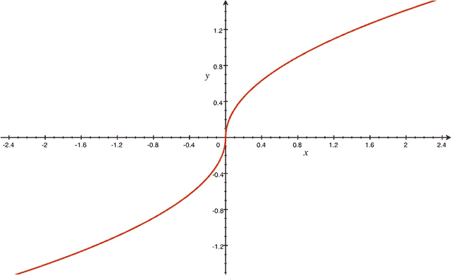
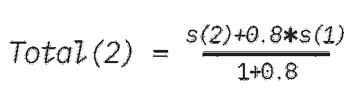
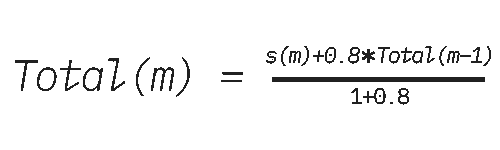
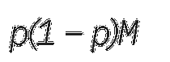
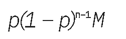

# 应用程序挖掘的工作原理

> 原文：<https://dev.to/blockstack/how-app-mining-works-4ij5>

Blockstack 正在拓宽“挖掘”的含义。

传统上，加密货币中的术语“挖掘”指的是向网络贡献计算资源并获得奖励的过程。然而，在 Blockstack 网络上，开发人员不仅可以通过计算进行“挖掘”,还可以通过向生态系统贡献应用程序和制作社区想要的应用程序来进行“挖掘”。

Blockstack 的 [App Mining](https://blog.blockstack.org/introducing-app-mining/) 计划奖励去中心化的应用开发。这篇文章深入探讨了游戏奖励的工作原理。

这篇文章是与来自普林斯顿和纽约大学的博弈论专家和行为经济学家皮埃特罗·奥托雷瓦、T2·埃菲·奥克和 T4·恩尼奥·斯塔凯蒂共同撰写的。该条目描述了:

1.  来自应用评审者(向聚合算法提交投票的实体)的分数如何聚合成最终分数
2.  表现最佳的应用程序的付费方案
3.  一年后评估应用程序审查公司自身绩效的方法

这篇文章描述了每个步骤所采用的一般原则。我们参考下面的技术报告，了解详细信息(包括精确的公式)和更完整的技术分析。您还可以找到一份白皮书和几个视频来提供更多详细信息。

* * *

### 论文:一种针对 Blockstack 的聚合算法

* * *

### App 审核人

应用程序的审查将由应用程序审查者进行:产品搜索、民主地球和第三个；为了讨论的目的，作为一个例子，我们将使用 Usertesting.com。每个应用评审员报告不同的分数，使用不同的标准组合成最终排名，希望产生一个更强大、更少游戏性的应用挖掘版本。未来可能会有更多的应用审查者加入，这种游戏设计仍然适用。

#### 如何将 App 审核人分数汇总成最终分数

##### **原始数据**

每个应用评审员都会给我们多个分数，每个标准一个分数。

##### **第一步:将分数归一化**

通过使用相同的度量单位，可以更有意义地汇总分数。

在第一步中，我们获取从所有评论者处获得的所有分数，并对它们进行归一化:首先，通过减去每个类别中的平均原始分数，其次，通过除以该类别中原始分数的标准偏差。

这种标准化避免了给那些倾向于给出更多极端原始分数的应用程序评论者过多的权重。

应用程序的标准化分数告诉我们该应用程序的分数在多大程度上高于或低于平均分数，以标准差单位衡量。例如，标准化分数为 0 意味着相应的原始分数正好是所有原始分数(相同类型)的平均值。另一方面，标准化分数 1 意味着相应的原始分数比相同类型的平均原始分数低一个标准差(大约位于所有分数的底部 16%)，分数 1/2 意味着相应的原始分数比相同类型的平均原始分数高半个标准差(大约位于所有分数的顶部 30%)。

##### **第二步:扩展标准化分数以纳入缺失数据**

**如果有来自 App 审核者的缺失数据，这是处理它的流程。**

在程序的这个阶段，我们转向那些在民主地球上没有收到任何投票的应用程序，或者没有在给定的类别上或由给定的应用程序审核者进行评估的应用程序。作为一般原则，我们将此类应用程序的标准化分数指定为 1，表示它们未达到的每一个分数。考虑到我们在步骤 1 中介绍的标准化的性质，这意味着这些应用程序获得的分数(就其原始分数而言)正好比平均值低一个标准差。因此，程序惩罚这些应用程序，但不一定给他们最差的评价。(此外，这种惩罚在第 5 步中有所减轻，在第 5 步中，我们汇总了评估期间应用程序的标准化总分。)

##### 第三步:App 内审核人员汇总

**在这一步中，我们汇总每个应用评审员对某个应用的评分，以获得该应用的“评审员”评分。**

现在，我们为每个应用评审者提供了多个标准化分数—回想一下，每个应用评审者都报告了不同类别的多个原始分数。在像 UserTesting.com 这样的潜在应用审查者的情况下，可能有四个分数，每个类别一个。在产品搜索的情况下，我们有两个分数，一个来自团队，一个来自社区。在民主地球的例子中，我们再次有两个分数，一个衡量应用程序的“受欢迎程度”，一个衡量应用程序在市场中受到的“关注”。在这一步中，我们将应用程序从任何一位评审员处获得的分数汇总成一个分数，以获得该应用程序的“评审员”分数。我们只需对评审者的分数进行加权平均即可。

##### 第四步:应用评审人员汇总

**在这一步中，我们汇总了一款应用在所有应用审核者中获得的标准化分数。**

这样做的目的是减少单个应用审核者分数对总分的影响。一般来说，对整个程序的主要关注是操纵的可能性(如购买选票等)。).我们的方法通过在评审者之间采用非线性聚合方法来使这种操作成本高昂，从而减少了这样做的动机。

更准确地说，我们不是简单地取上面第 3 步中确定的审阅者汇总分数的平均值，而是选择一个函数 F 来转换每个分数，然后只取这些转换值的平均值。这将是在此步骤中获得的总分数。选择函数 F，使得它对于正的(标准化的)得分是严格凹的，对于负的(标准化的)得分是严格凸的。(具体配方见技术报告。)它有一个与下图非常相似的 S 形:

##### *函数 F*

为了说明利用这种函数 F 的意义，假设 App i 希望将其总排名提高 0.3。鉴于我们下面建议的(凸)支付方案，这可能是有利可图的。(因为，中层职位的小幅上升带来的货币回报相对较小。)现在，假设某个评论者对应用程序的原始(标准化)评分是 0.2 分。为了具体起见，假设 0 以上的函数 F 是平方根。然后，上面的公式表明，要将满分提高 0.3 分，应用程序必须将来自该评审者的分数提高 1.81 分:回想一下，分数是标准化的，1 是标准偏差，这意味着非常实质性地操纵来自该评审者的分数。重要的是，应用程序的原始分数越高，从给定的审核者那里操纵算法就越不可行。例如，如果来自民主地球(DE)的应用 I 的分数是 0.8，则该应用需要将其 DE 分数增加到 3.2(以标准差为单位)，这实际上意味着购买整个社区的投票。

另一方面，使用像上面这样的 S 形函数，对接近平均分数的分数进行小的操作更容易一些。但考虑到支付方案(见下文)，这可能不太有利可图。

##### 步骤 5:跨期汇总，仅针对第一个之后的期间

由于应用程序开发人员将继续改进他们的应用程序，并且由于他们的应用程序的过去和现在的评估包含有价值的信息，我们可以通过“记忆”功能来持续说明这一点。

对于初始阶段，算法到此为止。然而，对于第一次之后的时间，我们为算法引入了一个“记忆”，因为一个应用程序以前的分数可能包含不应该丢失的有价值的信息。因此，我们采用了一种随着时间的推移对分数进行打折汇总的方案。

具体来说，我们将以 0.8 的因子来贴现先前的分数。

这个阶段的算法工作如下。假设我们在第二个时期。考虑上面第 4 步得到的 app 在初期的分数，称之为 s(1)。假设这个 app 在第二周期第四步得到的分数，是 s(2)。然后，我们获得第 2 阶段的总分，Total(2)为

通常，为了计算周期 m 的总得分 Total(m ),我们使用以下递归公式:

根据这种算法，旧的分数会被考虑，但会被打折扣。

#### 新增应用程序

在某些时期，新的应用程序可能会进入池中。重要的是，当一个新的应用程序到来时，让评审人员知道，并确保在它到来时立即将它包括在他们的评估过程中。这对于应用于与新应用程序相关的缺失数据的方法至关重要。

在新应用的情况下，该算法将计算新应用的分数，因为这是该算法第一次运行。因为其他应用程序的总得分是标准化的，因此它将具有可比性，新应用程序不会处于不利地位。

### 应用程序的支付方案

应用程序开发人员必须根据他们的应用程序排名每月获得报酬，你的应用程序排名越高，你的收入就越多。

我们建议使用以下付款方案。Blockstack 设置总预算 M、百分比 p 和付费应用程序的最大数量 n(可能超过考虑中的应用程序的总数)。然后，方案向第一个 app 支付 M 的分数 p；第二个 app 的余数的小数 p；诸如此类。特别是第二好的 app 是付费

而第 n 个 app 是付费的

这种情况一直持续到达到 app n 和/或不再有 app 为止。

我们采用 p=20%进行 App 挖掘试点。

#### 处理关系

两个或更多的应用程序可能会得到相同的最终分数，因此在最终排名中并列。在这种情况下，支付给应用程序的费用在绑定的应用程序之间平均分配，如果没有绑定，共享的总金额就是支付给所有这些应用程序的金额。

例如，回想一下，第一个应用程序收到了 p*M 的付款，第二个应用程序收到了*p(1p)M 的付款。*现在假设两个应用程序并列第一。然后，这两个应用程序平均共享总共*pM+p(1p)m。*

### 评估 App 审核者的标准

**以下标准是评估应用评审员的建议，可用于投票或进一步激励。**

我们建议用三个标准来评估应用评审员。这三个标准各有利弊。机构群体将根据所有三个标准(第三个标准在全球范围内按大类运行)获得排名结果，以便进行评估。

#### 标准 A:与最终排名一致

第一个可能的标准是调查评审者的分数是否与 12 个月后获得的最终总分数相似或 different。有两个原因可以将这个最终分数作为基准。首先，它是根据最多信息得出的排名——它汇总了一段时间内重复出现的大量 different 评论——因此可能被认为是最准确的。其次，因为这些最终分数要到很久以后才能知道，所以除了报告他们对应用程序的真实评价之外，应用程序评论者更难适应这些分数。

因此，我们可以为每个评论者构建一个分数，该分数减去该评论者在每个时期对每个应用的分数与该应用的最终总分数之间的平方距离之和。

这一标准有两个局限性。首先，因为它惩罚了相对于最终分数的变化，它惩罚了分数随时间高度可变的评审者。例如，如果某个应用程序的最终分数为 1，则始终报告为 1 的审核者的分数高于该应用程序分数在 0.8 和 1.2 之间变化的审核者的分数。

第二个限制是它不鼓励评审者使用与其他评审者截然不同的方法。例如，假设两个应用程序评审员遵循的方法使他们在很大程度上达成一致，而第三个评审员倾向于给出不相关的分数。然后，最后一个评审者更有可能得到较低的评审分数，除非他的方法更好地预测最终分数。

#### 标准 B:符合客观标准

第二种评估评审者的方法是将他们的分数与外部的客观标准进行比较。例如，可以根据外部融资或每月活跃用户数量来计算 different 应用的得分。然后，可以计算每个评论者在每个时期的分数是否与最终的客观排名一致。

这与上面的标准 A 类似，只是使用客观标准(也像在我们算法的步骤 1 中一样标准化)作为比较点，而不是总的最终分数。

与标准 A 的情况一样，该标准奖励具有随时间高度一致的分数的评审者。它还奖励那些准确预测获得最多/最少资金或每月活跃用户最多的应用的人。

#### 标准 C:发现热门应用

评估评论者的第三个标准是他们早期发现优秀应用的能力。这可能是一个特别可取的功能，因为对于具有巨大潜力的应用程序来说，尽早获得资金可能特别重要，这样它们就可以降低消失的风险，并继续增长。

考虑在这些总的最终分数中排名前 10%的应用程序；让 T 表示所有这类应用的集合。我们要表扬一个早先给这个组的应用打高分的评论者。因此，我们可以简单地添加给定评论者将 T 中的每个应用置于其自己的总排名的前 10%的次数(在我们的算法的步骤 3 中计算)。

请注意，根据这一标准，分数随时间波动很大的评论者可能(尽管不需要)具有优势。还要注意的是，这一指标并不依赖于应用程序的实际得分，无论是由评审者给出的还是在最终排名中给出的:重要的是识别最佳表现者的能力，即使他们的相对排名是最终排名中的 different。这与上述其他两个标准中使用的方法明显不同，是 different。

最后，让我们注意，这个标准可以应用于整个应用程序集，也可以按类别运行。后一种方法可能特别有用，因为它可以激励评论者发现好的应用程序，即使是在不太受欢迎的类别中，从而确保可用的应用程序在所有方面都是好的。

* * *

我们希望这个解释对你有用。如果你想继续关于应用挖掘的讨论，请前往[论坛](https://forum.blockstack.org)。如果您有兴趣将您的应用加入应用挖掘计划，请访问 app.co/mining。

* * *

### 全视频演示

帖子[App Mining 如何工作](https://blog.blockstack.org/app-mining-game-theory-algorithm-design/)首先出现在 [Blockstack 博客- Blockstack](https://blog.blockstack.org) 上。