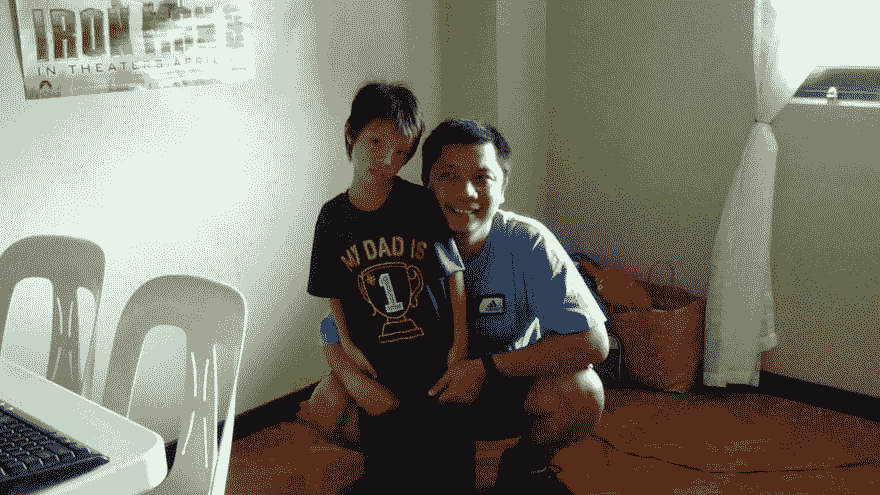

# 布拉德·特拉弗斯是如何教会我生活在“两全其美”的环境中的

> 原文：<https://dev.to/francisisberto/how-brad-traversy-taught-me-to-live-in-the-best-of-both-worlds-79o>

一位 44 岁父亲为了患有自闭症的儿子而转行的自白

因为我的导师布拉德·特拉弗斯，我现在过着两全其美的生活。

对于那些不知道的人，Brad Traversy 是当今世界上最受欢迎和最有效的网络开发教师之一
他创建了 Traversy Media，这是提供免费课程的顶级教育平台之一。他的 YouTube 频道有 67.7 万订户，他的大多数追随者在那里从头开始学习做 Web 应用程序，一直到最终产品。

通过他的彻底和非常详细的课程，布拉德能够改善许多人的生活。给他们信心和新技能，让他们在 Web 开发领域有一个有前途的职业生涯。我碰巧是其中之一。

我是一个自闭症孩子的父亲。我儿子叫洛伦佐。他 3 岁时被确诊。当我和妻子发现我们小儿子的病危时，一切都化为灰烬。我儿子的非自然综合症给我的双脚加上了沉重的负担，让我感到虚弱和无助。

10 年来，我不得不从一份工作跳到另一份工作，只是为了平衡我的工作和家庭。我的工作是给我和我的家人提供餐桌上的食物，但这无疑对我患有自闭症的儿子的生活产生了影响。患有自闭症的人需要所有的时间和注意力。我的工作占用了我儿子太多的时间。

我能怎么做呢？我需要给洛伦佐时间，但我也需要供养我的家人？

然后进来的是布拉德·特拉弗斯。我开始只是在 YouTube 上看了他的一个教程视频。一个视频变成了两个，然后是下一个，再下一个。在我开始用他的免费课程制作小型网络应用程序一周后。我了解了 Git 和 Github。我吸收了很多 React.js 和 Node 的教训。NPM 引起了我对更多代码的注意。然后我建立了自己的作品集网站(也使用了布拉德的课程)。

在短短的三个月里，我做到了这一切。布拉德给了我灵感，即使我老了，也不会失去所有的希望。Traversy 先生也有一个患有自闭症的儿子，但他设法做好自己的工作(教新生儿),并与儿子 Nicky 共度了美好时光。他是我模仿的最佳人选。他把劣势变成了优势。他把缺点变成了资产。

布拉德给出了最适合我和我家人的路线。现在，我可以(通过网络开发)谋生，也可以花大量的时间在我患有自闭症的儿子洛伦佐身上。很高兴知道我的祈祷最终得到了回应。和布拉德一样，我现在拥有了“两全其美”的生活！

今天，我刚刚从他的 Udemy 课程中创建了另一个 Web 应用程序。我得到了他的“新闻网格”代码技巧，我将把它用在我的新博客上。当我这样做的时候，我现在有很多时间带我的儿子去海滩，即使是在工作日。我们晚上去露营和讲故事。我喜欢和家人一起度假，同时还在网站开发部门工作。
这些只是我还在公司时没有的新东西。我从布拉德那里得到的祝福。

观看布拉德的 YouTube 视频是我一生中最伟大的转变之一。他不仅教你如何编码，还教你如何过上你能想象的最快乐的生活。